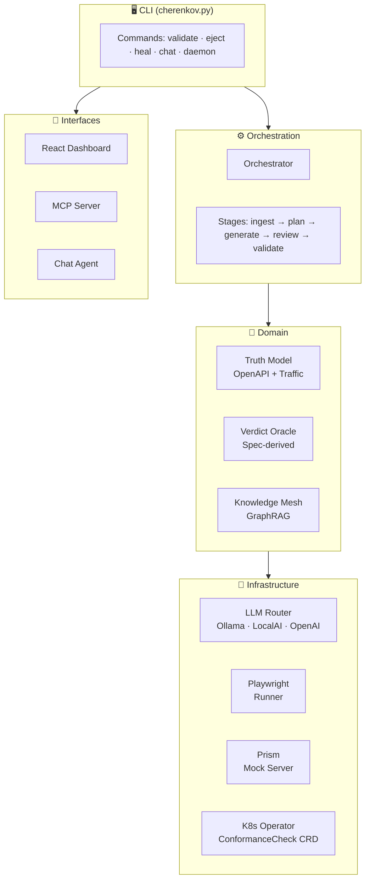

<div align="center">

# ⚡ CHERENKOV QA

### Tests your API, web UI, and mobile app — from your OpenAPI spec — zero lock-in

[](https://github.com/moaidmoatasem/cherenkov-qa/actions/workflows/ci.yml)
[](https://github.com/moaidmoatasem/cherenkov-qa/actions/workflows/security-scan.yml)
[](https://python.org)
[](https://typescriptlang.org)
[](https://playwright.dev)
[](LICENSE)
[](CONTRIBUTING.md)

**Your spec is the source of truth. Your tests prove it.**  
*Zero cloud. Zero lock-in. Zero test code to write.*

[**Quick Start**](#quick-start-2-minutes) · [**How It Works**](#how-it-works) · [**Commands**](#commands) · [**Docs**](docs/INDEX.md) · [**Architecture**](docs/wiki/Architecture.md)

</div>

---

## What It Does

CHERENKOV reads your OpenAPI 3.x spec and **writes Playwright tests for you** using a local LLM running on your machine. It tests three layers:

| Layer | What It Tests | Headed / Headless |
|-------|--------------|:-----------------:|
| **API** | REST endpoints — status codes, schemas, auth vs your spec | Both |
| **Web** | Browser UI flows via Playwright | Both |
| **Mobile** | Device flows via Maestro + Appium, VLM visual oracle | Both |

Everything runs locally. No API keys. No data leaving your machine. No vendor dependency after `eject`.

---

## How It Works


| Stage | What Happens |
|-------|-------------|
| **Ingest** | Parses and validates your OpenAPI 3.x spec |
| **Plan** | Generates test scenarios (happy path, edge cases, auth flows) |
| **Generate** | Local LLM writes typed `openapi-fetch` Playwright tests |
| **Review** | 6-gate check: syntax → structure → AST → assertions → TypeScript → Prism mock |
| **Run** | Executes tests against your live server |
| **Report** | Identifies spec drift, generates tightening suggestions, ejects standalone tests |

---

## Quick Start (2 minutes)

**Prerequisites:** Python 3.10+, Node 20+, [Ollama](https://ollama.com) with `qwen2.5-coder:7b`

```bash
# 1. Clone and install
git clone https://github.com/moaidmoatasem/cherenkov-qa.git
cd cherenkov-qa
python3 -m venv .venv && source .venv/bin/activate
pip install -r requirements.txt

# 2. Install Playwright and Node dependencies
cd stub && npm install && npx playwright install && cd ..

# 3. Start the bundled sample API (or point at your own)
cd target && source ../.venv/bin/activate
uvicorn target_api:app --host 127.0.0.1 --port 8000 &
cd ..

# 4. Run — watch it catch a real conformance bug
PYTHONPATH=. ./bin/cherenkov validate --target http://localhost:8000
```

> **Full setup guide (prerequisites, troubleshooting, Docker option):** [docs/GETTING_STARTED.md](docs/GETTING_STARTED.md)

---

## Example Output

```
cherenkov validate — running against http://localhost:8000

  ✔  GET /pets          happy_path             [PASSED]   195ms
  ✔  POST /pets         create_pet             [PASSED]   211ms
  ✗  POST /users        password_too_short     [FAILED]
       expected: 422 (spec: POST /users → 422 on validation error)
       actual:   400

  Tightening suggestions for happy_path:
    › assert response.headers['content-type'] includes 'application/json'
    › assert response.body.id is typeof 'number'

  2 passed, 1 failed — 1 conformance drift detected
  Full report: .cherenkov/report.json
```

The `password_too_short` failure is a **real spec conformance bug**: the OpenAPI spec declares `422` for validation errors but the server returns `400`. Nobody wrote that test. CHERENKOV found it from the spec.

---

## Commands

```bash
# Core workflow
./bin/cherenkov validate --target <url>       # Run tests + generate report
./bin/cherenkov eject --output <dir>          # Export standalone Playwright tests
./bin/cherenkov review --web                  # Open browser dashboard

# Diagnostics
./bin/cherenkov doctor                        # Check environment (Ollama, Node, etc.)
./bin/cherenkov --help                        # All commands and options

# Advanced
./bin/cherenkov heal --report <file>          # Get fix suggestions for failures
./bin/cherenkov explore --spec <file>         # Interactive spec explorer
./bin/cherenkov chat                          # AI chat agent with tool access
./bin/cherenkov daemon                        # Watch mode (re-run on spec change)
```

> **Complete CLI reference with all flags:** [docs/wiki/CLI-Reference.md](docs/wiki/CLI-Reference.md)

---

## Features

| Feature | What It Means |
|---------|--------------|
| **API conformance** | Spec-derived oracles — expected status from OpenAPI, never hardcoded |
| **Web testing** | Playwright browser flows, headed or headless, visual regression via VLM |
| **Mobile testing** | Maestro + Appium device flows, VLM visual oracle (4-tier: emulator → CI) |
| **Local LLM only** | Ollama runs on your machine; your spec never leaves |
| **Zero lock-in** | `eject` produces vanilla Playwright + `openapi-fetch` — no CHERENKOV import in sight |
| **Suggest-only healing** | When tests fail, CHERENKOV suggests fixes; it never auto-edits your code |
| **6-gate review** | Every generated test passes syntax → structure → AST → assertions → TypeScript → Prism |
| **React dashboard** | `--web` flag opens a live browser UI for all results |
| **K8s operator** | `ConformanceCheck` CRD runs tests as native Kubernetes jobs |
| **Chat agent** | Ask questions about your spec and test results via natural language |
| **Knowledge mesh** | GraphRAG-powered second brain learns from your codebase over time |
| **MCP integration** | First-class Model Context Protocol server for IDE and agent use |

---

## Architecture



> **Deep-dive architecture docs:** [docs/wiki/Architecture.md](docs/wiki/Architecture.md)

---

## The Anti-Lock-In Promise

```bash
# Export to vanilla Playwright — one command, zero CHERENKOV dependency
./bin/cherenkov eject --output ./my_tests

# Run the ejected tests anywhere
cd my_tests
npm install
npx playwright test
# Works. Forever. No cherenkov on the PATH.
```

What's left after eject: standard Playwright + `openapi-fetch`. If you stop using CHERENKOV tomorrow, your tests keep running. That's the deal.

---

## Cost Tiers

Everything runs locally. You choose how much infrastructure you want.

| Tier | Monthly Cost | What You Get |
|------|:-----------:|-------------|
| **L0** Bare CLI | **$0** | Python + SQLite, no Docker required |
| **L1** + Ollama | **$0** | L0 + local LLM, full API + visual testing |
| **L2** + Docker Compose | **$0** | L1 + LocalAI (VLM), Redis (vector store / sessions) |
| **L3** + Full Stack | **$0** | L2 + Android emulator, Maestro, mobile testing, desktop app |
| **L4** + Cloud | ~$50–100 | L3 + optional cloud VLM / cloud device farms |
| **L5** + Enterprise | $300+ | L4 + K8s operator, SSO, audit logs, SLA |

> **Solo developer zero-cost path: L0 through L3 = $0/month.**

---

## Project Status

| Track | Scope | State |
|-------|-------|-------|
| **A** Core engine | API conformance testing | ✅ Built · Validation gate passed (2026-06-08) |
| **B** VLM substrate | LocalAI / Ollama routing | ✅ Built and integrated |
| **C** Desktop | Tauri 2 host app | ✅ Built · Runtime blocked on `cargo` |
| **D** Mobile | Maestro / Appium | ✅ Built · Runtime blocked on ADB |
| **E** Dashboard | React UI (9 screens) | ✅ All screens shipped |
| **F** K8s | Operator + CRDs | 🔶 Phase 8 in progress |

**Active work:** Phase 8 — K8s CRD sync + cloud readiness.  
**Canonical status:** [docs/STATUS.md](docs/STATUS.md)  
**Phase roadmap:** [docs/PHASE_PLAN.md](docs/PHASE_PLAN.md)

---

## Documentation

<details>
<summary><strong>New here? Start here.</strong></summary>

| | |
|--|--|
| [docs/GETTING_STARTED.md](docs/GETTING_STARTED.md) | Install and run your first test in 5 minutes |
| [docs/CLI_DEMO.md](docs/CLI_DEMO.md) | Full terminal walk-through of every command |
| [docs/wiki/FAQ.md](docs/wiki/FAQ.md) | Common questions answered |
| [docs/wiki/Troubleshooting.md](docs/wiki/Troubleshooting.md) | Things that go wrong and how to fix them |

</details>

<details>
<summary><strong>Building on CHERENKOV?</strong></summary>

| | |
|--|--|
| [docs/wiki/Architecture.md](docs/wiki/Architecture.md) | Full system architecture with diagrams |
| [docs/wiki/Pipeline.md](docs/wiki/Pipeline.md) | Pipeline stages in depth |
| [docs/wiki/CLI-Reference.md](docs/wiki/CLI-Reference.md) | Every command, flag, and option |
| [docs/wiki/Configuration.md](docs/wiki/Configuration.md) | All config knobs and environment variables |
| [docs/wiki/Deployment.md](docs/wiki/Deployment.md) | Docker, K8s, and production deployment |
| [docs/engineering/SYSTEM_DESIGN.md](docs/engineering/SYSTEM_DESIGN.md) | System design and clean architecture |
| [docs/adr/](docs/adr/) | Architecture Decision Records |

</details>

<details>
<summary><strong>Contributing?</strong></summary>

| | |
|--|--|
| [CONTRIBUTING.md](CONTRIBUTING.md) | How to contribute (humans and agents) |
| [docs/wiki/Roadmap.md](docs/wiki/Roadmap.md) | Where the project is going |
| [docs/PHASE_PLAN.md](docs/PHASE_PLAN.md) | Detailed phase plan with all tickets |
| [docs/STATUS.md](docs/STATUS.md) | What is built, what is blocked, what is next |
| [AGENTS.md](AGENTS.md) | Rules for AI agents working on this project |

</details>

<details>
<summary><strong>Full documentation index</strong></summary>

See **[docs/INDEX.md](docs/INDEX.md)** for the complete documentation tree.

</details>

---

## Contributing

Read [CONTRIBUTING.md](CONTRIBUTING.md) first. The short version:

1. Pick a `status:ready` issue
2. Branch: `feat/<issue>-slug` or `fix/…`
3. Write tests; keep them green
4. Open a PR with the template filled and raw evidence attached
5. Get a human review — no self-merge to `main`

See also: [CODE_OF_CONDUCT.md](CODE_OF_CONDUCT.md) · [SECURITY.md](SECURITY.md) · [AGENTS.md](AGENTS.md)

---

## License

[MIT](LICENSE) — Copyright © 2026 Moaid Moatasem

---

<div align="center">

*Built to find the gap between what your API claims and what it does.*

</div>
