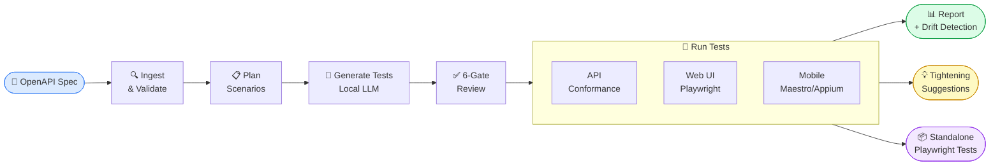
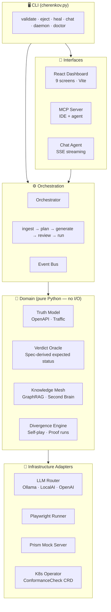

<div align="center">

# ⚡ CHERENKOV QA

### Spec in. Playwright tests out. Zero lock-in.

[](https://github.com/moaidmoatasem/cherenkov-qa/actions/workflows/ci.yml)
[](https://github.com/moaidmoatasem/cherenkov-qa/actions/workflows/security-scan.yml)
[](https://python.org)
[](https://typescriptlang.org)
[](https://playwright.dev)
[](LICENSE)
[](CONTRIBUTING.md)

</div>

---

```
openapi.yaml  ──▶  cherenkov validate  ──▶  Playwright tests  ──▶  eject  ──▶  run anywhere
```

Give CHERENKOV your OpenAPI spec and a live server URL.
It generates typed Playwright tests using a local LLM, runs a 6-gate review on every test,
executes them, and surfaces exactly where your implementation diverges from your spec.
No cloud. No API keys. When you're done, eject to vanilla Playwright — runs forever without CHERENKOV.

```
cherenkov validate --target http://localhost:8000

  ✔  GET  /pets          happy_path             [PASSED]   195ms
  ✔  POST /pets          create_pet             [PASSED]   211ms
  ✗  POST /users         password_too_short     [FAILED]
       spec says: 422 (validation error)
       server returned: 400

  1 conformance drift detected — nobody wrote that test, CHERENKOV found it from the spec
```

```bash
# Export to vanilla Playwright — zero CHERENKOV import, runs forever
./bin/cherenkov eject --output ./my-tests
cd my-tests && npx playwright test   # ✓ works. always will.
```

<div align="center">

[**Quick Start**](#quick-start-2-minutes) · [**How It Works**](#how-it-works) · [**Commands**](#commands) · [**Wiki**](docs/wiki/Home.md) · [**Docs**](docs/INDEX.md) · [**Architecture**](docs/wiki/Architecture.md)

</div>

---

## What It Tests

CHERENKOV generates and runs tests across three layers — from the same spec, the same command.

| Layer | What It Tests | Status |
|-------|--------------|:------:|
| **API** | REST endpoints — status codes, response schemas, auth flows vs your spec | ✅ Production ready |
| **Web** | Browser UI flows via Playwright — headed or headless, VLM visual regression | ✅ Playwright ready |
| **Mobile** | Device flows via Maestro + Appium, VLM visual oracle — 4-tier device support | ✅ Built · needs ADB |

All three modes run locally. No data leaves your machine.

---

## How It Works



| Stage | What Happens |
|-------|-------------|
| **Ingest** | Parses and validates your OpenAPI 3.x spec — catches malformed specs before they generate bad tests |
| **Plan** | Produces test scenarios: happy paths, edge cases, auth flows, error branches |
| **Generate** | Local LLM writes typed `openapi-fetch` Playwright tests — your spec never leaves your machine |
| **Review** | 6-gate check: syntax → structure → AST → assertions → TypeScript → Prism mock server |
| **Run** | Executes tests against your live server, API layer + web UI layer + mobile layer |
| **Report** | Identifies spec drift, surfaced as structured findings; generates tightening suggestions; ejects standalone tests |

---

## Quick Start (2 minutes)

**Prerequisites:** Python 3.10+, Node 20+, [Ollama](https://ollama.com) with `qwen2.5-coder:7b`

```bash
# 1. Clone and install
git clone https://github.com/moaidmoatasem/cherenkov-qa.git
cd cherenkov-qa
python3 -m venv .venv && source .venv/bin/activate
pip install -r requirements.txt

# 2. Playwright + Node deps
cd stub && npm install && npx playwright install && cd ..

# 3. Start the bundled sample API (or point at your own)
cd target && source ../.venv/bin/activate
uvicorn target_api:app --host 127.0.0.1 --port 8000 &
cd ..

# 4. Check everything is wired up
PYTHONPATH=. ./bin/cherenkov doctor

# 5. Run — watch it catch a real conformance bug
PYTHONPATH=. ./bin/cherenkov validate --target http://localhost:8000
```

> **Full setup guide (prerequisites, Docker option, troubleshooting):** [docs/GETTING_STARTED.md](docs/GETTING_STARTED.md)

---

## Commands

```bash
# Core workflow
./bin/cherenkov validate --target <url>       # Run conformance tests + generate report
./bin/cherenkov eject   --output <dir>         # Export standalone Playwright tests (zero lock-in)
./bin/cherenkov review  --web                  # Open browser dashboard

# Diagnostics
./bin/cherenkov doctor                         # Check environment (Ollama, Node, Playwright, etc.)
./bin/cherenkov --help                         # All commands and options

# Advanced
./bin/cherenkov heal    --report <file>        # Get fix suggestions for failing tests
./bin/cherenkov explore --spec <file>          # Interactive spec explorer
./bin/cherenkov chat                           # AI chat agent with tool access to your spec + results
./bin/cherenkov daemon                         # Watch mode — re-runs on spec change
```

> **Complete CLI reference with all flags:** [docs/wiki/CLI-Reference.md](docs/wiki/CLI-Reference.md)

---

## Features

| Feature | What It Means |
|---------|--------------|
| **API conformance** | Expected status codes come from the OpenAPI spec — never hardcoded |
| **Web testing** | Playwright browser flows, headed or headless, visual regression via VLM |
| **Mobile testing** | Maestro + Appium device flows, VLM visual oracle, 4-tier device support |
| **Local LLM only** | Ollama + `qwen2.5-coder:7b` runs on your machine; your spec never leaves |
| **Zero lock-in** | `eject` produces vanilla Playwright + `openapi-fetch` — no CHERENKOV import anywhere |
| **Suggest-only healing** | CHERENKOV suggests fixes for failures; it never auto-edits your code |
| **6-gate review** | Every generated test passes syntax → structure → AST → assertions → TypeScript → Prism |
| **React dashboard** | `--web` opens a live browser UI showing test results, spec coverage, drift findings |
| **K8s operator** | `ConformanceCheck` CRD runs tests as native Kubernetes jobs |
| **Chat agent** | Ask questions about your spec and results in natural language |
| **Knowledge mesh** | GraphRAG-powered second brain that learns from your codebase over time |
| **MCP integration** | First-class Model Context Protocol server for IDE and agent use |

---

## The Zero Lock-In Promise

```bash
# One command. Vanilla Playwright. No CHERENKOV dependency anywhere.
./bin/cherenkov eject --output ./my-tests

# What you get: standard Playwright + openapi-fetch
# Zero CHERENKOV imports. Zero CHERENKOV on PATH.
# Runs in any CI. Runs on any machine. Runs after you stop using CHERENKOV.

cd my-tests
cat package.json        # "@playwright/test" + "openapi-fetch" — that's it
npm install
npx playwright test     # ✓ passes
```

The eject invariant is enforced in CI by `smoke_test_eject.py` — it verifies every ejected test file contains zero CHERENKOV imports. That check never gets disabled.

---

## How It Compares

Spec-conformance testing isn't new — the difference is what you're left holding afterward.

| | What it leaves you | Conformance source | Runs offline |
|--|--|--|:--:|
| **CHERENKOV** | A typed Playwright + `openapi-fetch` suite your team owns forever | OpenAPI spec | ✅ local LLM |
| **Schemathesis** | A fuzz run report — findings, not tests | OpenAPI spec | ✅ |
| **Dredd** | A validation run against spec examples | API Blueprint / OpenAPI | ✅ |
| **Postman / contract tools** | Collections tied to the platform | hand-written assertions | varies |

If you want property-based fuzzing today, Schemathesis is excellent — use it.
CHERENKOV is for when the deliverable is a **readable regression suite**: tests
your team can read, review in a PR, extend by hand, and keep running in plain
`npx playwright test` long after removing CHERENKOV itself. The drift findings
are the demo; the ejected suite is the product.

---

## Architecture



> **Deep-dive:** [docs/wiki/Architecture.md](docs/wiki/Architecture.md) · [docs/engineering/SYSTEM_DESIGN.md](docs/engineering/SYSTEM_DESIGN.md) · [ADRs](docs/adr/)

---

## Cost Tiers

Everything runs locally. You choose how much infrastructure you want.

| Tier | Monthly Cost | What You Get |
|------|:-----------:|-------------|
| **L0** Bare CLI | **$0** | Python + SQLite, no Docker required |
| **L1** + Ollama | **$0** | L0 + local LLM, full API + visual testing |
| **L2** + Docker Compose | **$0** | L1 + LocalAI (VLM), Redis (vector store + sessions) |
| **L3** + Full Stack | **$0** | L2 + Android emulator, Maestro, mobile testing, desktop app |
| **L4** + Cloud | ~$50–100 | L3 + optional cloud VLM / cloud device farms |
| **L5** + Enterprise | $300+ | L4 + K8s operator, SSO, audit logs, SLA |

**Solo developer zero-cost path: L0 through L3 = $0/month.**

---

## Project Status

| Track | Scope | State |
|-------|-------|-------|
| **A** Core engine | API conformance testing | ✅ Built · Validation gate passed 2026-06-08 |
| **B** VLM substrate | LocalAI / Ollama routing | ✅ Built and integrated |
| **C** Desktop | Tauri 2 host app | 🔧 Shell complete · Blocked on `libwebkit2gtk-4.1-dev` + PyInstaller sidecar |
| **D** Mobile | Maestro / Appium | ✅ Built · Runtime blocked on ADB |
| **E** Dashboard | React UI (9 screens) | ✅ All screens shipped |
| **F** K8s | Operator + CRDs | ✅ Phase 8 complete |

**Active work:** Phase 8 — K8s CRD sync + cloud readiness.
**Canonical status:** [docs/STATUS.md](docs/STATUS.md)
**Phase roadmap:** [docs/PHASE_PLAN.md](docs/PHASE_PLAN.md)

---

## Documentation

<details>
<summary><strong>New here? Start here.</strong></summary>

| | |
|--|--|
| [docs/GETTING_STARTED.md](docs/GETTING_STARTED.md) | Install and run your first test in 5 minutes |
| [docs/CLI_DEMO.md](docs/CLI_DEMO.md) | Full terminal walk-through of every command |
| [docs/wiki/FAQ.md](docs/wiki/FAQ.md) | Common questions answered |
| [docs/wiki/Troubleshooting.md](docs/wiki/Troubleshooting.md) | Things that go wrong and how to fix them |

</details>

<details>
<summary><strong>Building on CHERENKOV?</strong></summary>

**Key docs:**
- **[docs/STATUS.md](docs/STATUS.md)** — canonical project state
- **[docs/PRODUCT_STRATEGY_ROADMAP.md](docs/PRODUCT_STRATEGY_ROADMAP.md)** — market strategy, Phases 9-16, revenue model, 10-year vision
- **[docs/INTEGRATION_STRATEGY.md](docs/INTEGRATION_STRATEGY.md)** — 25-integration ecosystem plan (VS Code, Slack, Jira, GraphQL, and more)
- **[AGENTS.md](AGENTS.md)** — agent operating rules, deltas, track status

| | |
|--|--|
| [docs/wiki/Architecture.md](docs/wiki/Architecture.md) | Full system architecture with diagrams |
| [docs/wiki/Pipeline.md](docs/wiki/Pipeline.md) | Pipeline stages in depth |
| [docs/wiki/CLI-Reference.md](docs/wiki/CLI-Reference.md) | Every command, flag, and option |
| [docs/wiki/Configuration.md](docs/wiki/Configuration.md) | All config knobs and environment variables |
| [docs/wiki/Deployment.md](docs/wiki/Deployment.md) | Docker, K8s, and production deployment |
| [docs/engineering/SYSTEM_DESIGN.md](docs/engineering/SYSTEM_DESIGN.md) | System design and clean architecture |
| [docs/adr/](docs/adr/) | Architecture Decision Records |

</details>

<details>
<summary><strong>Contributing?</strong></summary>

| | |
|--|--|
| [CONTRIBUTING.md](CONTRIBUTING.md) | How to contribute (humans and agents) |
| [docs/wiki/Roadmap.md](docs/wiki/Roadmap.md) | Where the project is going |
| [docs/PHASE_PLAN.md](docs/PHASE_PLAN.md) | Detailed phase plan with all tickets |
| [docs/STATUS.md](docs/STATUS.md) | What is built, what is blocked, what is next |
| [AGENTS.md](AGENTS.md) | Rules for AI agents working on this project |

</details>

<details>
<summary><strong>Full documentation index</strong></summary>

See **[docs/INDEX.md](docs/INDEX.md)** for the complete documentation tree.

</details>

---

## Contributing

Read [CONTRIBUTING.md](CONTRIBUTING.md) first. The short version:

1. Pick a `status:ready` issue
2. Branch: `feat/<issue>-slug` or `fix/…`
3. Write tests; keep them green
4. Open a PR with the template filled and raw evidence attached
5. Get a human review — no self-merge to `main`

See also: [CODE_OF_CONDUCT.md](CODE_OF_CONDUCT.md) · [SECURITY.md](SECURITY.md) · [AGENTS.md](AGENTS.md)

---

## License

[MIT](LICENSE) — Copyright © 2026 Moaid Moatasem

---

<div align="center">

*Built to find the gap between what your API claims and what it does.*

</div>
