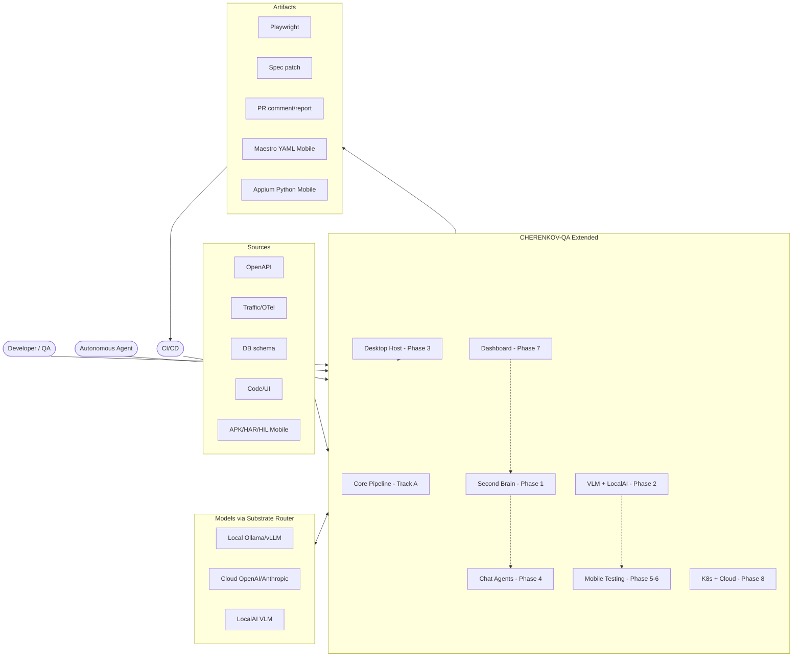
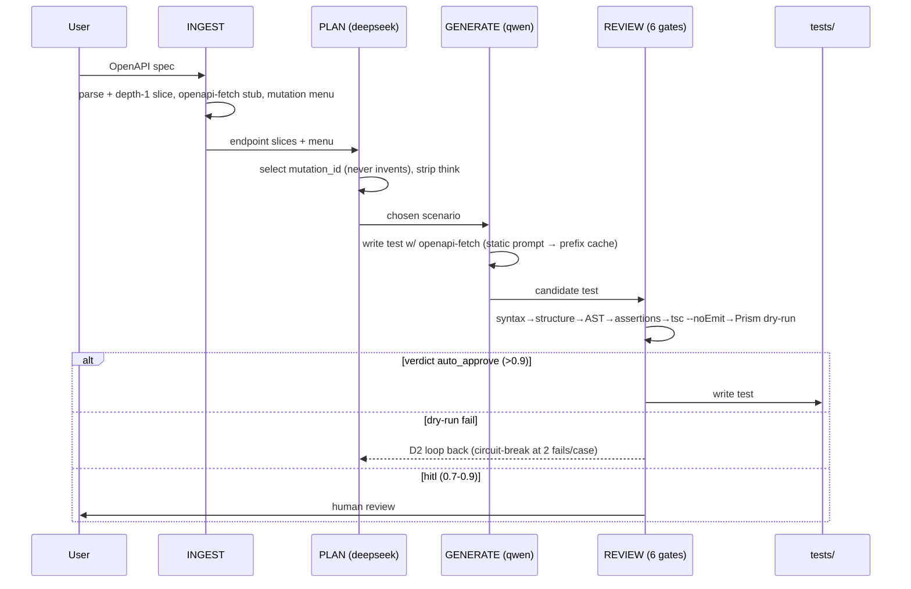
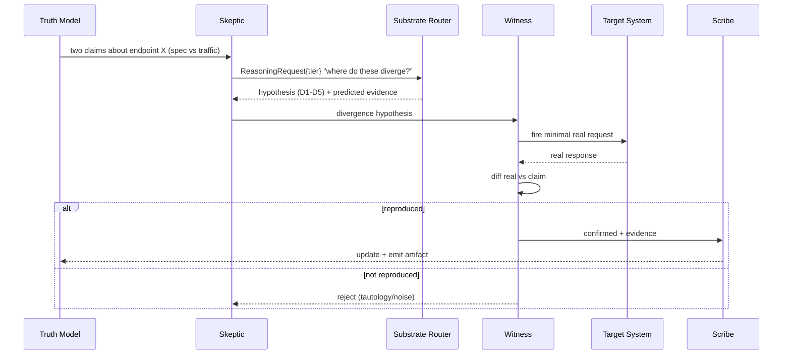
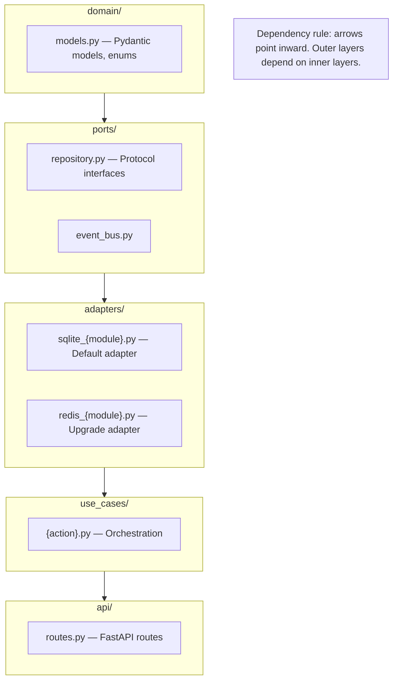
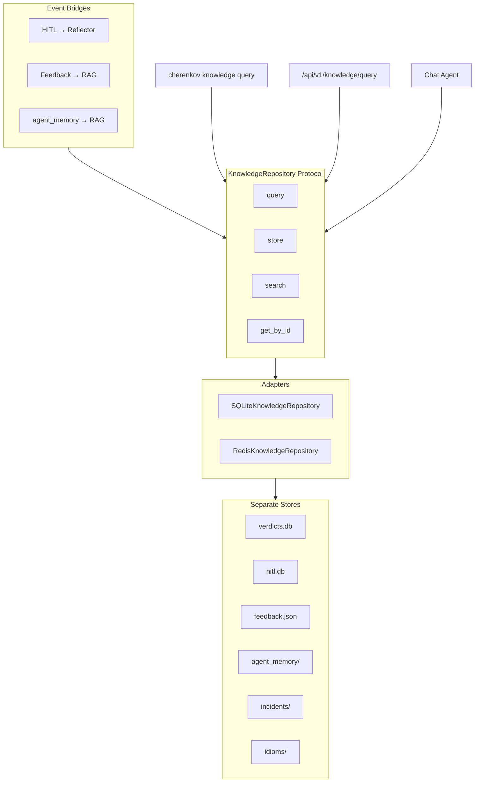
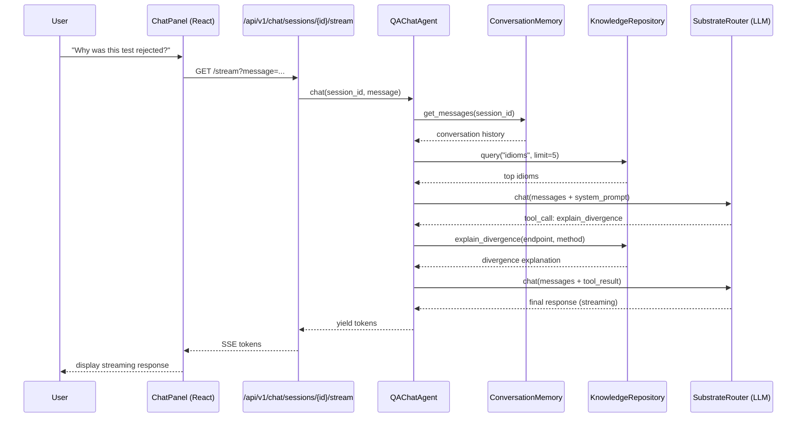
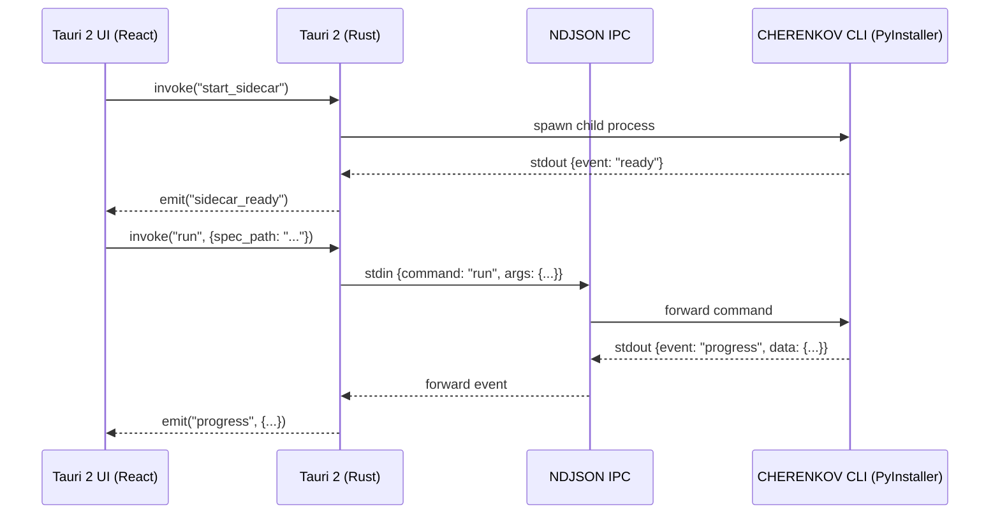
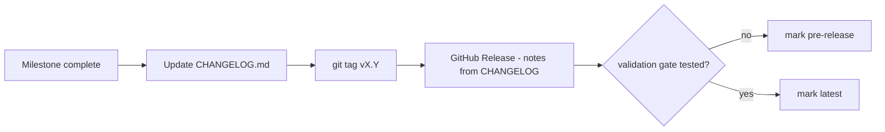
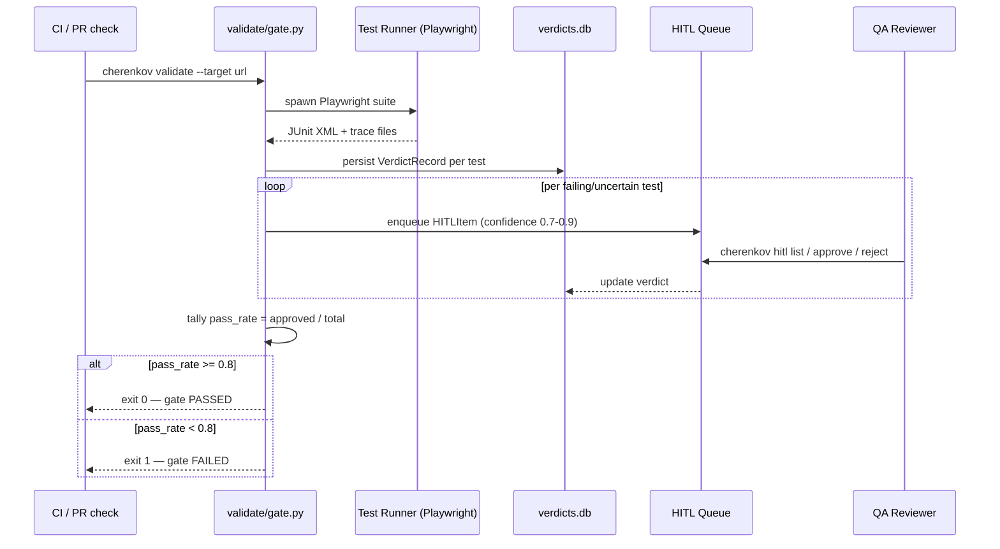

# System Architecture Diagrams

All CHERENKOV architectural flows rendered as interactive diagrams.

---

## 1. System Context

---

## 2. Track A Pipeline — Spec In, Tests Out

---

## Divergence Loop — The Core Capability

---

## 4. Clean Architecture Module Structure

---

## 5. Second Brain Architecture

---

## 6. Chat Agent Flow

---

## 7. Desktop Host IPC

---

## 8. Release Flow

---

## 9. Validation Gate Flow

