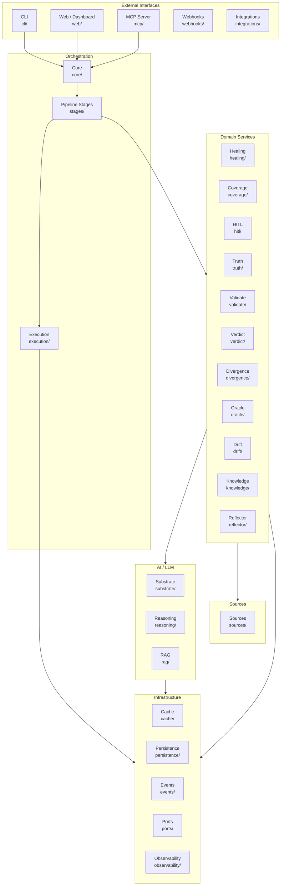

# Module Reference

This page documents every module in the `cherenkov/` package, organized by architectural layer. Use it to understand where code lives, what depends on what, and where to make changes.

---

## Dependency Layers

---

## Core

The central orchestration layer. Everything flows through here.

**`cherenkov/core/`**

| Module | Purpose |
|--------|---------|
| `orchestrator.py` | Main pipeline orchestrator — coordinates ingest, plan, generate, execute |
| `config.py` | Configuration model definitions |
| `config_loader.py` | Configuration file loading and merging |
| `settings.py` | Runtime settings and environment variable handling |
| `contracts.py` | Core data contracts (TypedDicts, dataclasses) shared across modules |
| `errors.py` | Exception hierarchy for the entire package |
| `error_handling.py` | Error formatting, recovery strategies |
| `budget.py` | Token and cost budget tracking for LLM calls |
| `flags.py` | Feature flags for gating experimental features |
| `certificate.py` | Conformance certificate generation and serialization |
| `events.py` | Internal event bus for pipeline stage notifications |
| `feedback_store.py` | Persistent storage for user feedback on findings |
| `knowledge_result.py` | Data model for knowledge base query results |
| `logging_ext.py` | Extended logging configuration |
| `migration.py` | Config and data migration between versions |
| `shutdown.py` | Graceful shutdown coordination |
| `compat.py` | Backward compatibility shims |
| `devices.py` | Device registry for mobile testing targets |
| `d2_controller.py` | D2 diagram generation controller |

---

## CLI

Command-line interface built with Click.

**`cherenkov/cli/`**

| Module | Purpose |
|--------|---------|
| `core.py` | Root Click group and shared CLI options |
| `groups.py` | Command group registration |
| `loaders.py` | Lazy command loading for fast CLI startup |
| `legacy_reports.py` | Backward-compatible report rendering |

**`cherenkov/cli/commands/`** — Individual CLI commands:

`validate`, `verify`, `generate`, `check-suite`, `eject`, `certify`, `daemon`, `guardian`, `hitl`, `demo`, `doctor`, `report`, `dashboard`, and others. Each command is a Click command that delegates to the corresponding pipeline stage or domain service.

---

## Pipeline Stages

The ordered steps that a validation or generation run passes through.

**`cherenkov/stages/`**

| Module | Purpose |
|--------|---------|
| `ingest.py` | Parse OpenAPI/GraphQL/gRPC spec into internal representation |
| `plan.py` | Decide which endpoints to test, generate test plan |
| `plan_accessibility.py` | Test planning for accessibility sources |
| `plan_asyncapi.py` | Test planning for AsyncAPI sources |
| `generate.py` | Generate Playwright test code from plan (calls LLM) |
| `enrich.py` | Enrich generated tests with additional assertions |
| `certify_cmd.py` | Conformance certificate generation stage |
| `doctor_cmd.py` | Environment diagnostics stage |
| `daemon_cmd.py` | Daemon mode startup stage |
| `copilot_cmd.py` | Copilot integration stage |
| `diagnostics_stage.py` | Extended diagnostics collection |
| `governance_cmd.py` | Governance report generation |
| `init_cmd.py` | Project initialization stage |
| `map_cmd.py` | Spec-to-test mapping stage |
| `mobile_cmd.py` | Mobile test orchestration |
| `mobile_generate.py` | Mobile test generation |
| `mobile_plan.py` | Mobile test planning |
| `mobile_review.py` | Mobile test review |

**`cherenkov/stages/perf/`** — Performance testing stages.

---

## Execution

Running generated tests and producing results.

**`cherenkov/execution/`**

| Module | Purpose |
|--------|---------|
| `playwright_invoke.py` | Invoke Playwright to run generated tests |
| `validate.py` | Validation execution coordinator |
| `eject.py` | Strip CHERENKOV dependencies from tests (eject to standalone Playwright) |
| `demo_mode.py` | Built-in demo execution |
| `coverage_report.py` | Generate coverage reports from test results |
| `failure_classifier.py` | Classify test failures by type (drift, flake, infra) |
| `perf_analyzer.py` | Performance test analysis |
| `trace_reader.py` | Read Playwright trace files |
| `visual_diff.py` | Visual regression diffing |
| `ui_probe.py` | UI probe execution |
| `prism_mock.py` | Prism mock server integration |
| `k6_runner.py` | k6 performance test runner |
| `appium_runner.py` | Appium mobile test runner |
| `maestro_runner.py` | Maestro mobile test runner |
| `mobile_runner_base.py` | Base class for mobile runners |
| `mobile_eject_appium.py` | Eject Appium mobile tests |
| `mobile_eject_maestro.py` | Eject Maestro mobile tests |

**`cherenkov/execution/emitters/`** — Output format emitters (JUnit XML, SARIF, JSON, HTML).

---

## Domain Services

Business logic modules that implement CHERENKOV's core capabilities.

### Healing

**`cherenkov/healing/`** — Suggest-only code repair (never auto-edits).

| Module | Purpose |
|--------|---------|
| `diagnose.py` | Analyze test failures and suggest fixes |
| `contract_drift.py` | Detect contract drift between spec versions |
| `auth_expiry.py` | Handle expired auth token scenarios |
| `sandbox_healer.py` | Sandboxed healing suggestion execution |
| `visual_heal.py` | Visual regression healing suggestions |
| `providers/` | Healing provider implementations |

### Coverage

**`cherenkov/coverage/`** — Track which spec endpoints have test coverage.

| Module | Purpose |
|--------|---------|
| `assertion_gate.py` | Gate that checks assertion quality |
| `emitter.py` | Coverage report generation |
| `loop.py` | Coverage gap detection loop |

### HITL (Human-in-the-Loop)

**`cherenkov/hitl/`** — Finding triage queue.

| Module | Purpose |
|--------|---------|
| `cmd.py` | HITL CLI operations (list, approve, reject) |
| `contracts.py` | HITL data contracts |
| `store.py` | Persistent finding storage |

### Truth

**`cherenkov/truth/`** — Source-of-truth resolution.

| Module | Purpose |
|--------|---------|
| `index.py` | Truth source registry and lookup |
| `spec_validator.py` | Validate spec correctness and richness |
| `sources/` | Truth source implementations (spec, production, etc.) |
| `emitters/` | Truth report emitters |

### Validate

**`cherenkov/validate/`** — Validation logic and export.

| Module | Purpose |
|--------|---------|
| `gate.py` | Validation gate (pass/fail logic with exit codes) |
| `evidence.py` | Evidence collection for validation results |
| `contracts.py` | Validation data contracts |
| `asyncapi.py` | AsyncAPI validation |
| `buf_registry.py` | Buf schema registry integration |
| `github_exporter.py` | Export results to GitHub (checks, comments) |
| `jira_exporter.py` | Export results to Jira |
| `linear_exporter.py` | Export results to Linear |

### Verdict

**`cherenkov/verdict/`** — Final pass/fail decision engine.

| Module | Purpose |
|--------|---------|
| `engine.py` | Verdict computation engine |
| `models.py` | Verdict data models |
| `semantic_judge.py` | LLM-based semantic comparison of expected vs actual |
| `mutation_oracle.py` | Mutation-based verdict verification |
| `traffic_capture.py` | Capture live traffic for verdict analysis |

### Divergence

**`cherenkov/divergence/`** — Detect and analyze API divergences.

| Module | Purpose |
|--------|---------|
| `explorer.py` | Explore spec surface for divergence candidates |
| `probe_planner.py` | Plan targeted probes for suspected divergences |
| `proof_run.py` | Execute proof-of-divergence runs |
| `witness.py` | Collect divergence evidence |
| `skeptic.py` | Skeptical re-evaluation of reported divergences |
| `health.py` | Health score computation |
| `coverage.py` | Divergence coverage analysis |
| `self_play.py` | Self-play divergence detection |
| `mutant_synth.py` | Synthesize mutant specs for testing |
| `report_diff.py` | Diff reports between runs |

### Oracle

**`cherenkov/oracle/`** — Ground truth comparison.

| Module | Purpose |
|--------|---------|
| `interface.py` | Oracle interface contract |
| `consensus_oracle.py` | Multi-source consensus-based oracle |
| `spec_prism.py` | Spec-based oracle using Prism |
| `prod_snapshot.py` | Production snapshot oracle |
| `visual_oracle.py` | Screenshot-based visual oracle |
| `visual_oracle_vlm.py` | VLM-powered visual oracle |

### Drift

**`cherenkov/drift/`** — Track API drift over time.

| Module | Purpose |
|--------|---------|
| `checker.py` | Drift checking logic |
| `detect.py` | Drift detection algorithms |
| `fingerprint.py` | API behavior fingerprinting |
| `ledger.py` | Historical drift ledger |
| `loop.py` | Continuous drift detection loop |
| `maker.py` | Synthetic drift generation for testing |
| `models.py` | Drift data models |
| `reconcile.py` | Drift reconciliation (spec vs implementation) |
| `snapshot.py` | API state snapshots for drift comparison |

### Knowledge

**`cherenkov/knowledge/`** — Knowledge base for test generation context.

| Module | Purpose |
|--------|---------|
| `graph_rag.py` | Graph-based RAG for spec knowledge |
| `rag_index.py` | RAG index construction |
| `cli.py` | Knowledge base CLI |
| `domain/` | Domain models |
| `ports/` | Port interfaces |
| `adapters/` | Storage and retrieval adapters |
| `api/` | Knowledge API |
| `bridges/` | Bridges to external knowledge sources |
| `use_cases/` | Knowledge use case implementations |

### Reflector

**`cherenkov/reflector/`** — Self-reflection on test quality.

| Module | Purpose |
|--------|---------|
| `reflector.py` | Core reflection engine |
| `introspect.py` | Test introspection utilities |
| `store.py` | Reflection result storage |
| `cli.py` | Reflector CLI |
| `mobile_extensions.py` | Mobile-specific reflection |

---

## AI / LLM

### Substrate

**`cherenkov/substrate/`** — LLM provider abstraction layer.

| Module | Purpose |
|--------|---------|
| `provider.py` | Provider selection and initialization |
| `provider_base.py` | Base class for all LLM providers |
| `client_factory.py` | Client factory pattern for provider instantiation |
| `interfaces.py` | Provider interface contracts |
| `router.py` | Multi-provider routing (fallback, load balancing) |
| `retry.py` | Retry logic for LLM calls |
| `cache.py` | Response caching |
| `accounting.py` | Token usage accounting |
| `certification.py` | Provider certification checks |
| `doctor.py` | Provider health diagnostics |
| `text_utils.py` | Text processing utilities |
| `vlm_provider.py` | Vision-language model provider |
| `playwright_mcp_client.py` | MCP client for Playwright integration |

**`cherenkov/substrate/providers/`** — Provider implementations:

| Provider | Module |
|----------|--------|
| Ollama (default) | `ollama.py`, `ollama_client.py` |
| OpenAI | `openai.py`, `openai_client.py` |
| Azure OpenAI | `azure_openai.py` |
| Anthropic | `anthropic.py`, `anthropic_client.py` |
| AWS Bedrock | `bedrock.py`, `bedrock_client.py` |
| GitHub Models | `github_models_client.py` |
| HuggingFace | `huggingface_client.py` |
| LocalAI | `localai.py` |
| AirLLM | `airllm.py`, `airllm_client.py` |
| NemoClaw | `nemoclaw.py`, `nemoclaw_client.py` |
| Model Runner | `model_runner_client.py` |
| Template (no LLM) | `template_generator.py` |
| OpenAI-compatible | `openai_compat.py` |
| Fenced client | `fenced_client.py` |
| VLM | `vlm.py` |

### Reasoning

**`cherenkov/reasoning/`** — LLM reasoning and chain-of-thought.

Structured as a hexagonal module: `domain/`, `ports/`, `adapters/`, `use_cases/`.

### RAG

**`cherenkov/rag/`** — Retrieval-augmented generation.

| Module | Purpose |
|--------|---------|
| `schema_index.py` | Index OpenAPI schemas for retrieval |
| `mobile_index.py` | Index mobile test patterns |

---

## Sources

**`cherenkov/sources/`** — Spec source parsers.

| Source | Directory | Purpose |
|--------|-----------|---------|
| OpenAPI | `sources/` (root) | Default — parse OpenAPI 3.0.x / 3.1.x / 3.2.x |
| GraphQL | `graphql/` | Parse GraphQL schemas and introspection results |
| gRPC | `grpc/` | Parse Protocol Buffer definitions |
| AsyncAPI | `asyncapi/` | Parse AsyncAPI event-driven API specs |
| Accessibility | `accessibility/` | Parse accessibility rules and WCAG criteria |
| Mobile | `mobile/` | Parse mobile app test sources |

---

## Integration

### MCP Server

**`cherenkov/mcp/`** — Model Context Protocol server implementation.

| Module | Purpose |
|--------|---------|
| `server.py` | MCP server entry point |
| `client.py` | MCP client for connecting to other servers |
| `protocol.py` | MCP protocol implementation |
| `handlers.py` | Request handlers |
| `contracts.py` | MCP data contracts |
| `auth.py` | MCP authentication |
| `policy.py` | Access policy enforcement |
| `mesh_router.py` | Multi-server mesh routing |
| `install.py` | MCP server installation helper |
| `tools/` | MCP tool definitions |
| `marketplace/` | MCP marketplace integration |

### LangChain

**`cherenkov/integrations/langchain/`** and **`cherenkov/langchain/`** — LangChain tool integration.

### Chat

**`cherenkov/chat/`** — Conversational interface.

Hexagonal architecture: `domain/`, `ports/`, `adapters/`, `use_cases/`, `api/`.

Key modules: `agent.py` (chat agent), `guard.py` (safety guardrails), `persona.py` (persona management), `tools.py` (chat tool definitions).

### Copilot

**`cherenkov/copilot/`** — IDE copilot integration.

| Module | Purpose |
|--------|---------|
| `autonomy.py` | Autonomous operation configuration |
| `digest.py` | Change digest generation |
| `intent.py` | User intent detection |
| `live_session.py` | Live coding session tracking |
| `mentor.py` | Mentoring suggestions |
| `triage.py` | Issue triage assistant |

### Webhooks

**`cherenkov/webhooks/`** — Outbound webhook dispatch.

| Module | Purpose |
|--------|---------|
| `dispatcher.py` | Webhook event dispatcher |

---

## Web

**`cherenkov/web/`** — FastAPI backend and React dashboard.

| Module | Purpose |
|--------|---------|
| `api.py` | FastAPI application factory |
| `errors.py` | HTTP error handlers |
| `monitoring.py` | Health and readiness endpoints |
| `alerts.py` | Alert management |
| `coverage_map.py` | Coverage map API |
| `divergences.py` | Divergence API |
| `pr_comments.py` | PR comment integration |
| `regenerate.py` | Test regeneration API |
| `auth/` | Authentication (JWT, session management) |
| `middleware/` | HTTP middleware (CORS, rate limiting, etc.) |
| `routes/` | API route definitions |
| `sdd_auth.py` | SDD authentication |
| `sdd_models.py` | SDD data models |
| `sdd_routes.py` | SDD route definitions |
| `ui/` | React frontend build and serving |

---

## Enterprise

**`cherenkov/enterprise/`** — Enterprise features (all free, Apache 2.0).

| Module | Purpose |
|--------|---------|
| `saml.py` | SAML SSO authentication |
| `rbac.py` | Role-based access control |
| `audit.py` | Audit trail logging |
| `org.py` | Organization and team management |
| `gdpr.py` | GDPR data handling compliance |
| `soc2.py` | SOC 2 compliance reporting |

---

## Extended Modules

### Agents

**`cherenkov/agents/conductor/`** — Multi-agent orchestration.

**`cherenkov/agents/pilot.py`** — Autonomous pilot agent.

### Continuity

**`cherenkov/continuity/`** — Session persistence and PR workflows.

| Module | Purpose |
|--------|---------|
| `pr_diff_action.py` | PR diff analysis action |
| `sessions/` | Session persistence and resumption |

### Daemon & Guardian

**`cherenkov/daemon/`** — Continuous monitoring daemon.

| Module | Purpose |
|--------|---------|
| `trigger_loop.py` | Periodic validation trigger |
| `watcher.py` | File and event watcher |

**`cherenkov/spec_guardian/`** — Spec file guardian.

| Module | Purpose |
|--------|---------|
| `core.py` | Guardian core logic |
| `daemon.py` | Guardian daemon process |
| `detector.py` | Spec change detection |
| `store.py` | Guardian state storage |

### Hooks

**`cherenkov/hooks/`** — Lifecycle hooks system.

Hexagonal architecture: `domain/`, `ports/`, `adapters/`, `registry.py`.

### Memory

**`cherenkov/memory/`** — Agent memory persistence.

Hexagonal architecture: `domain/`, `ports/`, `adapters/`, `use_cases/`.

### Scheduling

**`cherenkov/scheduling/`** — Job scheduling.

Hexagonal architecture: `domain/`, `ports/`, `adapters/`, `api/`, `use_cases/`, `templates/`.

---

## Other Modules

| Module | Purpose |
|--------|---------|
| `adversarial/` | Adversarial testing — prompt injection detection, security fuzzing |
| `analytics/` | Telemetry collection (local only, no phone-home) |
| `bench/` | Benchmarking framework for CHERENKOV's own performance |
| `cache/` | Endpoint response caching |
| `compliance/` | Compliance scanning (MENA region regulations) |
| `dashboard/` | Dashboard rendering utilities |
| `diff/` | Spec diffing between versions |
| `eval/` | Evaluation framework (grader, optimizer, runner) |
| `evals/` | Evaluation suite (judge, regression, prompt versioning) |
| `events/` | Event bridge for cross-module communication |
| `federation/` | Multi-instance federation (corpus sharing, cross-checking) |
| `governance/` | Generation governance (KPIs, metrics, fine-tune logging) |
| `integrity/` | API integrity checking |
| `mobile/` | Mobile testing contracts and registry |
| `observability/` | OpenTelemetry integration, LLM tracing, token monitoring |
| `openclaw/` | OpenClaw feedback protocol |
| `persistence/` | Run result storage |
| `playbooks/` | Test playbooks (builtin patterns, matcher, runner) |
| `ports/` | Port interfaces (event bus, storage, notifier, VLM) |
| `prompts/` | Prompt templates (Jinja2) |
| `rag/` | Retrieval-augmented generation indexes |
| `reasoning/` | LLM reasoning chains |
| `reporting/` | Session report generation |
| `review_ocr/` | OCR-based review (screenshot → findings) |
| `sdet/` | SDET tooling (assertion gating, coverage loops) |
| `security/` | Auth handling, secret redaction, Snyk integration |
| `synthetic/` | Synthetic test generation (personas, enrichment, refinement) |
| `training/` | Training data collection for model fine-tuning |
| `adapters/` | External system adapters (Docker, SSH, TestRail, Xray, Zephyr, Postman) |

---

## Top-Level Files

| File | Purpose |
|------|---------|
| `__init__.py` | Package version and public API |
| `__main__.py` | `python -m cherenkov` entry point |

---

## Next Steps

- [System Design](system-design.md) — high-level architecture and data flow
- [Clean Architecture](clean-architecture.md) — hexagonal architecture principles used in CHERENKOV
- [AI Pipeline](ai-pipeline.md) — how the LLM generation pipeline works
- [CLI Reference](../cli/reference.md) — command documentation
