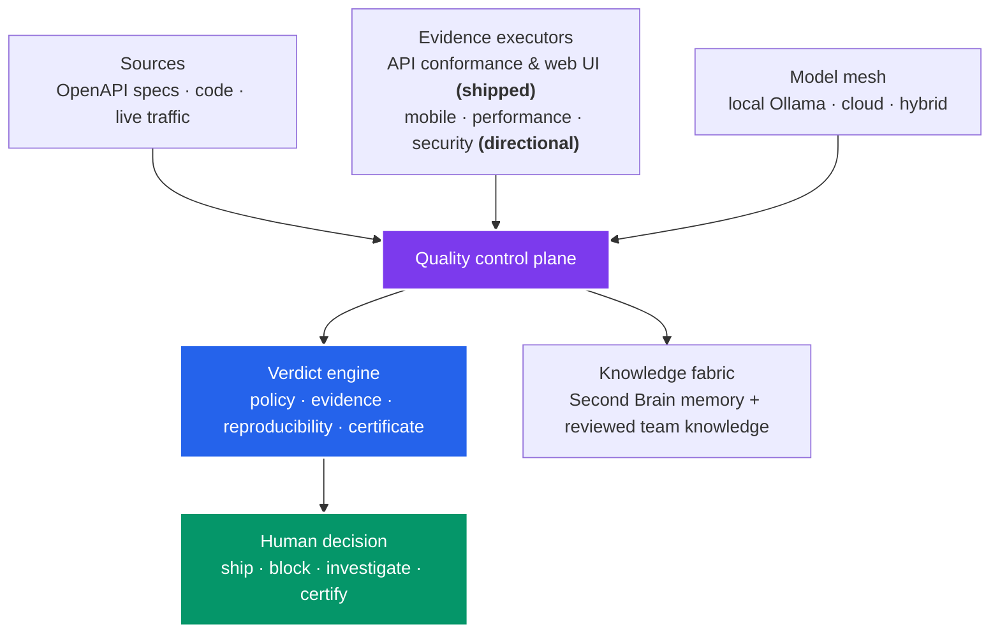
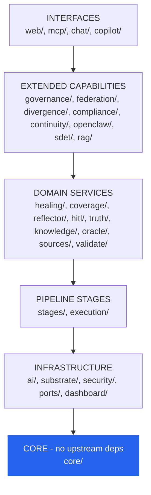
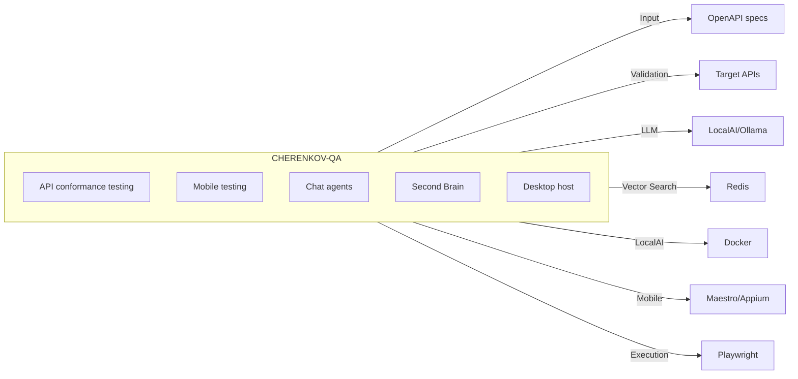

# System Design

CHERENKOV-QA follows Clean Architecture (Ports/Adapters pattern, ADR-004). Dependencies flow strictly inward — outer layers depend on inner layers, never the reverse.

---

## Platform Context — the independent quality layer

The architecture below exists to serve one product idea: **CHERENKOV is an open Quality Intelligence Platform. It gathers evidence from an engineering system, applies quality policy that the AI under test cannot lower for itself, and gives a person a reproducible verdict before software ships.**

The reason this matters is the failure mode CHERENKOV was built to catch: AI agents *cheat to look successful* — they weaken assertions, delete failing checks, and hallucinate oracles, then report green. When generation is free and infinite, **trust becomes the scarce thing.** The platform's job is to keep the quality decision independent of the model that produced the work.

This draws a deliberate boundary between what the platform **owns** and what pluggable adapters **provide**:

| Platform core — CHERENKOV owns this | Extension ecosystem — adapters provide this |
|---|---|
| Quality policy, verdict schema, evidence integrity, certificates, review workflow, memory governance | Test frameworks, model providers, source systems, CI, IDEs, messaging, device clouds |
| Deterministic guardrails an agent cannot lower for itself | Optional capabilities you install, configure, or remove |

!!! note "Shipped today vs. directional"
    API conformance is the **flagship, shipped** evidence source — `validate`, `verify`, test generation, the [check-suite integrity audit](../guides/check-suite.md), and [signed certificates](../guides/certificates.md) all run today. Mobile, performance, and security executors are the platform's **direction**, not current scope. The full product contract lives in the [Platform Operating Model](platform-operating-model.md), and the [User Journeys](user-journeys.md) show how it feels in practice.

---

## Module Dependency Layers

---

## Core Modules

| Module | Purpose | Location |
|--------|---------|----------|
| `core/` | Orchestrator, config, contracts, errors | `cherenkov/core/` |
| `substrate/` | Model providers, routing, certification | `cherenkov/substrate/` |
| `stages/` | Pipeline stages (ingest, plan, generate, review) | `cherenkov/stages/` |
| `execution/` | Test execution, ejection | `cherenkov/execution/` |
| `healing/` | Failure diagnosis, suggestions | `cherenkov/healing/` |

---

## Extended Modules

| Module | Phase | Purpose |
|--------|-------|---------|
| `knowledge/` | Phase 1 | GraphRAG second brain — verdicts, idioms, incidents |
| `ai/substrate/` | Phase 2 | LocalAI/VLM tier routing |
| `chat/` | Phase 4 | Tool-calling agent, SSE streaming, persona registry |
| `mobile/` | Phase 5-6 | Maestro/Appium device execution |
| `memory/` | CC-1 | SQLite FTS5 auto-memory |
| `hooks/` | CC-1 | HookRegistry, SubprocessHookExecutor |
| `agents/conductor/` | CC-2 | Multi-agent fan-out/fan-in |

---

## Key Design Decisions

| Decision | ADR | Choice |
|----------|-----|--------|
| Clean Architecture | [ADR-004](clean-architecture.md) | Ports/Adapters, no framework coupling in domain |
| Event-driven coordination | ADR-005 | EventBus (asyncio.Queue → Redis Streams) |
| Knowledge storage | ADR-006 | SQLite (default) + Redis (upgrade path) |
| VLM/LLM routing | ADR-003 | LocalAI as default, tier-aware (small/deep/vision) |
| Multi-agent protocol | ADR-013 | MCP JSON-RPC 2.0 mesh |
| Memory storage | ADR-011 | SQLite FTS5 with auto-promote |
| Hook execution | ADR-012 | cherenkov.toml defined, warn/abort fail modes |

---

## System Context

---

## Most-Imported Modules

Demand on each module (import count across codebase):

| Module | Count | Role |
|--------|-------|------|
| `core` | 203 | Foundation — most imported |
| `ai` | 34 | LLM clients |
| `substrate` | 29 | Model routing |
| `knowledge` | 25 | GraphRAG mesh |
| `stages` | 23 | Pipeline stage definitions |
| `reflector` | 22 | Verdict memory + suppression |
