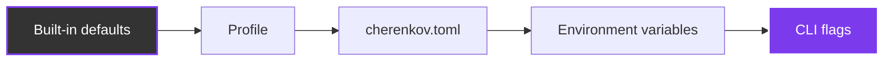
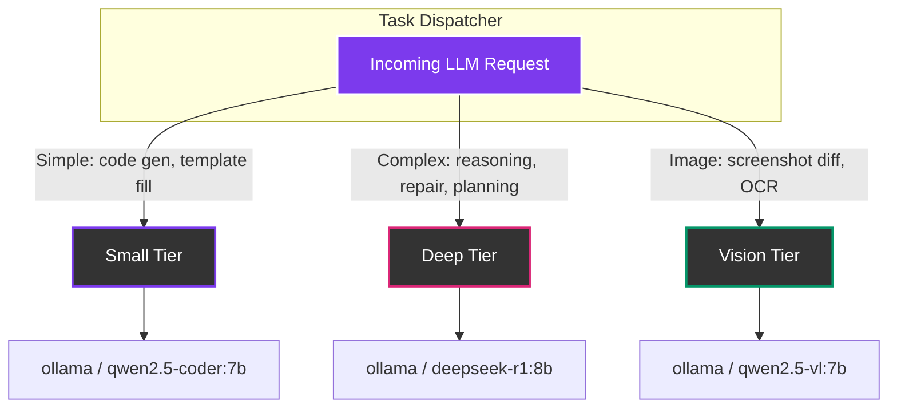

# Configuration

CHERENKOV-QA uses a layered configuration system. Every setting has a sensible default, so you can start with zero config. When you need control, each layer overrides the one below it.

---

## Precedence



**CLI flags win.** If you set `--spec` on the command line, it overrides `sources.openapi` in `cherenkov.toml`, which overrides the profile default, which overrides the built-in default.

---

## cherenkov.toml

Run `cherenkov init` to generate a `cherenkov.toml` in your project root. This file is the recommended way to configure a project — it is checked into version control and shared across your team.

```toml
# cherenkov.toml — generated by `cherenkov init`
# Every key is OPTIONAL; defaults apply when omitted.

profile = "laptop"

[sources]
openapi = [
  "./api/openapi.yaml",
]
# traffic = ["./capture.har"]
# db_schema = []

[substrate]
egress = "internal"           # none | internal | any

[substrate.tiers.small]
provider = "ollama"
model = "qwen2.5-coder:7b"

[substrate.tiers.deep]
provider = "ollama"
model = "deepseek-r1:8b"

[substrate.tiers.vision]
provider = "ollama"
model = "qwen2.5-vl:7b"

[substrate.budgets]
max_cost_usd_per_run = 0.0    # 0 = local only, no cloud spend
max_latency_ms = 120000

[divergence]
space = ["D1", "D2", "D3", "D4", "D5"]
adversarial_self_play = true
min_severity = "low"

[artifacts]
emitters = ["playwright"]
eject = true

[oracle]
kind = "spec+prism"

[continuity]
mode = "one-shot"             # one-shot | daemon
behavioral_diff_on_pr = false

[certification]
gold_set_path = ".cherenkov/gold_set.json"
min_faithfulness = 0.8

[copilot]
autonomy = "assisted"         # assisted | augmented | agentic | predictive
mentor_enabled = true
```

---

## Profiles

Profiles are pre-built configuration bundles for common scenarios. Set the profile in `cherenkov.toml` or with the `CHERENKOV_PROFILE` environment variable.

| Profile | Egress | Small Tier | Deep Tier | Vision | Cost Cap | Use Case |
|---------|--------|-----------|-----------|--------|----------|----------|
| `laptop` | `internal` | `ollama/qwen2.5-coder:7b` | `ollama/deepseek-r1:8b` | `ollama/qwen2.5-vl:7b` | $0 | Local development |
| `ci` | `internal` | `ollama/qwen2.5-coder:7b` | `ollama/qwen2.5-coder:7b` | `ollama/qwen2.5-vl:7b` | $0 | CI pipelines |
| `enterprise-vpc` | `none` | `ollama/qwen2.5-coder:7b` | `ollama/deepseek-r1:8b` | `ollama/qwen2.5-vl:7b` | $0 | Air-gapped VPC |
| `frontier-cloud` | `any` | `ollama/qwen2.5-coder:7b` | `openai/gpt-4o` | `openai/gpt-4o` | $5 | Maximum quality (cloud) |

---

## Environment Variables

Environment variables override `cherenkov.toml`. Use them for CI, Docker, or machine-specific overrides that should not be committed.

### Core LLM Settings

| Variable | Default | Description |
|----------|---------|-------------|
| `PROVIDER` | `ollama` | LLM provider for code generation |
| `GEN_MODEL` | `qwen2.5-coder:7b` | Model used for test generation |
| `OLLAMA_URL` | `http://localhost:11434/api/generate` | Ollama API endpoint |

### Tier Routing

CHERENKOV routes LLM calls to different models based on task complexity. Each tier has a provider and model.

| Variable | Default | Description |
|----------|---------|-------------|
| `CHERENKOV_TIER_SMALL_PROVIDER` | `ollama` | Provider for fast, simple tasks |
| `CHERENKOV_TIER_SMALL_MODEL` | `qwen2.5-coder:7b` | Model for small tier |
| `CHERENKOV_TIER_DEEP_PROVIDER` | `ollama` | Provider for complex reasoning |
| `CHERENKOV_TIER_DEEP_MODEL` | `deepseek-r1:8b` | Model for deep tier |
| `CHERENKOV_TIER_VISION_PROVIDER` | `ollama` | Provider for visual analysis |
| `CHERENKOV_TIER_VISION_MODEL` | `qwen2.5-vl:7b` | Model for vision tier |

### VLM (Visual Language Model)

| Variable | Default | Description |
|----------|---------|-------------|
| `CHERENKOV_VLM_PROVIDER` | `ollama` | VLM provider (ollama, localai, openai) |
| `CHERENKOV_VLM_LOCALAI_URL` | — | LocalAI endpoint for VLM tasks |

### Fallback

| Variable | Default | Description |
|----------|---------|-------------|
| `CHERENKOV_FALLBACK_ENABLED` | `false` | Enable fallback when primary provider fails |
| `CHERENKOV_FALLBACK_PROVIDER` | — | Fallback provider name |

### Network & Security

| Variable | Default | Description |
|----------|---------|-------------|
| `CHERENKOV_EGRESS` | `internal` | Network egress mode: `none` (air-gapped), `internal` (LAN only), `any` (cloud OK) |

### Budget Controls

| Variable | Default | Description |
|----------|---------|-------------|
| `CHERENKOV_BUDGET_USD_CAP` | `0.0` | Maximum USD spend per run. `0` = local models only |
| `CHERENKOV_BUDGET_WARN_THRESHOLD` | — | Warn when spend exceeds this fraction of the cap (0.0-1.0) |

### Output

| Variable | Default | Description |
|----------|---------|-------------|
| `CHERENKOV_OUTPUT_DIR` | `./output` | Directory for reports, certificates, and artifacts |

### Redis

| Variable | Default | Description |
|----------|---------|-------------|
| `CHERENKOV_REDIS_ENABLED` | `false` | Enable Redis for caching and queue persistence |
| `CHERENKOV_REDIS_URL` | `redis://localhost:6379/0` | Redis connection URL |

### Certification

| Variable | Default | Description |
|----------|---------|-------------|
| `CHERENKOV_CERTIFICATION_ENABLED` | `false` | Enable the certification subsystem |
| `CHERENKOV_MEANINGFUL_ASSERTION_GATE` | `true` | Require generated tests to prove they catch real bugs |

### Monitoring & Observability

| Variable | Default | Description |
|----------|---------|-------------|
| `CHERENKOV_MONITORING_ENABLED` | `false` | Enable Prometheus metrics and health endpoints |
| `CHERENKOV_METRICS_PORT` | `8001` | Port for the metrics exporter |
| `CHERENKOV_OTEL_ENABLED` | `false` | Enable OpenTelemetry tracing |
| `CHERENKOV_OTEL_ENDPOINT` | — | OTLP exporter endpoint (e.g. `http://localhost:4317`) |

---

## Tier Routing in Detail

CHERENKOV uses a tiered architecture so the right model handles the right task. Fast, cheap models handle simple work; expensive models handle complex reasoning.



| Tier | Purpose | Default Provider | Default Model | When Used |
|------|---------|-----------------|---------------|-----------|
| **Small** | Fast code generation, template filling | `ollama` | `qwen2.5-coder:7b` | Test generation, simple repairs |
| **Deep** | Complex reasoning, multi-step planning | `ollama` | `deepseek-r1:8b` | Repair loops, root-cause analysis |
| **Vision** | Image understanding, screenshot diffs | `ollama` | `qwen2.5-vl:7b` | Visual regression, OCR |

Override any tier independently:

```bash
# Use GPT-4o for deep reasoning, keep everything else local
export CHERENKOV_TIER_DEEP_PROVIDER=openai
export CHERENKOV_TIER_DEEP_MODEL=gpt-4o
export CHERENKOV_BUDGET_USD_CAP=5.0  # allow cloud spend
export CHERENKOV_EGRESS=any          # allow outbound HTTPS
```

---

## Example: CI Configuration

A minimal `.env` for a CI runner:

```bash
# .env.ci
PROVIDER=ollama
GEN_MODEL=qwen2.5-coder:7b
OLLAMA_URL=http://ollama:11434/api/generate
CHERENKOV_EGRESS=internal
CHERENKOV_BUDGET_USD_CAP=0.0
CHERENKOV_MEANINGFUL_ASSERTION_GATE=true
CHERENKOV_OUTPUT_DIR=./reports
```

---

## Example: Production with Redis + Monitoring

```bash
# .env.production
CHERENKOV_REDIS_ENABLED=true
CHERENKOV_REDIS_URL=redis://redis:6379/0
CHERENKOV_MONITORING_ENABLED=true
CHERENKOV_METRICS_PORT=8001
CHERENKOV_OTEL_ENABLED=true
CHERENKOV_OTEL_ENDPOINT=http://otel-collector:4317
```

---

## Next Steps

- [Quickstart](quickstart.md) — run your first conformance test
- [Cost Tiers](cost-tiers.md) — understand how CHERENKOV keeps costs at zero by default
- [Docker & Deployment](../guides/docker.md) — environment variables in Docker Compose
- [Local LLM Setup](../guides/local-llm.md) — configure Ollama and model selection
