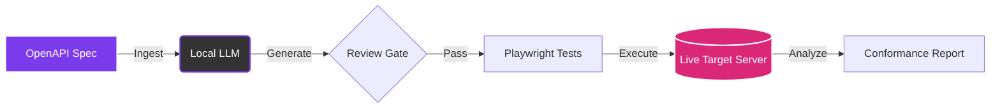
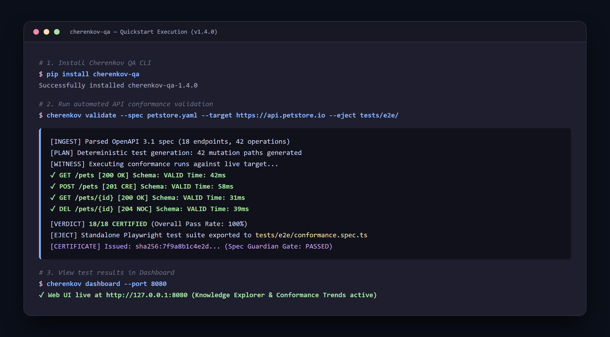

# 🚀 Unified Quick Start

This guide will take you from a blank terminal to a fully running CHERENKOV-QA environment that autonomously tests an API against its OpenAPI specification.

---

## 🏗️ 1. Installation

CHERENKOV runs entirely on your machine. You need **Python 3.10+**, **Node.js 18+**, and **Ollama**.

```bash
# 1. Clone the repository
git clone https://github.com/moaidmoatasem/cherenkov-qa.git
cd cherenkov-qa

# 2. Setup Python environment and install
python3 -m venv .venv
source .venv/bin/activate
pip install -e .

# 3. Install Playwright test dependencies
cd stub
npm install
npx playwright install
cd ..
```

---

## 🧠 2. Spin Up Local AI

CHERENKOV uses a local LLM by default. No cloud APIs, no data leaves your machine.

```bash
# Pull the required models (runs fine on CPU!)
ollama pull qwen2.5-coder:7b     # For code generation
ollama pull deepseek-r1:8b       # For reasoning and planning
```

!!! tip "Hardware Requirements"
    Both models run on CPU and require about 8-10GB of RAM total. GPU acceleration (NVIDIA/AMD/Apple Silicon) is automatically detected and will dramatically speed up generation.

---

## ⚙️ 3. The Testing Lifecycle

Here is what happens when you run a test:



---

## 🚀 4. Run Your First Test!

We'll test the canonical Petstore API. First, start a mock server in a new terminal:

```bash
curl -o petstore.yaml https://raw.githubusercontent.com/OAI/OpenAPI-Specification/main/examples/v3.0/petstore.yaml
npx @stoplight/prism-cli mock petstore.yaml --port 4010
```

Now, in your original terminal, tell CHERENKOV to validate the API against the spec:

```bash
cherenkov validate \
  --spec petstore.yaml \
  --target http://localhost:4010
```

The terminal will stream real-time results and summarize drift:

```text
CHERENKOV Conformance Report
════════════════════════════
✅ GET  /pets             200 — Conformant
✅ POST /pets             201 — Conformant
❌ GET  /pets/{petId}     Expected: 200, Got: 404 — DRIFT DETECTED
✅ DELETE /pets/{petId}   204 — Conformant

Summary: 3/4 passed · 1 divergence · Exit code: 1
```


*Figure: Live execution of `cherenkov validate` against OpenAPI specification with conformance report output.*

---

## 📊 5. Explore in the Dashboard (Optional)

Want a visual breakdown of the divergences? Launch the interactive React dashboard:

```bash
cherenkov dashboard
```

Open your browser to `http://localhost:8000`.

---

## 🎯 Next Steps

- **No Lock-in**: Want to own your generated tests? Run `cherenkov eject --output ./ejected-tests`.
- [Explore the CLI Reference →](../cli/reference.md)
- [Read the Architecture Guidelines →](../architecture/system-design.md)
