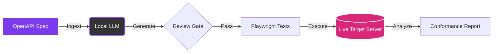

# Quickstart

Run CHERENKOV against the Petstore API — the canonical OpenAPI example — in under 5 minutes.

---

## The Testing Lifecycle

Before diving in, here is a visual overview of what CHERENKOV does autonomously:



---

## Step 1 — Get a Spec

Download the Petstore OpenAPI spec:

```bash
curl -o petstore.yaml https://raw.githubusercontent.com/OAI/OpenAPI-Specification/main/examples/v3.0/petstore.yaml
```

Or point to your own local specification:

```bash
export SPEC=./my-api.yaml
```

---

## Step 2 — Start a Target Server

You need a running server that implements the spec. For the Petstore example, we can use Prism to spin up a mock server instantly:

```bash
npx @stoplight/prism-cli mock petstore.yaml --port 4010
```

Or simply point to your own real development server:

```bash
export TARGET=http://localhost:8000
```

---

## Step 3 — Run CHERENKOV

Now, run the core conformance check. CHERENKOV will ingest the spec, plan the scenarios, and execute tests against the target.

```bash
cherenkov validate \
  --spec petstore.yaml \ # (1)!
  --target http://localhost:4010 # (2)!
```

1.  Path to the OpenAPI specification you want to test against.
2.  The live target server URL where your API is currently running.

---

## Step 4 — Read the Report

The terminal will stream real-time results and summarize drift:

```text
CHERENKOV Conformance Report
════════════════════════════
Spec:   petstore.yaml
Target: http://localhost:4010
Run:    2026-06-29T00:00:00Z

✅ GET  /pets             200 — Conformant
✅ POST /pets             201 — Conformant
❌ GET  /pets/{petId}     Expected: 200, Got: 404 — DRIFT DETECTED
✅ DELETE /pets/{petId}   204 — Conformant

Summary: 3/4 passed · 1 divergence · Exit code: 1
```

!!! tip "Exit code semantics"
    - `0` — all tests pass, no drift.
    - `1` — drift detected (spec violation found).
    - `2` — validation errors (config, spec parse failures).

---

## Step 5 — Explore in the Dashboard

Launch the interactive React dashboard to explore findings across 5 workspaces (Overview, Author & Generate, Triage, Coverage & Intelligence, Settings):

```bash
cherenkov dashboard
```

Open your browser to `http://localhost:8000`.

---

## Step 6 — Eject to Vanilla Playwright (Optional)

We guarantee zero vendor lock-in. When you're ready to own your tests outright:

```bash
cherenkov eject --output ./ejected-tests
```

This removes all CHERENKOV imports and produces pure Playwright tests:

```bash
cd ejected-tests
npm install
npx playwright test
```

---

## Next Steps

- [Full CLI reference →](../cli/reference.md)
- [Set up CI/CD integration →](../guides/ci-cd.md)
- [Configure local LLM →](../guides/local-llm.md)
