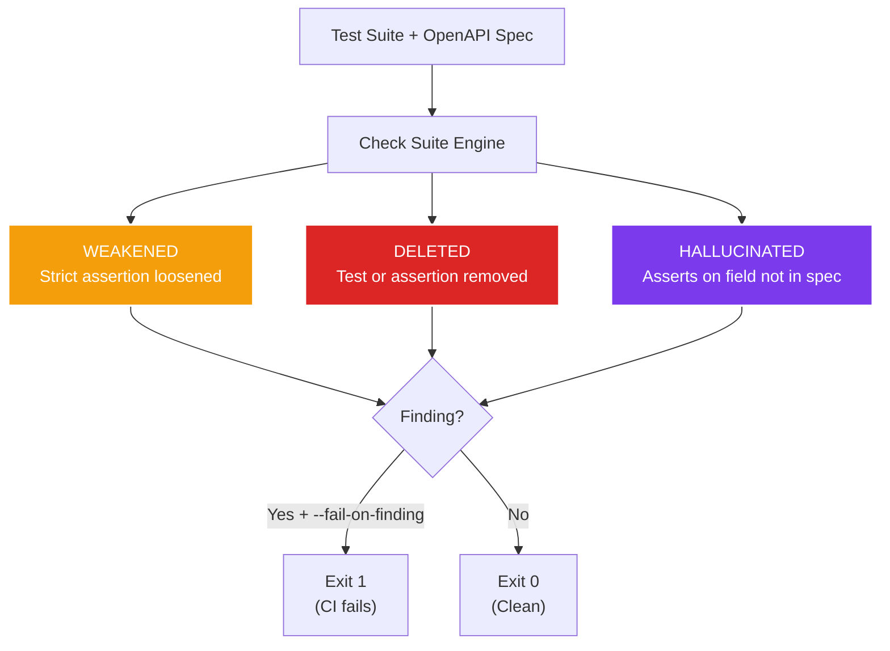

# Check Suite (Integrity Audit)

The check suite catches the three canonical ways an AI agent (or a human) weakens a test suite: loosening assertions, deleting tests, and asserting on fields that do not exist in the spec. Run it as a CI gate to prevent test rot.

---

## Quick Start

```bash
cherenkov check-suite \
  --candidate ./tests \
  --spec ./openapi.yaml \
  --fail-on-finding
```

Exit code `1` if any integrity finding is detected. Exit code `0` if the suite is clean.

---

## What It Detects



### 1. WEAKENED

A strict assertion was loosened to a weaker comparator. This happens when an AI "fixes" a failing test by relaxing the check instead of fixing the root cause.

| Strong (original) | Weak (loosened) |
|-------------------|-----------------|
| `toBe(200)` | `toBeTruthy()` |
| `toEqual({name: "Rex"})` | `toContain("Rex")` |
| `toStrictEqual(expected)` | `toBeDefined()` |
| `assert x == 42` (Python) | `assert x > 0` |

**Example finding:**

```
WEAKENED: test "GET /pets returns correct name"
  was: expect(body.name).toBe("doggie")
  now: expect(body.name).toBeTruthy()
```

### 2. DELETED

A test or specific assertion was removed from the suite compared to the baseline. A passing-by-deletion is not a passing test.

**Example finding:**

```
DELETED: test "POST /pets validates required fields"
  present in baseline, absent in candidate
```

### 3. HALLUCINATED

The test asserts on a response field that does not exist in the OpenAPI spec's schema definitions. This catches AI-generated tests that invent plausible-sounding but nonexistent fields.

**Example finding:**

```
HALLUCINATED: test "GET /pets/{petId}" asserts on field "breed"
  field "breed" is not defined in spec properties
  spec defines: id, name, tag, status
```

---

## Command Reference

### `cherenkov check-suite`

| Flag | Description |
|------|-------------|
| `--candidate` | Path to the test directory to audit (required) |
| `--spec` | Path to the OpenAPI spec for hallucination detection (required for hallucination checks) |
| `--baseline` | Path to the baseline test directory for deletion/weakening comparison |
| `--fail-on-finding` | Exit with code 1 if any finding is detected |
| `--json` | Output findings as JSON |

---

## Detection Depth by Language

The check suite uses different analysis strategies depending on the test language. This is important to understand because the coverage is not uniform.

### Python: Full AST Analysis

Python tests are analyzed using the `ast` module (stdlib, no external dependencies). This gives per-assertion granularity:

- Parses the full AST of each test file
- Identifies every `assert` statement and its comparator (`==`, `!=`, `>`, `in`, etc.)
- Classifies comparators as strong (`Eq`) or weak (`NotEq`, `Lt`, `Gt`, `In`, `NotIn`, etc.)
- Tracks which variables reference response body data (`body`, `data`, `payload`, `json`, `resp_json`, `response`)
- Detects `.json()` / `.get_json()` calls to identify response parsing

**Result:** Python detection is precise. It can identify the exact assertion that was weakened and the exact field being hallucinated.

### TypeScript: Regex-Based Analysis

TypeScript tests are analyzed using regular expressions. This is effective for common patterns but has known limitations:

- Pattern-matches `expect(...).toBe(...)`, `expect(...).toBeTruthy()`, etc.
- Classifies matchers as strong (`toBe`, `toEqual`, `toStrictEqual`) or weak (`toBeTruthy`, `toBeFalsy`, `toBeDefined`, `toContain`, etc.)
- Detects test names via `test('...')` / `it('...')` patterns

**Limitations (be honest about these):**

- **Hallucination detection for TypeScript is not yet implemented.** The regex approach cannot reliably extract property access chains from complex TypeScript expressions. Only Python tests get hallucination checks today.
- **Nested assertions** — deeply nested `expect()` calls inside callbacks or promise chains may be missed
- **Dynamic property access** — `body[fieldName]` where `fieldName` is a variable is not tracked

!!! warning "TypeScript hallucination gap"
    If you rely on hallucination detection, run your conformance tests in Python or add manual review for TypeScript suites. This is a known limitation we plan to address with a TypeScript AST parser.

---

## Using as a CI Gate

Add `--fail-on-finding` to your pipeline to block merges that weaken the test suite:

```yaml
# .github/workflows/check-suite.yml
name: Test Integrity Audit

on:
  pull_request:
    paths:
      - 'tests/**'

jobs:
  integrity:
    runs-on: ubuntu-latest
    steps:
      - uses: actions/checkout@v4
        with:
          fetch-depth: 2  # Need baseline for comparison

      - uses: actions/setup-python@v5
        with:
          python-version: "3.12"

      - name: Install CHERENKOV
        run: |
          git clone https://github.com/moaidmoatasem/cherenkov-qa.git /tmp/cherenkov-qa
          pip install /tmp/cherenkov-qa

      - name: Run integrity audit
        run: |
          cherenkov check-suite \
            --candidate ./tests \
            --spec api/openapi.yaml \
            --fail-on-finding
```

---

## Combining with Test Generation

The check suite and test generation work together in a trust chain:

1. `cherenkov generate` creates tests through the 6-gate pipeline
2. Humans or AI agents modify those tests over time
3. `cherenkov check-suite` detects if modifications weakened, deleted, or hallucinated assertions
4. `cherenkov certify` issues a certificate only if the suite passes integrity checks

```bash
# Full integrity pipeline
cherenkov generate --spec ./openapi.yaml --output-dir ./tests
cherenkov check-suite --candidate ./tests --spec ./openapi.yaml --fail-on-finding
cherenkov certify --url http://localhost:8080 --spec ./openapi.yaml --fail-on-fail
```

---

## Next Steps

- [Test Generation & Repair](test-generation.md) — understand how tests are generated before auditing
- [Certificates & Compliance](certificates.md) — certify after integrity checks pass
- [CI/CD Integration](ci-cd.md) — run check-suite in your pipeline
- [Human-in-the-Loop Workflow](hitl.md) — manually review findings from the audit
