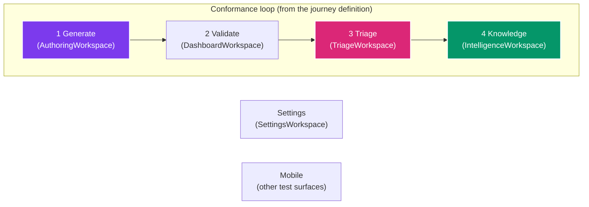

# Dashboard & UI

The CHERENKOV dashboard is a localhost-first web UI for observing conformance runs, triaging findings, managing test generation, and monitoring coverage. It runs on your machine — no cloud service required.

---

## Launch

```bash
cherenkov dashboard
```

Open [http://localhost:8000](http://localhost:8000) in your browser. The dashboard serves the React UI and the FastAPI backend from a single process.

!!! tip "Demo mode"
    The dashboard loads with live data from your test runs. To explore the UI before running real tests, visit the Journeys workspace — it uses the journey definition from `cherenkov/journeys/builtins/api-conformance.yaml`.

---

## Workspaces

The dashboard shows the conformance loop plus Settings, and one surface that sits outside the loop.

The loop is not hardcoded in the UI. It is served by `GET /api/v1/journeys` from the journey definition the engine actually runs (`cherenkov/journeys/builtins/api-conformance.yaml`), so the navigation, the journey stepper and the command palette cannot drift from the workflow the pipeline executes.



**Mobile** is a real, working device-pilot surface. It is deliberately not a peer of the loop above and is grouped separately as "Other Test Surfaces".

### The journey stepper

The rail under the header shows where a run has actually got to, driven by per-step state from `GET /api/v1/journeys/runs/{run_id}`. With no active run every stage reads *not started* — it reports progress, not which page you are on.

Generate covers three engine steps (ingest, plan, and the per-scenario generate/review fan-out) rolled into one stage. Validate, Triage and Knowledge are **manual** steps: the engine never marks them complete, because a pipeline finishing is not evidence that a person reviewed anything. A stage shows complete only when every step inside it does, so a green stage can never hide a failed step.

---

### Dashboard — stage 2, Validate (DashboardWorkspace)

**Your release readiness at a glance.**

- **Health score** — aggregate conformance percentage across all monitored endpoints
- **Recent runs** — timeline of validation runs with pass/fail/warn verdicts
- **Active divergences** — count and severity breakdown of open findings
- **Release decision** — clear PASS/WARN/FAIL indicator for go/no-go decisions

Use this workspace to answer the question: "Can we ship this?"

---

### Generate Tests — stage 1 (AuthoringWorkspace)

**Create tests from intent, not boilerplate.**

- **Spec upload** — drag-and-drop your OpenAPI spec (YAML or JSON)
- **Intent-driven generation** — describe what you want to test in plain English; CHERENKOV generates Playwright tests via the local LLM
- **Generation controls** — select model tier, enable/disable repair loop, set max attempts
- **Live preview** — see generated test code before it is written to disk

This workspace wraps the same pipeline as `cherenkov generate`, but with a visual interface.

---

### Triage — stage 3 (TriageWorkspace)

**A Kanban board for findings that need human judgment.**

- **Pending** column — items where the AI is not confident enough to auto-classify
- **Severity sorting** — sort by critical, high, medium, low
- **Approve / Reject** — one-click decisions that update the HITL queue
- **Bulk actions** — select multiple findings and approve or reject in batch
- **Audit trail** — every decision is logged with actor, timestamp, and reason

This is the visual counterpart to `cherenkov hitl list` and `cherenkov hitl approve`.

---

### Knowledge — stage 4 (IntelligenceWorkspace)

**Understand what your tests actually cover.**

- **Conformance map** — endpoint-by-endpoint matrix showing which spec requirements have test coverage
- **Coverage gaps** — highlights endpoints and response codes with no tests
- **Knowledge graph** — visualize relationships between specs, tests, and findings
- **Certificate status** — current certification verdict and history

---

### Settings (SettingsWorkspace)

**Configure CHERENKOV without editing files.**

- **Provider configuration** — switch LLM providers and models per tier
- **Feature flags** — toggle certification mode, adversarial self-play, behavioral diff on PR
- **System health** — check Ollama connectivity, Redis status, disk usage
- **Environment viewer** — see the resolved configuration (which layer each setting came from)

---

## API Endpoints

The dashboard backend exposes a REST API at `/api/v1/...` that you can use for scripting and automation. All endpoints are available when the dashboard is running.

| Endpoint Group | Prefix | Description |
|---------------|--------|-------------|
| Health | `/health` | Liveness, readiness, and system diagnostics |
| Conformance | `/api/v1/conformance` | Run validation, retrieve results |
| Coverage | `/api/v1/coverage` | Coverage maps and gap analysis |
| Divergences | `/api/v1/divergences` | List, filter, and manage divergences |
| Certificates | `/api/v1/certificates` | Issue, verify, and list certificates |
| Review (HITL) | `/api/v1/review` | HITL queue operations (list, approve, reject) |
| Workspace | `/api/v1/workspace` | Project and settings management |
| Metrics | `/api/v1/metrics` | Prometheus-compatible metrics |
| Runs | `/api/v1/runs` | Historical run data and replay |

### Example: List recent divergences

```bash
curl http://localhost:8000/api/v1/divergences | jq '.items[:3]'
```

### Example: Trigger a validation run

```bash
curl -X POST http://localhost:8000/api/v1/conformance/run \
  -H "Content-Type: application/json" \
  -d '{"spec_path": "./openapi.yaml", "target_url": "http://localhost:4010"}'
```

---

## WebSocket: Live Events

The dashboard uses a WebSocket at `/ws/live` for real-time pipeline updates. Connect to it for live streaming of validation events:

```javascript
const ws = new WebSocket("ws://localhost:8000/ws/live");
ws.onmessage = (event) => {
  const data = JSON.parse(event.data);
  console.log(`[${data.type}] ${data.message}`);
};
```

---

## Next Steps

- [Human-in-the-Loop Workflow](hitl.md) — understand the Triage workspace in depth
- [Configuration](../getting-started/configuration.md) — configure providers and tiers from the Settings workspace
- [Certificates & Compliance](certificates.md) — interpret the certificate status panel
- [Continuous Monitoring](continuous-monitoring.md) — feed the dashboard with ongoing drift detection
