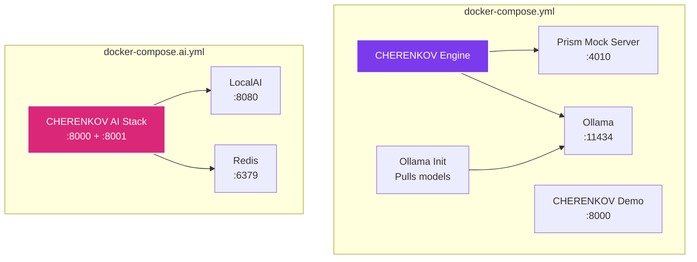

# Docker & Deployment

CHERENKOV ships with Docker Compose files for running the full stack locally or in production. The Dockerfile builds a multi-stage image that includes the React UI, Python engine, and Playwright browsers.

---

## Quick Start

```bash
# Clone the repository
git clone https://github.com/moaidmoatasem/cherenkov-qa.git
cd cherenkov-qa

# Start the full stack (Prism mock + CHERENKOV)
docker compose up -d

# Start with Ollama and full LLM pipeline
docker compose --profile full up -d

# Start with demo mode dashboard
docker compose --profile demo up -d
```

Open [http://localhost:8000](http://localhost:8000) for the dashboard (demo profile) or [http://localhost:4010](http://localhost:4010) for the Prism mock server.

---

## Architecture



---

## Compose Files

### `docker-compose.yml` — Core Stack

The default compose file provides:

| Service | Image | Port | Profile | Purpose |
|---------|-------|------|---------|---------|
| `prism` | `stoplight/prism:5` | 4010 | default | OpenAPI mock server |
| `cherenkov` | Built from Dockerfile | — | default | Core validation engine |
| `ollama` | `ollama/ollama` | 11434 | `full` | Local LLM server |
| `ollama-init` | `curlimages/curl` | — | `full` | Pulls required models on startup |
| `cherenkov-demo` | Built from Dockerfile | 8000 | `demo` | Dashboard with sample data |

```bash
# Core only (Prism + CHERENKOV engine)
docker compose up -d

# Full stack with Ollama
docker compose --profile full up -d

# Demo dashboard
docker compose --profile demo up -d
```

### `docker-compose.ai.yml` — AI Stack

A separate compose file for running the AI infrastructure (LocalAI + Redis) alongside CHERENKOV:

| Service | Image | Port | Purpose |
|---------|-------|------|---------|
| `local-ai` | `localai/localai:latest-cpu` | 8080 | OpenAI-compatible local inference |
| `redis` | `redis:7-alpine` | 6379 | Caching and queue persistence |
| `cherenkov` | Built from Dockerfile | 8000, 8001 | Engine with full AI + monitoring |

```bash
# Start the AI stack
docker compose -f docker-compose.ai.yml up -d
```

This stack pre-configures CHERENKOV with:

- LocalAI as the LLM provider (OpenAI-compatible API)
- Redis for caching and persistent divergence queues
- Monitoring enabled on port 8001

---

## Dockerfile

The Dockerfile uses a multi-stage build:

**Stage 1 — UI Build:**

- Base: `node:26-slim`
- Builds the React dashboard UI with Vite

**Stage 2 — Engine:**

- Base: `python:3.14-slim`
- Installs system dependencies (curl, git, Node.js)
- Installs the Python package in editable mode
- Installs Playwright with Chromium
- Copies the built UI from stage 1
- Runs as a non-root `cherenkov` user (UID 1000)
- Health check against `/health` endpoint

```bash
# Build the image directly
docker build -t cherenkov-qa .

# Run a one-off validation
docker run --rm cherenkov-qa validate \
  --spec /specs/openapi.yaml \
  --target http://host.docker.internal:8080
```

---

## Environment Variables for Docker

Pass environment variables to configure CHERENKOV inside Docker:

```yaml
services:
  cherenkov:
    build: .
    environment:
      # LLM provider — point to a Docker service
      - OLLAMA_URL=http://ollama:11434/api/generate
      - PROVIDER=ollama
      - GEN_MODEL=qwen2.5-coder:7b

      # VLM
      - CHERENKOV_VLM_PROVIDER=ollama
      - CHERENKOV_VLM_LOCALAI_URL=http://local-ai:8080

      # Redis
      - CHERENKOV_REDIS_ENABLED=true
      - CHERENKOV_REDIS_URL=redis://redis:6379/0

      # Monitoring
      - CHERENKOV_MONITORING_ENABLED=true
      - CHERENKOV_METRICS_PORT=8001

      # Network
      - CHERENKOV_EGRESS=internal
    ports:
      - "8000:8000"   # Dashboard
      - "8001:8001"   # Metrics
    volumes:
      - ./.cherenkov:/app/.cherenkov   # Persist state across restarts
```

See the [Configuration reference](../getting-started/configuration.md) for all available environment variables.

---

## GPU Support

For GPU-accelerated inference with Ollama:

```yaml
services:
  ollama:
    image: ollama/ollama
    deploy:
      resources:
        reservations:
          devices:
            - driver: nvidia
              count: 1
              capabilities: [gpu]
    volumes:
      - ollama_models:/root/.ollama
```

!!! tip "GPU is optional"
    CHERENKOV runs on CPU by default. GPU acceleration significantly speeds up LLM generation but is not required. The default `qwen2.5-coder:7b` model works well on CPU with ~4GB RAM.

---

## Production Deployment Considerations

### Persistent Storage

Mount volumes for state that should survive container restarts:

```yaml
volumes:
  - ./.cherenkov:/app/.cherenkov     # HITL queue, guardian DB, run history
  - ./output:/app/output             # Reports and certificates
  - ollama_models:/root/.ollama      # Downloaded models (avoid re-pulling)
```

### Health Checks

The CHERENKOV container includes a built-in health check:

```dockerfile
HEALTHCHECK --interval=30s --timeout=10s --start-period=5s --retries=3 \
    CMD python -c "import urllib.request; urllib.request.urlopen('http://localhost:8000/health', timeout=5)" || exit 1
```

### Security

- The container runs as a non-root user (`cherenkov`, UID 1000)
- Set `CHERENKOV_EGRESS=none` for air-gapped environments
- Use `CHERENKOV_EGRESS=internal` to allow LAN-only traffic (e.g., to Ollama in another container)

### Scaling

For high-throughput environments, run the engine and dashboard as separate services:

```yaml
services:
  engine:
    build: .
    command: ["daemon", "--url", "http://api:8080", "--interval", "30"]
    # No ports exposed — headless

  dashboard:
    build: .
    command: ["dashboard"]
    ports:
      - "8000:8000"
```

---

## Kubernetes

For Kubernetes deployment, see the [K8s Operator guide](k8s-operator.md). The operator provides:

- Custom Resource Definitions (CRDs) for CHERENKOV workloads
- Automatic scaling based on queue depth
- Helm chart for standard deployments

---

## Next Steps

- [Configuration](../getting-started/configuration.md) — full environment variable reference
- [Continuous Monitoring](continuous-monitoring.md) — run the daemon in Docker
- [K8s Operator](k8s-operator.md) — Kubernetes-native deployment
- [CI/CD Integration](ci-cd.md) — use the Docker image in CI pipelines
