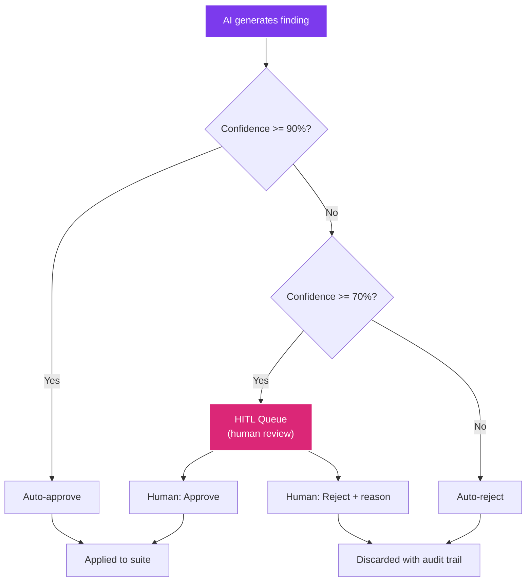

# Human-in-the-Loop Workflow

CHERENKOV generates test findings and conformance decisions using AI, but not every AI decision is trustworthy. The Human-in-the-Loop (HITL) system routes low-confidence findings to human reviewers for final judgment.

**Design invariant (D7):** CHERENKOV never auto-edits your code. Every change is a suggestion that a human approves or rejects.

---

## Why HITL Matters

AI models hallucinate. A conformance test might flag a "divergence" that is actually a valid API behavior the model misunderstood. Or a generated test might weaken an assertion without anyone noticing. The HITL queue catches these cases.



---

## HITL Queue Lifecycle

Each finding enters the queue as `pending` and moves to one of three terminal states:

| Status | Meaning |
|--------|---------|
| `pending` | Waiting for human review |
| `approved` | Human confirmed the finding is valid |
| `rejected` | Human dismissed the finding with a reason |
| `ignored` | Deprioritized — may revisit later |

---

## CLI Commands

### List pending items

```bash
cherenkov hitl list
```

Output:

```
  e1a2b3c4-...  pending     sev=high      conf=0.78  gate=prism_dry_run  GET /pets/{petId}
  f5d6e7a8-...  pending     sev=medium    conf=0.72  gate=meaningful     POST /pets
```

Filter by status:

```bash
cherenkov hitl list --status approved
cherenkov hitl list --status rejected
```

### Show item details

```bash
cherenkov hitl show e1a2b3c4-...
```

Displays full details: endpoint, mutation, confidence score, confidence reason, review gate that failed, and timestamps.

### Approve a finding

```bash
cherenkov hitl approve e1a2b3c4-...
```

The item moves to `approved` and is attributed to the current `$USER`.

### Reject a finding

```bash
cherenkov hitl reject f5d6e7a8-... --reason "API correctly returns 404 for unknown pet IDs"
```

Always provide a reason — it becomes part of the audit trail and helps the AI learn from its mistakes.

### JSON output

Every HITL command supports `--json` for machine-readable output:

```bash
cherenkov hitl list --json | jq '.payload.items[] | .id'
```

The JSON follows the `hitl/v1` envelope schema:

```json
{
  "schema_version": "hitl/v1",
  "ok": true,
  "command": "list",
  "payload": {
    "items": [...]
  },
  "error": null
}
```

---

## Dashboard Triage Workspace

The Triage workspace in the [dashboard](dashboard.md) provides a visual Kanban board for HITL review:

1. **Launch the dashboard**: `cherenkov dashboard`
2. **Navigate to Triage** (third tab)
3. **Drag findings** between columns: Pending, Approved, Rejected
4. **Click a finding** to see full details, including the generated test code and the divergence evidence
5. **Approve or Reject** with one click — bulk actions available for batch processing

---

## Severity Levels

Findings are classified by severity. Higher severity items appear first in the queue.

| Severity | Meaning | Example |
|----------|---------|---------|
| `critical` | API is broken in a way that affects all consumers | Auth endpoint returns 500 |
| `high` | Significant spec divergence | Required field missing from response |
| `medium` | Non-critical divergence | Response includes undocumented field |
| `low` | Minor or cosmetic | Different header casing |

---

## Audit Trail

Every HITL decision is recorded in an SQLite audit log (`.cherenkov/hitl.db`) with:

- **command** — the action taken (approve, reject, ignore)
- **actor** — who made the decision (from `$USER` or dashboard auth)
- **item_id** — the finding being acted on
- **outcome** — the result (ok, conflict, not_found)
- **timestamp** — when the action occurred

Query the audit trail:

```bash
cherenkov hitl list --status approved --json | jq '.payload.items[] | {id, approved_by, approved_at}'
```

---

## Integrating HITL into Your Workflow

### CI gate: require zero pending items

```bash
# In your CI pipeline — fail if any findings need human review
pending=$(cherenkov hitl list --json | jq '.payload.items | length')
if [ "$pending" -gt 0 ]; then
  echo "ERROR: $pending findings need human review before merge"
  exit 1
fi
```

### Daemon mode: auto-feed the queue

When running `cherenkov daemon`, new divergences are automatically added to the HITL queue. Reviewers can triage them throughout the day via the dashboard.

```bash
cherenkov daemon --url http://staging:8080 &
cherenkov dashboard  # Triage incoming findings in real time
```

---

## Next Steps

- [Dashboard & UI](dashboard.md) — navigate the Triage workspace
- [Test Generation & Repair](test-generation.md) — understand what generates the findings HITL reviews
- [Certificates & Compliance](certificates.md) — HITL decisions feed into certification verdicts
- [Continuous Monitoring](continuous-monitoring.md) — HITL queue as a real-time divergence inbox
