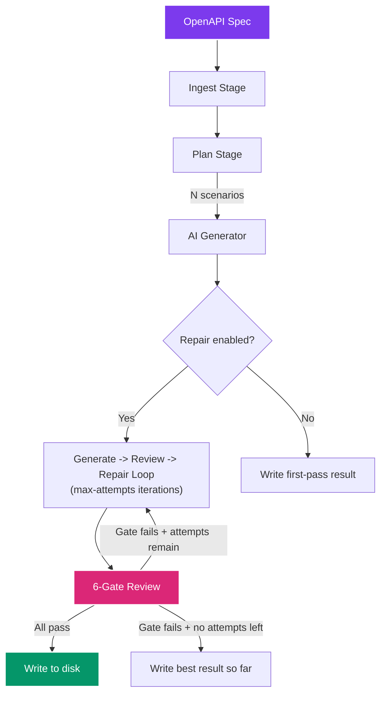

# Test Generation & Repair

CHERENKOV generates typed Playwright E2E tests from your OpenAPI spec using a local LLM. Each generated test goes through a 6-gate quality pipeline before it is written to disk. A repair loop automatically fixes failing tests — up to a configurable number of attempts.

---

## Quick Start

```bash
# Generate tests from an OpenAPI spec (with repair loop)
cherenkov generate --spec ./openapi.yaml

# Generate without repair — write first-pass results directly
cherenkov generate --spec ./openapi.yaml --no-repair

# Control the output directory
cherenkov generate --spec ./openapi.yaml --output-dir ./tests/generated
```

---

## How It Works



---

## Command Reference

### `cherenkov generate`

| Flag | Default | Description |
|------|---------|-------------|
| `--spec` | (required) | Path to the OpenAPI spec (JSON or YAML) |
| `--output-dir` | `stub/generated_tests` | Directory to write generated test files |
| `--repair` / `--no-repair` | `--repair` | Enable or disable the generate-review-repair loop |
| `--max-attempts` | `3` | Maximum repair iterations per scenario (1-10). Only used with `--repair` |

---

## The 6-Gate Review Pipeline

Every generated test must pass six quality gates before CHERENKOV considers it production-worthy. The gates run in order; the first failure triggers a repair cycle (if enabled).

| Gate | What It Checks | How |
|------|---------------|-----|
| **1. Syntax** | Valid JavaScript/TypeScript syntax | Regex and structural checks |
| **2. AST** | Correct test structure (describe/it blocks, expect calls) | AST parsing |
| **3. TypeScript** | Type-safe code that compiles | `tsc --noEmit` via the stub project |
| **4. Meaningful Assertion** | Test proves it catches a real bug, not just `toBeTruthy()` | Checks for strict equality (`toBe`, `toEqual`) on response fields |
| **5. Type-Check** | Response shape matches the spec schema | Cross-references `expect()` targets against spec `properties` |
| **6. Prism Dry-Run** | Test executes successfully against a Prism mock server | Playwright execution against `@stoplight/prism-cli` |

### Gate 4: Meaningful Assertion Gate

This gate is important enough to call out. A test that only checks `expect(response.status).toBe(200)` is trivially true — it does not prove the API works correctly. The meaningful assertion gate requires at least one assertion on the **response body**, using a **strict comparator** (`toBe`, `toEqual`, `toStrictEqual`).

This gate is controlled by the `CHERENKOV_MEANINGFUL_ASSERTION_GATE` environment variable (default: `true`).

```typescript
// FAILS Gate 4 — no body assertion
test("GET /pets returns 200", async ({ request }) => {
  const response = await request.get("/pets");
  expect(response.status()).toBe(200);  // status-only = not meaningful
});

// PASSES Gate 4 — asserts on response body with strict comparator
test("GET /pets returns pets array", async ({ request }) => {
  const response = await request.get("/pets");
  const body = await response.json();
  expect(response.status()).toBe(200);
  expect(body[0].name).toBe("doggie");  // strict body assertion
});
```

---

## The Repair Loop

When `--repair` is enabled (the default), CHERENKOV uses a ChatTester-style loop:

1. **Generate** — the LLM produces a test from the scenario
2. **Review** — the 6-gate pipeline evaluates the test
3. **Repair** — if a gate fails, the LLM receives the failure details and produces a corrected version
4. **Repeat** — steps 2-3 repeat up to `--max-attempts` times
5. **Best result wins** — if all attempts fail, the highest-quality version (most gates passed) is written to disk

```bash
# Allow up to 5 repair attempts for complex APIs
cherenkov generate --spec ./openapi.yaml --max-attempts 5
```

---

## Scenario Planning

Before generation begins, CHERENKOV plans test scenarios from the spec:

- **One file per scenario** — each endpoint + method + mutation gets its own `.spec.ts` file
- **Naming convention** — `{METHOD}_{path}_{mutation_id}.spec.ts` (e.g., `POST_pets_happy_path.spec.ts`)
- **Mutation types** — happy path, unauthorized, invalid input, missing required fields, wrong content type

---

## Template Fallback

When no LLM is available (Ollama is down, or you pass `--no-repair`), CHERENKOV still generates tests using built-in templates. These templates produce structurally correct Playwright tests with placeholder assertions. They pass gates 1-3 (syntax, AST, TypeScript) but may not pass gates 4-6.

This makes CHERENKOV useful even offline or in environments where running an LLM is not practical — you get a working test skeleton that a human can refine.

---

## Confidence and HITL

After review, each test is assigned a confidence score:

| Score | Action |
|-------|--------|
| >= 0.9 | Auto-approved — written to disk directly |
| 0.7 - 0.9 | Routed to the [HITL queue](hitl.md) for human review |
| < 0.7 | Auto-rejected — not written to disk |

---

## Output Structure

Generated tests land in `--output-dir` (default: `stub/generated_tests/`):

```
stub/generated_tests/
  GET_pets_happy_path.spec.ts
  GET_pets_petId_happy_path.spec.ts
  POST_pets_happy_path.spec.ts
  POST_pets_unauthorized.spec.ts
  POST_pets_invalid_body.spec.ts
```

Each file is a self-contained Playwright test that can be run independently:

```bash
cd stub
npx playwright test generated_tests/GET_pets_happy_path.spec.ts
```

---

## Next Steps

- [Check Suite (Integrity Audit)](check-suite.md) — verify generated tests have not been weakened
- [Human-in-the-Loop Workflow](hitl.md) — review AI-generated tests that need human judgment
- [Configuration](../getting-started/configuration.md) — configure LLM provider and model for generation
- [API Conformance Testing](api-conformance.md) — the full validate pipeline that includes generation
