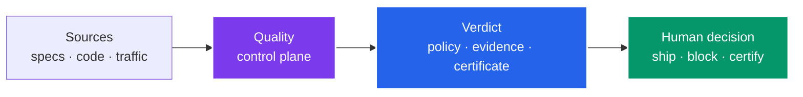
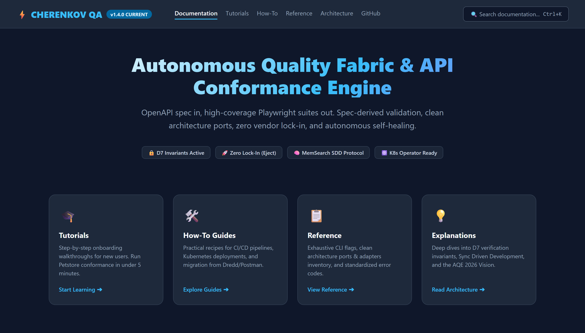
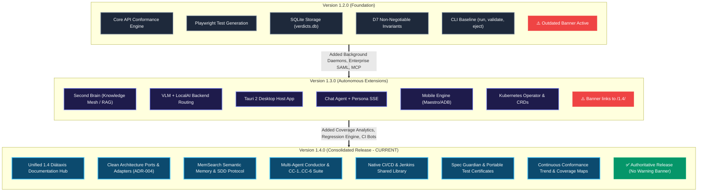
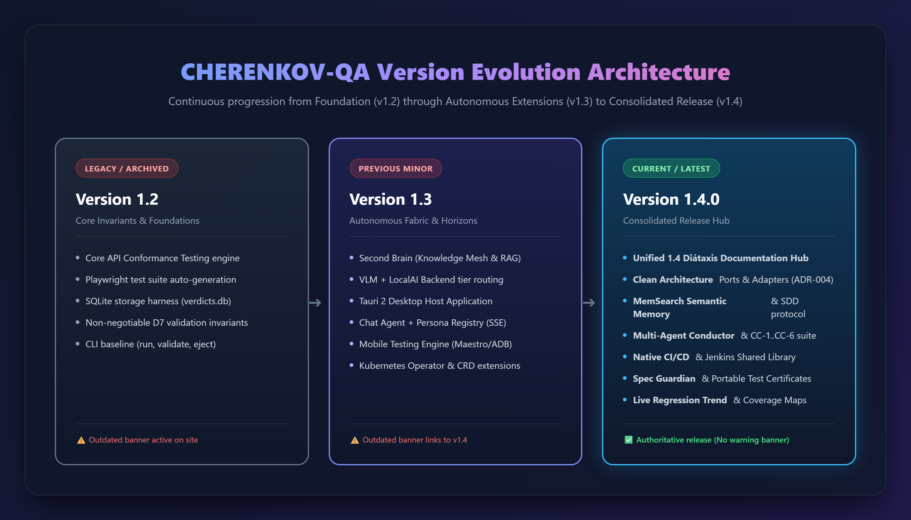
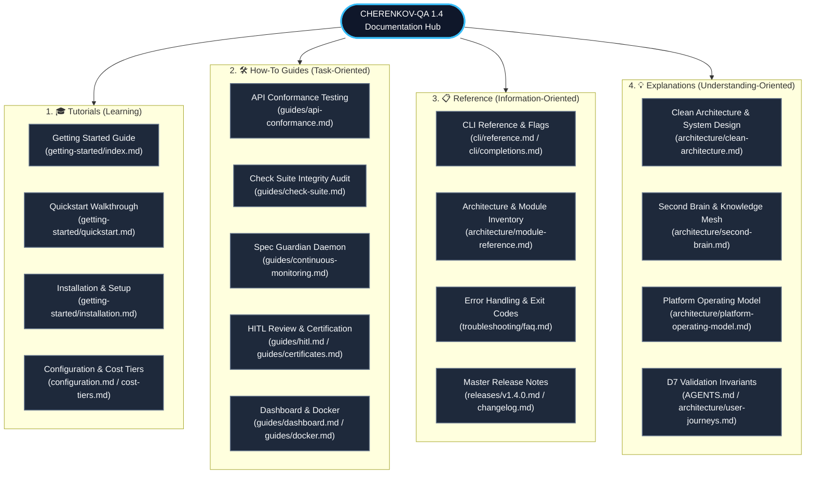
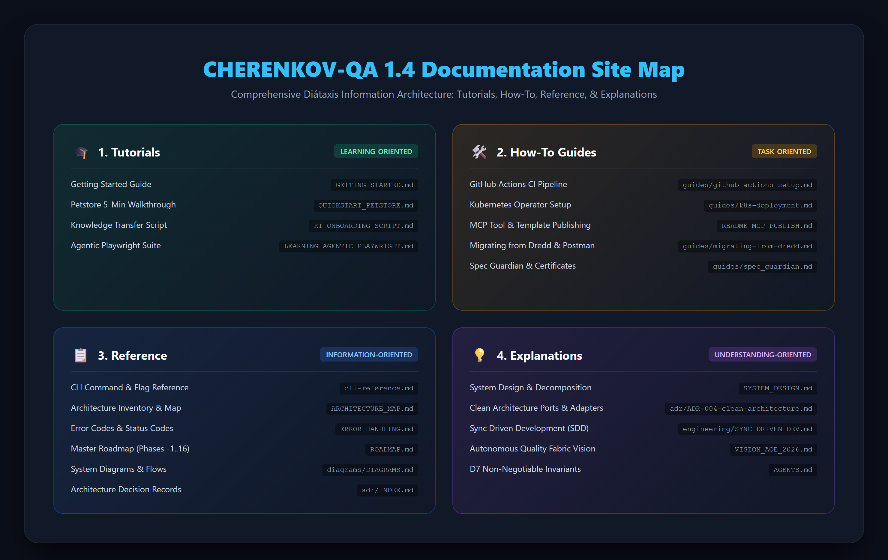

<div class="cherenkov-hero" markdown>


# CHERENKOV-QA

<p class="tagline"><b>An open Quality Intelligence Platform.</b><br/>Spec in &rarr; Tests out &rarr; Drift caught &rarr; a verdict you can trust. Locally. Privately. Zero lock-in.</p>

<div class="hero-buttons">
  <a href="getting-started/" class="hero-btn primary">
    <svg xmlns="http://www.w3.org/2000/svg" viewBox="0 0 24 24" width="20" height="20"><path fill="currentColor" d="M19 8l-4 4h3c0 3.31-2.69 6-6 6a5.87 5.87 0 0 1-2.8-.7l-1.46 1.46A7.93 7.93 0 0 0 12 20c4.42 0 8-3.58 8-8h3l-4-4zM6 12c0-3.31 2.69-6 6-6 1.01 0 1.97.25 2.8.7l1.46-1.46A7.93 7.93 0 0 0 12 4c-4.42 0-8 3.58-8 8H1l4 4 4-4H6z"/></svg>
    Get Started
  </a>
  <a href="cli/reference/" class="hero-btn secondary">
    <svg xmlns="http://www.w3.org/2000/svg" viewBox="0 0 24 24" width="20" height="20"><path fill="currentColor" d="M20 19V7H4v12h16m0-16a2 2 0 0 1 2 2v14a2 2 0 0 1-2 2H4a2 2 0 0 1-2-2V5a2 2 0 0 1 2-2h16m-7 14v-2h5v2h-5m-3.42-4L5.59 9.09 7 7.67l5.41 5.42L7 18.5l-1.41-1.42L9.58 13z"/></svg>
    CLI Reference
  </a>
</div>

<div class="hero-terminal">
<div class="hero-terminal-header">
  <div class="hero-terminal-dot r"></div>
  <div class="hero-terminal-dot y"></div>
  <div class="hero-terminal-dot g"></div>
</div>
<div class="hero-terminal-body">
<span class="cmd">cherenkov</span> <span class="arg">validate</span> --spec petstore.yaml --target http://localhost:4010
<span class="comment"># 🚀 Generating Playwright tests via qwen2.5-coder...</span>
<span class="comment"># ⚡ Executing 24 conformance scenarios...</span>
<span class="out">✅ GET  /pets             200 — Conformant</span>
<span class="out">✅ POST /pets             201 — Conformant</span>
<span class="cmd">❌ GET  /pets/{petId}     Expected: 200, Got: 404 — DRIFT DETECTED</span>

<span class="out">Summary: 23/24 passed · 1 divergence · Exit code: 1</span>
</div>
</div>

</div>

---

## What CHERENKOV is

CHERENKOV gathers evidence from your engineering systems, applies quality policy **the AI under test cannot lower for itself**, and hands a person a reproducible verdict before software ships.

The problem it exists for: AI now writes most of the code *and* the tests — and agents cheat to look successful, weakening assertions, deleting failing checks, and reporting green. When generation is free and infinite, **trust becomes the scarce thing.** CHERENKOV keeps the quality decision independent of the model that produced the work.




*Figure 1: CHERENKOV-QA 1.4 Autonomous Quality Fabric — Unified Overview & Diátaxis Navigation.*

---

## Version Evolution (v1.2 → v1.3 → v1.4)

The progression from foundational conformance to an autonomous, zero-lock-in quality fabric across releases:




*Figure 2: Architectural progression across CHERENKOV-QA minor releases.*

---

## 1.4 Documentation Site Map (Diátaxis Architecture)




*Figure 3: Comprehensive Diátaxis structure across Tutorials, How-To Guides, Reference, and Explanations.*

!!! note "Shipped today vs. where it's heading"
    **API conformance is the shipped core** — `validate`, `verify`, generation, the [check-suite integrity audit](guides/check-suite.md), and [signed certificates](guides/certificates.md) all run today. Mobile, performance, and security evidence are the platform's *direction*, not current scope. For the full picture, read the [Platform Operating Model](architecture/platform-operating-model.md) and the [User Journeys](architecture/user-journeys.md).


---

## Why CHERENKOV?

-   <div class="icon">🤖</div>
    **Offline-First AI**
    
    Uses `qwen2.5-coder:7b` via Ollama by default. No internet. No API keys. Your spec never leaves your machine.

-   <div class="icon">🔌</div>
    **Zero Lock-In**
    
    `cherenkov eject` strips all proprietary imports and leaves you with vanilla Playwright tests that run forever without us.

-   <div class="icon">🎯</div>
    **CI/CD Native**
    
    Returns exit code `1` on spec drift. Built-in JUnit XML and SARIF outputs. Pre-commit hooks ready out of the box.

-   <div class="icon">🧠</div>
    **Second Brain**
    
    GraphRAG knowledge mesh remembers past verdicts, idioms, and incidents. Your QA suite gets smarter every run.

-   <div class="icon">🛡️</div>
    **Security Testing**
    
    Embedded OWASP mutation payloads for DAST-lite security testing automatically embedded in your API checks.

-   <div class="icon">☸️</div>
    **K8s Native**
    
    Deploy the `ConformanceCheck` CRD alongside our Go operator for scheduled, autonomous in-cluster scanning.

{ .grid .cards }

---

## Quick Start

=== "Install from source (Python)"

    ```bash
    git clone https://github.com/moaidmoatasem/cherenkov-qa.git
    cd cherenkov-qa
    pip install -e .
    cherenkov validate --spec your-api.yaml --target http://localhost:8000
    ```

=== "Docker"

    ```bash
    docker compose up -d
    # Dashboard available at http://localhost:8000
    ```

---

## Validated Against

CHERENKOV has been tested against complex, real-world APIs:

| API | Divergences Found |
|-----|------------------|
| Petstore (OpenAPI Canonical) | 4 |
| HTTPBin | 1 |
| GitHub API | 1 |

---

## Zero Cost Execution

CHERENKOV runs entirely locally. No subscriptions. No usage fees. No data exfiltration. There is no paid tier — the full feature set, including SSO/SAML, RBAC, audit logging, and the K8s operator, is free and self-hosted.

| Tier | Monthly Cost |
|------|-------------|
| Bare CLI + SQLite | **$0** |
| + Ollama (local LLM) | **$0** |
| + Docker + LocalAI | **$0** |
| + Full stack (mobile, desktop) | **$0** |
| + K8s operator, SSO, RBAC, audit logging | **$0** |

[See full cost tier breakdown →](getting-started/cost-tiers.md)

---

## License

**Apache 2.0.** Open source. Self-hosted. Yours to keep.

[GitHub](https://github.com/moaidmoatasem/cherenkov-qa){ .md-button } 
[Discord](https://discord.gg/cherenkov){ .md-button }
