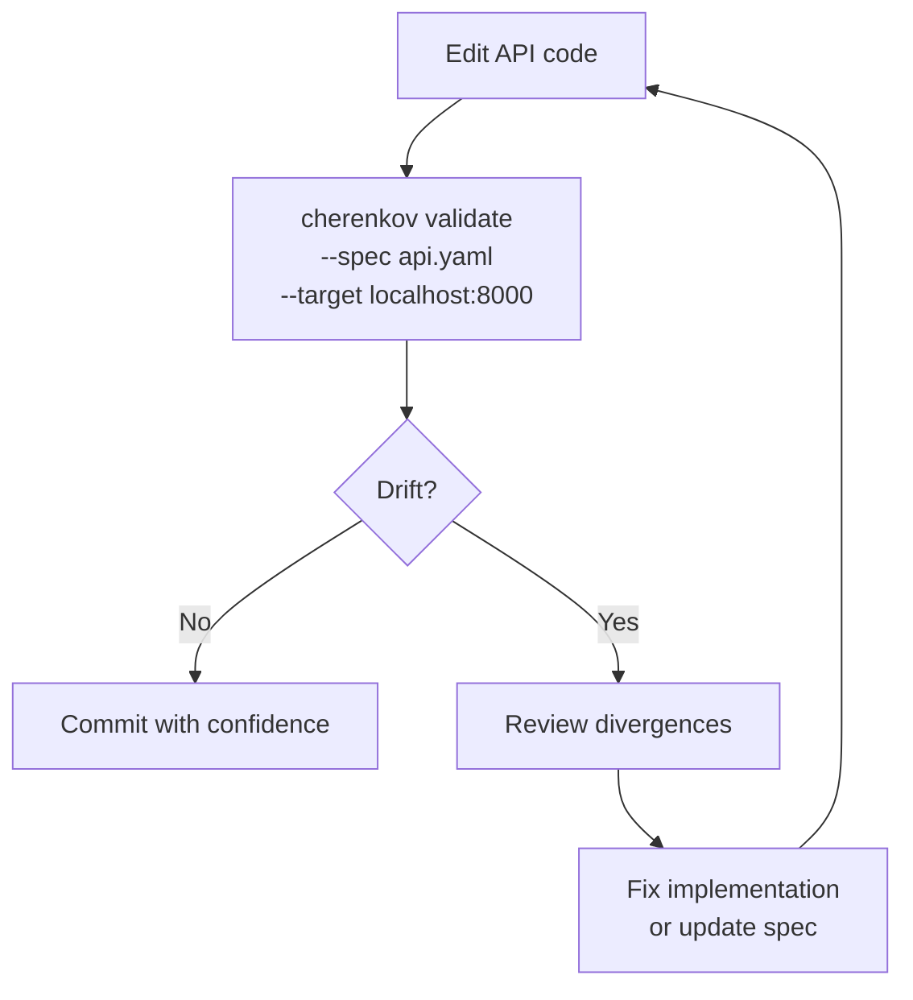
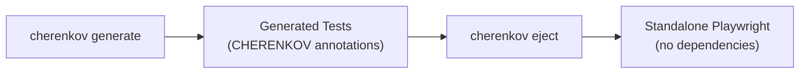

# Developer Guide

You write APIs. You have an OpenAPI spec. You want to know — right now, on your machine — whether your implementation matches what the spec promises.

CHERENKOV gives you that answer in seconds, with zero cloud dependencies.

---

## Your First 10 Minutes

### 1. Install (30 seconds)

```bash
git clone https://github.com/moaidmoatasem/cherenkov-qa.git && cd cherenkov-qa
pip install -e .
```

### 2. Try the built-in demo (2 minutes)

No API server needed. CHERENKOV ships a demo that validates a bundled Petstore spec against a mock:

```bash
cherenkov demo
```

You will see generated Playwright tests, execution results, and a conformance summary — all local, all instant.

### 3. Validate your own API (3 minutes)

Point CHERENKOV at your spec and your running server:

```bash
cherenkov validate --spec openapi.yaml --target http://localhost:8000
```

CHERENKOV will:

1. Parse your OpenAPI spec
2. Generate Playwright tests for every endpoint
3. Execute them against your live server
4. Report conformant endpoints and drift

### 4. Check your health score (2 minutes)

```bash
cherenkov verify --url http://localhost:8000 --spec openapi.yaml
```

This runs spec-derived probes (40 by default) and returns a health score without generating full test files.

### 5. Check environment (1 minute)

```bash
cherenkov doctor
```

Confirms Ollama connectivity, spec readability, and target reachability.

---

## Quick Wins

| Time | Command | What you learn |
|------|---------|----------------|
| 30s | `cherenkov demo` | See CHERENKOV in action, no setup |
| 60s | `cherenkov verify --url ... --spec ...` | Health score for your API |
| 3m | `cherenkov validate --spec ... --target ...` | Full conformance report |
| 5m | `cherenkov generate --spec ...` | Playwright tests in `./generated_tests/` |

---

## Core Workflows

### Local Validation Loop

This is the workflow you will use most. Think of it like running `pytest` — but the tests are generated from your spec.



```bash
# Full validation with detailed output
cherenkov validate --spec openapi.yaml --target http://localhost:8000

# Quick probe-only check (no test generation)
cherenkov verify --url http://localhost:8000 --spec openapi.yaml
```

**When to use `validate` vs `verify`:**

- `validate` — generates and runs full Playwright tests. More thorough. Use before merging.
- `verify` — sends spec-derived probes without generating test files. Faster. Use during active development.

### Generating Tests

Generate Playwright tests from your spec and keep them in your repo:

```bash
# Generate tests (uses local LLM by default)
cherenkov generate --spec openapi.yaml

# Generate without LLM (template fallback, no Ollama needed)
cherenkov generate --spec openapi.yaml --no-repair

# Generate and place in a specific directory
cherenkov generate --spec openapi.yaml --output ./tests/conformance
```

Generated tests are standard Playwright — you can read them, edit them, run them with `npx playwright test`.

### Ejecting Tests

When you want full independence from CHERENKOV, eject your tests into standalone Playwright:

```bash
cherenkov eject --output ./tests
```

This strips all CHERENKOV imports and annotations, leaving pure Playwright tests you own completely. No lock-in. If CHERENKOV disappears tomorrow, your tests still run.



---

## CI Integration (The Short Version)

Add a conformance gate to your pull requests:

```yaml
# .github/workflows/conformance.yml
- name: API Conformance Check
  run: cherenkov validate --spec openapi.yaml --target http://localhost:8000
  # Exit code 0 = pass, 1 = drift detected (fails the build)
```

For the full CI/CD setup with Docker, caching, and parallel jobs, see the [DevOps Guide](devops.md).

---

## VS Code Integration

CHERENKOV integrates with VS Code for inline drift warnings:

1. Install the CHERENKOV VS Code extension
2. Open a project with an OpenAPI spec
3. See inline annotations on endpoints that drift from spec

See [VS Code Integration](../integrations/vscode.md) for full setup.

---

## Working Without an LLM

CHERENKOV's test generation uses a local LLM (Ollama) by default, but several commands need no LLM at all:

| Command | LLM needed? |
|---------|-------------|
| `verify` | No |
| `check-suite` | No |
| `validate` | Yes (for generation) |
| `generate` | Yes (or use `--no-repair` for templates) |
| `eject` | No |
| `certify` | No |
| `doctor` | No |

If you do not want to run Ollama, use `generate --no-repair` for template-based test generation, then run `validate` with pre-generated tests.

---

## Tips for Your Daily Workflow

**Spec-first development.** Write or update your OpenAPI spec before implementing. Then use `cherenkov validate` to confirm your implementation matches. This catches mismatches immediately instead of in production.

**Use `verify` for fast feedback.** During active coding, `verify` runs 40 probes in roughly 9 seconds. Use it like a linter — run it on save.

**Commit generated tests.** After `cherenkov generate`, commit the test files. They serve as living documentation of your API contract.

**Eject when stable.** Once an API surface stabilizes, eject the tests. You get permanent, dependency-free Playwright tests that document every contract.

---

## Next Steps

- [CLI Reference](../cli/reference.md) — full flag documentation for every command
- [OpenAPI Spec Guide](../guides/openapi-spec.md) — tips for writing specs that generate better tests
- [CI/CD Guide](../guides/ci-cd.md) — pipeline integration patterns
- [QA Engineer Guide](qa-engineer.md) — if you also own test quality
- [Troubleshooting FAQ](../troubleshooting/faq.md) — common questions answered
