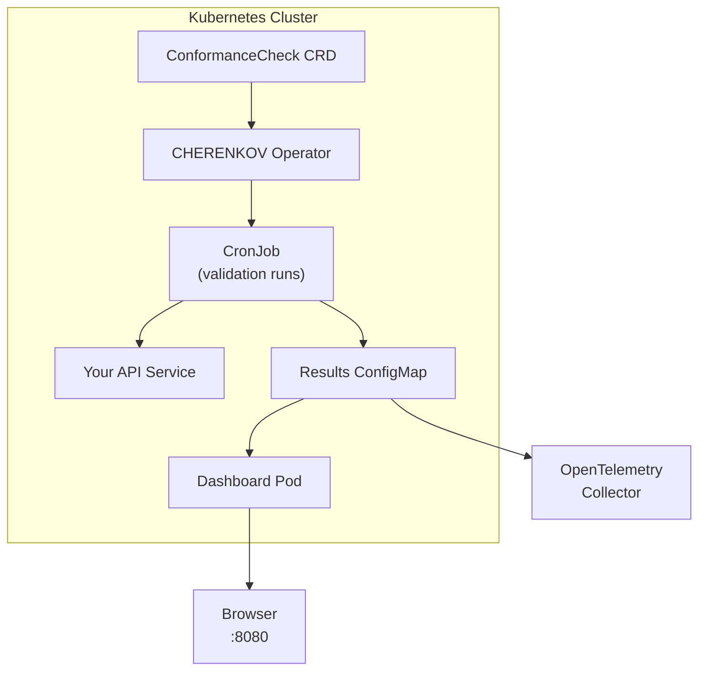
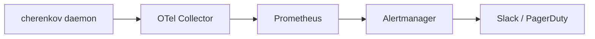

# DevOps & SRE Guide

You build pipelines and keep services running. You need CHERENKOV to fail builds on API drift, run in containers, deploy to Kubernetes, and emit telemetry your observability stack can consume.

This guide covers the infrastructure side — pipeline gates, container deployments, the K8s operator, and monitoring integrations.

---

## Quick Wins

| Time | What | Result |
|------|------|--------|
| 2m | Add `cherenkov validate` to a CI step | Builds fail on API drift |
| 5m | Run CHERENKOV in Docker | No host dependencies |
| 5m | Add JUnit XML output to CI | Drift shows in your test reporter |
| 10m | Deploy the K8s ConformanceCheck CRD | Continuous in-cluster validation |

---

## CI/CD Integration

### Exit Codes

Every CHERENKOV command uses consistent exit codes. Wire these into your pipeline logic:

| Code | Meaning |
|------|---------|
| `0` | Pass — all conformant |
| `1` | Drift detected — one or more divergences |
| `2` | Configuration error |
| `3` | Configuration error (spec parse failure) |
| `4` | Network error (target unreachable) |

### GitHub Actions

```yaml
name: API Conformance
on: [pull_request]

jobs:
  conformance:
    runs-on: ubuntu-latest
    services:
      ollama:
        image: ollama/ollama:latest
        ports:
          - 11434:11434
    steps:
      - uses: actions/checkout@v4

      - name: Install CHERENKOV
        run: |
          git clone https://github.com/moaidmoatasem/cherenkov-qa.git /tmp/cherenkov-qa
          pip install /tmp/cherenkov-qa

      - name: Start API server
        run: |
          # Start your API server in the background
          python -m your_api &
          sleep 5

      - name: Run conformance check
        run: |
          cherenkov validate \
            --spec openapi.yaml \
            --target http://localhost:8000

      - name: Upload JUnit results
        if: always()
        uses: actions/upload-artifact@v4
        with:
          name: conformance-results
          path: reports/junit.xml
```

#### Without an LLM in CI

If you do not want to run Ollama in CI, use pre-generated tests:

```yaml
      - name: Run pre-generated tests
        run: |
          cherenkov validate \
            --spec openapi.yaml \
            --target http://localhost:8000 \
            --tests ./tests/conformance
```

Or use `verify` for LLM-free probing:

```yaml
      - name: API health check
        run: |
          cherenkov verify \
            --url http://localhost:8000 \
            --spec openapi.yaml
```

Or use `check-suite` to audit existing tests (no LLM, no running server):

```yaml
      - name: Audit test suite
        run: |
          cherenkov check-suite \
            --candidate ./tests \
            --spec ./openapi.yaml \
            --fail-on-finding
```

### GitLab CI

```yaml
conformance:
  stage: test
  image: python:3.11
  services:
    - name: ollama/ollama:latest
      alias: ollama
  variables:
    OLLAMA_HOST: http://ollama:11434
  script:
    - git clone https://github.com/moaidmoatasem/cherenkov-qa.git /tmp/cherenkov-qa
    - pip install /tmp/cherenkov-qa
    - python -m your_api &
    - sleep 5
    - cherenkov validate --spec openapi.yaml --target http://localhost:8000
  artifacts:
    when: always
    reports:
      junit: reports/junit.xml
```

### CircleCI

```yaml
jobs:
  conformance:
    docker:
      - image: python:3.11
      - image: ollama/ollama:latest
    steps:
      - checkout
      - run:
          name: Install CHERENKOV
          command: |
            git clone https://github.com/moaidmoatasem/cherenkov-qa.git /tmp/cherenkov-qa
            pip install /tmp/cherenkov-qa
      - run:
          name: Start API and validate
          command: |
            python -m your_api &
            sleep 5
            cherenkov validate --spec openapi.yaml --target http://localhost:8000
      - store_test_results:
          path: reports/
```

---

## Report Formats

CHERENKOV outputs results in formats your CI system already understands:

| Format | Flag | Use case |
|--------|------|----------|
| JUnit XML | `--junit` | CI test reporters (GitHub, GitLab, Jenkins) |
| SARIF | `--sarif` | GitHub Code Scanning, VS Code |
| JSON | `--json` | Custom integrations, dashboards |
| HTML | `--html` | Human-readable reports |

```bash
cherenkov validate \
  --spec openapi.yaml \
  --target http://localhost:8000 \
  --junit reports/junit.xml \
  --sarif reports/conformance.sarif
```

---

## Docker Deployment

### Running CHERENKOV in Docker

```bash
docker run --rm \
  -v $(pwd)/openapi.yaml:/spec/openapi.yaml \
  --network host \
  cherenkov/cherenkov-qa:latest \
  validate --spec /spec/openapi.yaml --target http://localhost:8000
```

### Docker Compose (with Ollama)

```yaml
version: "3.8"
services:
  ollama:
    image: ollama/ollama:latest
    ports:
      - "11434:11434"
    volumes:
      - ollama_data:/root/.ollama

  cherenkov:
    image: cherenkov/cherenkov-qa:latest
    depends_on:
      - ollama
    environment:
      - OLLAMA_HOST=http://ollama:11434
    volumes:
      - ./specs:/specs
      - ./reports:/reports
    command: >
      validate
        --spec /specs/openapi.yaml
        --target http://api-server:8000

volumes:
  ollama_data:
```

### Dashboard in Docker

```yaml
  cherenkov-dashboard:
    image: cherenkov/cherenkov-qa:latest
    ports:
      - "8080:8000"
    command: dashboard
    volumes:
      - cherenkov_data:/data
```

---

## Kubernetes

### ConformanceCheck CRD

CHERENKOV provides a Kubernetes Custom Resource Definition for in-cluster conformance checking:

```yaml
apiVersion: cherenkov.dev/v1alpha1
kind: ConformanceCheck
metadata:
  name: petstore-conformance
  namespace: default
spec:
  specRef:
    configMap: petstore-spec
    key: openapi.yaml
  target:
    service: petstore-api
    port: 8000
  schedule: "*/30 * * * *"    # Every 30 minutes
  failurePolicy: Alert        # Alert, Block, or Ignore
  reporters:
    - type: junit
      path: /reports/junit.xml
    - type: sarif
      path: /reports/conformance.sarif
```

### Deployment Architecture



### Helm Chart

```bash
helm repo add cherenkov https://charts.cherenkov.dev
helm install cherenkov cherenkov/cherenkov-qa \
  --set spec.configMap=my-api-spec \
  --set target.service=my-api \
  --set target.port=8000 \
  --set schedule="*/30 * * * *"
```

See [K8s Operator Guide](../guides/k8s-operator.md) for full CRD documentation.

---

## Continuous Monitoring

### Daemon Mode

Run CHERENKOV as a long-lived process that periodically probes your API:

```bash
cherenkov daemon --url http://api.local:8000
```

In Docker or K8s, run the daemon as a sidecar or standalone deployment:

```yaml
# K8s Deployment
apiVersion: apps/v1
kind: Deployment
metadata:
  name: cherenkov-daemon
spec:
  replicas: 1
  template:
    spec:
      containers:
        - name: cherenkov
          image: cherenkov/cherenkov-qa:latest
          command: ["cherenkov", "daemon", "--url", "http://api-service:8000"]
```

### Spec Guardian

Monitor spec file changes and re-validate:

```bash
cherenkov guardian start --spec openapi.yaml --base-url http://localhost:8000
```

The guardian watches the spec file for changes (useful when specs are generated or synced from a schema registry).

---

## Observability

### OpenTelemetry

CHERENKOV emits OpenTelemetry traces and metrics:

```bash
export OTEL_EXPORTER_OTLP_ENDPOINT=http://otel-collector:4317
cherenkov validate --spec openapi.yaml --target http://localhost:8000
```

Metrics emitted:

- `cherenkov.validation.duration` — time per validation run
- `cherenkov.validation.endpoints` — endpoints tested
- `cherenkov.validation.drift` — drift count per run
- `cherenkov.validation.health_score` — overall health score

### Alerting

Combine daemon mode with your alerting stack:



---

## Infrastructure Checklist

Use this checklist when setting up CHERENKOV in your infrastructure:

- [ ] CHERENKOV installed (clone from GitHub + `pip install`)
- [ ] `cherenkov doctor` passes in your CI environment
- [ ] Exit codes wired into pipeline pass/fail logic
- [ ] JUnit XML or SARIF output configured
- [ ] Ollama available (or using `--no-repair` / `verify` / `check-suite`)
- [ ] Docker image tested locally
- [ ] K8s CRD deployed (if using Kubernetes)
- [ ] OpenTelemetry endpoint configured (if using observability)
- [ ] Daemon or guardian running for continuous monitoring
- [ ] Dashboard accessible for triage

---

## Next Steps

- [K8s Operator Guide](../guides/k8s-operator.md) — full CRD reference
- [CI/CD Guide](../guides/ci-cd.md) — advanced pipeline patterns
- [GitHub Actions Integration](../integrations/github-actions.md) — detailed Actions setup
- [QA Engineer Guide](qa-engineer.md) — coordinate on HITL triage
- [Troubleshooting: Common Issues](../troubleshooting/common-issues.md) — debugging infrastructure problems
