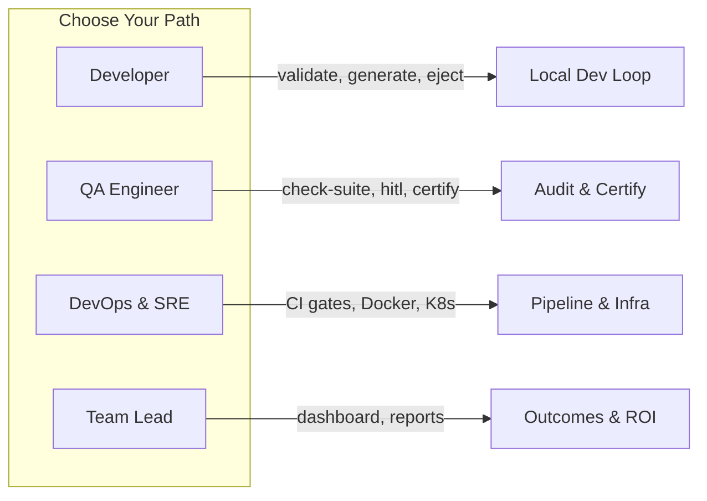

# Role-Based Guides

CHERENKOV-QA serves different roles differently. Pick the guide that matches how you work:

---

## :material-code-braces: [Developer Guide](developer.md)

**You write APIs and want them to match the spec.**

Validate endpoints during local development, generate Playwright tests from your OpenAPI spec, catch drift before it reaches code review, and eject tests when you want full independence.

Key commands: `validate`, `generate`, `eject`, `verify`

---

## :material-clipboard-check: [QA Engineer Guide](qa-engineer.md)

**You own test quality and release confidence.**

Audit existing test suites for weakened or hallucinated assertions, triage findings through the HITL queue, build conformance certificates for releases, and set up continuous monitoring.

Key commands: `check-suite`, `hitl`, `certify`, `daemon`, `guardian`

---

## :material-server: [DevOps & SRE Guide](devops.md)

**You build pipelines and keep services running.**

Integrate CHERENKOV into CI/CD (GitHub Actions, GitLab CI, CircleCI), deploy with Docker and Kubernetes, configure the ConformanceCheck CRD, and wire up OpenTelemetry.

Key commands: `validate --ci`, `daemon`, `guardian`, Docker/K8s configs

---

## :material-chart-line: [Team Lead & Manager Overview](team-lead.md)

**You need outcomes, not implementation details.**

Understand what CHERENKOV does in business terms, review the $0 cost model, read conformance certificates, and build the case for adoption.

Key views: Dashboard Overview workspace, conformance reports, competitive landscape
