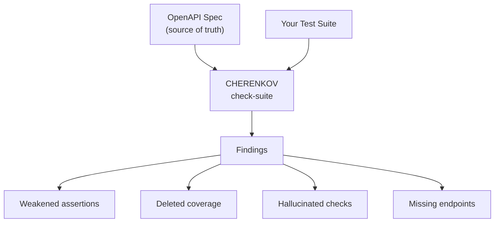
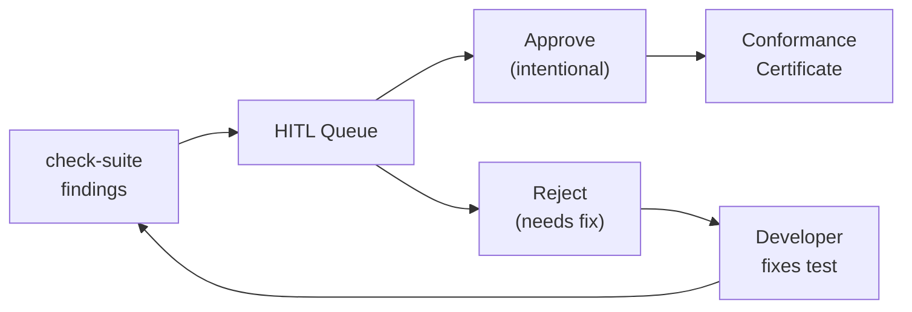
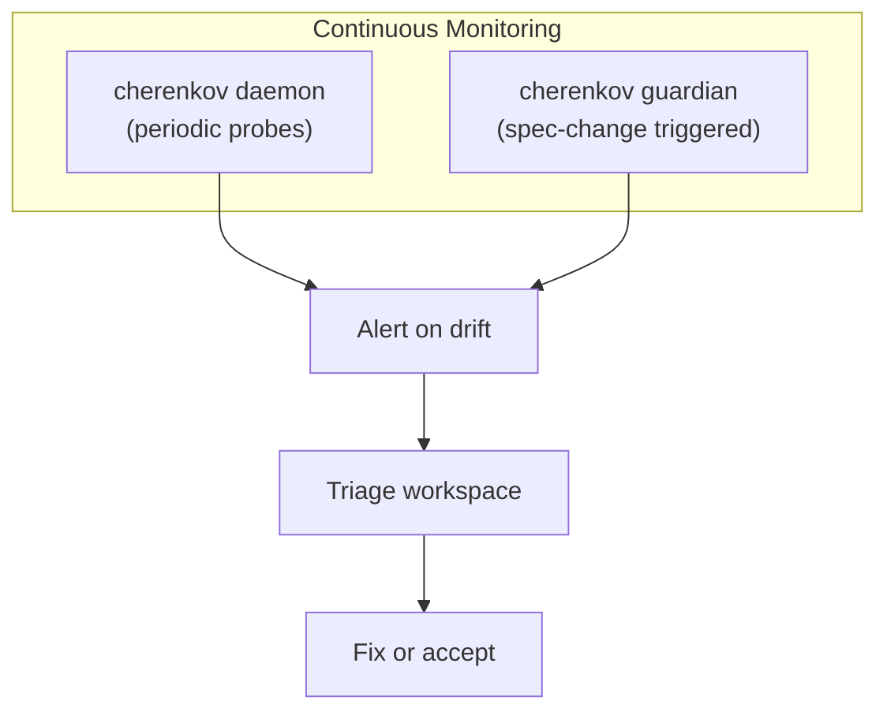
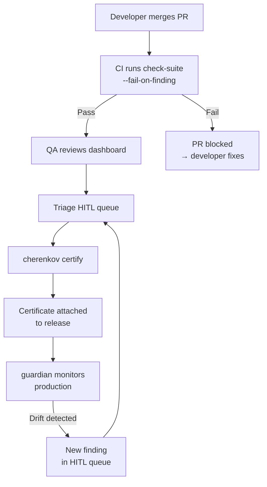

# QA Engineer Guide

You own test quality. You need to know whether your test suite actually tests what the spec says — or whether assertions have been weakened, deleted, or hallucinated by an LLM.

CHERENKOV gives you a second opinion on every test in your suite, plus the tooling to triage, certify, and continuously monitor.

---

## The Spec-vs-Reality Problem

Most API test suites drift from the spec over time:

- A developer weakens an assertion to make a flaky test pass
- An LLM generates a test that checks the wrong status code
- An endpoint changes but the test is not updated
- A test is deleted and nobody notices

CHERENKOV catches all of these by comparing your tests against the OpenAPI spec as the source of truth.



---

## Quick Wins

| Time | Command | What you learn |
|------|---------|----------------|
| 60s | `cherenkov check-suite --candidate ./tests --spec ./openapi.yaml` | How many findings in your suite |
| 2m | `cherenkov verify --url ... --spec ...` | API health score (40 probes) |
| 3m | `cherenkov dashboard` | Visual triage workspace |
| 5m | `cherenkov certify` | Conformance certificate for this build |

---

## Core Workflows

### 1. Audit Your Test Suite

`check-suite` is your primary tool. It reads your existing tests and compares them against the spec — no LLM needed, no network calls to your API:

```bash
cherenkov check-suite \
  --candidate ./tests \
  --spec ./openapi.yaml
```

The output categorizes findings:

- **Weakened** — an assertion exists but checks less than the spec requires
- **Deleted** — an endpoint in the spec has no corresponding test
- **Hallucinated** — a test asserts something the spec does not define
- **Stale** — a test references an endpoint or schema that no longer exists in the spec

#### As a CI Gate

Fail the build if any findings exist:

```bash
cherenkov check-suite \
  --candidate ./tests \
  --spec ./openapi.yaml \
  --fail-on-finding
```

Exit code 1 means findings were detected. Wire this into your CI pipeline to prevent test quality regressions.

### 2. Triage with HITL Review

Not every finding requires action. CHERENKOV's human-in-the-loop (HITL) queue lets you triage:

```bash
# List pending findings
cherenkov hitl list

# Approve a finding (mark as intentional / accepted)
cherenkov hitl approve <finding-id>

# Reject a finding (flag for fix)
cherenkov hitl reject <finding-id>
```

Or use the **Dashboard Triage workspace** for a visual interface:

```bash
cherenkov dashboard
# Open http://localhost:8000 → Triage workspace
```



### 3. Build Conformance Certificates

After triage, generate a conformance certificate that captures the state of your API:

```bash
cherenkov certify
```

The certificate includes:

- Timestamp and spec version
- Number of endpoints tested
- Pass/fail breakdown
- List of approved exceptions (from HITL)
- Overall conformance score

Certificates are artifacts you can attach to releases, compliance reports, or audit trails.

### 4. Continuous Monitoring

Set up ongoing conformance checks that catch drift as it happens:

#### Daemon Mode

Run continuous validation on an interval:

```bash
cherenkov daemon --url http://localhost:8000
```

The daemon re-runs probes periodically and alerts on new drift.

#### Spec Guardian

Watch for spec file changes and re-validate automatically:

```bash
cherenkov guardian start --spec openapi.yaml --base-url http://localhost:8000
```

The guardian monitors your spec file. When it changes, it re-validates and reports new drift.



---

## The Full QA Workflow

Putting it all together for a release cycle:



---

## Reports

Manage and review conformance reports:

```bash
# List all reports
cherenkov report --list

# View the latest report
cherenkov report --run latest

# View a specific report
cherenkov report --run <run-id>
```

Reports include detailed per-endpoint results, timing data, and finding breakdowns.

---

## Tips for QA Engineers

**Start with `check-suite`.** It needs no LLM, no running server — just your tests and your spec. You will have findings within 60 seconds.

**Do not auto-approve everything.** The HITL queue exists because not every finding is a bug. Some are intentional deviations. Approve those explicitly so the certificate reflects conscious decisions.

**Certify every release.** Conformance certificates create an audit trail. When someone asks "was this API tested before release?", you have a timestamped, signed answer.

**Combine `check-suite` with `validate`.** `check-suite` audits your *existing* tests. `validate` generates and runs *new* tests. Together, they cover both "are our tests good?" and "does our API work?"

---

## What Does Not Need an LLM

As a QA engineer, most of your workflow is LLM-free:

| Command | LLM needed? |
|---------|-------------|
| `check-suite` | No |
| `hitl list/approve/reject` | No |
| `certify` | No |
| `verify` | No |
| `daemon` | No |
| `guardian` | No |
| `report` | No |

The only command that uses an LLM is `generate` (and `validate`, which calls `generate` internally). Everything in the audit-triage-certify workflow runs without Ollama.

---

## Next Steps

- [CLI Reference](../cli/reference.md) — full flag documentation
- [Developer Guide](developer.md) — coordinate with your developers on the validate workflow
- [DevOps Guide](devops.md) — set up CI gates and continuous monitoring infrastructure
- [API Conformance Guide](../guides/api-conformance.md) — deeper dive into conformance testing concepts
- [Troubleshooting FAQ](../troubleshooting/faq.md) — common questions answered
