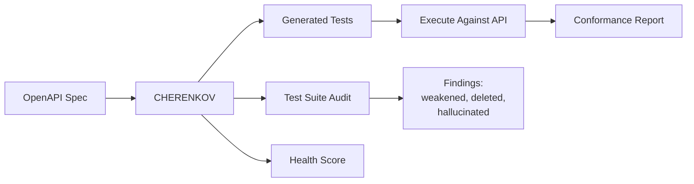
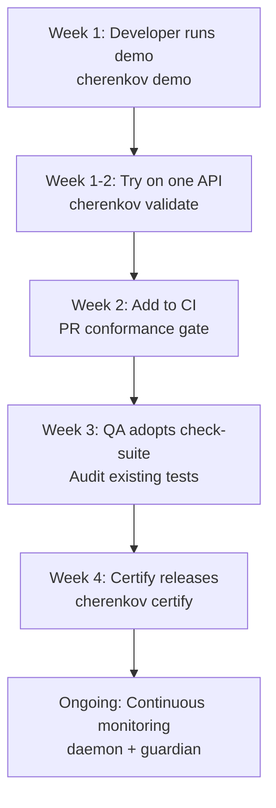

# Team Lead & Manager Overview

You need to know what CHERENKOV does, what it costs, and whether it is worth adopting. This page gives you the answers without requiring you to run any commands.

---

## The 5-Minute Pitch

**The problem:** Your API has a spec (OpenAPI/Swagger). Your team writes tests. But specs drift from implementations, tests weaken over time, and nobody catches it until a customer reports a broken integration.

**What CHERENKOV does:** It reads your OpenAPI spec, generates conformance tests, runs them against your live API, and tells you exactly where your implementation diverges from what you promised.

**What makes it different:**

1. **It tests the tests.** CHERENKOV does not just test your API — it audits your existing test suite for weakened, deleted, or hallucinated assertions.
2. **Local and private.** Everything runs on your infrastructure. No data leaves your network. The LLM runs on your machine via Ollama.
3. **Zero cost.** Not "free tier." Not "free for small teams." Everything is free. SSO, RBAC, Kubernetes operator, continuous monitoring — all included under Apache 2.0.
4. **No lock-in.** Tests can be ejected into standalone Playwright at any time. If you stop using CHERENKOV, your tests still work.



---

## Quick Wins

| Time | Action | Outcome |
|------|--------|---------|
| 30s | `cherenkov demo` | See it work, no setup |
| 2m | Share health score with team | Instant visibility into API quality |
| 5m | Review a conformance certificate | Evidence for compliance or release sign-off |
| 1 day | Add to CI pipeline | Every PR checked for API drift |

---

## Business Outcomes

### Reduced API Bugs

CHERENKOV catches spec drift — the category of bugs where your API stops matching its published contract. These bugs are invisible to unit tests and often missed by integration tests that were written against stale assumptions.

**Before CHERENKOV:** Drift is caught by customer complaints, partner integration failures, or production incidents.

**After CHERENKOV:** Drift is caught in the pull request, before merge.

### Compliance Evidence

Every `cherenkov certify` run produces a timestamped conformance certificate. This is audit-ready evidence that your API was tested against its spec at a specific point in time.

Use cases:

- SOC 2 audit trails
- Regulatory API compliance
- Partner SLA documentation
- Release sign-off artifacts

### Faster Releases

When your team trusts the conformance gate, they spend less time on manual API testing and less time debugging integration issues after deployment.

### Test Suite Integrity

`check-suite` audits your existing tests and reports:

- **Weakened assertions** — tests that check less than the spec requires
- **Deleted coverage** — endpoints with no tests
- **Hallucinated checks** — tests that assert things the spec does not define

This is particularly valuable if your team uses LLM tools to generate tests — CHERENKOV acts as a quality gate on LLM-generated test code.

---

## Cost Model

| Feature | Cost |
|---------|------|
| Core validation (`validate`, `verify`, `check-suite`) | Free |
| Test generation (`generate`) | Free |
| Dashboard (5 workspaces) | Free |
| HITL review queue | Free |
| Conformance certificates | Free |
| CI/CD integration | Free |
| Docker deployment | Free |
| Kubernetes operator + CRD | Free |
| Continuous monitoring (daemon, guardian) | Free |
| SSO/SAML authentication | Free |
| RBAC (role-based access control) | Free |
| OpenTelemetry integration | Free |
| Enterprise support | Free (community) |

**There is no paid tier.** CHERENKOV is Apache 2.0 licensed. Everything listed above is included.

**Infrastructure costs:** CHERENKOV runs on your existing infrastructure. The only optional dependency is Ollama for local LLM inference (also free and open source). If you have a GPU, test generation is faster; without one, it still works on CPU.

---

## Competitive Landscape

| Capability | CHERENKOV | Schemathesis | Manual Testing | LLM Eval Tools |
|------------|-----------|--------------|----------------|-----------------|
| Tests API against spec | Yes | Yes | Partially | No |
| Audits existing test suite | Yes | No | No | No |
| Generates Playwright tests | Yes | No | No | Some |
| Local/private execution | Yes | Yes | Yes | Varies |
| Zero cost (all features) | Yes | Partial | Yes | No |
| Ejectable tests (no lock-in) | Yes | N/A | N/A | No |
| Conformance certificates | Yes | No | No | No |
| HITL review queue | Yes | No | No | No |
| K8s operator | Yes | No | No | No |

**CHERENKOV vs Schemathesis:** Schemathesis fuzzes API inputs to find crashes and schema violations. CHERENKOV takes a different approach — it generates structured conformance tests and audits existing test suites. They are complementary, not competitive: Schemathesis finds edge cases your spec does not cover; CHERENKOV ensures your implementation matches what your spec promises.

**CHERENKOV vs manual testing:** Manual API testing is time-consuming and inconsistent. CHERENKOV automates the "does it match the spec?" question and produces repeatable evidence.

**CHERENKOV vs LLM eval tools:** LLM evaluation frameworks (like those for evaluating model outputs) solve a different problem. CHERENKOV uses LLMs to generate tests, but the thing being tested is your API, not an LLM.

---

## What Your Team Sees

### Dashboard

CHERENKOV provides a 5-workspace React dashboard at `localhost:8000`:

1. **Overview** — high-level conformance status across all APIs
2. **Triage** — HITL queue for reviewing findings
3. **Reports** — historical conformance reports and trends
4. **Coverage** — which endpoints are tested, which are not
5. **Settings** — configuration and team management

```bash
cherenkov dashboard
```

### Conformance Certificate

A certificate looks like this (simplified):

```
CHERENKOV Conformance Certificate
==================================
API:         Petstore API v1.2.0
Spec:        openapi.yaml (sha256: a1b2c3...)
Date:        2026-08-06T14:30:00Z
Endpoints:   24 tested / 24 in spec
Passed:      23
Divergences: 1 (approved exception)
Score:       95.8%
Status:      CONFORMANT (with exceptions)
```

### Reports

```bash
cherenkov report --list     # See all historical runs
cherenkov report --run latest   # View the most recent
```

---

## Adoption Path



**Week 1:** A developer runs `cherenkov demo` and then tries `validate` against a real API. No approvals needed — it is a pip install.

**Week 2:** Add `cherenkov validate` as a CI step on one service. Non-blocking at first (allow failures).

**Week 3:** QA runs `check-suite` against existing test suites. Triages findings in the dashboard.

**Week 4:** Start generating conformance certificates for releases. Make the CI gate blocking.

**Ongoing:** Deploy daemon or guardian for continuous monitoring. Expand to more services.

---

## Risks and Honest Limitations

- **TypeScript test detection** uses regex-based parsing, which is weaker than Python's AST-based detection. Complex TypeScript test patterns may be missed.
- **LLM-generated tests** depend on model quality. The default local model (via Ollama) works well for standard REST APIs; complex specs may benefit from larger models.
- **New project.** CHERENKOV is actively developed. Expect API surface changes between minor versions, though the core `validate`/`verify`/`check-suite` commands are stable.

---

## Next Steps

- [Getting Started](../getting-started/index.md) — share with your team for hands-on setup
- [Developer Guide](developer.md) — the developer's perspective
- [QA Engineer Guide](qa-engineer.md) — the QA workflow
- [DevOps Guide](devops.md) — infrastructure and pipeline setup
- [Cost Tiers](../getting-started/cost-tiers.md) — detailed breakdown of what is free (everything)
