# System Architecture Diagrams

All CHERENKOV architectural flows rendered as interactive diagrams.

---

## 1. System Context

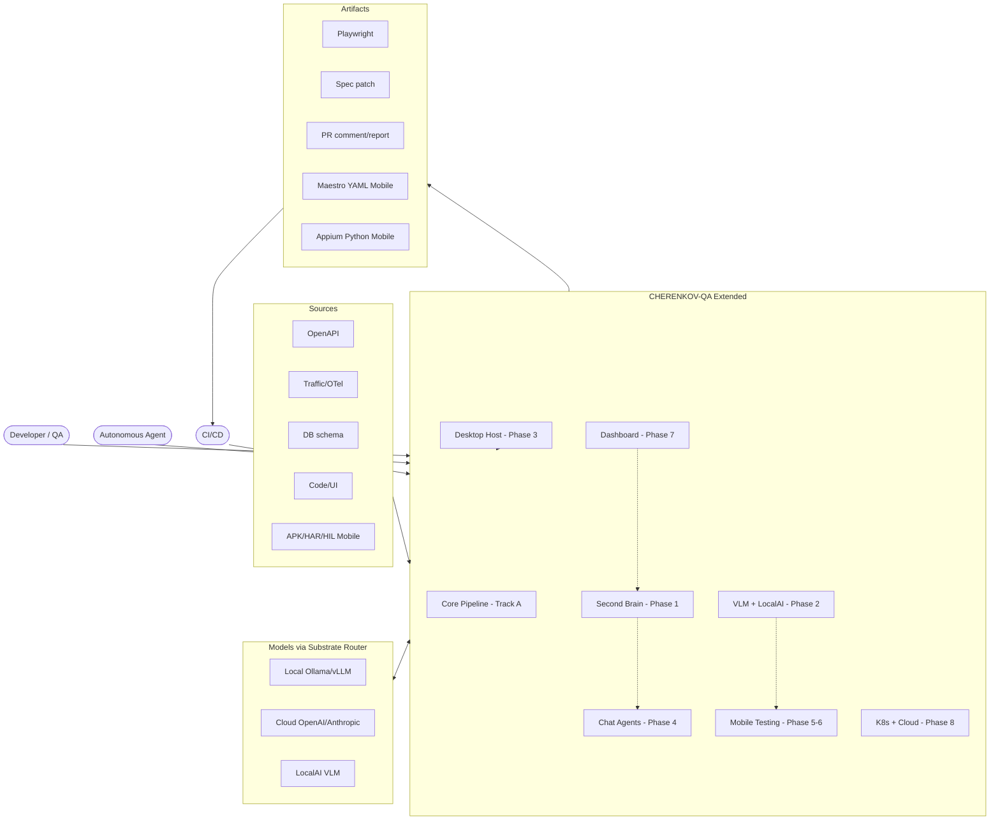

---

## 2. Track A Pipeline — Spec In, Tests Out

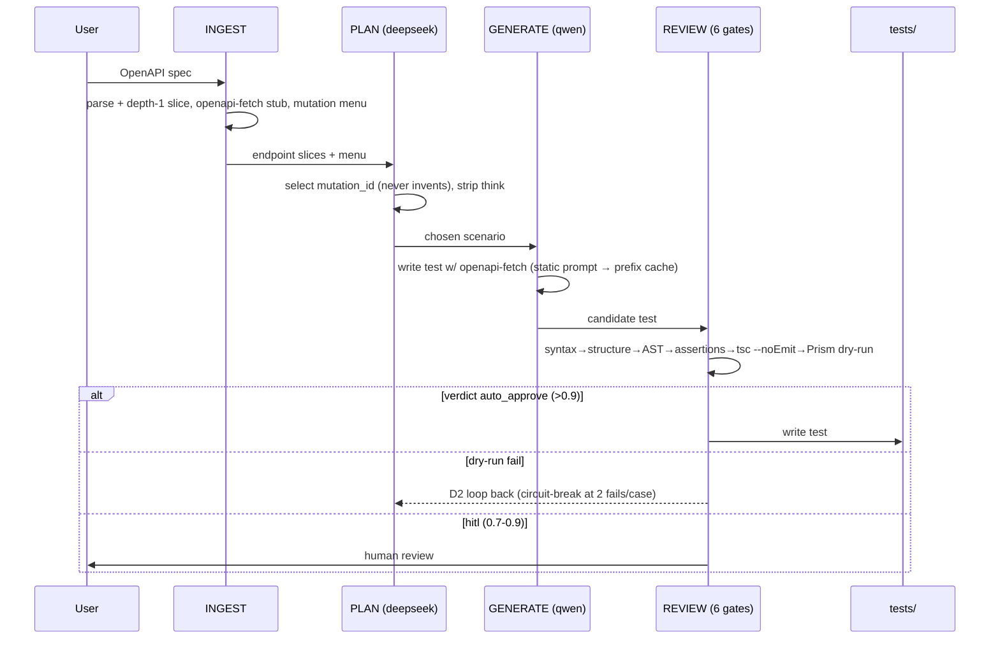

---

## Divergence Loop — The Core Capability

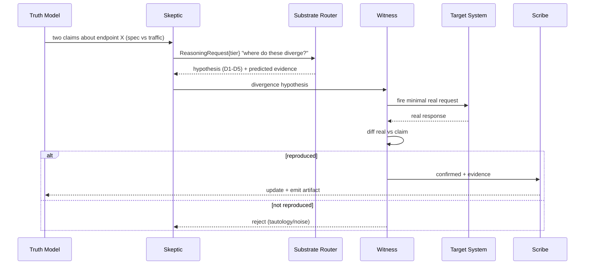

---

## 4. Clean Architecture Module Structure

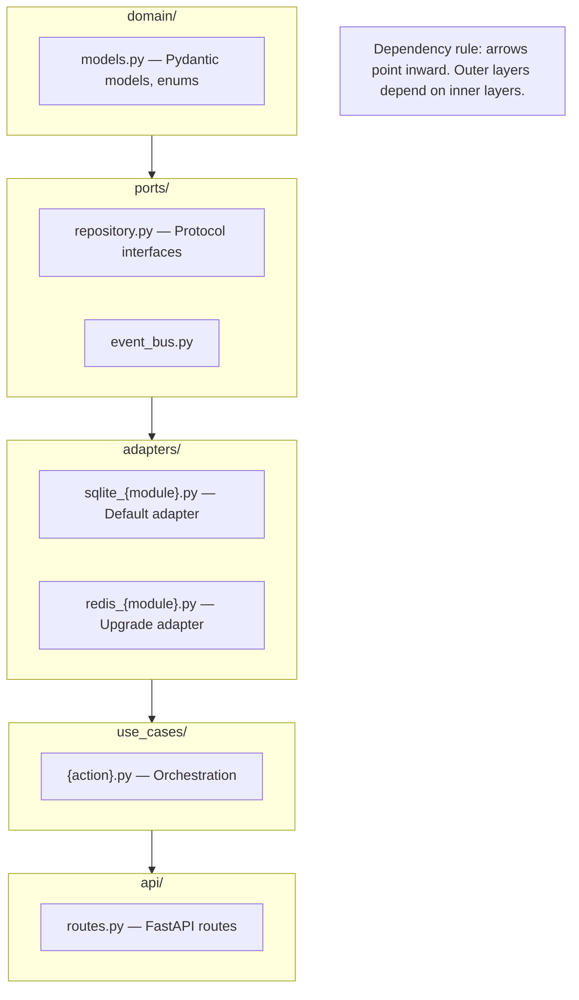

---

## 5. Second Brain Architecture

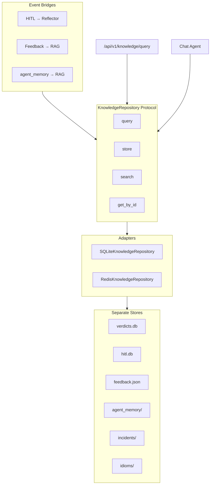

---

## 6. Chat Agent Flow

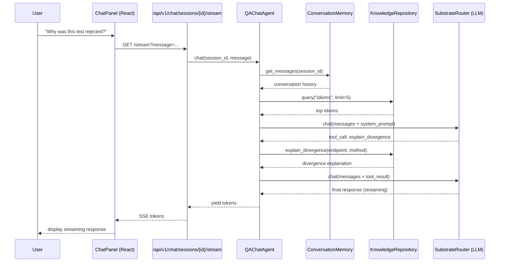

---

## 7. Desktop Host IPC

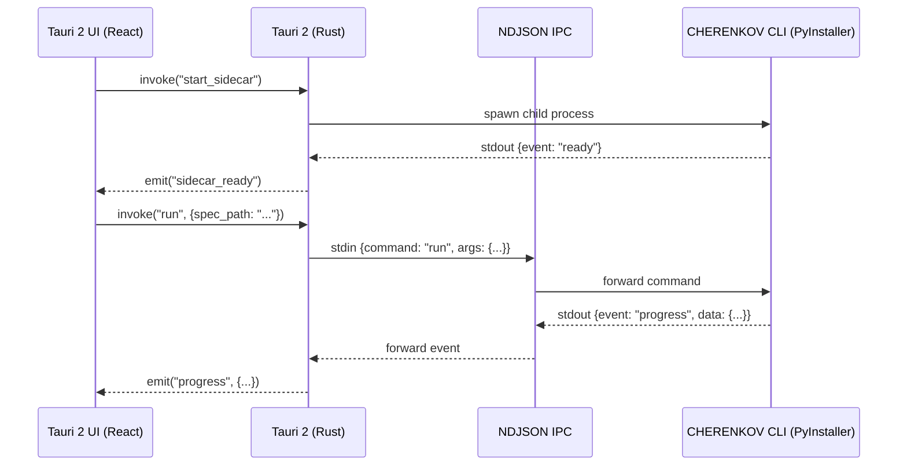

---

## 8. Release Flow

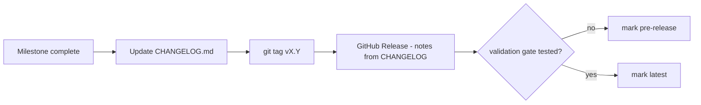

---

## 9. Validation Gate Flow

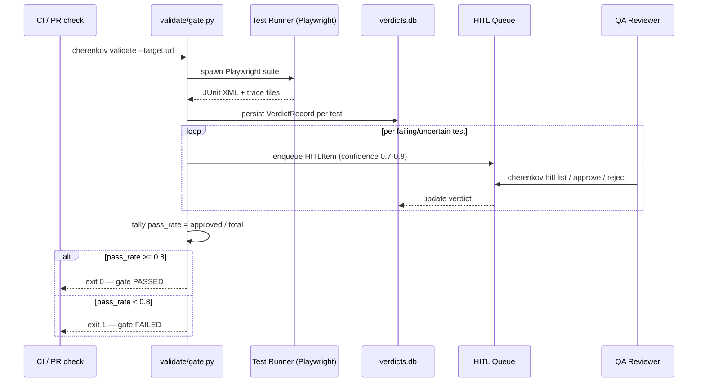

---

## 10. Version-Diff Evolution Flow (1.2 → 1.3 → 1.4)

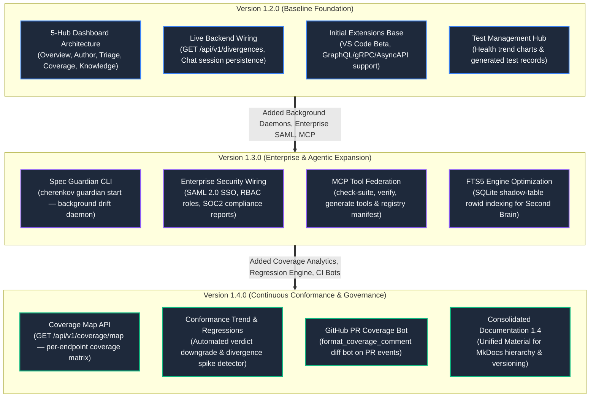

---

## 11. 1.4 Consolidated Documentation Site Map

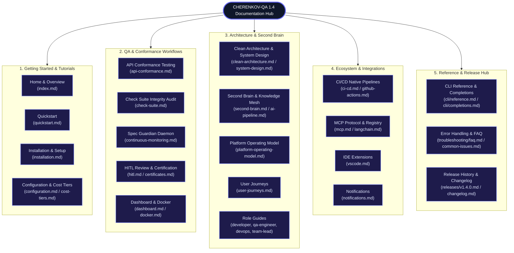

