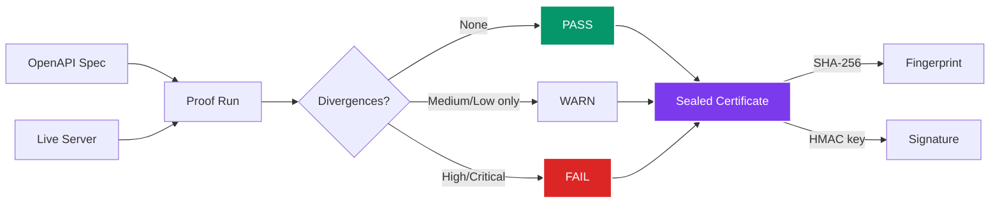
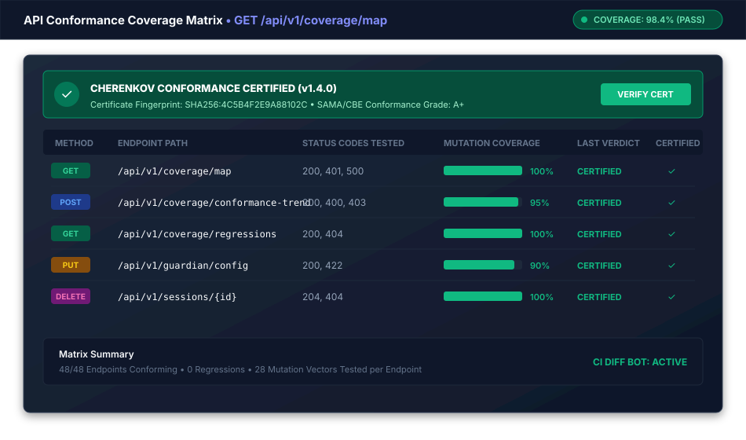

# Certificates & Compliance

A CHERENKOV certificate is a tamper-evident JSON artifact that proves an API was tested against its OpenAPI spec at a specific point in time. It carries a SHA-256 fingerprint for integrity and an optional HMAC-SHA256 signature for authorship.

---

## Quick Start

```bash
# Issue a certificate against the demo Petstore API
cherenkov certify

# Issue against your own API
cherenkov certify --url http://localhost:8080 --spec ./openapi.yaml --output cert.json

# Verify an existing certificate
cherenkov certify --verify cert.json
```

---

## How It Works




*Figure: Per-endpoint conformance coverage matrix and signed compliance certificate status.*

---

## Certificate Format

A sealed certificate looks like this:

```json
{
  "cert_id": "a1b2c3d4-e5f6-7890-abcd-ef1234567890",
  "version": "1.0",
  "issued_at": "2026-08-06T14:30:00+00:00",
  "subject": {
    "base_url": "http://localhost:8080",
    "spec_hash": "3f2a1b4c5d6e7f8a"
  },
  "run_id": "run-9876",
  "summary": {
    "total": 5,
    "critical": 0,
    "high": 0,
    "medium": 3,
    "low": 2
  },
  "verdict": "WARN",
  "divergences_json": [...],
  "fingerprint": "sha256:abcdef1234567890...",
  "signature": "hmac-sha256:fedcba0987654321..."
}
```

### Verdict Rules

| Verdict | Condition |
|---------|-----------|
| **PASS** | Zero divergences |
| **WARN** | Only MEDIUM and/or LOW divergences |
| **FAIL** | At least one HIGH or CRITICAL divergence |

---

## Command Reference

### `cherenkov certify`

| Flag | Description |
|------|-------------|
| `--url`, `-u` | Base URL of the live server. Defaults to the public Petstore demo |
| `--spec`, `-s` | Path or URL to the OpenAPI spec (JSON/YAML). Omit for built-in Petstore |
| `--output`, `-o` | Write the JSON certificate to this file |
| `--signing-key` | Hex-encoded 32-byte signing key. Also read from `CHERENKOV_CERT_KEY` env var |
| `--fail-on-fail` | Exit code 1 if verdict is FAIL (use as CI gate) |
| `--verify` | Verify an existing certificate file instead of running a new proof |
| `--compliance` | Print the compliance evidence mapping after issuing |
| `--coverage-report` | Print a spec coverage-gap report (requires `--spec`) |
| `--llm` / `--offline` | Use the LLM Skeptic (requires Ollama). Default: `--offline` |

### Signing and Verification

```bash
# Generate a signing key
export CHERENKOV_CERT_KEY=$(openssl rand -hex 32)

# Issue a signed certificate
cherenkov certify --url http://localhost:8080 --signing-key $CHERENKOV_CERT_KEY --output cert.json

# Verify the signature later
cherenkov certify --verify cert.json --signing-key $CHERENKOV_CERT_KEY
```

An unsigned certificate still provides **integrity** (the SHA-256 fingerprint detects any modification). The HMAC signature adds **authorship** — proof that the certificate was issued by someone with the key.

---

## Compliance Mappings

Pass `--compliance` to print how the certificate maps to regulatory frameworks:

```bash
cherenkov certify --url http://localhost:8080 --compliance
```

### Supported Frameworks

| Framework | Provisions Covered |
|-----------|-------------------|
| **EU AI Act (2024/1689)** | Art. 9 SS4 (residual risk), Art. 12 SS1 (logging integrity), Art. 12 SS2 (traceability), Art. 13 SS3 (transparency) |
| **SOC 2 Type II** | CC4.1 (risk analysis), CC6.7 (transmission integrity), CC7.2 (deficiency reporting) |
| **ISO/IEC 25010:2023** | Functional correctness, Confidentiality, Accountability |

Each mapping shows:

- **provision** — the specific article or control
- **cert_fields** — which certificate fields satisfy it
- **evidence** — the concrete values from this certificate
- **caveat** — what the integrator must still do (e.g., manage the signing key per policy)

---

## CI Gate

Use `--fail-on-fail` to block a pipeline when the API has HIGH or CRITICAL divergences:

```yaml
# .github/workflows/certify-gate.yml
name: API Certification Gate

on:
  push:
    branches: [main]
  pull_request:

jobs:
  certify:
    runs-on: ubuntu-latest
    steps:
      - uses: actions/checkout@v4
      - uses: actions/setup-python@v5
        with:
          python-version: "3.12"

      - name: Install CHERENKOV
        run: |
          git clone https://github.com/moaidmoatasem/cherenkov-qa.git /tmp/cherenkov-qa
          pip install /tmp/cherenkov-qa

      - name: Start API server
        run: docker compose up -d api && sleep 5

      - name: Certify
        run: |
          cherenkov certify \
            --url http://localhost:8080 \
            --spec api/openapi.yaml \
            --output cert.json \
            --fail-on-fail \
            --compliance

      - name: Upload certificate
        uses: actions/upload-artifact@v4
        if: always()
        with:
          name: conformance-certificate
          path: cert.json
```

---

## Certificate Spec

The full specification for the certificate format, including field semantics, versioning, and extension points, is documented in `docs/specs/CHERENKOV_CERTIFICATE.md` within the repository.

---

## Next Steps

- [Check Suite (Integrity Audit)](check-suite.md) — detect weakened or hallucinated assertions before certifying
- [CI/CD Integration](ci-cd.md) — embed certification in your pipeline
- [Human-in-the-Loop Workflow](hitl.md) — HITL decisions feed into the certification verdict
- [Configuration](../getting-started/configuration.md) — `CHERENKOV_CERTIFICATION_ENABLED` and `CHERENKOV_MEANINGFUL_ASSERTION_GATE`
