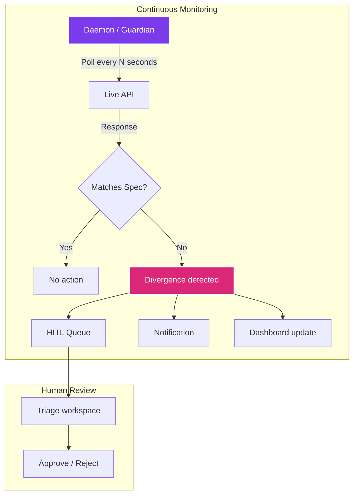
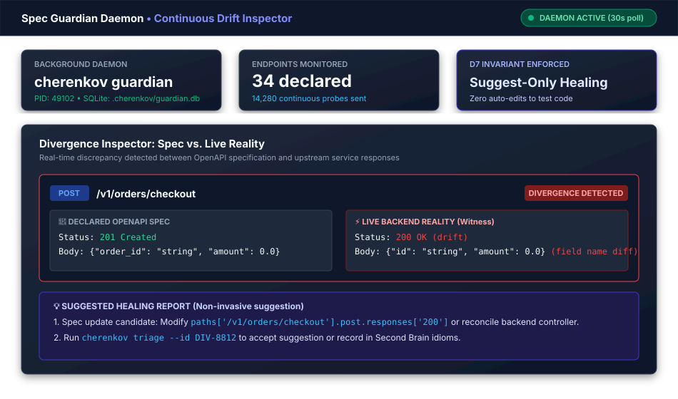
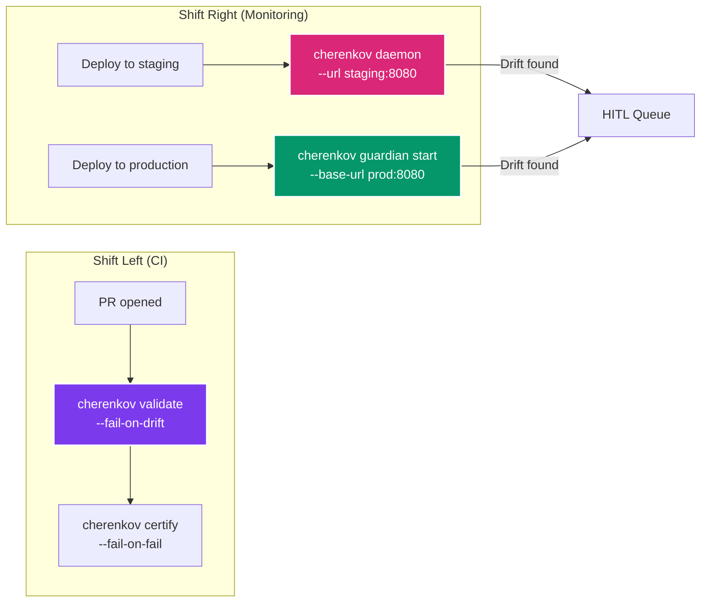

# Continuous Monitoring

CHERENKOV can run as a background process that continuously polls a live API, detects spec drift as it happens, and feeds findings into the HITL queue. Two modes are available: the general-purpose daemon and the focused Spec Guardian.

---

## Overview




*Figure: Spec Guardian real-time divergence inspector catching drift between OpenAPI specification and live backend.*

---

## Daemon Mode

The daemon watches your spec sources and rebuilds the Truth Model on each cycle. When `--url` is provided, it also probes the live server and queues any divergences.

```bash
cherenkov daemon --url http://localhost:8080
```

### How it works

1. **Watch specs** — monitors the OpenAPI files listed in `cherenkov.toml` for changes (file modification time)
2. **Rebuild truth model** — when a spec changes, the truth model is regenerated
3. **Probe live server** — sends requests to the target and compares responses against the spec
4. **Queue divergences** — any drift is appended to `.cherenkov/divergence_queue.jsonl`
5. **Repeat** — wait for the poll interval, then start again

### Options

| Flag | Default | Description |
|------|---------|-------------|
| `--url` | — | Live server URL to probe each cycle. Omit for spec-change-only monitoring |
| `--interval` | `60` | Seconds between poll cycles |
| `--max-loops` | `0` (infinite) | Maximum iterations before the daemon exits |

### Example: watch staging every 30 seconds

```bash
cherenkov daemon --url http://staging:8080 --interval 30
```

### Divergence Queue

Divergences are persisted to `.cherenkov/divergence_queue.jsonl` (one JSON object per line). The queue is consumed by the HITL subsystem and can be read by external tools:

```bash
cat .cherenkov/divergence_queue.jsonl | jq '.severity'
```

---

## Spec Guardian

The Spec Guardian is a more focused monitoring tool designed for watching specific API endpoints against an OpenAPI spec. It persists drift events and history to a local SQLite database.

```bash
cherenkov guardian start \
  --spec openapi.yaml \
  --base-url http://localhost:8080
```

### Default behavior

By default, the Guardian monitors every **concrete GET path** in the spec (paths without `{parameters}`). Non-GET methods are excluded to avoid mutating the target on every poll cycle.

### Override endpoints

Use `--endpoint` flags to monitor specific endpoints, including non-GET methods:

```bash
cherenkov guardian start \
  --spec openapi.yaml \
  --base-url http://localhost:8080 \
  --endpoint "GET:/health" \
  --endpoint "GET:/api/v1/status" \
  --interval 10
```

### Options

| Flag | Default | Description |
|------|---------|-------------|
| `--spec` | (required) | Path to the OpenAPI spec (YAML or JSON) |
| `--base-url` | (required) | Base URL of the live API |
| `--interval`, `-i` | `60` | Seconds between check cycles |
| `--endpoint` | All concrete GET paths | Repeatable `METHOD:PATH` to override default endpoint list |
| `--db` | `.cherenkov/guardian.db` | SQLite database for drift history |

### Example: focused health monitoring

```bash
cherenkov guardian start \
  --spec openapi.yaml \
  --base-url http://production:8080 \
  --endpoint "GET:/health" \
  --endpoint "GET:/api/v1/status" \
  --interval 10 \
  --db .cherenkov/prod-guardian.db
```

---

## Daemon vs. Guardian

| Feature | Daemon | Guardian |
|---------|--------|----------|
| **Scope** | Full pipeline (truth model + probing) | Endpoint-level spec conformance |
| **Spec change detection** | Yes (watches file mtimes) | No (static spec) |
| **Storage** | JSONL queue | SQLite database |
| **Endpoint selection** | All from spec | Concrete GET paths (customizable) |
| **Best for** | Development/staging continuous monitoring | Production health checks |

---

## Combining with CI/CD

Use continuous monitoring alongside CI gates for defense in depth:



**Shift left:** Catch drift before it merges. `cherenkov validate` and `cherenkov certify` run in your CI pipeline.

**Shift right:** Catch drift after deployment. The daemon or Guardian polls continuously and feeds findings to the HITL queue.

---

## Running as a Service

### systemd

```ini
# /etc/systemd/system/cherenkov-guardian.service
[Unit]
Description=CHERENKOV Spec Guardian
After=network.target

[Service]
Type=simple
User=cherenkov
WorkingDirectory=/opt/cherenkov-qa
ExecStart=/opt/cherenkov-qa/.venv/bin/cherenkov guardian start \
  --spec /etc/cherenkov/openapi.yaml \
  --base-url http://localhost:8080 \
  --interval 60
Restart=on-failure
RestartSec=10

[Install]
WantedBy=multi-user.target
```

### Docker Compose

```yaml
services:
  guardian:
    build: .
    command: ["guardian", "start", "--spec", "/specs/openapi.yaml", "--base-url", "http://api:8080", "--interval", "30"]
    volumes:
      - ./specs:/specs:ro
      - ./.cherenkov:/app/.cherenkov
    restart: unless-stopped
```

---

## Next Steps

- [Human-in-the-Loop Workflow](hitl.md) — triage the findings the daemon generates
- [Dashboard & UI](dashboard.md) — view live drift events as they arrive
- [CI/CD Integration](ci-cd.md) — combine shift-left and shift-right
- [Docker & Deployment](docker.md) — run the daemon in Docker
