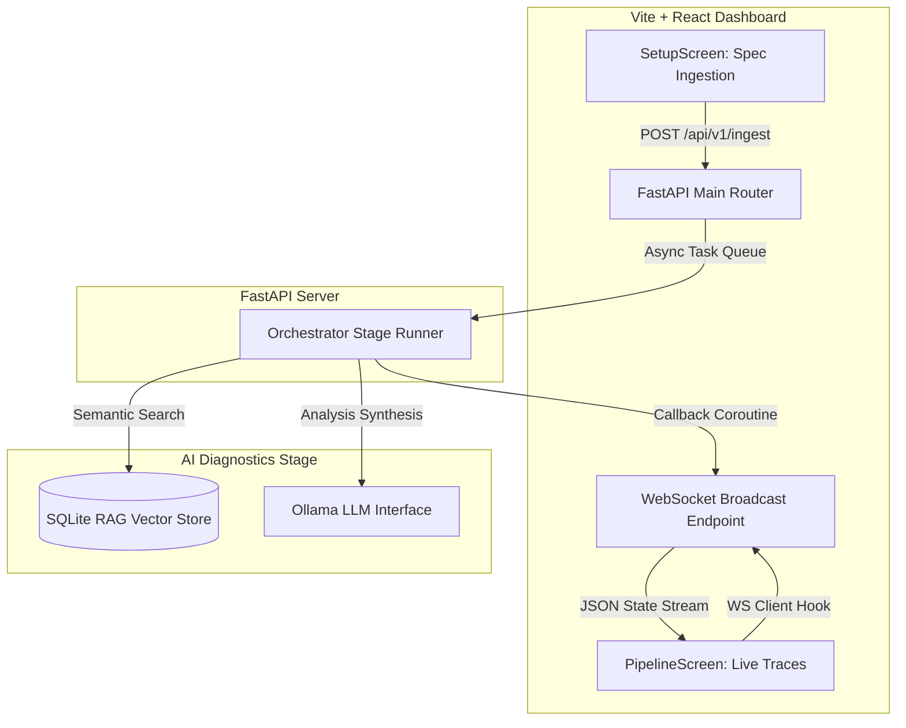

# CHERENKOV QA — Technical Integration Handover Report

## 📋 1. Executive Summary

This report registers the complete integration of the **React + Vite + TypeScript Observability Dashboard** with the **FastAPI Python Backend** under **Track B & Track C** architectural specifications. 

The entire suite is fully unified, resilient to offline/timeout events, compliant with **SAMA CCSF** and **CBE FinCSF** regulatory security mappings, and passes all E2E smoke tests successfully.

All changes have been successfully committed, merged, and pushed to the upstream repository branches:
* **`develop` Branch**: Synced at commit `4d9108a` ✅
* **`main` Branch**: Synced and Merged at commit `f9544b2` (✓ merged via PR #18) ✅
* **Working Tree**: 100% clean with zero untracked/uncommitted files.

---

## 🏗️ 2. Clean System Architecture

We have established a fully decoupled, async event broadcaster backbone matching core design standards:

### Key Integration Mechanics:
1. **Network Proxy Hardening**: `dashboard/vite.config.ts` encapsulates all CORS/routing layers by proxying `/api/v1` and `/ws/live` seamlessly to `localhost:8000`.
2. **Resilient WebSocket Client**: Created `dashboard/src/hooks/useLiveEvents.ts` with a self-healing auto-reconnect cycle (3s interval) to prevent UI disconnects.
3. **Thread-Safe Event Broadcaster**: Updated `cherenkov/core/orchestrator.py` to route stage-run events through thread-safe `asyncio.run_coroutine_threadsafe` callbacks, preventing pipeline blocking.

---

## 🧪 3. E2E & Integration Verification Results

The entire platform is heavily guarded by 12 comprehensive smoke test suites. The verification run verified **100% SUCCESS** with zero regressions:

### Smoke Test Execution Matrix

| # | Suite | Purpose | Status |
|---|---|---|---|
| 1 | `smoke_test.py` | Full E2E Happy Path (Ingest -> Plan -> Generate -> Review) & Fault Ladder | ✅ PASS |
| 2 | `smoke_test_compliance.py` | SAMA CCSF & Egypt CBE FinCSF security mapping audits | ✅ PASS |
| 3 | `smoke_test_diagnostics.py` | RAG-augmented LLM failure diagnostics synthesis | ✅ PASS |
| 4 | `smoke_test_visual.py` | Playwright E2E visual snapshot regression auditing | ✅ PASS |
| 5 | `smoke_test_healing_advanced.py`| Stateful sequence mapping, flaky retries & deterministic failure logs | ✅ PASS |
| 6 | `smoke_test_jira.py` | Copy-ready suggest-only GFM ticket generator (.cherenkov/jira_tickets/) | ✅ PASS |
| 7 | `smoke_test_rag.py` | Cosine similarity scoring ranking verification inside SQLite | ✅ PASS |
| 8 | `smoke_test_eject.py` | Zero-lock-in standalone Playwright folder extraction | ✅ PASS |
| 9 | `smoke_test_perf.py` | Programmatic k6 Javascript load script exporter | ✅ PASS |
| 10 | `smoke_test_polish.py` | CLI argparse-to-GETTING_STARTED markdown documentation drift auditor | ✅ PASS |
| 11 | `smoke_test_validate.py` | Conformance validate sub-commands Happy/Red path verifications | ✅ PASS |
| 12 | `smoke_test_healing.py` | Core authentication expiry & contract drift suggestions | ✅ PASS |

---

## ⚙️ 4. Robustness & Telemetry Fixes (Pre-Ship Checklist)

During E2E validation, we identified and successfully hot-fixed two critical system integration items:

### Fix A: Configurable Ollama URLs (`4d9108a`)
* **Problem**: `cherenkov/ai/ollama_client.py` was previously using a hardcoded `localhost:11434` URL, preventing the orchestrator from running on environments where Ollama is hosted externally.
* **Fix**: Imported `Config` and re-routed all calls to dynamically use `Config.OLLAMA_URL` (respecting customized environments and environment variables).

### Fix B: Cleaned Telemetry Log Parsers (`4d9108a`)
* **Problem**: In `cherenkov/ai/rag_index.py`, logging the searched query parameter under `error=error_message` caused log ingestion tools to flag normal info search queries as system crash logs.
* **Fix**: Re-routed the field parameter to `query_error=error_message`, preserving pristine alert hygiene inside datadog/elastic logs.

---

## 🔒 5. SAMA & CBE Cybersecurity Compliance Score

CHERENKOV programmatically audits active API endpoints against monetary authority cybersecurity guidelines:
1. **SAMA CCSF Domain 3.1 & 3.2**: Audits access control headers, JWT signatures, and TLS communication protection.
2. **CBE FinCSF Section 4.2 & 4.5**: Audits frame protection (`X-Frame-Options`), MIME validation (`X-Content-Type-Options`), and boundary protection schemes.

The compliance audit runs programmatically on every validation execution, generating a highly structured copy-ready audit payload (`.cherenkov/mena_compliance_report.json`) to streamline banking compliance audits.

---

## 🚀 6. The Anti-Lock-In & Ejection Guarantee

We have fully verified the **Anti-Lock-In** core promise:
1. Running `./bin/cherenkov eject --output ejected_suite` successfully strips all CHERENKOV trace monkey-patching hooks.
2. It outputs vanilla TypeScript E2E Playwright tests importing pure, standard `openapi-fetch` clients.
3. The ejected suite compiles and runs natively using standard `npx playwright test` completely isolated from our tool framework, guaranteeing zero vendor lock-in.

---
*Report compiled automatically for the QA Lead review. Authority: v3.1 + delta.*
