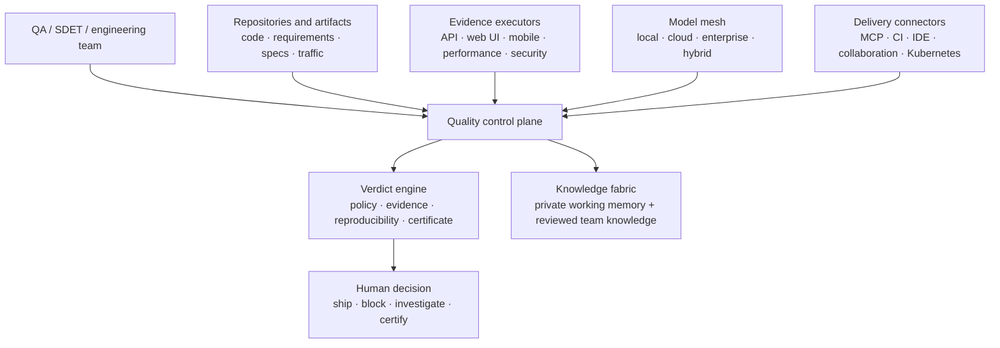

# CHERENKOV Platform Operating Model

**Status:** Directional architecture and product contract. Not a delivery roadmap.
**Related:** [NORTH_STAR.md](NORTH_STAR.md), [PRODUCT_STRATEGY_ROADMAP.md](PRODUCT_STRATEGY_ROADMAP.md), [engineering/SYSTEM_DESIGN.md](engineering/SYSTEM_DESIGN.md)

## The product in one sentence

**CHERENKOV is an open Quality Intelligence Platform: it gathers evidence from any engineering system, applies independent quality policy, and gives people a reproducible verdict before software ships.**

AI can generate code, tests, and release notes quickly. It must not be the sole authority that says its own work is safe. CHERENKOV exists to preserve an independent quality decision, with QA practitioners defining the policy and retaining final control.

## One quality truth, many evidence sources

CHERENKOV is not a Playwright product, an LLM wrapper, or an integration marketplace. Those are important delivery surfaces. The platform is the shared quality truth that they contribute to and consume.

The Verdict Engine is deliberately small. It must be able to answer:

1. What claim was checked?
2. What evidence supports or contradicts it?
3. Which policy and tool versions were used?
4. What did the responsible human decide?
5. Can another person reproduce or independently verify the result?

## Platform boundaries

| Platform core — CHERENKOV owns this | Extension ecosystem — adapters provide this |
|---|---|
| Quality policies, verdict schema, provenance, evidence integrity, review workflow, certificates, memory governance | Test frameworks, model providers, source systems, CI systems, IDEs, messaging tools, device clouds, ticketing systems |
| Deterministic guardrails that an agent cannot lower for itself | Optional capabilities that can be installed, configured, upgraded, or removed |
| A common evidence and decision model | How evidence is collected or how a user sees it |

An integration is successful only when it improves a quality decision. It is not successful merely because data moves between two tools.

## Open extension contracts

New capabilities enter through explicit, versioned contracts. No individual tool becomes a hidden platform dependency.

| Contract | Responsibility | Examples |
|---|---|---|
| `EvidenceSource` | Describe a system or artifact and expose claims to check | OpenAPI, GraphQL, gRPC, code diff, user story, production trace |
| `ScenarioPlanner` | Turn claims and risk into executable scenarios | Contract coverage, checkout journey, accessibility flow, load profile |
| `EvidenceExecutor` | Run a scenario and return immutable raw evidence | Playwright, Cypress, Selenium, Appium, Maestro, k6, JMeter, Postman/Newman, pytest |
| `Oracle` | Judge evidence against a stated policy or source of truth | Spec conformance, visual baseline, performance budget, WCAG rule, security policy |
| `ModelProvider` | Provide optional reasoning or generation under declared limits | Ollama, LocalAI, vLLM, OpenAI, Azure OpenAI, Anthropic, Bedrock, Vertex AI |
| `Connector` | Exchange context or results with another system | MCP host, GitHub, GitLab, Jenkins, GitHub Actions, Slack, Teams, Jira, Linear, Kubernetes |
| `MemoryStore` | Store private or shared knowledge with provenance and retention | Local SQLite, workspace database, approved repository knowledge |

Each adapter must declare: supported contract version, required permissions, network egress behavior, data retention, cost model, reliability limits, and the evidence it can produce. That declaration is part of the quality record.

## Model-neutral and hybrid by design

Models are workers, never the final authority. A model-selection policy should be able to route one task to several providers—for example, local generation, cloud visual analysis, and an independent evaluator—while recording the choice and its constraints.

Every model request must carry:

- task purpose and expected output schema;
- sensitivity and permitted egress level;
- cost, latency, and reliability budget;
- provider/model/version identity;
- whether its result is advisory, evidence-producing, or prohibited from affecting a verdict.

The platform must remain useful with no model available. Deterministic checks and human review are the minimum trust floor.

## Memory that compounds without becoming untrusted

Memory has two distinct ownership levels:

| Level | Purpose | Who can write | How it becomes trusted |
|---|---|---|---|
| Private working memory | Temporary agent context, local discoveries, and task state | The agent or its operator | It is never treated as an organizational fact by default |
| Shared team knowledge | Reusable verdicts, accepted patterns, approved runbooks, and known risks | Authorized people or policy-approved workflows | It must include provenance, scope, reviewer, confidence, and retention/expiry rules |

Agents may propose a memory promotion. They may not silently turn an unreviewed observation into team truth. A later verdict can supersede a previous memory record; history must remain auditable.

## The human operating model

QA evolves from manually writing every test to stewarding the quality system:

- define release policies and acceptable risk;
- choose what requires independent verification;
- review ambiguous, high-risk, or policy-changing outcomes;
- approve knowledge that should guide future agents;
- explain a verdict to engineering, product, customers, and auditors.

Agents explore, generate, execute, summarize, and propose. They do not quietly weaken checks, alter tests, certify their own work, or make release decisions outside the authority delegated by people.

## Standards for integrations

The preferred order is: use an open standard first, a stable vendor API second, and a bespoke adapter only when necessary.

- **Agent interoperability:** MCP and JSON Schema; support local stdio before hosted transport.
- **Delivery:** standard CI exit codes, JUnit/SARIF/JSON artifacts, signed provenance where available.
- **Observability:** OpenTelemetry-compatible traces and metrics.
- **Identity and authorization:** least-privilege tokens, scoped service accounts, and explicit human attribution.
- **Test artifacts:** retain native runner outputs rather than synthesizing passing results.
- **Security and privacy:** local-first default, explicit egress policy, redaction before external routing.

## What this document does not authorize

This operating model does not add a new roadmap, relax current validation gates, or promise every connector immediately. The active roadmap remains the authority for sequencing and evidence of what is actually shipped. This document is the architectural filter for future work: an integration belongs only if it strengthens the independent quality verdict.
