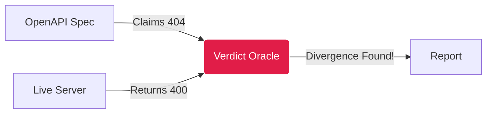

# Petstore Quickstart: Zero to Hero in 5 Minutes

Welcome to the **Cherenkov QA** Quickstart! We will walk you through a complete validation flow using the public Swagger Petstore API. No coding required, no AI accounts needed (it all runs locally), and no complex setup.

By the end of this guide, you will have verified a live API against its OpenAPI spec, found a divergence, and generated a standalone Playwright test suite.

---

## Step 1: Install Cherenkov

First, install the Cherenkov QA CLI tool.

=== "Using pip (Python)"
    ```bash
    pip install cherenkov-qa
    ```

=== "Using Docker"
    ```bash
    docker pull cherenkov/qa-engine:latest
    ```

> [!TIP]
> Ensure you have [Node.js](https://nodejs.org) (v18+) installed if you want to run the ejected Playwright tests later.

---

## Step 2: Run Your First Verification

The fastest way to see Cherenkov in action is the **Zero-Config Verify** command. It automatically fetches the OpenAPI spec, probes the live server, and finds where the server breaks its own contract.

```bash
cherenkov verify --url https://petstore3.swagger.io/api/v3
```

**What just happened?**
1. 📥 Cherenkov downloaded the OpenAPI spec from the server.
2. 🧠 The **Reasoning Engine** planned happy-path and edge-case scenarios.
3. 🔬 The **Witness Agent** fired real HTTP requests to the Petstore API.
4. ⚖️ The **Verdict Oracle** compared the live responses against the spec.

### The Output (Spec vs. Reality)

You will see an output indicating any divergences. For example, the spec might say an endpoint returns a `404` for a missing pet, but the server actually returned a `400 Bad Request`.



---

## Step 3: Generate a Test Suite

Now let's generate a permanent, repeatable **Playwright** test suite that you can run in your CI/CD pipeline.

```bash
cherenkov generate --spec https://petstore3.swagger.io/api/v3/openapi.json --output-dir my-tests
```

This command generates fully-typed TypeScript tests using `@playwright/test`. 

> [!NOTE]
> **No Magic Lock-In**: The generated tests do not depend on Cherenkov. They are vanilla Playwright tests that use the `openapi-fetch` client. 

---

## Step 4: Eject and Own Your Tests

Cherenkov firmly believes in the **Eject Freedom** principle. To prove there is no vendor lock-in, let's eject the suite into a standalone Node project.

```bash
cherenkov eject --tests-dir my-tests --output standalone-suite
```

Now, step into the directory and run the tests exactly like any normal Node project:

```bash
cd standalone-suite
npm install
npx playwright test
```

🎉 **Congratulations!** You just audited a third-party API, found a divergence, and generated a standalone integration test suite in under 5 minutes.

---

## Next Steps

Ready to take Cherenkov to the next level?

- **[Integrate with CI/CD](guides/github-actions-setup.md)**: Add Cherenkov to your GitHub Actions.
- **[Explore the Dashboard](guides/dashboard.md)**: Visualise the Truth Model and HITL (Human-in-the-Loop) review queues.
- **[View the Architecture](ARCHITECTURE_MAP.md)**: Dive deep into how the Clean Architecture and Spec Guardian work.
