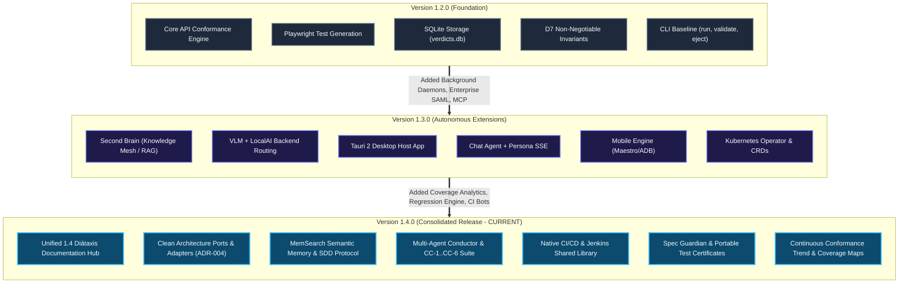

# Release Notes: CHERENKOV-QA v1.4.0

**Date:** 2026-08-05
**Tag:** `v1.4.0`

## Version Evolution (v1.2 → v1.3 → v1.4)

*Figure: Architectural evolution across CHERENKOV-QA minor versions.*

## What's New Since v1.3.0

### Features

- **Coverage map** (Phase 14): `build_coverage_map()` in
  `cherenkov/web/coverage_map.py` computes per-endpoint conformance coverage from the
  in-process `divergences` corpus. Registered as
  `GET /api/v1/coverage/map`, returning endpoint tuples
  `(method, path, status, last_run_id, last_verdict)`.
- **Continuous conformance trend** (Phase 14): `conformance_trend()` and
  `conformance_summary()` stream verdict/divergence/coverage time-series from RunStore
  records. Registered as `GET /api/v1/coverage/conformance-trend` and
  `GET /api/v1/coverage/conformance-summary` (#767).
- **Regression detection** (Phase 14): `detect_regressions()` compares consecutive
  runs *per target_url*, flagging `verdict_downgrade` (PASS→FAIL), `coverage_regression`
  (pct drop), and `divergence_spike` (climb). Registered as
  `GET /api/v1/coverage/regressions` (#771).
- **PR-comment integration** (Phase 14): `format_coverage_comment()` + GitHub client
  post a coverage-diff comment on `opened`/`synchronize`/`reopened`/`ready_for_review`
  events. Best-effort background task; never 5xxes the webhook (#766).

### Design Notes

- **Spec-derived (D7):** verdict ranks are read from
  `cherenkov/verdict/models.py` (`OverallVerdict`: CERTIFIED/DIVERGENT/
  SUSPECT/INCONCLUSIVE), not hardcoded. Records sourced from RunStore
  (`persistence/run_store.py`); coverage map from the `divergences` corpus.
- **Eject-safe:** coverage/conformance routes read only the public `divergences` and
  `RunStore` ports — `eject` strips CHERENKOV imports without breaking the contract.
- **Suggest-only healing:** regression results are reports/suggestions; no auto-commit
  or auto-apply (D7 invariant maintained).

### Certification

- **Conformance gate green at push:** commit `4c5b4f2e` —
  `Automated Golden Path Validation Gate` ✅ and `CHERENKOV Conformance Tests` ✅ both
  `success`.
- **New unit tests:** 26 tests in `tests/unit/test_coverage_map.py` (including new
  `TestDetectRegressions` + `TestRegressionsRoute`), 26 passed in 2.66s.
- **Type check:** `mypy cherenkov/web/coverage_map.py cherenkov/web/routes/coverage_routes.py cherenkov/web/pr_comments.py cherenkov/web/routes/webhooks_github.py` clean (no errors).
- **Pre-existing failures NOT introduced by this release** (documented in
  `docs/evidence/baseline-recert-2026-08-04.md`): `supply-chain.yml` and `spec-drift.yml`
  continue to fail on `main` from `sqlite.py:235`, `airllm_client.py:87,97`, and
  `InferenceRouter` import errors — tracked separately, out of scope for Phase 14.

