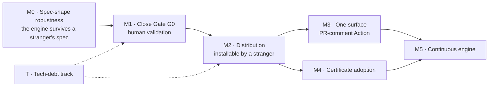

# CHERENKOV — Project Roadmap (2026 H2)

**Created:** 2026-07-29 · **Revised:** 2026-07-29 (after a spec-shape investigation, below)
**Status anchor:** [`HANDOVER.md`](../HANDOVER.md) (repo root) — this roadmap is derived from it, not the other way round.
**Supersedes for forward planning:** `docs/ROADMAP_NEXT.md`, `docs/ROADMAP_AQE.md` (still the reference for what each rung *means*).

> `docs/ROADMAP_RECONCILIATION.md` contains fabricated gate results. Gate status here comes from `HANDOVER.md` plus evidence files only.
> `docs/PRODUCT_STRATEGY_ROADMAP.md` is a **hypothesis register**, not a plan. Its revenue and star figures ($1.8M ARR, 20k stars) are unvalidated ambition. They must not be cited as milestones.

---

## 0. Where we actually are (2026-07-29)

| Track | State | Evidence |
|---|---|---|
| Gate **G0** | **3/4** — E0.1, E0.2, E0.4 done; **E0.3 open** | `docs/evidence/`, `demos/catch-the-ai-cheating/`, `NORTH_STAR.md` §8 |
| Rungs 1 / 2 / 3 | **15/15 code-complete** | Tool, Platform, Protocol all shipped |
| Test suites | **1746 passed, 1 skipped, 0 failed** | `tests/unit` + `tests/integration`, verified this session |
| Mypy gate | **FAILING — 7 errors in 3 files** | `cherenkov/ai/{openai,nemoclaw}_client.py`, `substrate/providers/localai.py` |
| Distribution | **Not shipped** — not on PyPI, not in MCP registries | `dist/cherenkov-1.0.0.whl` built, unpublished |
| External users | **Zero** | — |

**The honest read:** the ladder is built to the top rung, but nothing above Rung 1 has been validated by anyone outside this repo, and nothing is installable by a stranger.

---

## 1. What changed this revision — and why it reorders everything

The previous draft treated **E0.3 (recruit 3 practitioners)** as the single blocker, with recruitment latency as the only risk. That was wrong, and the reason matters more than the correction.

Before recruiting anyone, this session pointed the engine at a spec that was neither Petstore nor FastAPI-generated. It found a silent soundness failure:

> **OpenAPI 3.x lets a path parameter be declared once on the PathItem and inherited by every operation under it.** `probe_planner` read only `operation.parameters`. On the inherited form, `{id}` was unfillable, so the endpoint was dropped from probe planning entirely — and `verify` reported a **clean run on an endpoint it never probed**.

Reproduced with the same API written two legal ways: operation-level → 1 probe planned; PathItem-level → **0 probes, exit 0, "conformant."**

This is the same failure class as PR #720 (an unreachable target passing as clean), and it is the worst possible failure for an *integrity* product: the tool that catches other tools lying, quietly lying.

**Fixed this session** — `_effective_parameters()` in `cherenkov/divergence/probe_planner.py` merges PathItem parameters with operation-level precedence, routed through all three call sites. Four regression tests in `tests/unit/test_probe_planner.py`. Full suite green, mypy-clean on the changed file.

**The roadmap consequence:** E0.3 was never blocked on recruitment. It was blocked on a bug that only appears when someone brings their own spec — which is precisely what E0.3 asks three strangers to do. Had we recruited first, all three would have received a false "conformant" verdict, and we would have burned the pool learning it.

**Therefore: M0 exists, and it gates M1.**

---

## 2. The wedge decision

Investigated and settled this session, because sequencing depends on it.

`cherenkov check-suite` **requires a known-honest baseline** to diff against (`-b/--baseline`; only HALLUCINATED detection works from a spec alone). A stranger auditing their own repo does not have a baseline — that is the entire point of their situation. So check-suite cannot be the top-of-funnel wedge.

But a **baseline-free** oracle already exists, wired into the generate/repair path rather than exposed: `mutant_synth.synthesize_mutant_response()` derives a deliberately-wrong response from an operation's own documented success response, `BrokenImplServer` serves it, and any test that still passes is vacuous. Spec + tests, no baseline.

A working harness over these shipped parts was built and run this session against 20 generated tests. Result on the 4 gradeable Petstore tests: **0 vacuous, 4 meaningful** (the other 16 target other APIs). Small n — the number is not the finding. The finding is that **the baseline-free audit works end-to-end on shipped components**, and it is one command away from being a product.

**Decision:** the wedge is a baseline-free `audit` — *point it at tests you already have, no baseline, no adoption*. It creates the awareness that the rest of the ladder depends on. `generate` competes with Copilot for a job developers think they have solved; `audit` has no incumbent and zero switching cost.

**Now measured, and the measurement moved the plan** ([evidence](evidence/e0.5e_oracle_discrimination.md)):

- Baseline-free detection **works** — isolated single-axis mutants plus a conforming run catch all three cheat classes in the labelled corpus (weakened, deleted, hallucinated) with no false alarms on the honest suite.
- But the **single coarse mutant that ships today catches none of them.** It perturbs status *and* drops a field at once, so failure can't be attributed and a weakened suite scores as meaningful.
- **And "baseline-free" does not mean "spec-only."** A spec constrains types, not instance values; mutating a schema-sampled body makes the honest suite fail its own control. The audit must **record** the target's real responses during a green run, then perturb those. No honest *baseline suite* is needed — only a live target, which `verify` already requires.
- So the earlier claim that this was "one command away from being a product" was wrong twice over. The battery now ships; the record step does not. E0.5f part 2.

Corpus is one API and three fixtures. Directionally strong; not yet a benchmark, and not yet a claim to make publicly.

---

## 3. Milestone map

---

## M0 — Spec-shape robustness · **NEW, gates M1**

**Window:** 2026-07-29 → 2026-08-12 · **Owner:** engineering · **Why:** a false-clean verdict in front of a recruited practitioner is unrecoverable.

The engine has only ever been proven against Petstore and FastAPI-generated specs. Both declare parameters at the operation level. Real-world specs do not.

- [x] **E0.5a** — PathItem-level parameters merged into probe planning; 4 regression tests — `90d8829`
- [x] **E0.5b** — the same inheritance applied at the ingestion slicing point, so the meaningful-assertion gate (and `truth/sources/openapi.py`) actually receive it; verified end to end — `7780c1d`
- [x] **E0.5c** — skip message split: `explain_unmutatable()` names the real cause instead of always blaming a missing 200 — `7780c1d`
- [x] **E0.5e** — oracle discrimination measured. **Result changes the plan** → [`docs/evidence/e0.5e_oracle_discrimination.md`](evidence/e0.5e_oracle_discrimination.md)
- [x] **E0.5f (part 1)** — mutation battery shipped: `synthesize_mutant_battery()` emits one mutant per axis (status, value, enum, missing) plus a conforming control. Validated with shipped code against the labelled corpus: **3/3 cheat classes, 0 false alarms.** `enum` is the strongest single mutant; `missing` gives no signal. 9 unit tests.
- [x] **E0.5f (part 2)** — record step shipped: `RecordingProxy` forwards a suite's traffic to the live target and captures each response, feeding `recorded_base()` straight into the battery. Full **record → perturb → replay** loop demonstrated end to end against a live server with **no hand-supplied values**: 3/3 cheat classes, 0 false alarms. Hallucination is caught by the green run itself, before any mutation. 10 unit tests.
- [ ] **E0.5h — productize the audit.** The mechanism is proven; there is no `cherenkov audit` command. Four gaps stand between the harness and a product: (a) a CLI surface; (b) correlating each test with the response it depends on across many parameterised paths — the demo has one endpoint; (c) sequence-aware replay for state-mutating suites, since `recorded_base()` returns a flat most-recent-per-path map; (d) cost — N mutants means N replays per test, affordable for an audit command, too slow per repair-loop candidate. **Decide (d) before building (a).**
- [x] **E0.5g** — zero-probe endpoints are now reported, never silently skipped. `unprobed_endpoints()` names every operation planning declines, with the real cause; `verify` prints them before running. **On `petstore.json` this is 7 of 19 operations** — coverage was never 19/19, it was 12/19 and silent about the rest. Most causes are deliberate limits (happy-path probes are GET-only to avoid mutating state; skipped on templated paths because a sampled identifier need not exist; skipped when query parameters are required), and `max_probes` truncation is reported too. 8 tests including the accounting invariant. Inferring sample values remains the rejected alternative — it manufactures spurious divergences.
- [ ] **E0.5i — raise real coverage, now that the gap is visible.** Reporting the 7/19 does not close it. Each guard has a route through it: templated GETs need a known-good identifier (record one during a green run — `RecordingProxy` already captures them); non-GET operations need a safe-mutation strategy or an explicit opt-in; required-query-param GETs can use `example`/`default`/`enum` values from the spec when present. Sequence by how much coverage each unlocks against the E0.5d corpus, not by ease.
- [ ] **E0.5d** — **spec-shape conformance corpus.** Run `verify` against ≥10 real third-party OpenAPI specs (Stripe, GitHub, Twilio, Kubernetes, plus hand-written ones). Record per spec: probes planned, endpoints dropped, crashes.

**Exit criterion:** zero *silent* endpoint drops across the corpus, and a mutation battery that separates weakened from honest on the labelled corpus.

**This is also the cheapest marketing asset in the plan.** E0.5d produces "we ran the engine against 10 major public APIs and here is what we found" — an artifact that recruits *for* M1 instead of cold-asking strangers for a favour.

---

## M1 — Close Gate G0 · human validation

**Window:** 2026-08-12 → 2026-08-26 · **Owner:** human · **Depends on:** M0

**Redesigned exit criterion.** "3 practitioners complete the quickstart" is a usability test: it measures whether the docs work, and can be passed by three people who finish, say "neat," and never return. The risk here is not ability, it is motivation.

- [ ] ≥3 practitioners from outside this repo (Egypt ESTB / ISTQB CT-GenAI — `docs/reviews/STRATEGY_REVIEW_2026-07-05.md` §8.4)
- [ ] Each completes `docs/onboarding/sessions/session_a_zero_to_hero.md` cold, unaided, timed
- [ ] **≥1 runs it again on their own API within 7 days, unprompted** ← the real signal
- [ ] Friction log filed as issues — *this is the deliverable, not the pass/fail*
- [ ] `HANDOVER.md` G0 table flipped to 4/4 with evidence path

**If it fails:** fix the top 3 blockers, re-run with 3 fresh practitioners. Do not proceed to M3 on a failed gate.

---

## M2 — Distribution · installable by a stranger

**Window:** 2026-08-26 → 2026-09-09 · **Depends on:** M1

- [ ] **PyPI** — `twine upload dist/*`. Check name availability on day 1, not at upload. README badge restored *only after* the package is live (R0 was spent removing a badge for an install that did not exist — do not regress that)
- [ ] **Tag hygiene first** — `git tag` already shows `v1.2.0` and `v3.1-delta` while `pyproject.toml` says `1.1.1`, plus a malformed `v.1.1.1`. Reconcile before anything is published; a release tagged from this state is unreproducible
- [ ] **MCP registries** — per `docs/README-MCP-PUBLISH.md`; `cherenkov mcp install` verified from a clean machine
- [ ] **Write-up** — `docs/marketing/CATCH_THE_AI_CHEATING_WRITEUP.md` published
- [ ] Clean-VM test: fresh container → install → `verify` against a live target → correct exit code

**#726 and #730 landed upstream on 2026-07-30** — the coverage-score and false-Ollama-detection fixes, and the Docker/CI alignment that also untracked `build/cherenkov-launcher/*` and added `.github/workflows/surface-freeze-gate.yml`. The freeze is now CI-enforced rather than convention, which strengthens M3. Only #731 remains for the `1.1.2` patch line; keep it out of the minor bump so the changelog stays honest.

---

## M3 — Lift the surface freeze · one surface

**Window:** 2026-09-09 → 2026-10-07 · **Depends on:** M1 + M2

The freeze stays for four of five surfaces. **Recommended surface: the GitHub Action that comments conformance findings on a PR.**

Rationale: the previous draft picked by "where practitioners got stuck," treating this as a friction question. It is a distribution question. Test-quality decisions get made in code review, and a PR comment is the only surface with a built-in loop — every comment is seen by the whole team. Desktop and VS Code are single-player.

- [ ] Surface installs from a published artifact, not a local build
- [ ] Golden path E2E-tested in CI, on the same footing as the 260-test `qa/` suite
- [ ] Tauri updater signing key generated **if** desktop is chosen instead (`pubkey` is empty)
- [ ] Freeze on the other four re-affirmed in `HANDOVER.md`

---

## M4 — Certificate adoption · authority beyond our own repo

**Window:** 2026-09-23 → 2026-10-28 (parallel to M3) · **Depends on:** M2

- [ ] ≥3 external repositories run `cherenkov certify` in CI and display the badge
- [ ] `.github/workflows/certify-gate.yml` promoted from `workflow_dispatch`-only to a real gate
- [ ] ≥1 external issue filed against `docs/specs/CHERENKOV_CERTIFICATE.md` and resolved
- [ ] Compliance mapping reviewed by someone with actual audit experience

**Risk:** a distribution milestone wearing an engineering hat. If M2 slips, this slips — do not start it early to feel productive.

---

## M5 — Continuous engine · Rung 2 depth

**Window:** 2026-10-28 → 2026-12-09 · **Depends on:** M3 + M4

Scope re-derived from M1/M3 friction logs before committing. Candidates:

- [ ] HITL queue as a first-class surface — severity triage and audit trail already exist
- [ ] Daemon observability: what it probed, what it **skipped**, what it cost
- [ ] Coverage and health-score trend over time (both are per-run today)

**Retention note:** an audit is a one-shot diagnostic — once you know, you know. If `audit` becomes the wedge, the daemon is what converts a one-time shock into a standing habit, and M5 may need to move earlier.

**Deferred by decision, not neglect:** mobile execution, VLM expansion, everything in `docs/DEFERRED_VISION_ARCHIVE.md`.

---

## T — Tech-debt track (continuous, never blocks a milestone)

| ID | Item | Notes |
|---|---|---|
| **T1** | Retire root `cherenkov.py` | Migration, not a delete. 8 load-bearing consumers (`ci.yml:612-626`, `Dockerfile.mcp`, `bin/cherenkov-npm.js:42`, `setup_oi.sh`, `qwen-code-integration.sh`, `package.json`, `ci_docs_check.py`, `check_cli_docs.py`). A premature delete (`0f16fed`) broke CI and Docker; restored in #675 |
| **T2** | Record onboarding assets | Do this **during** M1's recruitment wait |
| **T3** | **Mypy gate is failing on main** | 7 errors in `ai/openai_client.py`, `ai/nemoclaw_client.py`, `substrate/providers/localai.py`. `HANDOVER.md`'s "runs clean on 530 files" is stale and should be corrected |
| **T4** | Working-tree hygiene | Shared tree, concurrent agents. Stage specific files; never `git add -A` |
| **T5** | Untracked-file triage | `playwright-suite/`, `bench/escaped_defect/`, `svgs_dump.json`, `cherenkov-security-landing.png` — decide keep-vs-gitignore before M2 tags a release |
| **T6** | Git remote carries a plaintext PAT | `.git/config` embeds a `github_pat_…` token in the origin URL, in a tree shared across agent sessions. Rotate and re-add the remote without credentials |
| **T7** | Dual AI routing (`ai/` + `substrate/`) | Two provider layers coexist; all 7 mypy failures live here. Consolidation is real debt — but it is debt, not a milestone |

---

## What we are deliberately NOT doing in H2

- **No new surfaces.** The freeze lifts for one at M3, not five.
- **No new rungs.** Rung 4+ ideas stay archived until M4 proves external adoption of Rung 3.
- **No roadmap docs.** This file plus `HANDOVER.md` are the forward plan. `ROADMAP_NEXT`, `ROADMAP_AQE`, `MASTER_ROADMAP_2026-06-19`, `PRODUCT_STRATEGY_ROADMAP`, `PHASE_PLAN` are history and reference. Do not add a seventh.
- **No claims we can't demo.** Every badge, README line and deck slide must map to a command a stranger can run.
- **No revenue figures in planning.** They belong in the hypothesis register until someone pays.

---

## Cadence & review

- **Weekly:** update `HANDOVER.md`. This file changes only when a milestone opens, closes, or is re-scoped.
- **Per milestone close:** flip the checkboxes, add the evidence path, and record the *friction* found — not just the pass.
- **Anchor rule:** if this roadmap and `HANDOVER.md` disagree, `HANDOVER.md` wins and this file is stale.
