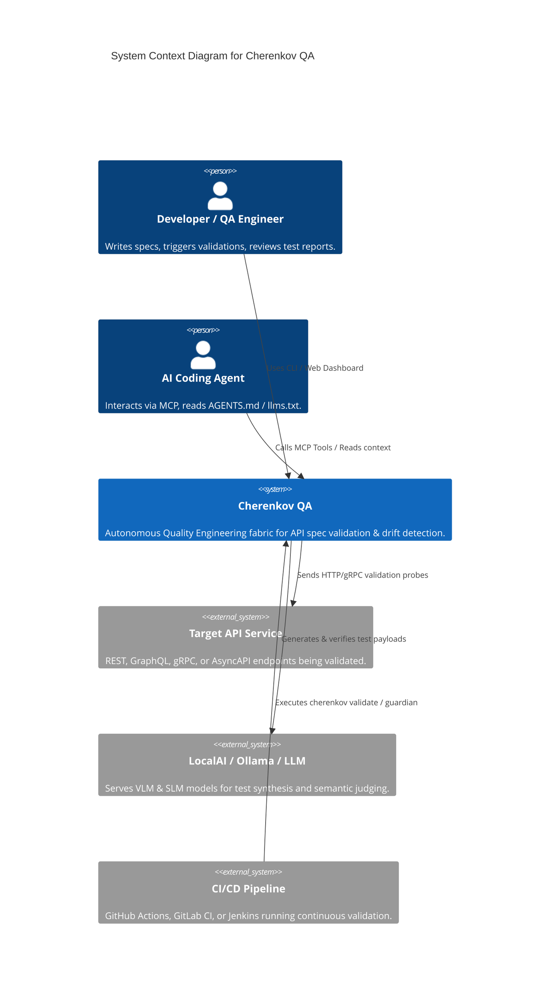
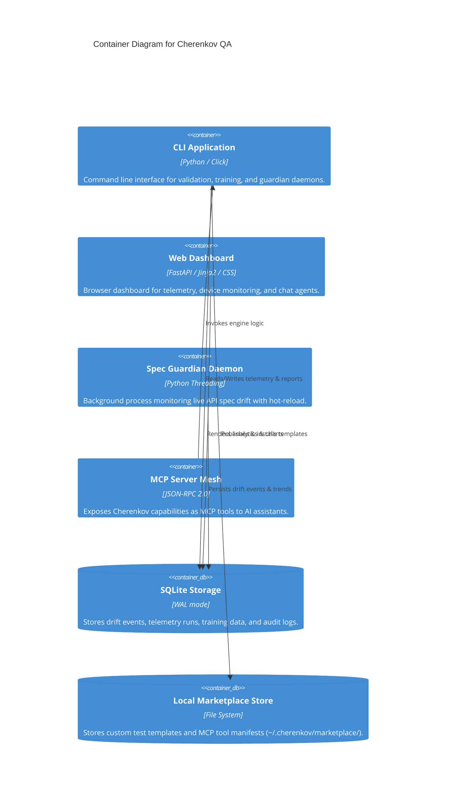
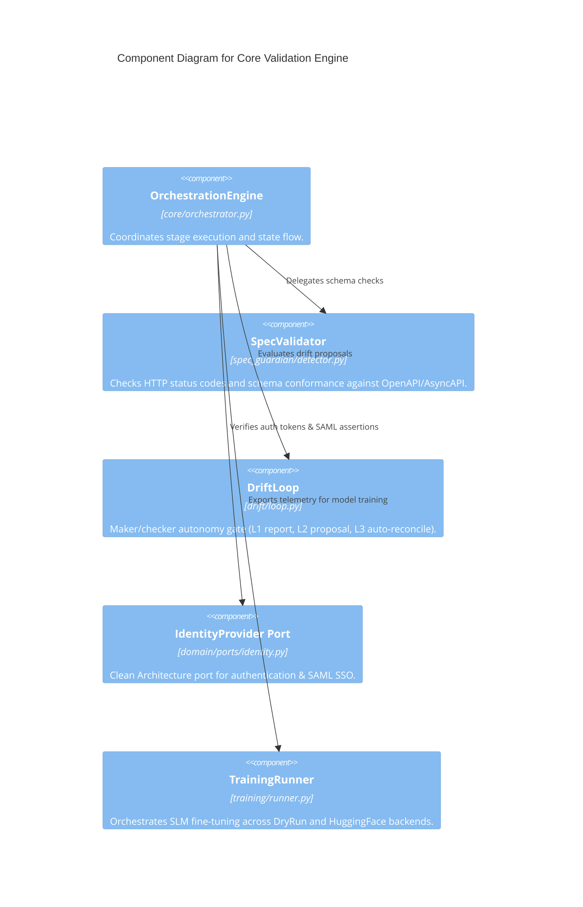

# CHERENKOV QA — C4 Architecture Diagrams (Diagrams-as-Code)

This document provides visual models of the **Cherenkov QA** architecture using the **C4 Model** (Context, Container, Component) rendered natively via Mermaid.js syntax.

---

## Level 1: System Context Diagram

The System Context diagram shows Cherenkov QA in relation to external users, target APIs, AI models, and CI/CD pipelines.

---

## Level 2: Container Diagram

The Container diagram breaks down Cherenkov QA into its high-level runnable units and storage components.

---

## Level 3: Component Diagram (Core Validation Engine)

The Component diagram shows the internal structure of the core validation engine.

