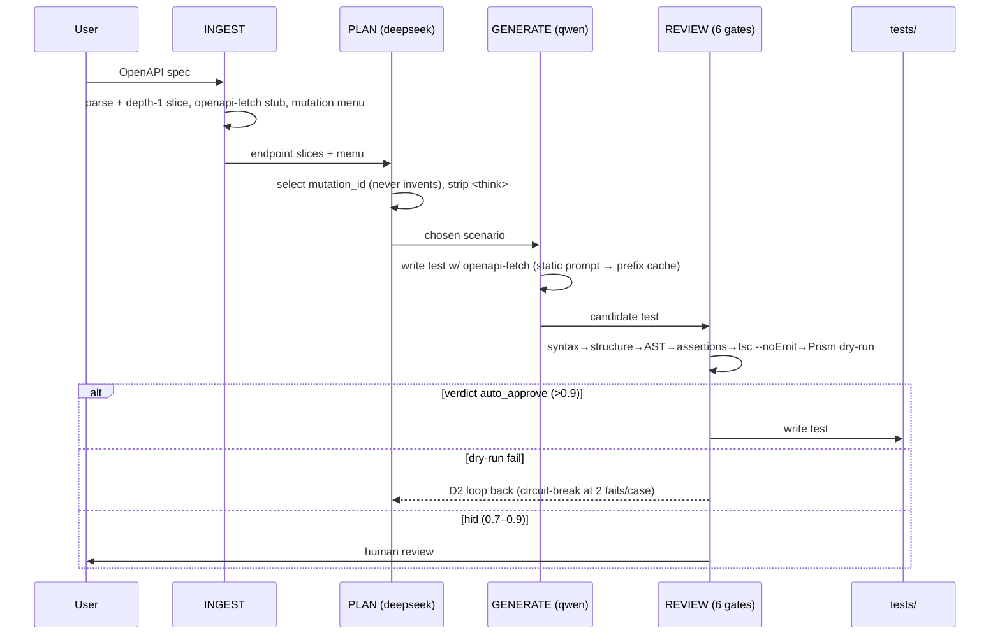
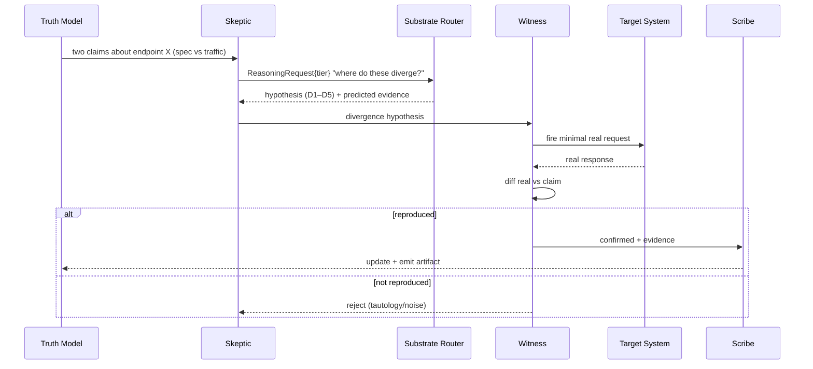
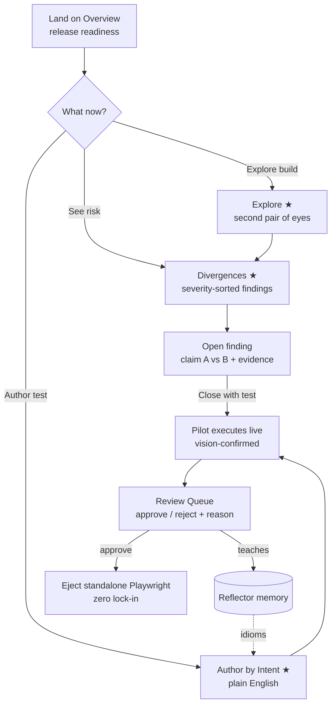
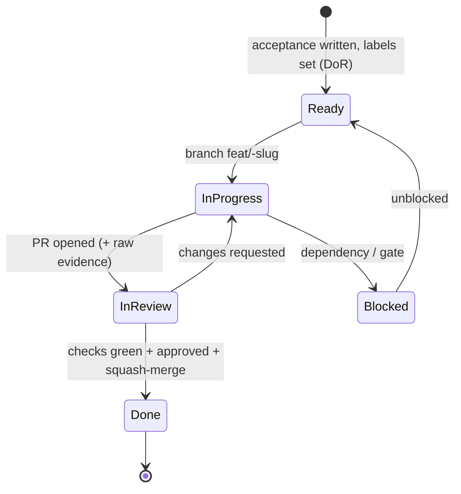
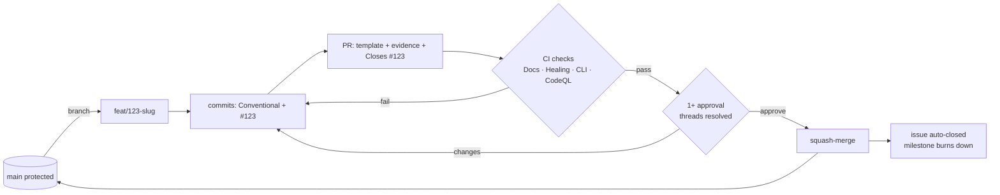
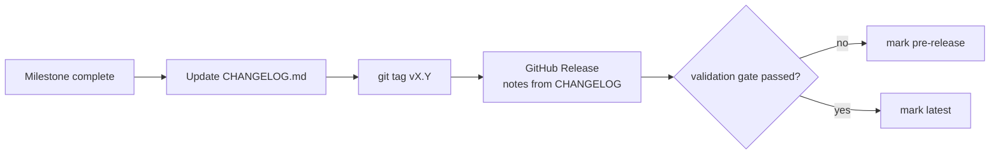

# CHERENKOV — Diagrams (Mermaid, render on GitHub)

System, sequence, flow, and lifecycle diagrams. Companion to [`docs/vision/01_ARCHITECTURE.md`](../vision/01_ARCHITECTURE.md) and [`docs/process/GITHUB_PM.md`](../process/GITHUB_PM.md).

---

## 1. System context


## 2. Track A pipeline (sequence) — spec in, tests out



## 3. Divergence loop (sequence) — THE BET



## 4. Reflector learning loop (sequence) — Epoch 7 (proposed)

```mermaid
sequenceDiagram
  participant W as Witness/Healing
  participant H as Human (Verdict)
  participant R as Reflector
  participant DB as verdicts.db
  participant K as Skeptic
  participant Sc as Scribe
  W->>R: ReproductionResult / FailureClass
  H->>R: accept | reject | refine (+reason)
  R->>DB: persist VerdictRecord / Idiom
  R->>K: reweight hypothesis ranking (rejected stop recurring)
  R->>Sc: idiom updates (what to emit / check)
  Note over R,DB: Exit = behavioral: rejected findings don't return; hit-rate ↑
```

## 5. FE user journey (flowchart) — manual-QA first



## 6. Application lifecycle — issue/ticket state machine



## 7. Git / PR flow



## 8. Release flow


