# CHERENKOV — Diagrams (Mermaid, render on GitHub)

System, sequence, flow, and lifecycle diagrams. Companion to [`docs/vision/01_ARCHITECTURE.md`](../vision/01_ARCHITECTURE.md) and [`docs/process/GITHUB_PM.md`](../process/GITHUB_PM.md).

---

## 1. System context

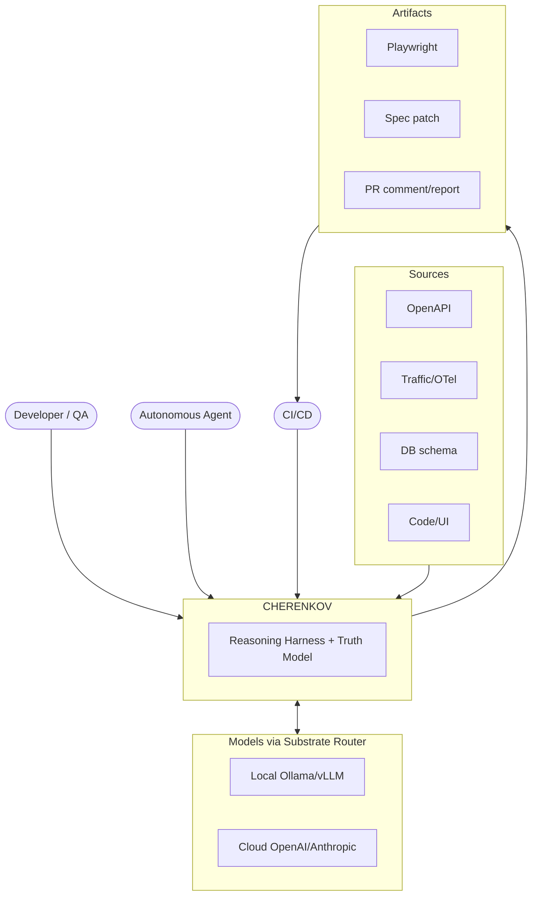

## 2. Track A pipeline (sequence) — spec in, tests out

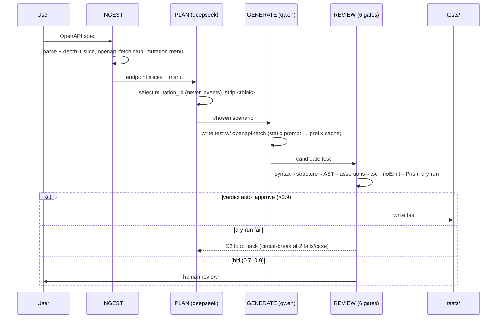

## 3. Divergence loop (sequence) — THE BET

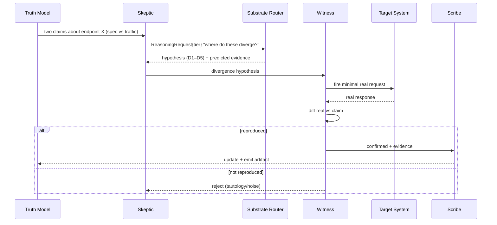

## 4. Reflector learning loop (sequence) — Epoch 7 (proposed)

```mermaid
sequenceDiagram
  participant W as Witness/Healing
  participant H as Human (Verdict)
  participant R as Reflector
  participant DB as verdicts.db
  participant K as Skeptic
  participant Sc as Scribe
  W->>R: ReproductionResult / FailureClass
  H->>R: accept | reject | refine (+reason)
  R->>DB: persist VerdictRecord / Idiom
  R->>K: reweight hypothesis ranking (rejected stop recurring)
  R->>Sc: idiom updates (what to emit / check)
  Note over R,DB: Exit = behavioral: rejected findings don't return; hit-rate ↑
```

## 5. FE user journey (flowchart) — manual-QA first

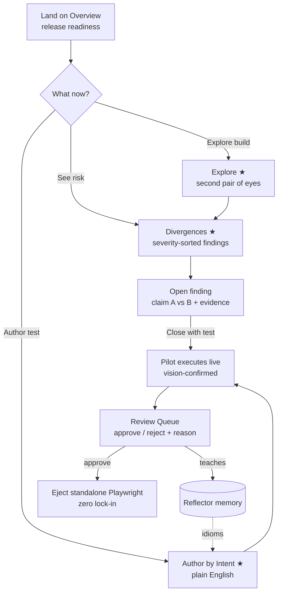

## 6. Application lifecycle — issue/ticket state machine

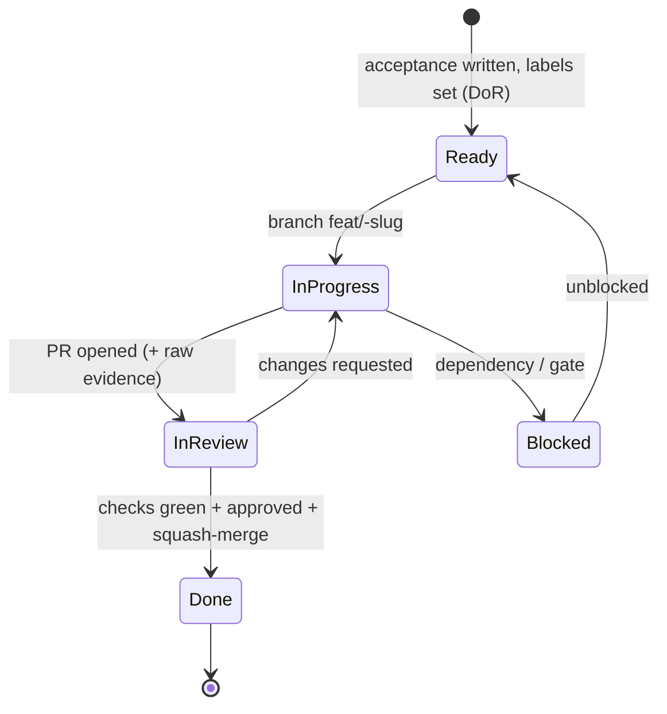

## 7. Git / PR flow

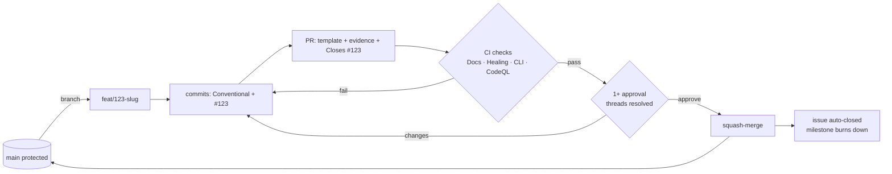

## 8. Release flow

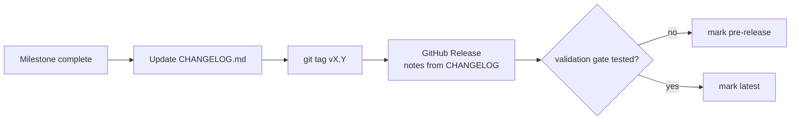

---

## 9. Second Brain Architecture (Phase 1)

```mermaid
flowchart TB
  subgraph KB[KnowledgeRepository Protocol]
    Q[query]
    S[store]
    SR[search]
    G[get_by_id]
  end

  subgraph Stores[Separate Stores]
    V[verdicts.db]
    H[hitl.db]
    F[feedback.json]
    AM[agent_memory/]
    I[incidents/]
    ID[idioms/]
  end

  subgraph Adapters[Adapters]
    SQL[SQLiteKnowledgeRepository]
    RED[RedisKnowledgeRepository]
  end

  subgraph Bridges[Event Bridges]
    HB[HITL → Reflector]
    FB[Feedback → RAG]
    AB[agent_memory → RAG]
  end

  KB --> Adapters
  Adapters --> Stores
  Bridges --> KB

  CLI[cherenkov knowledge query] --> KB
  API[/api/v1/knowledge/query] --> KB
  Chat[Chat Agent] --> KB
```

## 10. Event Bus Flow (Phase 0b)

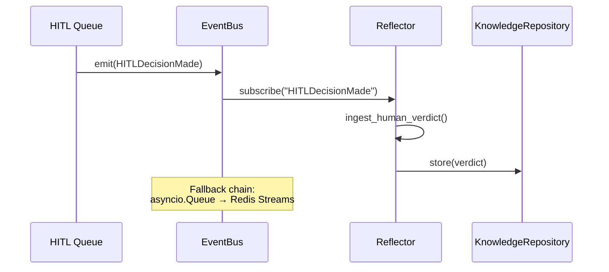

## 11. Clean Architecture Module (Phase 0b)

```mermaid
flowchart TB
  subgraph Domain[domain/]
    M[models.py<br/>Pydantic models, enums]
  end

  subgraph Ports[ports/]
    P1[repository.py<br/>Protocol interfaces]
    P2[event_bus.py]
  end

  subgraph Adapters[adapters/]
    A1[sqlite_{module}.py<br/>Default adapter]
    A2[redis_{module}.py<br/>Upgrade adapter]
  end

  subgraph UseCases[use_cases/]
    UC[{action}.py<br/>Orchestration]
  end

  subgraph API[api/]
    API1[routes.py<br/>FastAPI routes]
  end

  Domain --> Ports
  Ports --> Adapters
  Adapters --> UseCases
  UseCases --> API

  Note over Domain,API: Dependency rule:<br/>Arrows point inward<br/>Outer layers depend on inner layers
```

## 12. Desktop Host IPC (Phase 3)

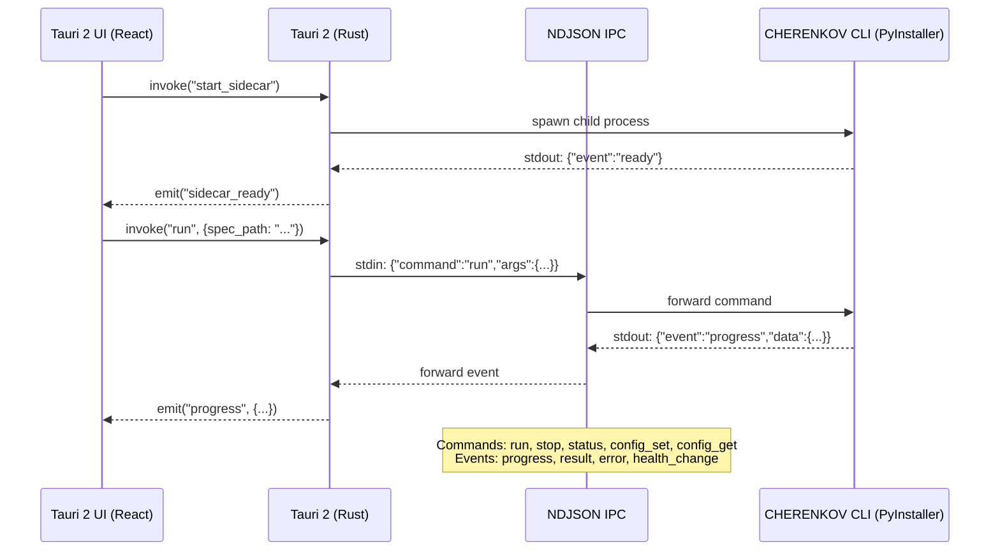

## 13. Chat Agent Flow (Phase 4)

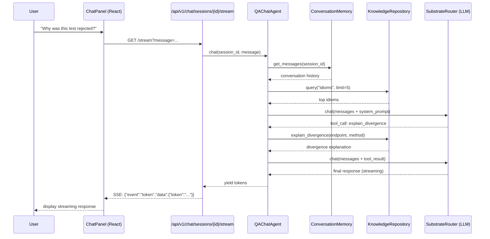

## 14. Mobile Testing Tiers (Phase 5-6)

```mermaid
flowchart TB
  subgraph Tier1[Tier 1: Browser Emulation]
    B1[Chromium]
    B2[Firefox]
    B3[WebKit]
  end

  subgraph Tier2[Tier 2: Android Emulator]
    A1[Android Studio AVD]
    A2[Genymotion]
  end

  subgraph Tier3[Tier 3: iOS Simulator]
    I1[Xcode Simulator]
  end

  subgraph Tier4[Tier 4: Physical Device]
    P1[Android (ADB)]
    P2[iOS (libimobiledevice)]
  end

  subgraph Execution[Execution]
    M[Maestro YAML]
    AP[Appium Python]
  end

  Tier1 --> Execution
  Tier2 --> Execution
  Tier3 --> Execution
  Tier4 --> Execution

  Note over Tier1,Tier4: Device selection based on DeviceClass:<br/>GPU_WORKSTATION → Tier 2<br/>CPU_HIGH_END → Tier 3<br/>CPU_STANDARD → Tier 1
```

## 15. Updated System Context (Consolidated Plan)

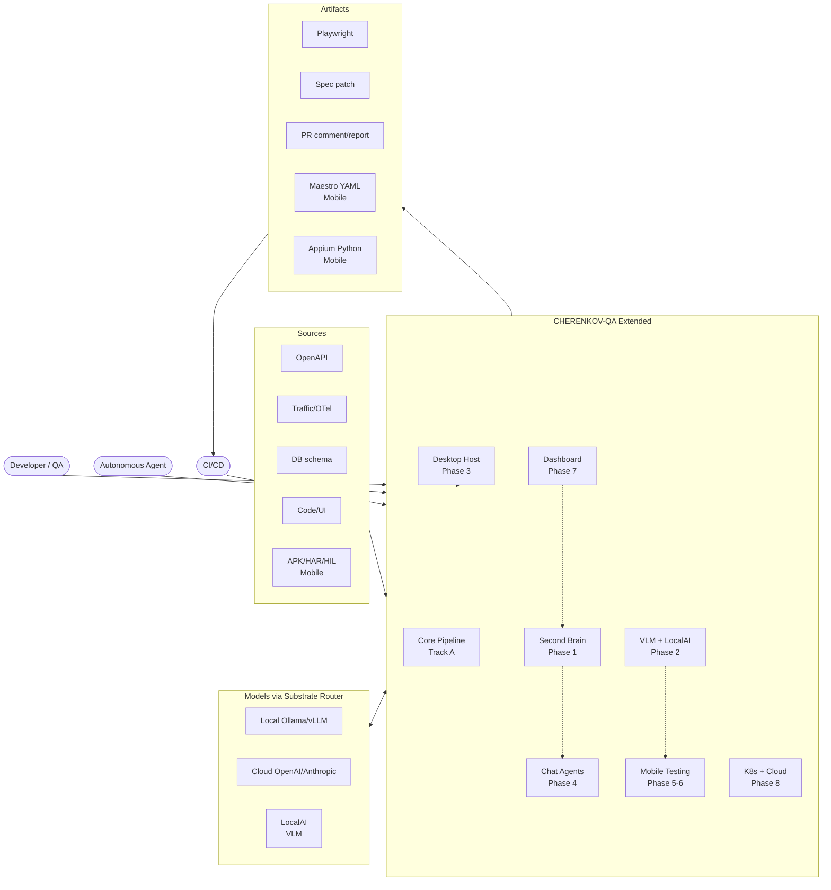
