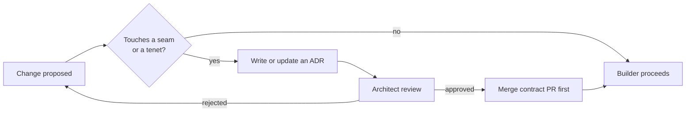

# Architecture Principles

The tenets every design and PR is judged against. They are **non-negotiable defaults**; violating one requires an [ADR](../adr/) that argues the exception.

---

## The thirteen tenets

1. **The model is a dependency, not the product.** No agent code names a model. All intelligence flows through the Substrate Router as a `ReasoningRequest`. (Enforced by CI — see [WAYS_OF_WORKING](WAYS_OF_WORKING.md).)

2. **Contracts first.** Every stage/seam boundary is a versioned Pydantic model in `core/contracts.py` with `data / status / errors / metadata(schema_version)`. Build the contract and its round-trip test *before* the implementation.

3. **Open at the four seams.** Sources, Models, Artifacts, Oracles are plugin SPIs. New capability = new plugin, never a fork of the core.

4. **Deterministic core, probabilistic edges.** AI proposes; deterministic harnesses dispose. Anything that decides pass/fail (the Witness, gates, RCA confirmation) must be reproducible without a model in the loop.

5. **Provenance everywhere.** Every claim, test, and finding records where it came from (source, commit, prompt version). No anonymous facts.

6. **No hidden egress.** Network calls obey the `egress` policy (`none|internal|any`). Forbidden calls fail loud, never silently degrade. Default never sends code off-box.

7. **Easy by default, configurable on top.** Every new behaviour ships with a sane default and a config key. Zero-config must stay useful. (See [03_CONFIGURATION](../vision/03_CONFIGURATION.md).)

8. **Evidence over assertion.** A finding without a reproduction is a hypothesis, not a result. Anti-reward-hacking (adversarial self-play, independent re-execution) is structural, not optional.

9. **Eject-able, vendor-neutral output.** Emitted artifacts run with their native tool (`npx playwright test`) with zero CHERENKOV dependency. We add value, we don't lock in.

10. **Small, reversible steps.** Keep the old path green while introducing a seam; migrate behind it. Prefer many verifiable PRs over one big bang.

11. **Graceful degradation.** Never crash on infrastructure failure, always degrade. Every external dependency has a fallback chain (LocalAI → Ollama → Demo, Redis → SQLite, VLM → pixel_diff_only). The system works in L0 mode (bare CLI, no Docker, no Redis, no LLM) on any laptop. (See [../ERROR_HANDLING.md](../ERROR_HANDLING.md).)

12. **Open for extension, closed for modification.** New testing types (accessibility, security, performance, GraphQL, gRPC) plug in via Source Adapter SPI without core modifications. Each new source type implements `SourceAdapter` protocol, adds corresponding stages and oracles. No changes to `core/` required. (See [../PHASE_PLAN.md](../PHASE_PLAN.md) §Extension Points.)

13. **Knowledge mesh, not monolith.** Each data store (verdicts, idioms, incidents, HITL, feedback, agent_memory) keeps its schema. `KnowledgeRepository` provides a unified query interface. All queries return `KnowledgeResult` envelope. Anti-lock-in: each store is independently useful (can eject any one). (See [../adr/ADR-006-knowledge-mesh.md](../adr/ADR-006-knowledge-mesh.md).)

---

## The Architect's way of work

There is a standing **Architect role** (human or designated agent) whose job is *coherence*, not throughput:

- **The Architect owns the contracts and the SPIs**, not the features. Feature work is delegated; boundary changes are gated.
- **ADRs are the memory.** Every decision that changes a tenet, a contract, or a seam is recorded in [`../adr/`](../adr/) so future agents inherit the *why*, not just the *what*.
- **The Architect does not block velocity inside a seam** — only at seam boundaries. Builders move freely within their module.

---

## Fitness functions (automated principle checks)

Principles that aren't enforced rot. These run in CI:

| Principle | Automated check |
|---|---|
| Model-agnostic (#1) | grep/AST check: no model names in `cherenkov/` outside `substrate/providers/` |
| Contracts first (#2) | every boundary type has a `model_validate_json` round-trip test |
| No hidden egress (#6) | network calls only via the router; `egress=none` integration test |
| Eject-able (#9) | ejected sample runs with zero CHERENKOV imports |
| Provenance (#5) | claims/findings schema requires a non-empty `source` field |
| Graceful degradation (#11) | remove LocalAI container → system falls back to Ollama, not crash |
| Open for extension (#12) | new `SourceAdapter` implementation works without `core/` changes |
| Knowledge mesh (#13) | `KnowledgeRepository` contract test passes for both SQLite and Redis adapters |

A PR that fails a fitness function is rejected the same as a failing unit test.
