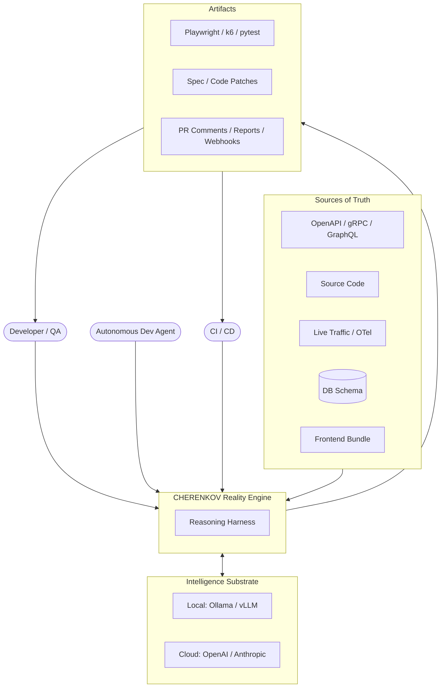
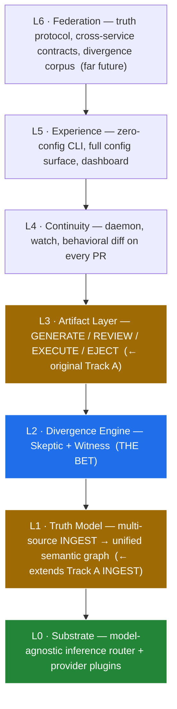
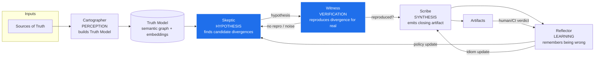
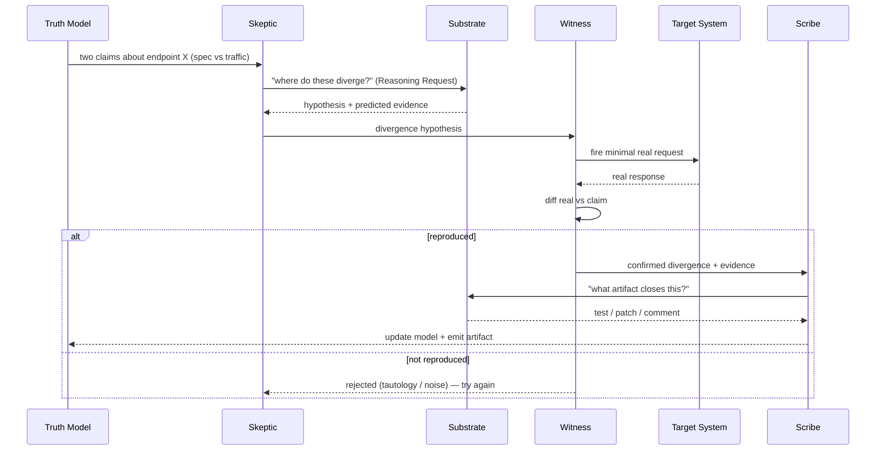
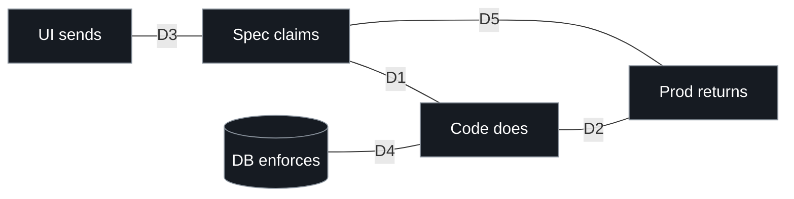
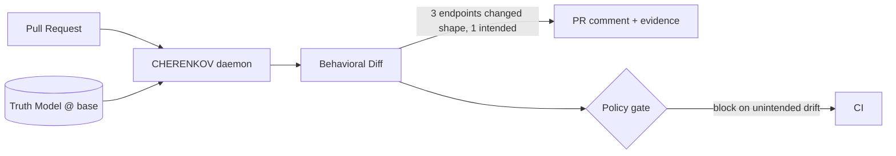
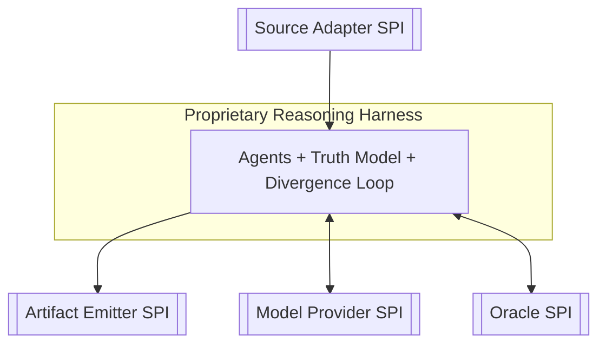

# CHERENKOV — Architecture

Companion to [`00_VISION.md`](00_VISION.md). All diagrams are Mermaid (render natively on GitHub).

---

## 1. System context (C4 level 1)

Who/what CHERENKOV talks to.



---

## 2. The layer map (and where the old plan lives)

Seven layers. The original 22-week generator becomes **L1 + L3** — real, needed, but no longer the whole product.



> 🟦 the bet · 🟩 new foundation · 🟧 inherited from the original plan.

---

## 3. The four agents + the metabolism

CHERENKOV is *made of* reasoning, not augmented by it. Four cooperating agents (a fifth optional), none clever alone.



| Agent | Role | Intelligence need | Cadence |
|---|---|---|---|
| **Cartographer** | Normalize all sources into the Truth Model | Cheap / small | Continuous (on change) |
| **Skeptic** | Adversarially hypothesize divergences | Deep reasoning | On model update / traffic shift |
| **Witness** | Independently reproduce the divergence | Near-zero (deterministic harness) | Per hypothesis |
| **Scribe** | Choose + write the artifact that closes the loop | Mid / code-tuned | Per confirmed divergence |
| **Reflector** | Learn from rejected/accepted findings | Mid | Per verdict (async) |

---

## 4. The Substrate Router (L0) — the keystone

Treats intelligence as a market: right brain for the right job, decided per call, bounded by org policy.

```mermaid
flowchart TB
  Caller[Agent emits a Reasoning Request\n(task, schema, budget, sensitivity)]
  Router{Substrate Router}

  subgraph Policy
    Egress["egress: none | internal | any"]
    Budget["cost / latency / quality budgets"]
    Tier["capability tier required"]
  end

  subgraph Providers[Provider Plugins]
    P1[Ollama local]
    P2[vLLM self-host]
    P3[OpenAI]
    P4[Anthropic]
    P5[future model]
  end

  Cache[(Prefix / response cache)]

  Caller --> Router
  Policy --> Router
  Router --> Cache
  Router -->|route by tier+policy| P1 & P2 & P3 & P4 & P5
  P1 & P2 & P3 & P4 & P5 -->|validated structured output| Caller
  Router -.->|fallback / spillover on failure| Router
```

**Contract:** agents NEVER name a model. They emit a *Reasoning Request* — `{task, output_schema, capability_tier, max_cost, max_latency, sensitivity}` — and the router picks a provider that satisfies org policy. Swapping models = config, never code. A bank sets `egress: none`; a startup sets `egress: any`; same product.

---

## 5. The Divergence Loop in detail (L2 — the bet)



**Anti-reward-hacking (adversarial self-play option):** the Witness can run the candidate test against BOTH a correct mock (Prism) AND a deliberately-broken implementation. A test that passes both is tautological (`true==true`) and is killed. This directly attacks the existential failure mode of autonomous QA.

---

## 6. The five-way divergence space (what L2 detects)



| Divergence | Example | Why it matters |
|---|---|---|
| **D1 spec↔code** | spec says `format=email`, code accepts anything | spec lies; integrators break |
| **D2 code↔prod** | prod leaks `_internal_debug` 3% of the time | silent PII / contract drift |
| **D3 ui↔spec** | UI sends `"555-1234"`, API wants E.164 | integration drift |
| **D4 db↔code** | DB `UNIQUE(email)`, API never checks | race condition / 500s |
| **D5 spec↔prod** | endpoint in spec no longer exists | dead contract |

---

## 7. Continuity & behavioral diff (L4)



`git diff` shows *code* changes; CHERENKOV shows *behavior* changes. A behavioral diff on every PR — nobody ships this; everyone needs it.

---

## 8. Open-seam plugin interfaces (summary)



Each SPI is a small, versioned contract (Pydantic models, à la the existing `core/contracts.py`). New capability = new plugin, never a rewrite. See [`03_CONFIGURATION.md`](03_CONFIGURATION.md) for how plugins are selected and configured.
