# CHERENKOV — Roadmap

Companion to [`00_VISION.md`](00_VISION.md) / [`01_ARCHITECTURE.md`](01_ARCHITECTURE.md).
Each **Epoch** is a GitHub **milestone**. Each task below is (or becomes) a GitHub **issue** labelled `agent-ready`. See [`04_AGENT_WORKBOOK.md`](04_AGENT_WORKBOOK.md).

---

## Sequencing principle

> Ship the **foundation** (a working generator) → carve the **substrate seam** so the model is swappable → build the **truth model** → prove the **bet** (divergence loop) → make it **continuous** → make it **effortless + configurable** → **federate**.

Discipline guardrail (inherited from v3.1): never let the vision's size stop the next shippable slice. The bet (Epoch 3) is buildable in **weeks on any model** once L0/L1 exist.

```mermaid
gantt
  title CHERENKOV Epochs (relative, not calendar-locked)
  dateFormat X
  axisFormat E%s
  section Foundation
  E0 Reconcile foundation      :e0, 0, 1
  section Substrate
  E1 Substrate Router (L0)     :e1, 1, 2
  section Truth
  E2 Truth Model (L1)          :e2, 2, 2
  section The Bet
  E3 Divergence Engine (L2)    :crit, e3, 4, 3
  section Productize
  E4 Artifact + Continuity (L3/L4) :e4, 7, 2
  E5 Experience + Config (L5)  :e5, 9, 2
  section Frontier
  E6 Federation (L6)           :e6, 11, 3
```

---

## Epoch 0 — Reconcile the foundation
**Goal:** the existing Track A generator builds, runs, and is green on all 3 Week-0 specs; create room for the substrate seam without breaking it.

- [ ] E0-1 Audit current pipeline vs `TECHNICAL_DEVELOPMENT_PLAN.md`; record actual vs claimed state.
- [ ] E0-2 Stabilise CI green on `main` (smoke tests + docs check).
- [ ] E0-3 Extract a thin `InferenceClient` interface in front of `ai/ollama_client.py` (no behaviour change) — the seam L0 will grow into.
- [ ] E0-4 Tag a `foundation-v0` release of the current generator.

**Exit:** generator works end-to-end; `InferenceClient` interface merged; CI green.

---

## Epoch 1 — Substrate Router (L0)
**Goal:** intelligence is swappable per call, bounded by policy. The keystone.

- [ ] E1-1 Define `ReasoningRequest` / `ReasoningResult` contracts (`{task, output_schema, capability_tier, max_cost, max_latency, sensitivity}`).
- [ ] E1-2 `Model Provider SPI` + Ollama provider (wraps existing client).
- [ ] E1-3 Add a second provider (OpenAI **or** Anthropic) to prove agnosticism.
- [ ] E1-4 Router: route by `capability_tier` + `egress` policy; fallback/spillover on failure.
- [ ] E1-5 Response/prefix cache + per-request cost & latency accounting.
- [ ] E1-6 `egress: none|internal|any` sovereignty dial enforced at the router.

**Exit:** the same generation runs unchanged on a local model *and* a cloud model by config alone.

---

## Epoch 2 — Truth Model (L1)
**Goal:** a unified, queryable semantic model of "what this system claims to be," from multiple sources.

- [ ] E2-1 `Source Adapter SPI` + OpenAPI adapter (reuse existing INGEST slicing).
- [ ] E2-2 Truth Model graph schema (endpoints, shapes, constraints, provenance per claim).
- [ ] E2-3 Embedding index over claims (reuse `nomic-embed-text`) for retrieval.
- [ ] E2-4 Traffic adapter (replay a HAR / proxy capture into claims).
- [ ] E2-5 DB-schema adapter (constraints → claims).
- [ ] E2-6 `cherenkov map` command: build + inspect the Truth Model for a target.

**Exit:** `cherenkov map` ingests spec + a traffic sample and renders the claim graph with provenance.

---

## Epoch 3 — Divergence Engine (L2) · 🟦 THE BET
**Goal:** find 5 real, reproduced "the system is lying to itself" divergences on a real OSS target.

- [ ] E3-1 Skeptic agent: generate divergence hypotheses across the 5-way space (D1–D5).
- [ ] E3-2 Witness agent: deterministic reproduction harness (fire real request, diff vs claim).
- [ ] E3-3 Adversarial self-play option: test must pass correct mock, fail broken impl.
- [ ] E3-4 Divergence report contract (claim A, claim B, evidence, repro steps, severity).
- [ ] E3-5 **Proof run:** point at a mid-size OSS service; document ≥5 real divergences humans missed.

**Exit (the company-making milestone):** a published proof run with ≥5 reproduced divergences.

---

## Epoch 4 — Artifact Layer + Continuity (L3/L4)
**Goal:** close every divergence with the right artifact; run continuously.

- [ ] E4-1 `Artifact Emitter SPI` + Playwright emitter (reuse Track A GENERATE/REVIEW/EJECT).
- [ ] E4-2 Spec-patch + PR-comment emitters.
- [ ] E4-3 `Oracle SPI`: spec / prod-snapshot / human / sibling-service oracles.
- [ ] E4-4 Daemon mode: watch sources, maintain Truth Model, queue divergences.
- [ ] E4-5 Behavioral diff on PR (GitHub Action): comment changed-behavior endpoints.

**Exit:** open a PR that changes response shape → CHERENKOV comments the behavioral diff automatically.

---

## Epoch 5 — Experience + Configuration (L5)
**Goal:** trivially easy by default, fully configurable on top. See [`03_CONFIGURATION.md`](03_CONFIGURATION.md).

- [ ] E5-1 `cherenkov init` zero-config happy path (autodetect spec, pick sane defaults).
- [ ] E5-2 Layered `cherenkov.toml` with profiles (`laptop`, `ci`, `enterprise-vpc`, `frontier-cloud`).
- [ ] E5-3 `cherenkov doctor` (device/model/egress health check; extends existing health check policy).
- [ ] E5-4 Dashboard: Truth Model + live divergences (defer-first, mock data acceptable).
- [ ] E5-5 Docs: 5-minute getting-started for the new flow + config cookbook.

**Exit:** a new user goes from `init` to a first reproduced divergence in < 10 minutes following docs.

---

## Epoch 6 — Federation (L6) · frontier
**Goal:** cross-system truth without coordination.

- [ ] E6-1 Truth Protocol: shared schema for publishing/consuming a system's claims.
- [ ] E6-2 Cross-service contract check (producer claims vs consumer expectations).
- [ ] E6-3 Opt-in anonymized divergence corpus + aggregate insights.
- [ ] E6-4 (Research) fine-tune a divergence-specialist model on the corpus.

**Exit:** two services' daemons catch an inter-service contract break before either deploys.

---

## How the original plan maps in

| Original Track A phase | New home |
|---|---|
| INGEST (Phase 4) | L1 Truth Model — OpenAPI Source Adapter (E2-1) |
| PLAN + GENERATE (Phase 5) | L3 Artifact Layer — Playwright emitter (E4-1) |
| EXECUTE + PRISM (Phase 6) | L2 Witness reproduction harness (E3-2) |
| REVIEW gates (Phase 7) | L2/L3 — verdict gates + adversarial self-play (E3-3) |
| HEALING (Phase 8) | L1 Reflector + Truth Model updates |
| VALIDATE (Phase 9) | L2 Witness against real server (E3-2) + Oracle SPI (E4-3) |
| EJECT (Phase 10) | L3 Artifact Emitter (E4-1) |
| Dashboard (Phase 11) | L5 Experience (E5-4) |
| Polish/Ship (Phase 12) | L5 + the Epoch 3 proof run |

Nothing discarded — **inverted**.
