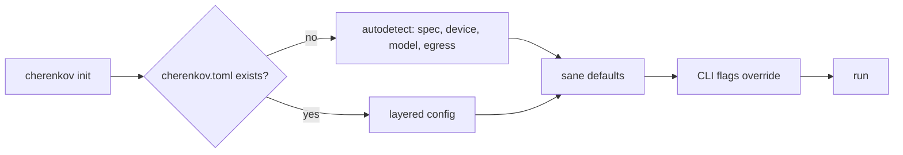

# CHERENKOV — Configuration: easy by default, configurable on top

Companion to [`00_VISION.md`](00_VISION.md). This is the contract that keeps the product **usable at the end of the day**: the defaults must "just work," and *every* default must be a dial you can turn — never a wall.

---

## 1. The two promises

1. **Zero-config works.** `cherenkov init && cherenkov run` produces value with no file editing.
2. **Everything is overridable.** Anything the defaults chose, you can override in `cherenkov.toml`, per-profile, or per-invocation flag — without touching code.



---

## 2. Layered resolution (lowest → highest precedence)

```
built-in defaults
  → profile (laptop | ci | enterprise-vpc | frontier-cloud)
    → cherenkov.toml (project)
      → environment variables (CHERENKOV_*)
        → CLI flags
```

Highest wins. Every layer is optional. With none present, **built-in defaults run**.

---

## 3. Default profile (what you get with nothing configured)

| Dimension | Default | Rationale |
|---|---|---|
| Sources | autodetect OpenAPI in repo | most common entry point |
| Model substrate | local (Ollama) if present, else prompt | privacy-first, zero cost |
| `egress` | `internal` | never silently send code to a cloud |
| Capability tiers | small=local, deep=local | works offline out of the box |
| Artifacts | Playwright tests | the proven Track A output |
| Oracle | spec + Prism mock | deterministic, no real server needed |
| Mode | one-shot (`run`) | daemon is opt-in |

> The default never sends data off-box and never costs money. Upgrading quality is an explicit choice.

---

## 4. The config surface (`cherenkov.toml`)

```toml
# cherenkov.toml — every key shown is OPTIONAL; defaults apply when omitted.
profile = "laptop"            # laptop | ci | enterprise-vpc | frontier-cloud

[sources]
openapi = ["./openapi.yaml"]  # autodetected if omitted
traffic = ["./capture.har"]   # optional: enables D2/D5 divergences
db_schema = []                # optional: enables D4 divergences

[substrate]                   # L0 Substrate Router
egress = "internal"           # none | internal | any
[substrate.tiers.small]       # cheap, always-on (Cartographer)
provider = "ollama"
model = "qwen2.5-coder:7b"
[substrate.tiers.deep]        # reasoning (Skeptic)
provider = "ollama"           # set to "anthropic"/"openai" for frontier quality
model = "deepseek-r1:8b"
[substrate.budgets]
max_cost_usd_per_run = 0.0    # 0 = local only
max_latency_ms = 120000

[divergence]
space = ["D1", "D2", "D3", "D4", "D5"]   # which divergence classes to hunt
adversarial_self_play = true             # kill tautological tests
min_severity = "low"

[artifacts]
emitters = ["playwright"]     # playwright | k6 | pytest | spec-patch | pr-comment | webhook
eject = true

[oracle]
kind = "spec+prism"           # spec+prism | prod-snapshot | human | sibling-service

[continuity]
mode = "one-shot"             # one-shot | daemon
behavioral_diff_on_pr = false
```

---

## 5. Profiles (presets that flip many dials at once)

```mermaid
flowchart TB
  subgraph laptop[laptop]
    l1[egress: internal] --- l2[local models] --- l3[one-shot]
  end
  subgraph ci[ci]
    c1[egress: internal] --- c2[fast small models] --- c3[behavioral_diff_on_pr: true]
  end
  subgraph vpc[enterprise-vpc]
    v1[egress: none] --- v2[self-host vLLM] --- v3[daemon + audit log]
  end
  subgraph cloud[frontier-cloud]
    f1[egress: any] --- f2[deep tier = frontier API] --- f3[budgets enabled]
  end
```



| Profile | egress | deep tier | mode | for |
|---|---|---|---|---|
| `laptop` | internal | local | one-shot | a dev on their machine |
| `ci` | internal | local (fast) | one-shot + PR diff | pipelines |
| `enterprise-vpc` | **none** | self-hosted | daemon + audit | regulated buyers |
| `frontier-cloud` | any | frontier API | one-shot/daemon | max quality, cost OK |

The same binary serves a privacy-locked bank and a quality-maximizing startup — one line apart. This is the **sovereignty-as-a-dial** promise from the vision.

---

## 6. Reframing "local-first"

`TECHNICAL_DESIGN.md` pins the product to one GPU. The new framing: **deterministic, reproducible, auditable reasoning that runs anywhere a model fits** — laptop, VPC, or frontier cloud. The 5060 path is *one profile*, not the product. That reframe turns a hobby-sounding constraint into compliance-grade infrastructure for buyers who *cannot* send specs to a cloud.

---

## 7. Design rules for contributors

- **No hidden network calls.** If `egress` forbids it, it cannot happen; fail loud.
- **Every new behaviour ships with a default** and a config key to change it.
- **Defaults favour: offline, free, deterministic.** Quality/cost upgrades are opt-in.
- **Config is validated** with typed contracts (extend `core/contracts.py`); unknown keys → explicit error, never silent.
- **`cherenkov doctor`** explains the *effective* config and where each value came from.
