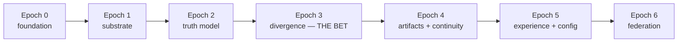

# CHERENKOV — Agent Workbook

How autonomous dev agents (and humans) pick up, build, and ship work on CHERENKOV. Pairs with the GitHub issues seeded from [`02_ROADMAP.md`](02_ROADMAP.md).

---

## 1. Label taxonomy

| Label | Meaning |
|---|---|
| `epic` | A parent tracking issue for one Epoch. Don't implement directly; pick its children. |
| `agent-ready` | Self-contained; an agent can start with no extra context. |
| `epoch:0` … `epoch:6` | Which roadmap epoch the issue belongs to. |
| `area:substrate` | L0 router / providers. |
| `area:truth-model` | L1 ingest / semantic graph. |
| `area:divergence` | L2 Skeptic / Witness / the bet. |
| `area:artifacts` | L3 emitters / oracles / eject. |
| `area:continuity` | L4 daemon / PR diff. |
| `area:experience` | L5 CLI / config / dashboard / docs. |
| `area:federation` | L6 protocol / corpus. |
| `type:contract` | Defines a Pydantic SPI / boundary. Do these first — they unblock others. |
| `type:feature` · `type:research` · `type:proof` | Build / investigate / demonstrate. |
| `reality-engine` | Umbrella tag on every issue from this plan (filter on this). |

---

## 2. Dependency order (don't skip)

Within an epoch, **`type:contract` issues come first** — they define the SPIs everything else implements against.

---

## 3. Definition of Done (every issue)

1. Behaviour matches the issue's acceptance criteria (checkboxes).
2. New boundary types live in `core/contracts.py` and round-trip through `.model_validate_json()` in a test.
3. A default exists for every new behaviour; a config key can change it ([`03_CONFIGURATION.md`](03_CONFIGURATION.md)).
4. No new hidden network egress; `egress` policy is honoured.
5. Tests pass; CI green; docs/`--help` updated if user-facing.
6. PR links the issue (`Closes #N`) and notes which acceptance boxes it satisfies.

---

## 4. Working agreement for parallel agents

- **One issue = one branch = one PR.** Branch name: `epoch{N}/{issue-slug}`.
- **Claim before you build:** comment on the issue / assign yourself so two agents don't collide.
- **Respect the seam:** never let an agent hardcode a model name — go through the Substrate Router (`ReasoningRequest`). PRs that name a model in agent code are rejected.
- **Contracts are law:** if you need to change an SPI, open a `type:contract` PR first and get it merged before building on it.
- **Small, verifiable PRs** beat big ones. If an issue is too big, split it and link children.

---

## 5. Where things live (current → target)

| Concern | Today | Target module |
|---|---|---|
| Inference | `cherenkov/ai/ollama_client.py` | `cherenkov/substrate/` (router + providers) |
| Ingest | `cherenkov/stages/ingest.py` | `cherenkov/truth/sources/` |
| Plan/Generate | `cherenkov/stages/` | `cherenkov/artifacts/emitters/` |
| Execute/Prism | `cherenkov/execution/` | `cherenkov/divergence/witness/` |
| Review | `cherenkov/stages/review.py` | `cherenkov/divergence/` gates |
| Contracts | `cherenkov/core/contracts.py` | same — extend with SPI models |

Refactors are **incremental**: keep the old path green, introduce the seam, migrate behind it (see Epoch 0 / E0-3).

---

## 6. The one rule that matters

> If you're unsure whether something belongs in CHERENKOV, ask: **"Does this help the system detect, prove, or close a divergence between sources of truth?"** If yes, it fits. If it's just "generate more tests," it's probably L3 plumbing, not the mission.
