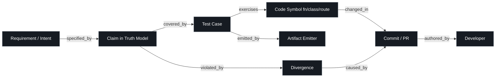
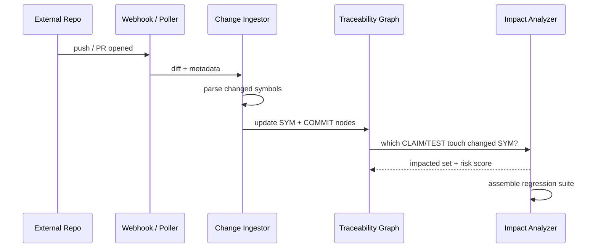
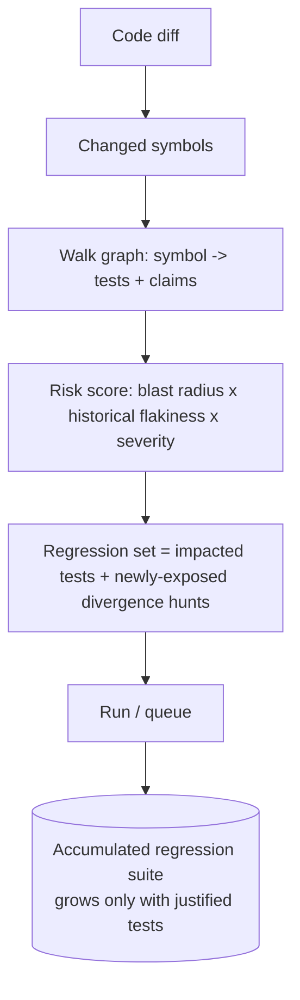
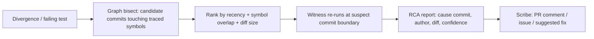
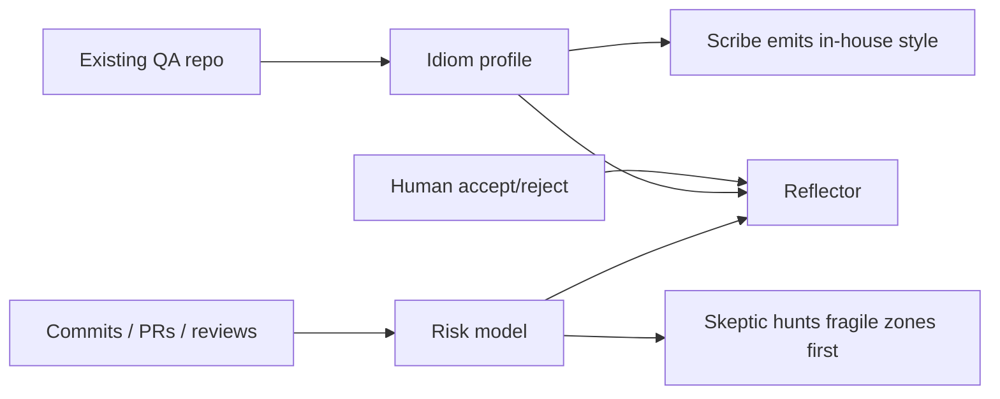

# CHERENKOV — Change Intelligence (L4.5)

Companion to [`01_ARCHITECTURE.md`](01_ARCHITECTURE.md) / [`02_ROADMAP.md`](02_ROADMAP.md).
This is the layer that makes CHERENKOV **learn from change** instead of only reacting to a static snapshot — and that connects every test back to the code, requirement, and commit that justify it.

> Maps to **Epoch 7** (GitHub milestone). The governance that surrounds it is **Epoch 8** — see [`../engineering/`](../engineering/README.md).

---

## 1. The problem this solves

A test suite that doesn't know *why* a test exists, *what change* it guards, or *what broke it* is dead weight. Teams drown in:

- tests with no link to the requirement or code they cover (**no traceability**),
- regressions discovered late because nobody knew a change touched them (**no impact analysis**),
- failures triaged by hand with no idea which commit caused them (**no RCA**),
- brittle suites that don't learn from how the team actually writes tests (**no learning**).

Change Intelligence closes all four — on **CHERENKOV's own repo and on external repos it watches**.

---

## 2. The Traceability Graph (the backbone)

Everything hangs off one graph. Each node carries provenance; each edge is typed and queryable both directions.



**Query examples it must answer instantly:**
- "Which tests cover this endpoint, and which requirement justifies each?" (`REQ→CLAIM→TEST`)
- "This PR changed `charge()` — what could regress?" (`COMMIT→SYM→TEST/CLAIM`)
- "This test just failed — what change caused it?" (`DIV→COMMIT`, RCA)
- "Show every untested claim." (`CLAIM` with no `covered_by`)

---

## 3. Change detection across repos

CHERENKOV watches **other repositories**, not just its own.



Detection modes (configurable, `egress`-respecting): GitHub/GitLab **webhook**, scheduled **poll**, or local **git hook**. Each maps a diff to changed **code symbols**, then walks the graph to the impacted claims/tests.

---

## 4. Impact analysis → auto-accumulated regressions



The regression suite is **not** "run everything" and **not** a human-curated list — it is **derived**: exactly the tests whose traced symbols changed, plus fresh divergence hunts on newly-exposed claims. Every added test carries the commit that justified it, so the suite stays lean and explainable.

---

## 5. Root Cause Analysis (RCA)

When a divergence or test failure appears, the RCA engine localizes the cause.



RCA output is a typed contract: `{symptom, suspect_commit, confidence, evidence, blast_radius, suggested_action}`. It uses the **Witness** (Epoch 3) to confirm, not just guess — the same anti-reward-hacking discipline applies.

---

## 6. Learning loops

Two distinct learners, both feeding the **Reflector** (Epoch 3/8):

1. **Learn from existing QA repos.** Reverse-ingest an existing Playwright (or Cypress/pytest/k6) suite: extract its idioms — naming, fixture style, assertion patterns, page objects — into a per-project **idiom profile**. New artifacts CHERENKOV emits *match the house style*, so they integrate instead of clashing. This is the on-ramp: point it at a repo that already has tests, and it augments rather than replaces.
2. **Learn from dev changes.** Mine commit/PR history: which review comments preceded reverts, which changes historically caused regressions, which areas are volatile. This trains the **risk score** and biases the Skeptic toward fragile zones.



---

## 7. The QA Companion Repo

CHERENKOV can **initiate and maintain a dedicated QA repository** (or a `qa/` workspace inside an existing repo) as the managed home for emitted artifacts + traceability metadata.

Layout it scaffolds:

```
qa-workspace/
  tests/                 # emitted, ejectable suites (Playwright/k6/pytest)
  .cherenkov/
    truth-model/         # serialized claim graph
    traceability/        # the graph: req<->claim<->test<->symbol<->commit
    idiom-profile.json   # learned house style
    divergences/         # open + resolved, with RCA
  cherenkov.toml         # config (see 03_CONFIGURATION.md)
  REGRESSIONS.md         # human-readable accumulated suite + why each exists
```

The companion repo is **ejectable and vendor-neutral**: `tests/` runs with plain `npx playwright test` even if CHERENKOV is removed (the original eject promise, preserved).

---

## 8. How it composes with the rest

- Backbone: **L1 Truth Model** (claims) + this graph (links to code/commits).
- Detection: extends **L4 Continuity** to multi-repo + dev-history.
- Proof: reuses the **L2 Witness** for RCA confirmation and adversarial self-play.
- Output: reuses **L3 Artifact Emitters** + **Oracle SPI**.
- Governance of *how this is built*: **Epoch 8** — see [`../engineering/README.md`](../engineering/README.md).

Nothing here is a side feature; traceability is the spine that turns "a pile of tests" into "an accountable quality system."
