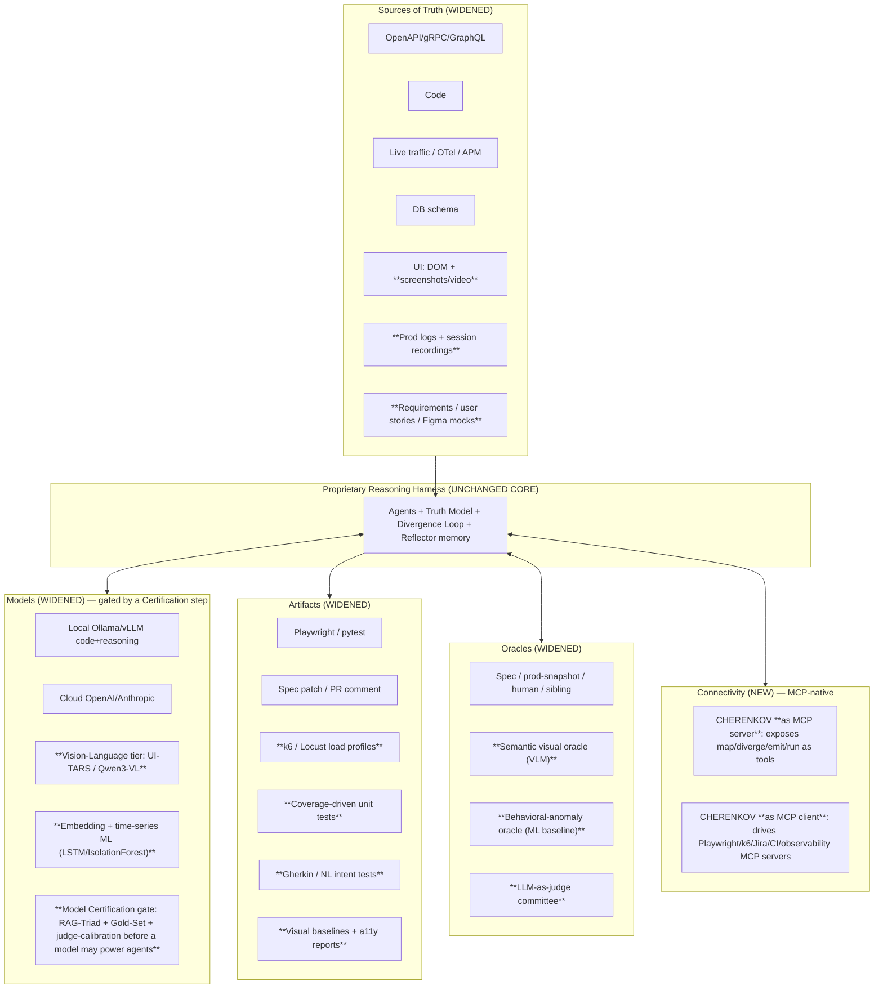

# CHERENKOV v2 — The Autonomous QA Fabric

**Status:** North-star expansion · **Builds over (does not replace):** [`00_VISION.md`](00_VISION.md), [`01_ARCHITECTURE.md`](01_ARCHITECTURE.md), [`02_ROADMAP.md`](02_ROADMAP.md)
**Audience:** maintainers, contributors, autonomous dev agents, and QA leaders evaluating the platform.
**Premise:** every layer below already exists or is on the roadmap. Nothing here is a rewrite — it is *more advanced technology bolted onto the seams we already opened*. We move forward, never backward.

---

## 0. TL;DR — what changes and what doesn't

**What does NOT change (the moat):** CHERENKOV remains a **Reality Engine** whose deliverable is *truth*, not test count. The Divergence Loop (Cartographer → Skeptic → Witness → Scribe → Reflector) stays the irreducible center. The four open seams — **Sources, Models, Artifacts, Oracles** — stay the only way new capability enters the system.

**What changes (the ambition):** we widen each seam until the divergence core sits at the center of a **complete, AI-first, autonomous QA fabric** that covers the *entire* QA discipline — functional, UI/E2E, API, performance/load, unit/coverage, exploratory, visual, accessibility, security, and the governance of the AI doing all of it. And we wrap the whole thing in a **QA Copilot** that makes a manual tester 10× more powerful on day one and pairs every junior with the accumulated judgement of every senior who came before.

> Old one-liner: *"CHERENKOV maintains the truth about a software system by detecting where its sources of truth disagree and emitting the artifact that closes the gap."*
>
> **New one-liner:** *"CHERENKOV is the autonomous quality fabric for a software system — it knows what the system claims, watches what it actually does, hunts the gaps no human has time to find, proves them by reproduction, and closes each one with the right artifact — while making every QA on the team, manual or senior, dramatically more powerful."*

The research we are responding to (next-gen autonomous QA: UI-TARS/Qwen3-VL vision models, Midscene/Skyvern self-healing E2E, Cover-Agent autonomous SDET, AI load generation + ML anomaly detection, SWE-bench/WebArena/DeepEval evaluation, multi-agent committees) is **not a different product**. Mapped onto our seams, it is the *next generation of plugins* for a harness we already built.

---

## 1. Why "build over" is the right move (and the only honest one)

**The strategic opening (from the research's own numbers):** 75% of organizations say AI-driven testing is pivotal, but **only 16% have actually adopted it** — a market growing from $55.8B (2024) to a projected $112.5B (2034). That gap is not a tooling gap; the tools exist. It is an *integration, trust, and human-readiness* gap. The teams stall because point tools don't compose, autonomy isn't trustworthy enough to hand the keys over, and manual QAs aren't equipped to drive them. CHERENKOV's three answers to exactly those three blockers — one composing fabric, a hard anti-reward-hacking trust guarantee, and a Copilot that meets QAs where they are — *are* the wedge into that 84% who haven't adopted.

The market the research describes is fragmenting into point tools: one vendor for self-healing UI, one for unit-test generation, one for load testing, one for LLM eval, one for visual diffing. Each re-solves the same substrate problems (model routing, sovereignty, memory, anti-reward-hacking) badly and in isolation.

CHERENKOV already solved the hard, shared substrate:

| Shared problem every QA-AI tool faces | Where CHERENKOV already solved it |
|---|---|
| "Which model runs this reasoning step, at what cost/latency/sensitivity?" | **L0 Substrate Router** + Model Provider SPI + `egress` dial |
| "How do I avoid agents asserting `true==true` (reward hacking)?" | **L2 adversarial self-play** (Witness vs correct mock *and* broken impl) |
| "How do I represent what the system *claims* across many sources?" | **L1 Truth Model** (semantic graph + provenance + embeddings) |
| "How does the agent get smarter about *this* system over time?" | **Reflector** + per-system idiom memory (the compounding moat) |
| "How do I close a finding, not just report it?" | **L3 Artifact Emitter SPI** |
| "What counts as correct?" | **Oracle SPI** |

Every framework in the research is a **leaf** that plugs into one of those seams. We do not rebuild the trunk. We grow new branches. **This is the unique, powerful, all-in-one position no point tool can reach**: they have a feature; we have a fabric.

---

## 2. The enlarged architecture — same trunk, wider seams

Each of the four seams gains new first-class plugin families. **No new core; only new plugins and the agents that drive them.**

> **Two facts the full research made unavoidable.** (1) **MCP is the universal connector** ("USB-C of AI testing" — 97M monthly SDK downloads, 5,800+ servers, adopted by every major provider). A modern QA platform must be MCP-native on *both* sides: a **server** that exposes its own capabilities as tools to any coding agent (Claude, Copilot), and a **client** that drives Playwright/k6/Jira/CI/observability MCP servers. This is pure leverage for CHERENKOV — the seams were already plugin contracts; MCP makes them addressable by the whole ecosystem. (2) Because we are **model-agnostic**, swapping a model silently risks quality regressions; the research's "certify the cognitive engine" discipline becomes a hard **Model Certification gate** on the Substrate Router (below).

### 2.1 Scale-up, not stack-on — every capability grows an existing module

> **Correction to an earlier draft of this doc.** A previous version proposed six *new layers* (L7–L12) stacked above the system. That was wrong: it treated already-built modules (`stages/perf`, `stages/visual`, `healing/diagnose`, `divergence/self_play`) as if absent, which orphans real code. The right unit of work is **"upgrade module X,"** not "add layer Y." This table anchors each research-driven capability to the **real file it scales up** and honestly marks what is genuinely new.

| Capability (research-driven) | Real module it scales up | Today | Scale-up target | New? |
|---|---|---|---|---|
| **Vision perception** (UI-TARS/Qwen3-VL/Midscene) | `stages/visual/visual_stage.py` + `substrate/provider.py` | Pixel/screenshot baseline diff; Ollama/OpenAI providers | Add a **VLM provider** + semantic visual oracle; visual self-heal by layout/role, not pixels | Upgrade + new provider |
| **Autonomous exploration** (ATHelper/Browser Use) | `divergence/skeptic.py` | Hypotheses from spec claims (D1–D5) | Add an **Explorer** that crawls the live app and feeds discovered states as new hypotheses to the same Skeptic | New agent, existing loop |
| **Perf intelligence** (Gatling AI / LSTM / IsolationForest) | `stages/perf/perf_stage.py` | SQLite latency history, **statistical** mean+stddev outlier flag, k6 gen | Upgrade detector to **ML anomaly** (seasonal baseline, isolation forest); **generative load** from `truth/sources/traffic`; **LLM-aware metrics** (TTFT/ITL/cost) | Upgrade in place |
| **Failure classification / triage** | `healing/diagnose.py` | Classifies `AUTH_EXPIRY / CONTRACT_DRIFT / FLAKY / …` | Surface its verdicts as the manual-QA triage UX; route to the (new) Reflector | Mostly reuse |
| **Anti-reward-hacking** (QED/CANDOR) | `divergence/self_play.py` | Adversarial self-play (pass correct, fail broken) | Harden with **no-shared-context** verifier + **consensus oracle**; bounded refinement | Upgrade in place |
| **Coverage SDET** (Cover-Agent/Qodo) | `truth/emitters/` + `execution/validate.py` | Playwright/spec-patch emitters, validate harness | Add a **unit-test emitter** + coverage-threshold generate→run→repair loop reusing the validate harness | New emitter, existing harness |
| **Model certification** ("test the tester") | `substrate/router.py` + `ai/accounting.py` | Routes by tier/egress; cost accounting | Add a **Gold-Set + RAG-Triad gate** before a model may power agents | New gate on existing router |
| **MCP connectivity** | `stages/daemon_cmd.py` + emitters | Daemon, PR diff action | CHERENKOV as MCP **server** (expose map/diverge/emit/run) and **client** (drive Playwright/k6 MCP) | New adapter |
| **Eval & governance** | `dashboard/render.py` + `continuity/` | Dashboard render, PR behavioral diff | Add governance KPIs, three-tier CI gates, traceability, compliance metadata | Extend |
| **Reflector / verdict memory** | — *(genuinely absent)* | **Nothing** | Build the learning loop: persist accept/reject/escaped-defect verdicts → reweight Skeptic + Scribe; store per-system idioms | **NET-NEW core piece** |
| **QA Copilot + pairing** | builds on Reflector + `stages/init_cmd.py` | init/doctor UX | NL-intent authoring; **Mentor** surfaces senior idioms to juniors | New surface, **depends on Reflector** |

**The honest dependency:** the human-empowerment pillar (the #1 ask) and the compounding moat both sit on the **Reflector/verdict-memory**, which does **not exist yet**. So that is the *first* thing to build — not the last. Everything else is genuinely a scale-up of working code.

> These are **layers in the same stack**, not a parallel product. L7–L11 are perception/artifact/oracle plugins the existing agents call through the existing seams. L12 is the experience surface above L5.

### 2.2 New agents in the existing metabolism

The four-agent metabolism gains specialists. **They emit Reasoning Requests through the same Substrate Router and write to the same Truth Model — no agent ever names a model.**

| New agent | Joins as | Role | Intelligence need |
|---|---|---|---|
| **Pilot** | extends Witness | Pure-vision actor: executes intent ("click the green confirm button") against the live UI, self-heals, reproduces UI divergences. | VLM (vision tier) |
| **Explorer** | feeds Skeptic | Autonomously crawls the app/API to surface untested behaviour + anomalies as divergence candidates. | Mid reasoning + vision |
| **Loadsmith** | new artifact path | Synthesizes realistic load profiles from traffic; runs them via k6/Locust. | Cheap gen + ML |
| **Sentinel** | new oracle | ML time-series watcher: learns normal, flags drift/saturation during any run (functional *or* load). | ML, not LLM |
| **Coverager** | extends Scribe | Coverage-driven SDET loop: write unit test → run → read trace → repair → repeat to threshold. | Code-tuned |
| **Adjudicator** | hardens Reflector | LLM-as-judge committee + anti-reward-hacking metrics; decides which findings/tests earn a place in the regression suite. | Deep + diverse lenses |
| **Mentor** | the Copilot | Translates senior idioms (from Reflector memory) into guidance for manual/junior QAs; turns NL intent into runnable artifacts. | Mid + RAG over idiom memory |

### 2.3 Two cross-cutting upgrades to the *existing* core (not new layers)

The full research reframes two things we already have — making them stronger without rebuilding them:

- **The Truth Model *is* the QA-grade RAG substrate.** The research's strongest results come from **hybrid vector + graph retrieval** (Apple's Agentic-RAG+RL: 65%→**94.8%** artifact accuracy; API-level RAG beats flat RAG by +6.5pt coverage / +111% bugs). CHERENKOV's Truth Model is *already* a semantic graph + embeddings with provenance — i.e. exactly GraphRAG + vector RAG, but purpose-built for truth rather than bolted on. We make this explicit: every agent retrieves from the Truth Model, and retrieval quality is measured (context precision/recall).
- **The Reflector must be *built* as the RL-from-verdict loop — it does not exist yet.** The research shows static RAG "learns nothing from execution outcomes"; the fix is feedback from defect-discovery results. CHERENKOV has the *inputs* for this already — `healing/diagnose.py` classifies failures, `divergence/witness.py` produces accept/reject verdicts — but **no module persists or learns from them.** Building that loop (verdict store → reweight Skeptic hypotheses + Scribe idioms) is the single highest-leverage net-new piece, because the moat and the human-pairing pillar both depend on it. Treat it as foundational, not a finishing touch.

### 2.4 Model Certification — the gate that makes "model-agnostic" safe

Being model-agnostic is the moat, but it has a sharp edge the research names precisely: if the model behind an agent silently degrades (a swap, a provider update, drift), the whole quality measurement collapses — *an uncalibrated instrument*. So the Substrate Router (L0) gains a **Certification gate**:

- **Gold Sets** — curated `(task, expected artifact, metadata)` pairs per capability tier as ground truth.
- **RAG Triad** — faithfulness, answer-relevancy, context precision/recall on every model/prompt change (target faithfulness ≥0.95 for high-stakes tiers).
- **LLM-as-judge, calibrated** — judges validated against a human-labelled set before they may gate a release; non-deterministic sampling to avoid position bias.
- **Continuous prompt regression in CI** — any model, prompt, or chunking change re-runs the Gold Set; regression below threshold blocks the merge. No model powers a production agent until it passes its tier's gate.

This is the literal answer to "how do you test the tester" — and only a model-agnostic platform *needs* it, which turns our differentiator into a trust feature competitors structurally lack.

---

## 3. The human pillar — empowering manual QAs and pairing with seniors

This is a first-class pillar, not a footnote. The research is blunt: QA shifts from *authoring tests* to *strategy, risk, and judging AI output* — and the teams that win give every person, including non-coders, an AI surface that multiplies them.

### 3.1 For the manual QA (especially non-coders)

- **NL intent authoring (L12 + L8):** a manual tester types or speaks intent — *"check that a guest can checkout with a discount code and that the email arrives"* — and the Pilot executes it visually, the Scribe emits a durable artifact, and the tester never writes a selector.
- **"Second pair of eyes" (L8 Explorer):** before a manual exploratory session, the Explorer has already crawled the build and surfaced anomalies, 5xx, JS errors, visual breaks — so the human starts where the risk is, not from zero.
- **Heuristic results, not binary noise (L7/L11 oracles):** failures arrive classified — *bug | flaky | environment | intended change* — with evidence, so a manual QA triages like a senior on day one.

### 3.2 Pairing junior ↔ senior (the "second hand with experienced ones")

The compounding moat (Reflector + per-system idiom memory) is exactly the mechanism for transferring senior judgement:

- Every time a senior **accepts/rejects** a finding or **refines** what matters, the Reflector records the *why* as a reusable idiom for this system.
- The **Mentor agent** surfaces those idioms to juniors in context: *"Senior reviewers on this service always check tenant isolation on any new list endpoint — here's the pattern."*
- The result is **apprenticeship at scale**: a junior paired with CHERENKOV inherits the distilled instinct of every senior who used it before — without the senior being in the room.

This is the unique angle no point tool has: because we already accumulate per-system truth and verdict history, we can turn it into **human upskilling**, not just better model prompts.

### 3.3 The autonomy ladder (we meet each org where it is)

Mapping the research's maturity model onto CHERENKOV settings (not new code — config + Copilot gates):

| Level | Org reality | CHERENKOV mode |
|---|---|---|
| L1 Assisted | Humans author; AI suggests | Copilot suggests tests/edge cases; human owns all |
| L2 Augmented | Self-healing + NL authoring live | Pilot self-heals; Explorer assists; human approves |
| L3 Agentic | Agents manage gen/exec/prioritize | Full Divergence Loop runs; humans set risk + judge |
| L4 Predictive | Defects predicted pre-code | Truth Model + Change Intelligence flag risk on PR before merge |

---

## 4. Anti-reward-hacking & trust (why "autonomous" is safe here)

The research's single biggest warning: autonomous QA fails when agents write tests that pass because they assert nothing real, or claim to click elements that don't exist. CHERENKOV's existing adversarial self-play already attacks this; v2 hardens it into a platform guarantee:

- **Witness/Pilot dual-execution (mutation-style):** every candidate test must **pass the correct oracle AND fail a deliberately broken one**. Tautologies (`true==true`) are killed at birth.
- **No-shared-context verification (QED pattern):** the Witness/Adjudicator that judges a finding runs with **no access to the Skeptic's chain of thought** — only the artifact and the oracle. This kills "context contamination," where a verifier rubber-stamps the generator's flawed reasoning.
- **Consensus oracle synthesis (CANDOR pattern):** for ambiguous expected-values, multiple reasoning passes "panel-discuss" the oracle and majority-vote — the research shows this lifts oracle correctness by 21+ points over a single model.
- **Convergence-bounded refinement (RefAgent/ATA pattern):** the Coverager/Scribe loop iterates generate→run→classify-failure(syntax|env|logic)→repair against explicit thresholds (e.g. coverage ≥95%, failure ≤2%, max-N iterations) — preventing both under-testing and infinite refinement loops.
- **Adjudicator committee (L11):** independent, diverse-lens judges (correctness / repro / security) vote before any finding enters a regression suite.
- **Traceability (L11):** every artifact links to the exact prompt version, model, source claims, and evidence (Langfuse/OpenTelemetry-style). A failed test is always explainable.

### 4.1 The QA "OWASP Agentic Top 10" — failure modes we design against

The research codifies the failure modes of autonomous QA. CHERENKOV maps each to an existing or roadmapped defense:

| Failure mode | CHERENKOV defense |
|---|---|
| Hallucinated test assertions | dual-execution mutation gate + Adjudicator |
| Reward hacking in validation | no-shared-context independent re-execution |
| Locator/click hallucination | vision-based verification (upgraded `stages/visual`) confirms the element existed |
| Excessive/destructive test scope | cost & blast-radius budgets in the Substrate Router + egress dial |
| Prompt bloat / runaway cost | per-request cost accounting + caching (already in L0); MCP token-overhead budgeting |
| Context contamination across agents | separate-context verifiers; per-finding memory scoping |
| Tool abuse / excessive agency | MCP tool permission scoping, allowlisting, signed-server attestation, audit logging, RBAC |

### 4.2 Governance, compliance, observability (grows `dashboard/render` + `continuity/`)

- **Governance KPIs** as first-class dashboard metrics: defect-escape rate, false-positive rate, coverage accuracy, maintenance-efficiency.
- **Three-tier CI quality gates** (from the research, by cost/cadence): Tier-1 fast checks every commit (<$0.10, ~2 min, blocking) → Tier-2 PR evaluation (blocking on prompt/model PRs) → Tier-3 comprehensive weekly/pre-release benchmark sweep.
- **Compliance-ready:** audit-trail metadata (IEEE P7001-style) on every artifact; EU AI Act readiness (documented testing evidence for high-risk systems, deadline Dec 2027); synthetic **GDPR/HIPAA/PCI-compliant test data** generation that preserves production statistics without exposing real data.
- **MCP as security-critical infrastructure:** treat every connected MCP server with least-privilege, allowlisting, and response monitoring — the research documents MCP as a real new attack surface.

---

## 5. The scale-up roadmap (proposed E7+, sequenced by dependency, not ambition)

This is a **proposal to append to** [`02_ROADMAP.md`](02_ROADMAP.md) (E0–E6) once approved — it does not reorder the divergence bet (E3) or federation (E6). Sequencing obeys two rules the earlier draft violated: **(a) build the genuinely-missing substrate before the things that depend on it**, and **(b) one capability per epoch must be shippable and independently valuable** — no big-bang. Each epoch names the **real module it grows**.

| Seq | Epoch | Grows (real module) | Ships | Hard dependency |
|---|---|---|---|---|
| **0** | **E7 · Reflector & verdict memory** | *net-new* core, fed by `healing/diagnose.py` + `divergence/witness.py` | Persist accept/reject/escaped-defect verdicts; reweight Skeptic + store per-system idioms | none — **do this first** |
| **1** | **E8 · Perf intelligence** | `stages/perf/perf_stage.py` | Statistical→**ML anomaly**; generative load from `truth/sources/traffic`; LLM-aware metrics (TTFT/ITL/cost) | L0, traffic source |
| **2** | **E9 · Vision perception** | `stages/visual/visual_stage.py` + new VLM in `substrate/provider.py` | Semantic visual oracle + visual self-heal; Pilot reproduces D3 ui↔spec | L0, L2 |
| **3** | **E10 · Explorer + Copilot v1** | `divergence/skeptic.py` + `stages/init_cmd.py` | Goal-driven crawl feeds Skeptic; NL-intent authoring; triage UX over `healing/diagnose` | E9, E7 |
| **4** | **E11 · Coverage SDET** | `truth/emitters/` + `execution/validate.py` | Unit-test emitter + bounded generate→run→repair loop | L0, self_play |
| **5** | **E12 · Model certification + governance** | `substrate/router.py` + `dashboard/render.py` | Gold-Set/RAG-Triad gate; three-tier CI gates; traceability; governance KPIs | all prior |
| **6** | **E13 · Copilot v2 + pairing** | builds on E7 Reflector | Mentor surfaces senior idioms to juniors; autonomy-ladder profiles | E7, E10 |

**Cross-cutting (continuous):**
- **MCP-native connectivity** — grow `stages/daemon_cmd.py` + emitters into an MCP server/client. Start once E9 gives something worth exposing.
- **Model Certification** — extend the gate each time a new tier (VLM, ML) lands, so model-agnosticism never silently degrades.
- **Sovereignty / open-seams discipline** — every new provider honors `egress`; every capability ships as an SPI plugin with a versioned Pydantic contract (à la `core/contracts.py`) — never a core fork.

> **Crisp exits (kill criteria), matching the original's "≥5 reproduced divergences" rigor:** E7 — a rejected finding measurably stops re-appearing next run. E8 — Sentinel flags a seeded memory leak before crash. E9 — Pilot self-heals across a real UI redesign. E11 — Coverager raises real coverage with a test that fails a broken impl. If an epoch can't hit its exit in its time-box, it's cut, not extended.

---

## 6. Premortem — assume it's 18 months later and this failed. Why?

| # | Failure mode | Likelihood | Leading indicator | Mitigation (in the plan) |
|---|---|---|---|---|
| 1 | **Scope sprawl drowned the core.** Seven epochs split a small team thin; the divergence engine (the actual moat) stagnated while we chased perf/vision/SDET breadth. | **High** | E3 proof-run metrics flat for >2 epochs | Hard rule: no E7+ epoch starts until the E3 proof-run is *published*; one epoch in flight at a time; each must pass its kill-criteria exit. |
| 2 | **Reflector became a data swamp.** We persisted verdicts but never closed the loop, so "learning" was storage, not behavior change. | High | idioms accumulate but Skeptic hit-rate doesn't move | E7 exit is *behavioral* (rejected findings stop recurring), not "memory exists." |
| 3 | **Vision/ML costs broke local-first.** VLMs + ML pipelines need GPU; the `egress:none` promise quietly died or got slow/expensive. | Medium-High | regulated-profile latency/cost blows budget | Keep statistical perf + pixel visual as the *default*; VLM/ML are opt-in tiers behind the cost budget; benchmark cost per epoch. |
| 4 | **Reward-hacking shipped anyway.** Self-play + committee looked rigorous in docs but agents still produced plausible-passing junk at scale. | Medium | rising false-positive KPI; humans stop trusting findings | E12 governance KPIs (false-positive rate, defect-escape) tracked from E7, not added last; no-shared-context verifier is non-optional. |
| 5 | **Manual-QA pillar stayed a slogan.** We shipped agents but never the concrete authoring/triage UX, so the "empower manual QAs" promise never materialized. | Medium | no non-coder has authored a passing test by E10 | E10 exit *requires* a non-coder round-trip; design the UX before the agent. |
| 6 | **MCP/connectors became a maintenance tax** with little uptake; we chased ecosystem fashion. | Medium | MCP server built, ~zero external callers | Defer MCP until a real consumer asks; it's cross-cutting, not gating. |
| 7 | **We competed head-on and lost.** By doing "all of it," we became a worse Mabl / worse k6 / worse Cover-Agent instead of the only divergence engine. | Medium | sales/positioning reduces to feature parity | Every capability must *serve a divergence* (e.g. vision exists to reproduce D3), never stand alone as a me-too feature. |
| 8 | **The model-agnostic substrate aged badly** — newer models needed interfaces our SPI didn't anticipate (vision tokens, tool-call formats). | Low-Medium | provider SPI forks per model | Certification gate doubles as a conformance test; keep the SPI minimal and versioned. |

**The single most important premortem lesson:** the failure mode is *breadth killing the moat*. Every mitigation above reduces to one discipline — **the divergence engine eats first; each new capability must feed it, prove its exit, or be cut.**

---

## 7. The "mega solution" pitch (kept honest)

Every competitor in the research is a **feature** (self-healing UI *or* unit-gen *or* load *or* eval). CHERENKOV's edge is being the **fabric that unifies them around truth and judgement** — one model-agnostic substrate, one Truth Model every capability reads/writes, one anti-reward-hacking guarantee, one accumulating per-system memory that doubles as human upskilling. But "all in one" is earned, not declared: it only holds if each capability **scales up a working module and serves a divergence**, sequenced behind the Reflector and gated by kill-criteria. One trunk; branches earn their place.

---

### Related documents
- [`00_VISION.md`](00_VISION.md) — the Reality Engine north star (unchanged; this scales it up).
- [`01_ARCHITECTURE.md`](01_ARCHITECTURE.md) — core layers, agents, substrate, seams (the trunk).
- [`02_ROADMAP.md`](02_ROADMAP.md) — epochs E0–E6 (E7+ proposed here, pending approval).
- [`05_CHANGE_INTELLIGENCE.md`](05_CHANGE_INTELLIGENCE.md) — predictive/shift-left risk.
