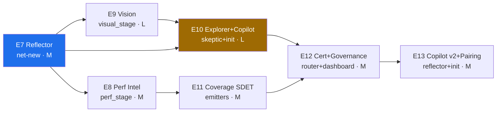

# CHERENKOV — Master Development Plan & Roadmap (definitive)

**Status:** Approved-candidate plan · **Supersedes:** the scale-up framing in [`06_AUTONOMOUS_QA_FABRIC.md`](06_AUTONOMOUS_QA_FABRIC.md) (kept as the research-mapping appendix)
**Grounded in:** the actual codebase (real modules, contracts in `core/contracts.py`, config in `cherenkov.toml`) — every task names the file it grows.
**Reading order:** this is the plan of record. [`00_VISION.md`](00_VISION.md) is the why; [`01_ARCHITECTURE.md`](01_ARCHITECTURE.md) is the trunk; [`02_ROADMAP.md`](02_ROADMAP.md) E0–E6 is done/in-flight; this defines **E7→E13**.

---

## 1. The revolutionary thesis — in one breath

> Every QA tool on the market answers *"given an artifact, produce/run tests."* CHERENKOV answers a question nobody else owns: **"where is this system lying to itself, and who do I need to be to catch it?"** It maintains the **truth** about a system (what it claims vs. what it does), proves each gap by **reproduction**, closes it with the **right artifact**, and — the part that changes lives — **turns every confirmed catch into transferable judgement** so a manual tester triages like a senior on day one.

**The real pain it kills** (each maps to a built or planned capability):

| Who hurts today | The pain | CHERENKOV's answer |
|---|---|---|
| Manual QA (esp. non-coder) | "I can't automate; I click the same flows forever; I start every session from zero." | NL-intent authoring + Explorer's "second pair of eyes" pre-session anomaly list (E10) |
| Junior QA | "I don't know what a senior would check here." | Mentor surfaces the team's accumulated senior idioms in context (E13) |
| Senior QA / SDET | "I drown in flaky-test maintenance and triage instead of strategy." | Self-healing (built) + `healing/diagnose` triage + Reflector that stops re-surfacing rejected noise (E7) |
| QA lead | "Tests pass but prod breaks; I can't prove release readiness." | Divergence engine (built) + behavioral-diff-on-PR (built) + governance KPIs (E12) |
| Regulated org | "I can't send my data or my code to a SaaS." | model-agnostic substrate + `egress: none` (built, production) |

**Why it's defensible (the moat, unchanged):** value lives *above* the model; the model is rented per-call through the Substrate Router. The accumulating, per-system **truth + verdict memory** is something no stateless point tool and no model vendor can replicate — and it is the same asset that powers both a smarter engine and human upskilling.

---

## 2. Non-negotiable design principles (the guardrails that keep this from sprawling)

1. **Scale up, never rebuild.** Every capability grows a real module (table in §4). No parallel products, no orphaned layers.
2. **The divergence engine eats first.** A new capability ships only if it (a) feeds a divergence, (b) passes a kill-criteria exit, or (c) is cut. Breadth is earned.
3. **One epoch in flight.** No big-bang. Each epoch is independently shippable and independently valuable.
4. **Agents never name a model.** Everything routes through `ReasoningRequest{capability_tier}` + the Substrate Router. New intelligence = new tier in `cherenkov.toml`, never a hardcode.
5. **Sovereignty is sacred.** Every new model family (VLM, ML) honors the `egress` dial. The local-first default never degrades silently.
6. **Trust is built-in, not bolted-on.** No autonomous output enters a regression suite without surviving adversarial self-play (built) + independent (no-shared-context) verification.
7. **Every seam is a versioned Pydantic contract** (à la `core/contracts.py`). New capability = new plugin, never a core fork.

---

## 3. Where we actually are (verified against code)

**Built & working (do not rebuild):** L0 Substrate Router (`substrate/`, Epoch-1 closed, tested) · L1 Truth Model (`core/truth_model.py`, `truth/sources/*`) · **L2 Divergence engine — runnable** (`divergence/{skeptic,witness,self_play,proof_run}`) · L3 emitters + eject (`truth/emitters/*`, `execution/*`) · L4 behavioral-diff-on-PR + daemon (`continuity/`, `stages/daemon_cmd`) · self-healing (`healing/*`) · perf baseline *(statistical)* (`stages/perf`) · visual baseline *(pixel)* (`stages/visual`) · federation scaffolding · dashboard.

**Genuinely absent (the build-list):** Reflector/verdict-memory · VLM perception · autonomous Explorer · coverage/unit SDET · model-certification/eval harness · MCP · the manual-QA Copilot surface.

---

## 4. The plan: E7 → E13 (sequenced by dependency)

Each epoch: **Goal · Grows · Key tasks · New contracts/config · Exit metric (kill criteria) · Effort · Top risk.** Effort is T-shirt (S≈1–2 wk, M≈3–5 wk, L≈6–8 wk) for one focused dev.

### E7 — Reflector & Verdict Memory  ·  *do this first*
- **Goal:** the system learns from being right/wrong; rejected findings stop recurring; per-system idioms accumulate.
- **Grows:** *net-new* `cherenkov/reflector/` fed by `healing/diagnose.py` (FailureClass) + `divergence/witness.py` (ReproductionResult) + human `Verdict`.
- **Key tasks:** (1) `VerdictRecord` contract + local store (SQLite, `.cherenkov/verdicts.db`). (2) Reflector consumes accept/reject/escaped-defect → reweights Skeptic hypothesis ranking. (3) `Idiom` records (per-system "always check X on Y"). (4) Wire into `proof_run` loop.
- **New contract/config:** `core/contracts.py` += `VerdictRecord`, `Idiom`; `cherenkov.toml` += `[reflector] enabled, store_path, decay`.
- **Exit (kill):** seed 3 rejected findings; next proof-run on same target **does not re-surface them** AND Skeptic hit-rate (confirmed/hypotheses) ↑ vs. baseline. If no behavioral change → cut.
- **Effort:** M · **Risk:** becomes a data swamp (storage ≠ learning) → exit is behavioral, not "memory exists."

### E8 — Perf Intelligence
- **Goal:** load testing that learns real traffic and predicts saturation.
- **Grows:** `stages/perf/perf_stage.py` (today: SQLite history + mean+stddev outlier).
- **Key tasks:** (1) Upgrade detector statistical → **ML anomaly** (seasonal baseline + isolation forest) behind the existing SQLite history. (2) **Generative load profiles** from `truth/sources/traffic.py`. (3) **LLM-aware metrics** (TTFT, inter-token latency, tokens/sec, P95/P99, cost) for AI endpoints. (4) Keep statistical path as the zero-dependency default.
- **New contract/config:** extend `PerfReport`/`PerfGateResult`; `[substrate.tiers.ml]` (local), `[perf] detector = "statistical"|"ml"`.
- **Exit:** seed a gradual memory-leak/latency-drift; Sentinel flags it **before crash** and statistical path would have missed it.
- **Effort:** M · **Risk:** ML needs samples/compute → default stays statistical; ML is opt-in.

### E9 — Vision Perception
- **Goal:** see the running UI like a human; self-heal by layout/role, not pixels; reproduce **D3 ui↔spec** visually.
- **Grows:** `stages/visual/visual_stage.py` + new VLM provider in `substrate/provider.py`.
- **Key tasks:** (1) `VLMProvider` (UI-TARS/Qwen3-VL local; cloud optional) as a `[substrate.tiers.vision]`. (2) Semantic visual oracle (`oracle/`) — true anomaly vs. harmless shift. (3) Visual element identity + self-heal across redesign. (4) Pilot path: execute intent, **vision-confirm the element existed** (kills click-hallucination).
- **New contract/config:** extend `VisualReport`; `[substrate.tiers.vision] provider, model`; respects `egress`.
- **Exit:** Pilot self-heals a real UI redesign that breaks a selector-based test, with no human edit.
- **Effort:** L · **Risk:** VLM cost/latency breaks local-first → opt-in tier behind cost budget; pixel default preserved.

### E10 — Explorer + Copilot v1 (the manual-QA pillar)
- **Goal:** a non-coder authors a real test and starts from where the risk is.
- **Grows:** `divergence/skeptic.py` (Explorer feeds it) + `stages/init_cmd.py` (Copilot surface).
- **Key tasks:** (1) **Explorer** crawls live app/API, surfaces 5xx/JS errors/visual breaks as Skeptic hypotheses. (2) **NL-intent → artifact** (`"check guest checkout w/ discount + email"` → Playwright via existing emitter). (3) **"Second pair of eyes"** pre-session digest. (4) Triage UX over `healing/diagnose` classes (`bug|flaky|env|intended`).
- **New contract/config:** `IntentSpec` contract; `cherenkov explore` + `cherenkov author` CLI; `[copilot] autonomy = "assisted"`.
- **Exit:** a non-coder round-trips intent → passing, ejected test, starting from an Explorer risk list. (Hard requirement — design the UX before the agent.)
- **Effort:** L · **Risk:** stays a slogan → exit *requires* the non-coder round-trip.

### E11 — Coverage SDET
- **Goal:** close coverage gaps with meaningful tests, autonomously.
- **Grows:** `truth/emitters/` (new unit-test emitter) + `execution/validate.py` (reuse harness).
- **Key tasks:** (1) Unit-test emitter (pytest/jest). (2) Bounded **generate→run→read-trace→repair** loop to a coverage threshold. (3) **Meaningful-assertion gate** via existing `self_play` broken-impl run. (4) Convergence thresholds (coverage ≥ target, max-N iters) to stop infinite loops.
- **New contract/config:** `CoverageTarget`; `[sdet] threshold, max_iters`.
- **Exit:** raises real line coverage with tests that **fail a deliberately broken impl** and pass the correct one.
- **Effort:** M · **Risk:** tautological tests → the broken-impl gate is non-optional.
- **Landed (#92):** tasks (2)+(3)+(4) — `cherenkov/sdet/coverage_loop.py` (bounded generate→run→read-trace→repair, `threshold` + `max_repairs` convergence) and `cherenkov/sdet/assertion_gate.py` (meaningful-assertion gate over `divergence/self_play`). Contracts `CoverageItem`/`CoverageReport`/`AssertionGateResult` in `core/contracts.py`; unit tests `test_sdet_coverage.py` (14). Remaining: task (1) unit-test emitter in `truth/emitters/`.

### E12 — Model Certification + Governance (trust at scale)
- **Goal:** model-agnosticism never silently degrades; autonomy is auditable.
- **Grows:** `substrate/router.py` + `ai/accounting.py` + `dashboard/render.py`.
- **Key tasks:** (1) **Gold-Set + RAG-Triad gate** — a model tier can't power agents until it passes its tier's eval. (2) Continuous prompt/model regression in CI blocks merges on degradation. (3) **Three-tier CI gates** (commit / PR / pre-release by cost). (4) Governance KPIs on dashboard: defect-escape, false-positive, coverage-accuracy, maintenance-efficiency. (5) Traceability: artifact → prompt+model+claims+evidence.
- **New contract/config:** `GoldSet`, `CertResult`; `[certification] gold_set_path, min_faithfulness`.
- **Exit:** swapping a model that fails its Gold-Set is **blocked automatically**; KPI panel trends live.
- **Effort:** M · **Risk:** judges themselves unreliable → calibrate against human-labeled set before gating.

### E13 — Copilot v2 + Pairing (apprenticeship at scale)
- **Goal:** every junior inherits the team's accumulated senior judgement.
- **Grows:** E7 Reflector + `stages/init_cmd.py`.
- **Key tasks:** (1) **Mentor** surfaces relevant `Idiom`s in context during authoring/triage. (2) Senior accept/reject/refine → recorded *why* → replayed to juniors. (3) **Autonomy-ladder profiles** (`assisted|augmented|agentic|predictive`) as `[copilot] autonomy`. (4) Review/approval gates unifying init/doctor UX with the Copilot.
- **New contract/config:** `[copilot] autonomy` profiles; Mentor surfacing rules.
- **Exit:** a new hire, paired with CHERENKOV, triages/authors at the level of the team's recorded senior idioms (measured: agreement with senior verdicts ↑).
- **Effort:** M · **Risk:** idioms too noisy/generic → relevance-rank idioms; require N-confirmations before surfacing.

**Cross-cutting (continuous, not gating):** MCP server/client (start after E9 gives something worth exposing) · sovereignty & open-seam discipline on every PR · benchmark-as-you-go (WebArena-style UI, SWE-bench-style SDET, anomaly-recall perf).

---

## 5. The human pillar, made concrete (not a slogan)

**Manual-QA authoring loop (E10):**
1. Tester types intent in plain language (or speaks it). 2. Explorer has *already* crawled the build → shows a ranked risk list. 3. Pilot (vision) executes the intent live; tester watches. 4. On success, Scribe ejects a durable, human-owned Playwright file (existing `eject`). 5. Failures arrive pre-classified (`bug|flaky|env|intended`) with screenshots + the diverging claim. *The tester never writes a selector and never starts from zero.*

**Junior↔senior pairing mechanics (E7 store → E13 surface):**
- Capture: every senior `Verdict` (accept/reject/refine) writes a `VerdictRecord` + optional `Idiom("on new list endpoints, check tenant isolation")`.
- Rank: idioms gain weight with each confirmation; decay if unused.
- Surface: when a junior touches a matching context, Mentor injects the top idioms inline.
- Effect: **apprenticeship without the senior in the room** — the unique asset only CHERENKOV has, because it already accumulates per-system truth + verdicts.

---

## 6. Robustness & engineering standards (so it's concrete, not aspirational)

- **Testing:** every epoch ships unit + smoke (the repo's pattern: `test_*.py` + `smoke_test_*.py`) and a **kill-criteria exit demo**. CI stays green on `main`.
- **Determinism where it counts:** the Witness reproduction harness is deterministic (real request, real diff) — autonomy proposes, determinism verifies.
- **Anti-reward-hacking (layered):** adversarial self-play (built) → no-shared-context verifier → consensus oracle for ambiguous values → Adjudicator vote before regression-suite entry.
- **Cost & sovereignty:** per-request cost accounting (built) enforces `[substrate.budgets]`; `egress: none` keeps VLM/ML local; every expensive tier is opt-in with a statistical/pixel default fallback.
- **Security:** MCP servers treated as untrusted (allowlist, least-privilege, signed attestation, audit log); secrets never enter prompts; sandboxed execution for healer/SDET (existing `sandbox_healer` pattern).
- **Graceful degradation:** missing k6 / missing GPU / thin spec → `Status.DEGRADED` with caveats, never a crash (existing convention).
- **Provenance everywhere:** every Claim/artifact carries `Provenance{SPEC|CODE|TRAFFIC|DB}` → full traceability for audit/compliance (EU AI Act-ready).

---

## 7. Evaluation — wearing the hats

Each hat: verdict, sharpest concern, and a 1–5 confidence score.

| Hat | Verdict | Sharpest concern | Score |
|---|---|---|---|
| **Product** | Strong. The "truth + transferable judgement" wedge is genuinely differentiated; the manual-QA loop is a real "aha." | Is "behavioral diff / divergence" legible to buyers, or too abstract vs. "self-healing tests"? Needs a 30-sec demo. | 4/5 |
| **Principal Engineer** | Sound. Scale-up-on-real-modules is correct; contracts/config already support new tiers cleanly. | Reflector is the keystone *and* the riskiest net-new — if learning is weak, E13 collapses. | 4/5 |
| **Manual QA (the user we serve)** | Loved — *if* E10's UX is real. The "second pair of eyes" + no-selector authoring is life-changing. | Will it actually trust me to edit/override? Don't make me feel replaced. | 4/5 |
| **Senior SDET** | Credible. Anti-reward-hacking is taken seriously; coverage SDET reuses the validate harness. | Generated unit tests are often noise; the broken-impl gate must be ruthless. | 3.5/5 |
| **Security / Compliance** | Above average. Provenance + egress + sandboxing + MCP-as-untrusted are right. | Synthetic test data must *provably* not leak; certification judges must be calibrated. | 4/5 |
| **SRE / Perf** | Good upgrade path. Generative load + ML anomaly is the right direction. | ML anomaly false-positives erode trust fast; needs confidence bands + tuning. | 3.5/5 |
| **Business / GTM** | Compelling. 16%-adoption gap + local-first sovereignty = real wedge into regulated mid-market. | Competing on too many fronts dilutes the story; lead with divergence, not breadth. | 3.5/5 |
| **Skeptic / Red-team** | Plan is honest about gaps (rare). The premortem discipline is the saving grace. | Will the team actually hold "one epoch in flight," or sprawl? Org discipline is the real risk. | 3.5/5 |

**Weighted read:** ~3.8/5 — a strong, buildable plan whose dominant risks are *organizational discipline* and *the Reflector landing as real learning*, not technical feasibility.

---

## 8. Premortem (condensed; full table in [`06`](06_AUTONOMOUS_QA_FABRIC.md) §6)

Assume it failed 18 months out. The top three causes, each pre-mitigated here:
1. **Breadth killed the moat** → rule: divergence eats first; one epoch in flight; kill-criteria exits.
2. **Reflector = storage, not learning** → E7 exit is behavioral (rejected findings stop recurring), not "memory exists."
3. **VLM/ML broke local-first economics** → expensive tiers opt-in; statistical/pixel defaults preserved; cost benchmarked per epoch.

---

## 9. Go / no-go and the first move

**Go.** The foundation is real and tested; the plan scales it up without rebuild; the unique asset (truth + transferable judgement) is defensible and addresses pain no point tool unifies.

**The single first move:** build **E7 Reflector** to its *behavioral* exit. It is the keystone for both the moat and the human pillar, it's net-new (highest uncertainty), and proving it learns de-risks everything downstream. If E7's exit can't be hit in its time-box, stop and reconsider the human-pairing pillar before investing in E8–E13.

> Recommended next action: turn E7 into a concrete design doc + `agent-ready` issue (per [`04_AGENT_WORKBOOK.md`](04_AGENT_WORKBOOK.md)), and — once approved — append E7→E13 to [`02_ROADMAP.md`](02_ROADMAP.md) as milestones.
