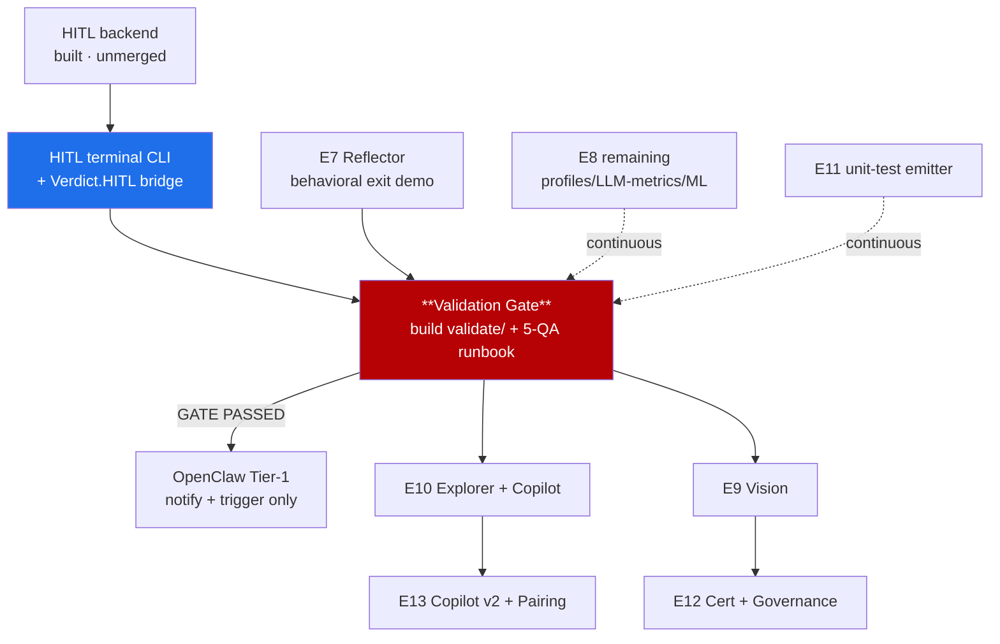

# CHERENKOV — Consolidated Delivery Plan (across-the-board status of record)

**Status:** Active plan of record · **Date:** 2026-06-04
**Supersedes** the open-question framing in [`07_MASTER_PLAN.md`](07_MASTER_PLAN.md) §9 (kept as the strategic rationale).
**Purpose:** one document that reconciles **code reality ↔ GitHub ↔ sequencing** so any agent or human can pick up the next shippable slice without re-deriving context.

This doc is the bridge between the *why* ([`00_VISION`](00_VISION.md)), the *what/when* ([`02_ROADMAP`](02_ROADMAP.md) E0–E6, [`07_MASTER_PLAN`](07_MASTER_PLAN.md) E7–E13) and the *now* (this file: verified state + the open backlog).

---

## 0. The one rule that orders everything

> **The Validation Gate eats first.** Track A (OpenAPI → Playwright conformance) must pass a real **5-QA validation gate** before E9–E13 frontier work or any external voice layer (OpenClaw, dashboard authoring) is allowed to consume it. Surfaces past the gate are labelled `do-not-extend-until-gate` and `blocked:validation-gate`. See [`HANDOVER.md`](../HANDOVER.md) and [`AGENTS.md`](../../AGENTS.md).

Everything below is sequenced against that gate, not against epoch numbers.

---

## 1. Verified state (against code on `main` @ `1eb88da`, 2026-06-04)

| Layer / Epoch | Module(s) | State | Evidence |
|---|---|---|---|
| L0 Substrate Router | `substrate/` (5 files) | ✅ **Done, tested** | E1 milestone closed; tier/egress/cost/cache |
| L1 Truth Model | `core/truth_model.py`, `truth/sources/*` | ✅ Done | E2 closed |
| L2 Divergence Engine | `divergence/{skeptic,witness,self_play,proof_run}` | ✅ **Runnable** | E3 closed |
| L3 Artifacts + eject | `truth/emitters/*`, `execution/*` | ✅ Done | E4 closed |
| L4 Continuity (daemon + PR diff) | `continuity/`, `stages/daemon_cmd` | ✅ Done | E4 closed |
| Self-healing (suggest-only) | `healing/*` (6 files) | ✅ Done | D7 honored |
| Perf baseline (statistical) | `stages/perf` | ✅ Done | E8 #107 anomaly detector merged |
| Visual baseline (pixel) | `stages/visual` | ✅ Done | — |
| **E7 Reflector & verdict memory** | `reflector/*` (5 files) | 🟢 **Largely landed** | #103 self-audit · #104 fingerprint suppression · #105 inspect CLI · #106 busy-timeout |
| **E8 Perf intelligence** | `stages/perf/anomaly.py` | 🟡 **Partial** | spike+drift detector landed (#107); generative profiles + LLM metrics + ML tier remain |
| **E11 Coverage SDET** | `sdet/*` (3 files) | 🟡 **Partial** | #92: coverage loop + assertion gate landed; unit-test emitter remains |
| **HITL queue backend** | `hitl/*` (3 files) | 🟡 **Built, unmerged** | branch `feat/hitl-queue-backend`; 2 smokes green (race 10/10, concurrency 5/5) |
| **Validation Gate** | `validate/` | 🔴 **Empty (0 files)** | the critical Track-A ship gate is not yet built |
| E9 Vision perception | — | 🔴 Absent | VLM provider/oracle not started |
| E10 Explorer + Copilot | — | 🔴 Absent | manual-QA pillar not started |
| E12 Cert + Governance | partial in `copilot/` | 🔴 Mostly absent | gold-set gate / KPIs not started |
| E13 Copilot v2 + Pairing | — | 🔴 Absent | Mentor/idiom-surfacing not started |
| Federation | `federation/` (4 files) | 🟡 Scaffolding | E6 frontier, deferred |

**GitHub state:** 16 milestones (all open, 0 open issues each — 81 issues closed), full label taxonomy present, `foundation-v0` pre-release tagged, governance/PM kit merged (#98). **Gap: the open backlog is empty** — the roadmap is not actionable as GitHub work until issues are (re)opened. §3 fixes that.

---

## 2. The critical path (sequenced by the gate, not by epoch number)

**Phase A — Make the gate reachable (now):**
1. Merge HITL backend PR (`feat/hitl-queue-backend`).
2. Terminal HITL CLI (`cherenkov hitl list|show|approve|reject --json`) + `Verdict.HITL → enqueue` bridge.
3. **Build the Validation Gate** (`validate/`): gate criteria, evidence collection, 5-QA runbook.
4. E7 behavioral exit demo (rejected findings stop recurring + Skeptic hit-rate ↑).

**Phase B — Pass the gate:** run Track A against ≥5 real QA targets; collect evidence; flip `blocked:validation-gate` issues to ready.

**Phase C — Post-gate frontier (only after B):** OpenClaw Tier-1 → E10/E9 → E12/E13. E8/E11 remainders run continuously, non-gating.

---

## 3. The open backlog (what becomes GitHub issues)

Mapped to existing milestones + labels. `agent-ready` = self-contained, an agent can start now. `blocked:validation-gate` = do not start until Phase B passes.

### Phase A — gate-reaching (P0/P1, `agent-ready`)

| # | Title | Milestone | Labels | Grows |
|---|---|---|---|---|
| A1 | HITL terminal CLI (`hitl list/show/approve/reject --json`) | Validation Gate | `type:feature` `agent-ready` `priority:P1` | `stages/`, wraps `hitl/store.py` |
| A2 | `Verdict.HITL → HitlQueue.enqueue` bridge in REVIEW | Validation Gate | `type:feature` `agent-ready` `priority:P1` | `divergence`/REVIEW → `hitl/` |
| A3 | HITL `GETTING_STARTED.md` + CLI demo entry (docs-gate) | Validation Gate | `documentation` `agent-ready` | `docs/` |
| A4 | **Build `validate/`: Validation Gate criteria + result contract** | Validation Gate | `type:contract` `agent-ready` `priority:P0` | new `cherenkov/validate/` |
| A5 | 5-QA validation runbook + evidence collector | Validation Gate | `type:proof` `priority:P0` `needs-human` | `docs/process/`, `validate/` |
| A6 | E7 behavioral exit demo (no-recur + hit-rate ↑) | Epoch 7 | `type:proof` `area:reflector` `agent-ready` | `reflector/`, `divergence/proof_run` |
| A7 | Wire Reflector into `proof_run` loop (rerank live) | Epoch 7 | `type:feature` `area:reflector` `agent-ready` | `divergence/proof_run.py` |

### Phase C — post-gate frontier (`blocked:validation-gate`)

| # | Title | Milestone | Labels |
|---|---|---|---|
| C1 | OpenClaw Tier-1 adapter (notify + trigger only, consumes `hitl/v1`) | Epoch 13 | `type:feature` `blocked:validation-gate` |
| C2 | E8 generative load profiles from `truth/sources/traffic.py` | Epoch 8 | `type:feature` `area:perf` |
| C3 | E8 LLM-aware metrics (TTFT/inter-token/tokens-sec/P95-99/cost) | Epoch 8 | `type:feature` `area:perf` |
| C4 | E8 ML anomaly tier (opt-in; statistical stays default) | Epoch 8 | `type:research` `area:perf` |
| C5 | E11 unit-test emitter (pytest/jest) in `truth/emitters/` | Epoch 11 | `type:feature` `agent-ready` |
| C6 | E9 VLMProvider as `[substrate.tiers.vision]` (egress-respecting) | Epoch 9 | `type:contract` `area:visual` `blocked:validation-gate` |
| C7 | E9 semantic visual oracle + element-identity self-heal | Epoch 9 | `type:feature` `area:visual` `blocked:validation-gate` |
| C8 | E10 Explorer crawl → Skeptic hypotheses (5xx/JS/visual) | Epoch 10 | `type:feature` `area:divergence` `blocked:validation-gate` |
| C9 | E10 NL-intent → artifact (`cherenkov author`) | Epoch 10 | `type:feature` `blocked:validation-gate` |
| C10 | E10 "second pair of eyes" pre-session digest + triage UX | Epoch 10 | `type:feature` `blocked:validation-gate` |
| C11 | E12 Gold-Set + RAG-Triad certification gate | Epoch 12 | `type:contract` `blocked:validation-gate` |
| C12 | E12 governance KPI panel (escape/FP/coverage/maintenance) | Epoch 12 | `type:feature` `area:frontend` `blocked:validation-gate` |
| C13 | E13 Mentor idiom-surfacing during authoring/triage | Epoch 13 | `type:feature` `area:reflector` `blocked:validation-gate` |
| C14 | E13 autonomy-ladder profiles (`assisted→predictive`) | Epoch 13 | `type:feature` `blocked:validation-gate` |

### Cross-cutting / repo hygiene (continuous)

| # | Title | Labels |
|---|---|---|
| X1 | Prune merged/stale branches (30+ remote branches) | `documentation` `agent-ready` |
| X2 | Apply branch-protection ruleset on `main` (per `GITHUB_PM.md §5`) | `needs-human` |
| X3 | CI runners for env-dependent smokes (node/k6/playwright) | `agent-ready` |
| X4 | MCP server/client (start after E9 exposes something worth serving) | `type:research` `blocked:validation-gate` |

---

## 4. Way of work (unchanged, restated so the plan is self-contained)

- **One epoch in flight.** Each issue is independently shippable. Branch from `origin/main`, isolated additive files, evidence-first PRs, avoid hot files (`core/contracts.py`, `cherenkov.py`) unless the ticket owns them.
- **Every seam is a versioned Pydantic contract** local to its package (e.g. `hitl/contracts.py`), never a core fork.
- **Agents never name a model** — route through `ReasoningRequest{capability_tier}`.
- **Sovereignty:** every expensive tier (VLM/ML) is opt-in behind a statistical/pixel default and honors the `egress` dial.
- **Trust:** no autonomous artifact enters a suite without adversarial self-play + no-shared-context verification. D7: never auto-edit test code.
- **Testing:** every issue ships `test_*.py` + `smoke_test_*.py` + a kill-criteria exit demo; CI green on `main`.
- **PM:** epics are tracking issues (`epic` label); tasks link to their epic and milestone; releases + CHANGELOG per merged epoch; wiki mirrors `docs/wiki/`.

---

## 5. Standing risks / flags

1. 🔐 **Revoke the GitHub PATs pasted in plaintext** earlier — the cached credential is still live.
2. **Swarm saturation** — every epoch has concurrent agents fixing each other's breakage. Enforce X2 (branch protection) so `main` stays green by construction; serialize agents per epoch.
3. **Validation Gate is the keystone risk** — it is empty (`validate/` 0 files) yet gates all frontier value. Phase A must land it before any C-work is unblocked.
4. **Reflector = storage not learning** — E7 exit (A6) is behavioral, not "memory exists."

---

## 6. Definition of done for "roadmap ready across the board"

- [x] Code reality reconciled against `main` (§1).
- [x] Critical path sequenced by the Validation Gate (§2).
- [x] Open backlog defined and mapped to milestones/labels (§3).
- [ ] Backlog opened as GitHub issues (Phase-A `agent-ready`, Phase-C `blocked:validation-gate`).
- [ ] HITL backend PR opened + merged.
- [ ] This doc cross-linked from `02_ROADMAP.md` and `07_MASTER_PLAN.md`.
</content>
</invoke>
