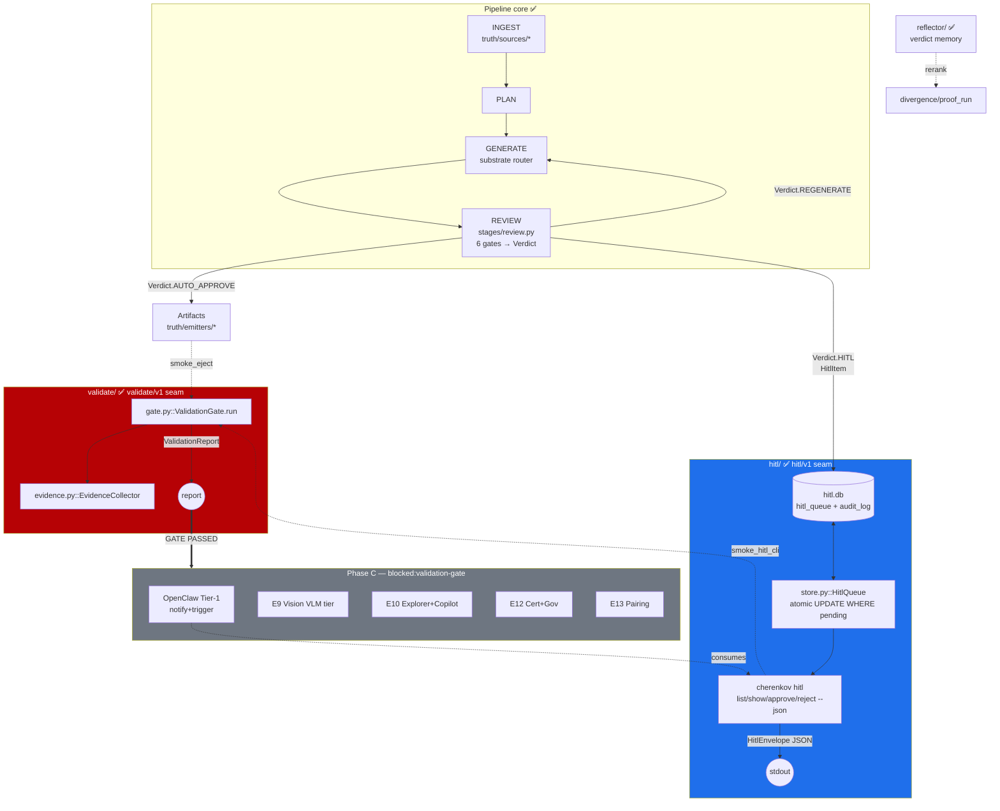

# CHERENKOV — All-Phases Wiring Schema (technical seam map)

**Status:** Active · **Date:** 2026-06-04 · **Companion to** [`08_DELIVERY_PLAN.md`](08_DELIVERY_PLAN.md)
**Purpose:** the exact module-to-module wiring, contracts, and data flow for every phase, so an agent can pick up any node knowing precisely what it consumes, what it emits, and where it plugs in. Grounded against code on `main`, not aspiration.

> Reading order: §1 legend → §2 system DAG → §3 contracts (the seams) → §4 per-phase wiring → §5 dependency matrix → §6 invariants enforced at each seam.

---

## 1. Legend

- `module/file.py::symbol` — concrete integration point.
- **Seam** = a versioned Pydantic contract local to its package. Cross-package calls happen ONLY through a seam, never by reaching into another package's internals.
- Status: ✅ built+tested · 🟡 partial · 🔴 absent.
- Edge label = the payload that crosses the seam.

---

## 2. System wiring DAG



---

## 3. The seams (contracts that wire packages together)

| Seam | Version | Defined in | Producer | Consumer(s) | Payload |
|---|---|---|---|---|---|
| **Reasoning** | — | `core/contracts.py::ReasoningRequest{capability_tier}` | every stage | `substrate/` router | model-agnostic inference request (agents never name a model) |
| **Verdict** | — | `core/contracts.py::Verdict` | `stages/review.py` | emitters / GENERATE / `hitl/` | `AUTO_APPROVE` / `HITL` / `REGENERATE` |
| **hitl/v1** | `hitl/v1` | `hitl/contracts.py` | `hitl/store.py`, CLI | OpenClaw, dashboard | `HitlEnvelope{ok,command,payload,error}` |
| **validate/v1** | `validate/v1` | `validate/contracts.py` | `validate/gate.py` | CI, 5-QA runbook | `ValidationReport{result,gates[],evidence_dir}` |
| **substrate tiers** | — | `[substrate.tiers.*]` config | router | tier providers (incl. future `vision`) | tier selection + egress/cost dials |

**Rule:** a new capability (e.g. VLM) joins by registering a *tier* and emitting through an *existing* seam — never by forking `core/contracts.py`.

### hitl/v1 envelope (frozen)
```
HitlEnvelope = { schema_version:"hitl/v1", ok:bool, command:str, payload:Any|null, error:HitlError|null }
HitlError    = { code ∈ {conflict,not_found,forbidden,invalid_input,db_locked,llm_unavailable}, message, detail }
HitlItem     = { id, status ∈ {pending,approved,rejected,ignored}, endpoint, method, mutation_*,
                 confidence, confidence_reason, review_gate_failed, approved_by, approved_at,
                 reject_reason, run_id, spec_hash, created_at }
```
Approve/reject success payload: `{id, action, previous_status, current_status, actor, actor_at, rows_affected:1}`.
Conflict detail: `{current_status, current_actor, current_actor_at}`.

---

## 4. Per-phase wiring + technical aspects

### PHASE A — make the gate reachable  *(status: ✅ landed on `main`, pending the 5-QA run)*

| ID | Node | Wiring (in → out) | Integration point | Status |
|---|---|---|---|---|
| A1 | HITL terminal CLI | argparse subcommands → `HitlQueue` → `HitlEnvelope` JSON to stdout | `cherenkov.py::hitl_parser` → `hitl/store.py::HitlQueue.{list,get,approve,reject}` | ✅ |
| A2 | `Verdict.HITL → enqueue` bridge | REVIEW computes `Verdict.HITL` (0.7–0.9 band) → builds `HitlItem` → `enqueue()` | `stages/review.py:245-275` (lazy import, non-fatal try/except) | ✅ |
| A4 | Validation Gate | runs 6 required + 2 optional smokes → `ValidationReport` | `validate/gate.py::ValidationGate.run` + `evidence.py::EvidenceCollector` | ✅ |
| A3 | HITL `GETTING_STARTED.md` | docs only; demos CLI round-trip | `docs/` | 🟡 verify |
| A5 | 5-QA runbook + evidence | human runs Track A ×5 → `EvidenceCollector` → gate | `docs/process/`, `validate/evidence.py` | 🔴 needs-human |
| A6/A7 | E7 Reflector exit + rerank | reflector verdict memory → reranks `proof_run` | `reflector/*` → `divergence/proof_run.py` | 🟡 |

**Concurrency model (the load-bearing detail):** approve/reject = single `UPDATE hitl_queue SET status=? WHERE id=? AND status='pending'`; `rowcount==1` → success, `==0` → re-read row → `conflict` (exists) or `not_found` (null). **Audit row written in the same transaction.** WAL + 30 s busy-timeout. Correct even if every voice layer is bypassed. Proven: `smoke_test_hitl_race.py` (10/10), `smoke_test_hitl_concurrency.py` (5/5).

**Validation Gate criteria (required → `fail` if any fail):** `smoke_track_a`, `smoke_hitl_race`, `smoke_hitl_concurrency`, `smoke_hitl_cli`, `smoke_eject`, `smoke_validate`. Optional (→ `degraded`): `smoke_healing`, `smoke_polish`. Result semantics: `pass` / `degraded` / `fail` per `validate/contracts.py::ValidationReport`.

### PHASE B — pass the gate  *(human-gated, no new code)*
Run Track A against **≥5 real QA targets** → `EvidenceCollector` captures outputs to `.cherenkov/evidence/` → `ValidationGate.run` must return `result:"pass"`. On pass, flip every `blocked:validation-gate` issue to ready. **This is the only gate to Phase C.** Until then Phase C stays mechanically blocked by label, not by goodwill.

### PHASE C — post-gate frontier  *(all `blocked:validation-gate`)*

| ID | Node | Wires into | Seam it consumes/extends | Notes |
|---|---|---|---|---|
| C1 | OpenClaw Tier-1 | shells `cherenkov … --json` | **consumes** `hitl/v1` (read/notify/trigger only) | NO DB access; voice not brain; Tier-1 = notify+trigger, not approve |
| C2 | E8 generative load profiles | `truth/sources/traffic.py` → perf | perf stage | non-gating, continuous |
| C3 | E8 LLM-aware metrics | perf stage (TTFT/inter-token/P95-99/cost) | perf | non-gating |
| C4 | E8 ML anomaly tier | opt-in behind statistical default | substrate tier + `egress` dial | research |
| C5 | E11 unit-test emitter | `truth/emitters/` (pytest/jest) | emitter seam | `agent-ready` even pre-gate (additive) |
| C6 | E9 VLMProvider | `[substrate.tiers.vision]` | **registers tier**, egress-respecting | no core fork |
| C7 | E9 semantic visual oracle | visual stage + element self-heal | oracle seam | depends C6 |
| C8 | E10 Explorer crawl → hypotheses | feeds `divergence/skeptic` | divergence seam | depends gate |
| C9 | E10 NL-intent → artifact | `cherenkov author` | emitter seam | depends gate |
| C10 | E10 pre-session digest/triage | reflector + hitl read | hitl/v1 read | depends gate |
| C11 | E12 Gold-Set + RAG-Triad cert | wraps gate as cert | validate/v1 extension | depends gate |
| C12 | E12 governance KPI panel | frontend over audit_log/verdicts | hitl/v1 + reflector read | depends gate |
| C13 | E13 Mentor idiom-surfacing | reflector during authoring | reflector seam | depends C9/C10 |
| C14 | E13 autonomy-ladder | profile over whole pipeline | config | last |

### Cross-cutting (continuous, non-gating)
`X1` prune 30+ stale branches · `X2` branch-protection on `main` (do before swarm fan-out) · `X3` CI runners for node/k6/playwright smokes · `X4` MCP server (after E9).

---

## 5. Dependency matrix (what blocks what)

```
A1 ✅ ──► A2 ✅ ──┐
A4 ✅ ───────────┼──► [GATE A complete] ──► B (5-QA run) ──► C1,C6,C7,C8,C9,C10,C11,C12,C13,C14
A5 🔴 ───────────┘                         │
A6/A7 🟡 ────────────────────────────────► │ (E7 exit feeds gate confidence, not blocking)
C2,C3,C4 (E8) ····· continuous, non-gating ┘
C5 (E11 emitter) ··· agent-ready now (additive, pre-gate OK)
X2 (branch-protect) ·· do BEFORE multi-agent fan-out
```

Hard edges: **A1→A2** (bridge needs the queue), **C6→C7** (oracle needs VLM tier), **{C9,C10}→C13** (mentor needs authoring surface). Everything else under C is parallel once B passes.

---

## 6. Invariants enforced at each seam (the guardrails agents must not break)

1. **Voice-not-brain** — voice layers (OpenClaw/dashboard) parse ONLY `HitlEnvelope`; never import `hitl.store` or touch `hitl.db`. Enforced by package boundary + `--json` contract.
2. **SQLite is SSOT + gatekeeper** — all state mutations go through atomic `WHERE status='pending'`; one DB per concern (`hitl.db`, `perf_metrics.db`, `verdicts.db`), no big-bang `state.db`.
3. **Model-agnostic** — stages emit `ReasoningRequest{capability_tier}`; never a model name. New models = new tier registration.
4. **D7 suggest-only** — healing/validation never auto-edit test code.
5. **Anti-lock-in** — `eject` strips all CHERENKOV imports; `smoke_eject` is a required gate.
6. **Every seam versioned** — `hitl/v1`, `validate/v1`; additive fields = no bump, rename/remove/retype = `v2` + `--schema-version` shim.
7. **Evidence-first** — every issue ships `test_*.py` + `smoke_test_*.py` + kill-criteria demo; CI green on `main`.
8. **The gate eats first** — no `blocked:validation-gate` node starts until Phase B returns `result:"pass"`.

---

## 7. Reconciliation note (code has moved past 08's snapshot)
`08_DELIVERY_PLAN.md §1` recorded `validate/` as 🔴 empty and HITL backend as unmerged (@`1eb88da`). As of `e944988`: HITL backend (`#136`), CLI (A1/`#109`), REVIEW bridge (A2/`#110`), and `validate/` gate (A4/`#112`) are **all merged on `main`**. The remaining Phase-A work is **A5 (the human 5-QA run)** and confirming **A3 docs**. Phase A is therefore code-complete; the keystone risk is now purely the human gate (Phase B), exactly as intended.
