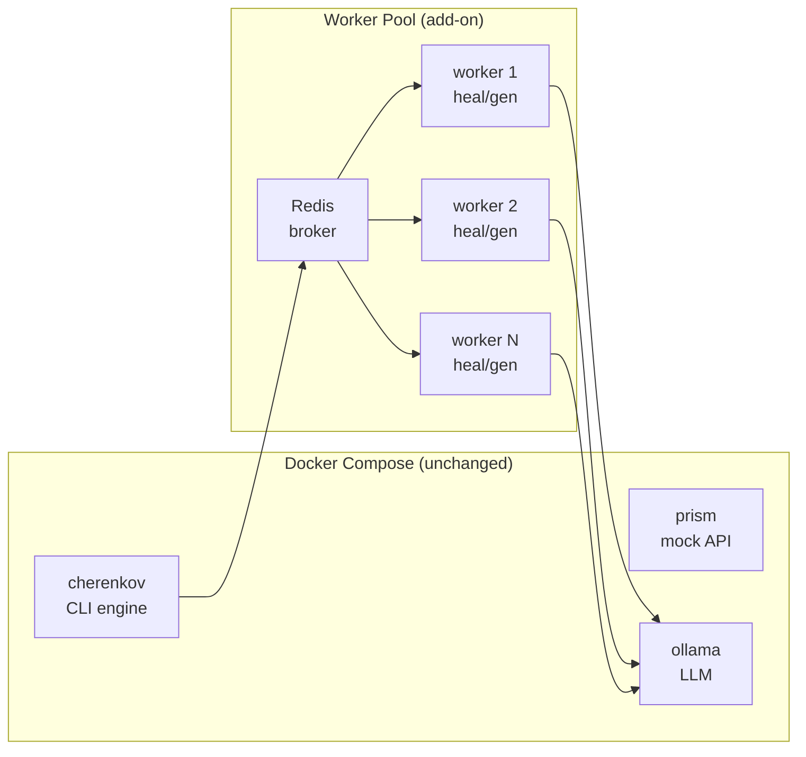
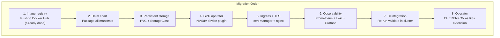
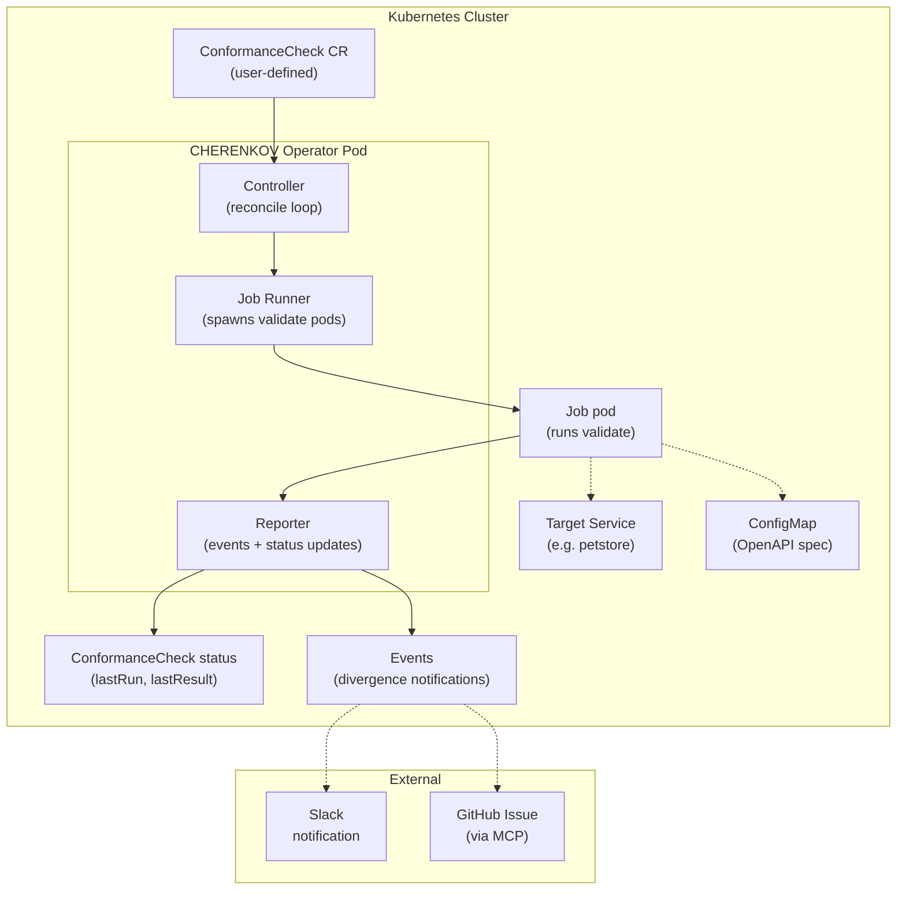

# CHERENKOV — Horizon 4: Kubernetes Considerations & Migration Plan

**Status:** Strategic analysis + implementation blueprint · **Date:** 2026-06-07
**Parent:** [`00_VISION.md`](00_VISION.md) (north-star), [`12_DOCKER_AI_HORIZON.md`](12_DOCKER_AI_HORIZON.md) (Docker integration)
**Predecessor:** [`13_DOCKER_AI_IMPLEMENTATION_PLAN.md`](13_DOCKER_AI_IMPLEMENTATION_PLAN.md) (Phases B-E)
**See also:** [`docs/ROADMAP_PACKAGING.md`](../ROADMAP_PACKAGING.md) (deferral trigger)

---

## Table of Contents

1. [Executive Summary](#1-executive-summary)
2. [Decision Framework — When Does K8s Become Necessary?](#2-decision-framework--when-does-k8s-become-necessary)
3. [Current Architecture → K8s Primitives Mapping](#3-current-architecture--k8s-primitives-mapping)
4. [Tiered Deployment Continuum](#4-tiered-deployment-continuum)
5. [Migration Path: Docker Compose → k3d → Full K8s](#5-migration-path-docker-compose--k3d--full-k8s)
6. [Helm Chart Architecture](#6-helm-chart-architecture)
7. [GPU Scheduling Strategy](#7-gpu-scheduling-strategy)
8. [Networking Topology](#8-networking-topology)
9. [Storage Architecture](#9-storage-architecture)
10. [Security Model](#10-security-model)
11. [Observability Stack](#11-observability-stack)
12. [CHERENKOV as a Kubernetes Operator](#12-cherenkov-as-a-kubernetes-operator)
13. [Cost Analysis](#13-cost-analysis)
14. [Rollback Strategy](#14-rollback-strategy)
15. [Decision Triggers & Checkpoints](#15-decision-triggers--checkpoints)
16. [Implementation Sequencing](#16-implementation-sequencing)
17. [Appendices](#17-appendices)

---

## 1. Executive Summary

CHERENKOV today runs as a Docker Compose stack on a single machine. This is correct for local development, demos, and the validation gate. Kubernetes becomes valuable when:

- **Multiple engineers** need to share agent fabric outputs
- **CI pipelines** need consistent, GPU-backed environments on demand
- **The agent fabric scales** beyond 3 agents to 8+ (sentinel, pilot, coverager, adjudicator, mentor)
- **HA becomes necessary** — the divergence engine cannot be offline during a release

**This document does not recommend migrating today.** It defines the *architecture and playbook* so that when the triggers fire, the migration is tactical, not exploratory. The key innovation: instead of merely deploying CHERENKOV *on* K8s, we design it as a **K8s-native conformance validator** that watches cluster state as a source of truth — a unique position no QA tool occupies.

---

## 2. Decision Framework — When Does K8s Become Necessary?

### 2.1 Trigger Matrix

| Trigger | Threshold | Impact | Urgency |
|---------|-----------|--------|---------|
| **Concurrent users** | ≥ 3 team members using agent fabric simultaneously | Agents contend for Ollama; no isolation | Medium |
| **Multi-node GPU** | Single node VRAM exhausted (LLM + VLM + embedding models > 8 GB) | Cannot run full stack on one machine | High |
| **CI GPU demand** | ≥ 5 CI jobs/day needing GPU inference | Self-hosted runner GPU contention | Medium |
| **Agent scale** | ≥ 5 agent types (current: 3) | Compose becomes unwieldy; no autoscaling | Medium |
| **Uptime requirement** | Need > 99% uptime for drift-watch service | Docker daemon restarts take the stack down | High |
| **Enterprise deployment** | ≥ 1 paying customer requiring HA | Contractual SLA | Critical |
| **Multi-tenant** | Isolated environments per team/project | Namespace isolation becomes necessary | Medium |

### 2.2 Anti-Patterns (Don't Migrate For These)

| Anti-pattern | Why |
|---|---|
| "K8s looks good on a pitch deck" | Adds operational cost without user-facing value |
| "Everyone else uses K8s" | CHERENKOV's users are QA engineers, not platform teams |
| "We need auto-scaling" | Auto-scaling LLMs doesn't work — GPU memory is the bottleneck, not CPU |
| "We need rolling updates" | Docker Compose with `update_config` handles zero-downtime for ≤ 5 replicas |

### 2.3 The Honest Alternative: Worker Pool Before K8s

Before full K8s, consider a **Celery/RQ + Redis** worker pool for the heaviest workloads:



**This may solve GPU contention + job queuing without introducing K8s complexity.** Documented as a spike branch, not a commitment.

---

## 3. Current Architecture → K8s Primitives Mapping

| Docker Compose Service | K8s Resource | Rationale |
|---|---|---|
| `prism` | `Deployment` + `Service` (ClusterIP) | Stateless mock server, horizontally scalable |
| `cherenkov` | `Deployment` or `Job` (ephemeral) | CLI tool — `Job` for ad-hoc runs, `Deployment` for persistent daemon modes |
| `cherenkov-demo` | `Deployment` + `Service` (NodePort/Ingress) | Needs external access |
| `ollama` | `StatefulSet` + `Service` (ClusterIP) | Stateful (model storage), GPU-dependent, ordered start |
| `ollama-init` | `InitContainer` or `Job` | One-shot model pull before Ollama serves |
| `explorer-agent` | `Deployment` (replicas=1..3) | Stateless agent, can scale horizontally |
| `healer-agent` | `Deployment` (replicas=1..2) | Stateless healing, needs Docker socket or Docker-in-Docker |
| `daemon-agent` | `Deployment` (replicas=1) | Leader-election for watch loop (singleton) |
| `openapi_cache` volume | `PersistentVolumeClaim` (ReadWriteOnce) | Shared cache across restarts |
| `ollama_models` volume | `PersistentVolumeClaim` (ReadWriteOnce) | Model storage, must persist across pod restarts |

### 3.1 K8s Resource Spec Template (ollama as StatefulSet)

```yaml
apiVersion: apps/v1
kind: StatefulSet
metadata:
  name: ollama
spec:
  serviceName: ollama
  replicas: 1
  selector:
    matchLabels:
      app: ollama
  template:
    metadata:
      labels:
        app: ollama
    spec:
      initContainers:
        - name: model-init
          image: curlimages/curl
          command:
            - sh
            - -c
            - |
              until curl -s -f http://ollama:11434/api/tags; do sleep 1; done
              curl -X POST http://ollama:11434/api/pull \
                -d '{"name":"qwen2.5-coder:7b"}'
              curl -X POST http://ollama:11434/api/pull \
                -d '{"name":"deepseek-r1:8b"}'
      containers:
        - name: ollama
          image: ollama/ollama
          ports:
            - containerPort: 11434
          env:
            - name: OLLAMA_HOST
              value: "0.0.0.0"
          resources:
            limits:
              nvidia.com/gpu: 1
              cpu: "4"
              memory: "8Gi"
            requests:
              cpu: "1"
              memory: "4Gi"
          volumeMounts:
            - name: models
              mountPath: /root/.ollama
          livenessProbe:
            httpGet:
              path: /api/tags
              port: 11434
            initialDelaySeconds: 120
            periodSeconds: 30
          readinessProbe:
            httpGet:
              path: /api/tags
              port: 11434
            initialDelaySeconds: 60
            periodSeconds: 15
  volumeClaimTemplates:
    - metadata:
        name: models
      spec:
        accessModes: ["ReadWriteOnce"]
        resources:
          requests:
            storage: 20Gi
```

---

## 4. Tiered Deployment Continuum

Not a binary "Compose vs. K8s" choice. Four tiers that share the same images and config:

```
Tier 1: Local Dev              Tier 2: Lightweight K8s         Tier 3: Production K8s         Tier 4: Multi-Cluster
─────────────────────          ───────────────────────         ──────────────────────         ──────────────────────
Docker Compose                 k3d (single-node K8s)          Full K8s (multi-node)          K8s + federation

No K8s knowledge               Same API as K8s               GPU operator                    Cross-cluster drift watch
One command                    k3d CLI                       Helm charts                     Global truth model
Minimal resource               ConfigMaps + Secrets           HPA auto-scaling
                               Volume snapshots               ClusterIssuer (cert-manager)
                               Traefik ingress                Prometheus + Grafana

─── validation gate ───►       ─── team adoption ───►         ─── enterprise ───►            ─── global scale ───►
```

### 4.1 Tier 1 → Tier 2 Decision Point

When to move from Compose to k3d:

- [ ] Team has 3+ members using agent fabric
- [ ] Need to persist ConfigMaps for policy distribution
- [ ] Someone on the team already knows kubectl
- [ ] Need Secrets management (Ollama API keys, Docker Hub creds)

### 4.2 Tier 2 → Tier 3 Decision Point

When to move from k3d to multi-node K8s:

- [ ] GPU memory exhausted on single node
- [ ] Need HA for drift-watch (>99% uptime)
- [ ] Need persistent logging/monitoring
- [ ] First paying customer with SLA requirements

---

## 5. Migration Path: Docker Compose → k3d → Full K8s

### 5.1 Phase 1: Compose → k3d (zero-commit K8s)

**Goal:** Run the identical stack under K8s API without changing the architecture.

Steps:

1. **Install k3d** (single binary, runs on any machine with Docker):
   ```bash
   k3d cluster create cherenkov \
     --servers 1 \
     --agents 1 \
     --gpus all \
     --volume /var/run/docker.sock:/var/run/docker.sock@agent:0 \
     --port 4010:4010@loadbalancer \
     --port 8000:8000@loadbalancer \
     --port 11434:11434@loadbalancer
   ```

2. **Generate K8s manifests** from docker-compose using `kompose`:
   ```bash
   kompose convert -o k8s/manifests/
   ```

3. **Tweak manifests:**
   - Replace `Deployment` with `StatefulSet` for ollama
   - Add `Service` accounts for the healer-agent (Docker socket access)
   - Add GPU resource requests
   - Add `InitContainer` for ollama-init

4. **Create `k3d/` directory** with:
   ```
   k3d/
   ├── cluster.yaml           # k3d cluster definition
   ├── config.yaml            # k3d config (ports, volumes, GPUs)
   └── README.md              # one-command bootstrap
   ```

5. **One-command bootstrap:**
   ```bash
   make k3d-up    # k3d cluster create + kubectl apply -k k8s/
   ```

### 5.2 Phase 2: k3d → Full K8s (production)

**Goal:** Migrate to a managed K8s cluster (EKS, AKS, GKE, or self-hosted) with all the production trimmings.



Key changes from k3d:

| Area | k3d (Tier 2) | Full K8s (Tier 3) |
|---|---|---|
| Cluster | Single-node via k3d | Multi-node managed (EKS/AKS/GKE) |
| Storage | Local volumes | EBS/CSI with snapshot |
| GPU | `--gpus all` flag | `nvidia-device-plugin` DaemonSet |
| Ingress | Traefik (k3d default) | NGINX Ingress + cert-manager |
| Monitoring | kubectl top | Prometheus + Grafana dashboards |
| Logging | kubectl logs | Loki + structured JSON logging |
| Secrets | k3d secrets | External Secrets Operator / Vault |

---

## 6. Helm Chart Architecture

### 6.1 Chart Structure

```text
charts/cherenkov/
├── Chart.yaml                    # name: cherenkov, version: 0.1.0
├── values.yaml                   # all configurable parameters
├── values/                       # environment-specific overrides
│   ├── local.yaml                # Tier 1 defaults (single node)
│   ├── team.yaml                 # Tier 2 defaults (k3d)
│   └── production.yaml           # Tier 3 defaults (HA)
├── templates/
│   ├── _helpers.tpl              # common templates
│   ├── namespace.yaml
│   ├── prism-deployment.yaml
│   ├── prism-service.yaml
│   ├── cherenkov-deployment.yaml
│   ├── cherenkov-service.yaml
│   ├── ollama-statefulset.yaml
│   ├── ollama-service.yaml
│   ├── ollama-init-job.yaml      # InitContainer pattern in StatefulSet
│   ├── agent-explorer-deployment.yaml
│   ├── agent-healer-deployment.yaml
│   ├── agent-daemon-deployment.yaml
│   ├── configmap-policy.yaml     # cherenkov-policy.json as ConfigMap
│   ├── configmap-settings.yaml   # cherenkov.toml as ConfigMap
│   ├── pvc-openapi-cache.yaml
│   ├── pvc-ollama-models.yaml
│   ├── serviceaccount-healer.yaml
│   ├── rbac.yaml
│   ├── ingress.yaml
│   └── hpa.yaml                  # HorizontalPodAutoscaler (agent services)
└── crds/                         # CRDs for operator mode
    └── cherenkov-checks.yaml
```

### 6.2 values.yaml Structure

```yaml
# ── Global ────────────────────────────────────────────────────
global:
  imageRegistry: "docker.io/cherenkov"
  imageTag: "latest"
  imagePullPolicy: "IfNotPresent"

# ── Services ──────────────────────────────────────────────────
prism:
  enabled: true
  replicaCount: 1
  image:
    repository: stoplight/prism
    tag: "5"
  resources:
    limits: { cpu: "0.5", memory: "256Mi" }
    requests: { cpu: "0.1", memory: "64Mi" }
  service:
    type: ClusterIP
    port: 4010

cherenkov:
  enabled: true
  replicaCount: 1
  mode: "service"   # "service" | "job" | "ephemeral"
  resources:
    limits: { cpu: "0.5", memory: "256Mi" }
    requests: { cpu: "0.1", memory: "64Mi" }

ollama:
  enabled: true
  gpu:
    enabled: true
    count: 1
  storage:
    size: 20Gi
    storageClass: ""
  resources:
    limits: { cpu: "4", memory: "8Gi", nvidia.com/gpu: "1" }
    requests: { cpu: "1", memory: "4Gi" }

agents:
  explorer:
    enabled: true
    replicas: 1
    resources:
      limits: { cpu: "0.5", memory: "128Mi" }
      requests: { cpu: "0.1", memory: "32Mi" }
  healer:
    enabled: true
    replicas: 1
    dockerSocket: true
    resources:
      limits: { cpu: "0.5", memory: "128Mi" }
      requests: { cpu: "0.1", memory: "32Mi" }
  daemon:
    enabled: true
    replicas: 1   # singleton — leader election via ConfigMap
    resources:
      limits: { cpu: "0.5", memory: "128Mi" }
      requests: { cpu: "0.1", memory: "32Mi" }

# ── Policy ────────────────────────────────────────────────────
policy:
  profile: "full-dev"
  configMap: "cherenkov-policy"  # created from cherenkov-policy.json

# ── Ingress ───────────────────────────────────────────────────
ingress:
  enabled: false
  host: "cherenkov.local"
  tls: true
  className: "nginx"

# ── Autoscaling ───────────────────────────────────────────────
autoscaling:
  enabled: false
  minReplicas: 1
  maxReplicas: 5
  targetCPUUtilizationPercentage: 80

# ── Observability ─────────────────────────────────────────────
monitoring:
  enabled: false
  prometheus:
    serviceMonitor: true
  logging:
    format: "json"
    level: "info"
```

### 6.3 Publishing the Chart

```bash
# Package and publish to OCI registry (same as Docker Hub)
helm package charts/cherenkov -d charts/releases/
helm push charts/releases/cherenkov-0.1.0.tgz \
  oci://docker.io/cherenkov/helm-charts

# Install
helm install cherenkov oci://docker.io/cherenkov/helm-charts \
  --values values/team.yaml
```

---

## 7. GPU Scheduling Strategy

### 7.1 The Challenge

GPU is the hardest constraint in K8s scheduling for CHERENKOV:
- Ollama needs ~4 GB VRAM per loaded model (qwen2.5-coder:7b + deepseek-r1:8b)
- Vision models (UI-TARS, Qwen3-VL) need ~8 GB each
- Embedding models need ~1 GB
- GPU memory is not fungible — two smaller GPUs are not the same as one large one

### 7.2 Strategy: GPU Tiers

```yaml
# Node labels for GPU capacity
nodes:
  gpu-small:    # RTX 3060 8GB — ollama only (current)
    - nvidia.com/gpu.product: "NVIDIA-GeForce-RTX-3060"
    - cherenkov.io/gpu-tier: "small"
  gpu-medium:   # RTX 4090 24GB — ollama + vision
    - nvidia.com/gpu.product: "NVIDIA-GeForce-RTX-4090"
    - cherenkov.io/gpu-tier: "medium"
  gpu-large:    # A100 80GB — everything + training
    - nvidia.com/gpu.product: "NVIDIA-A100-80GB"
    - cherenkov.io/gpu-tier: "large"

# Pod scheduling using nodeSelector
ollama:
  nodeSelector:
    cherenkov.io/gpu-tier: "small"   # 8 GB is enough for 2 models

vision-agent:
  nodeSelector:
    cherenkov.io/gpu-tier: "medium"  # needs 24 GB for VLM
```

### 7.3 Multi-Instance GPU (MIG) Partitioning

For A100/H100 nodes, use MIG to partition a single GPU:

```yaml
# MIG profile: 1g.5gb (5 GB compute instance)
resources:
  limits:
    nvidia.com/mig-1g.5gb: 1
```

### 7.4 GPU Operator Installation

```bash
# NVIDIA GPU Operator manages GPU drivers, device plugin, monitoring
helm repo add nvidia https://helm.ngc.nvidia.com/nvidia
helm install gpu-operator nvidia/gpu-operator \
  --set driver.enabled=true \
  --set migManager.enabled=false    # disable if not using MIG
```

---

## 8. Networking Topology

### 8.1 Service Mesh

```
External                    Cluster Internal
─────────                   ────────────────
Browser ───► Ingress ───► cherenkov-demo:8000
                  │
Agent fabric ───► | ───► ollama:11434
                  │
CLI            ───► cherenkov:8001 (API)
                        │
                        ├──► prism:4010 (mock API)
                        ├──► ollama:11434 (LLM)
                        └──► agents (gRPC or HTTP)
```

### 8.2 Agent-to-Agent Communication

As the agent fabric grows beyond 3 agents, inter-agent communication needs a protocol:

| Phase | Approach | Why |
|---|---|---|
| Tier 1-2 | HTTP + shared host networking | Simplicity, all on one node |
| Tier 3 | gRPC + service mesh (Istio/Linkerd) | Agent agents are long-lived streams |
| Tier 4 | Async via message bus (NATS/Kafka) | Cross-cluster, decoupled |

### 8.3 Network Policies

```yaml
apiVersion: networking.k8s.io/v1
kind: NetworkPolicy
metadata:
  name: isolate-agents
spec:
  podSelector:
    matchLabels:
      cherenkov.io/role: agent
  policyTypes:
    - Ingress
    - Egress
  ingress:
    - from:
        - podSelector:
            matchLabels:
              cherenkov.io/role: daemon  # only daemon talks to agents
  egress:
    - to:
        - podSelector:
            matchLabels:
              app: ollama  # agents can talk to Ollama
    - to:
        - namespaceSelector: {}
          podSelector:
            matchLabels:
              k8s-app: kube-dns  # DNS
---
# Egress sovereignty — agents cannot reach the internet
apiVersion: networking.k8s.io/v1
kind: NetworkPolicy
metadata:
  name: egress-sovereignty
spec:
  podSelector:
    matchLabels:
      cherenkov.io/egress: "none"
  egress:
    - to:
        - ipBlock:
            cidr: 10.0.0.0/8    # cluster-internal only
        - ipBlock:
            cidr: 172.16.0.0/12
        - ipBlock:
            cidr: 192.168.0.0/16
```

---

## 9. Storage Architecture

### 9.1 Volume Types

| Data | Volume Type | Size | Backup | Notes |
|---|---|---|---|---|
| Ollama models | PVC (ReadWriteOnce) | 20 GB | Snapshot weekly | Bulk model downloads, slow to rehydrate |
| OpenAPI cache | PVC (ReadWriteOnce) | 1 GB | None | Ephemeral, can be rebuilt |
| Output/test results | PVC or HostPath | 10 GB | Optional | CI artifacts, short-lived |
| SQLite databases | PVC (ReadWriteOnce) | 100 MB | Snapshot daily | Verdicts, configuration, HITL queue |
| Policy/Config | ConfigMap | — | Git-backed | Immutable, versioned |

### 9.2 StorageClass Configuration

```yaml
# Local-path for k3d (fast, no network latency)
apiVersion: storage.k8s.io/v1
kind: StorageClass
metadata:
  name: cherenkov-local
provisioner: rancher.io/local-path
reclaimPolicy: Retain
---
# EBS gp3 for production (backup + snapshot support)
apiVersion: storage.k8s.io/v1
kind: StorageClass
metadata:
  name: cherenkov-ebs
provisioner: ebs.csi.aws.com
parameters:
  type: gp3
  iops: "3000"
  throughput: "125"
reclaimPolicy: Retain
allowVolumeExpansion: true
```

### 9.3 Backup Strategy

```yaml
# Velero backup schedule
apiVersion: velero.io/v1
kind: Schedule
metadata:
  name: cherenkov-daily
spec:
  schedule: "0 2 * * *"
  template:
    includedNamespaces:
      - cherenkov
    includedResources:
      - persistentvolumeclaims
      - configmaps
    ttl: 720h  # 30 days
```

---

## 10. Security Model

### 10.1 Service Accounts & RBAC

```yaml
apiVersion: v1
kind: ServiceAccount
metadata:
  name: healer-agent
---
apiVersion: rbac.authorization.k8s.io/v1
kind: Role
metadata:
  name: healer-role
rules:
  - apiGroups: [""]
    resources: ["pods", "pods/exec"]
    verbs: ["get", "list", "create"]  # healer creates pods for sandbox execution
---
apiVersion: rbac.authorization.k8s.io/v1
kind: RoleBinding
metadata:
  name: healer-binding
subjects:
  - kind: ServiceAccount
    name: healer-agent
roleRef:
  kind: Role
  name: healer-role
  apiGroup: rbac.authorization.k8s.io
```

### 10.2 Pod Security Standards

```yaml
apiVersion: v1
kind: Namespace
metadata:
  name: cherenkov
  labels:
    pod-security.kubernetes.io/enforce: restricted
    pod-security.kubernetes.io/audit: restricted
    pod-security.kubernetes.io/warn: restricted
---
# Exception: healer-agent needs Docker socket → privileged
apiVersion: v1
kind: Pod
metadata:
  annotations:
    container.apparmor.security.beta.kubernetes.io/healer: unconfined
  labels:
    pod-security.kubernetes.io/enforce: baseline   # relaxed for this pod
```

### 10.3 Secrets Management

```yaml
apiVersion: external-secrets.io/v1beta1
kind: ExternalSecret
metadata:
  name: cherenkov-secrets
spec:
  refreshInterval: 1h
  secretStoreRef:
    kind: ClusterSecretStore
    name: vault-backend
  target:
    name: cherenkov-secrets
  data:
    - secretKey: docker_username
      remoteRef:
        key: cherenkov/prod/docker
        property: username
    - secretKey: docker_password
      remoteRef:
        key: cherenkov/prod/docker
        property: password
```

---

## 11. Observability Stack

### 11.1 Metrics (Prometheus)

Key metrics to export from each CHERENKOV service:

| Metric | Type | Labels | Description |
|---|---|---|---|
| `cherenkov_validations_total` | Counter | status, target | Total validation runs |
| `cherenkov_divergences_found` | Gauge | severity, gate | Active divergences |
| `cherenkov_agent_runs_total` | Counter | agent, result | Agent execution count |
| `cherenkov_llm_latency_seconds` | Histogram | model, provider | LLM response time |
| `cherenkov_llm_tokens_total` | Counter | model, direction | Token usage |
| `cherenkov_queue_depth` | Gauge | queue | HITL queue depth |
| `cherenkov_memory_bytes` | Gauge | type | Process memory (model, cache) |

### 11.2 Logging (Loki)

Structured JSON logging format:

```json
{
  "timestamp": "2026-06-07T10:00:00Z",
  "level": "info",
  "service": "explorer-agent",
  "trace_id": "abc123",
  "span_id": "def456",
  "message": "Exploring endpoint GET /api/v1/users",
  "divergence_id": "div_789",
  "duration_ms": 1234
}
```

### 11.3 Dashboards (Grafana)

Pre-built dashboard panels:

```
Kubernetes / CHERENKOV Overview
├── Cluster Health
│   ├── Node GPU utilization
│   ├── Pod CPU/Memory by service
│   └── PVC usage
├── Validation Pipeline
│   ├── Validations per hour [bar chart]
│   ├── Divergences by severity [stacked area]
│   └── Validate success rate [gauge]
├── Agent Fabric
│   ├── Agent runs per type [donut]
│   ├── Agent queue depth [time series]
│   └── Agent error rate [heatmap]
├── LLM Performance
│   ├── P50/P95/P99 latency [line]
│   ├── Token throughput [area]
│   └── Cost per run [bar]
└── HITL Queue
    ├── Queue depth [gauge]
    ├── Avg review time [stats]
    └── Accept/Reject ratio [pie]
```

### 11.4 Alerting Rules

```yaml
groups:
  - name: cherenkov-alerts
    rules:
      - alert: OllamaDown
        expr: probe_success{target="ollama:11434/api/tags"} == 0
        for: 5m
        severity: critical

      - alert: GPUOvercommit
        expr: sum(nvidia_gpu_memory_used_bytes) / sum(nvidia_gpu_memory_total_bytes) > 0.9
        for: 2m
        severity: warning

      - alert: ValidationFailureSpike
        expr: rate(cherenkov_validations_total{status="fail"}[5m]) > 10
        for: 5m
        severity: warning

      - alert: AgentQueueBacklog
        expr: cherenkov_queue_depth > 50
        for: 10m
        severity: warning
```

---

## 12. CHERENKOV as a Kubernetes Operator

This is the innovative play — not just running on K8s, but becoming a K8s-native tool.

### 12.1 Concept

A Kubernetes Operator extends the K8s API with custom resources. CHERENKOV would introduce:

```yaml
apiVersion: cherenkov.io/v1alpha1
kind: ConformanceCheck
metadata:
  name: petstore-api-check
spec:
  # Source of truth
  specRef:
    kind: ConfigMap
    name: petstore-openapi
    key: openapi.yaml

  # Target to validate against
  target:
    service:
      name: petstore
      namespace: default
      path: /api/v3

  # What to check
  gates:
    - status-code     # 200 vs spec. 401 vs spec
    - response-schema # actual body matches spec schema
    - drift-watch     # periodic re-check

  # Schedule
  schedule: "*/30 * * * *"  # every 30 minutes as CronJob

  # What to do on divergence
  onDivergence:
    - emitEvent: true
    - createIssue:             # creates GitHub issue via MCP
        repo: myorg/myrepo
    - notifyWebhook:
        url: "https://hooks.slack.com/..."
```

### 12.2 CRD Design

```yaml
apiVersion: apiextensions.k8s.io/v1
kind: CustomResourceDefinition
metadata:
  name: conformancechecks.cherenkov.io
spec:
  group: cherenkov.io
  names:
    kind: ConformanceCheck
    plural: conformancechecks
    shortNames:
      - ccc
  scope: Namespaced
  versions:
    - name: v1alpha1
      served: true
      storage: true
      schema:
        openAPIV3Schema:
          type: object
          required: [spec]
          properties:
            spec:
              type: object
              required: [target, gates]
              properties:
                specRef:
                  type: object
                  properties:
                    kind: { type: string }
                    name: { type: string }
                    key:  { type: string }
                target:
                  type: object
                  properties:
                    service:  { type: object }
                    ingress:  { type: object }
                    external: { type: string }
                gates:
                  type: array
                  items:
                    type: string
                    enum: [status-code, response-schema, drift-watch]
                schedule:
                  type: string
                onDivergence:
                  type: array
                  items:
                    type: object
                    properties:
                      emitEvent:  { type: boolean }
                      createIssue: { type: object }
                      notifyWebhook: { type: object }
            status:
              type: object
              properties:
                lastRun:
                  type: string
                  format: date-time
                lastResult:
                  type: string
                  enum: [pass, fail, error]
                divergences:
                  type: integer
                conditions:
                  type: array
                  items:
                    type: object
```

### 12.3 Operator Architecture



### 12.4 Operator Benefits

| Capability | Without Operator | With Operator |
|---|---|---|
| Spec management | File on disk | ConfigMap, versioned, GitOps |
| Service discovery | Hardcoded URL | K8s Service lookup by name |
| Validation triggers | Manual or cron | Watch Service/Ingress changes |
| Divergence notification | Log file | K8s Events, webhook, GitHub issue |
| Rollback detection | Manual | Watch Deployment rollbacks → re-validate |
| Scale | Single process | Per-namespace controller, multi-tenant |

### 12.5 Implementation Path

1. **Phase 1: Controller** — `kubebuilder` scaffold + reconcile loop that reads `ConformanceCheck`
2. **Phase 2: Job Runner** — spawn a `cherenkov validate` Job pod per check
3. **Phase 3: Watcher** — watch Service/Ingress changes and trigger re-validation
4. **Phase 4: Status Reporter** — write results back to CR status, emit events

---

## 13. Cost Analysis

### 13.1 Monthly Cost Comparison

| Component | Docker Compose (Tier 1) | k3d (Tier 2) | Full K8s (Tier 3, EKS) |
|---|---|---|---|
| Compute (1 node) | $0 (existing hardware) | $0 (existing hardware) | $150/mo (c5.2xlarge, 8 vCPU, 16 GB) |
| GPU | $0 (RTX 5060 laptop) | $0 (same GPU) | $400/mo (g4dn.xlarge, 16 GB VRAM) |
| Storage (20 GB) | $0 (local) | $0 (local) | $5/mo (EBS gp3) |
| Control plane | $0 | $0 | $75/mo (EKS cluster fee) |
| Load balancer | $0 | $0 | $20/mo |
| NAT Gateway | $0 | $0 | $35/mo |
| **Total** | **$0** | **$0** | **$685/mo** |

### 13.2 When The Cost Is Justified

| Scenario | Monthly Cost | Value |
|---|---|---|
| Team of 5 QA engineers | $685 | 5 × avg QA salary $8k/mo = $40k/mo protected |
| CI pipeline 200 runs/mo | $685 | 200 manual validation hours saved = ~$10k/mo |
| Compliance requirement | $685 | Audit trail, RBAC, network policies — non-negotiable for regulated |
| Enterprise SLA | $685 | Downtime > 1 hr/mo costs more than cluster |

**Recommendation:** absorb K8s cost at the first enterprise customer or when the team exceeds 5 engineers.

---

## 14. Rollback Strategy

### 14.1 Rollback Checklist

Every deployment must be reversible within 30 minutes:

| Step | Command | Time |
|---|---|---|
| 1. Verify rollback target | `kubectl rollout history deployment/cherenkov` | 1 min |
| 2. Rollback | `kubectl rollout undo deployment/cherenkov --to-revision=N` | 2 min |
| 3. Verify health | `kubectl rollout status deployment/cherenkov` | 2 min |
| 4. Check metrics | `divergences_found` should return to pre-deploy baseline | 5 min |
| 5. Verify agent fabric | `kubectl logs daemon-agent` no errors | 5 min |
| 6. Verify LLM | `kubectl exec ollama-0 -- ollama list` | 2 min |
| **Total** | | **~15 min** |

### 14.2 GitOps with Flux/ArgoCD

```yaml
apiVersion: kustomize.toolkit.fluxcd.io/v1
kind: Kustomization
metadata:
  name: cherenkov
spec:
  interval: 10m
  path: ./k8s/overlays/production
  prune: true
  sourceRef:
    kind: GitRepository
    name: cherenkov-infra
  healthChecks:
    - kind: Deployment
      name: cherenkov
    - kind: StatefulSet
      name: ollama
```

Rollback with GitOps: `git revert HEAD && git push`

### 14.3 Data Rollback

| Scenario | Recovery | RPO | RTO |
|---|---|---|---|
| Model corruption | Restore PVC from Velero snapshot | 24 h | 1 h |
| Verdict DB corruption | SQLite backup from PVC clone | 1 h | 30 min |
| Config error | Git revert ConfigMap source | 10 min | 5 min |
| Container image bug | Rollout undo to previous image tag | N/A | 5 min |

---

## 15. Decision Triggers & Checkpoints

### 15.1 Gate Check: Should We Migrate?

Before ANY migration work (beyond this document), verify:

- [ ] Validation gate (Phase 2, 5 QA users) has passed — demand is real
- [ ] At least one team member has passed CKA or equivalent K8s experience
- [ ] We have a committed user who will run the K8s version within 30 days
- [ ] Docker Compose has failed us in a concrete way (specify which trigger from §2.1)
- [ ] Budget allocated for cluster costs ($685/mo minimum, see §13)

If any of these is ❌, stay on Docker Compose or at most k3d.

### 15.2 Tier Progression Checkpoints

```
Tier 1 (Compose)
  │
  ├── Trigger: ≥3 team members + K8s knowledge available
  │
  ▼
Tier 2 (k3d)
  │
  ├── Verify: Can we express everything as Helm values?
  ├── Verify: Do ConfigMaps replace config file management?
  ├── Verify: Can an intern bootstrap from scratch in 15 min?
  │
  ├── Trigger: GPU contention on single node + ≥1 paying user
  │
  ▼
Tier 3 (Full K8s)
  │
  ├── Verify: Are all probes accurate? (no false positives)
  ├── Verify: Can we recover from node failure in < 5 min?
  ├── Verify: Are backup restores tested and documented?
  │
  ├── Trigger: Cross-region HA required by SLA
  │
  ▼
Tier 4 (Multi-Cluster)
```

### 15.3 Monthly K8s Health Score

```bash
#!/usr/bin/env bash
# k8s-health-score.sh — score 0-100
score=100
# Deductions:
kubectl get nodes -o json | jq '.items[].status.conditions[] | select(.type=="Ready" and .status!="True")' && score=$((score-20))
kubectl top pods --no-headers 2>/dev/null | awk '$3 ~ /[0-9]+m/ && int($3) > 800 {score=score-5}'  # CPU > 80%
kubectl get events --all-namespaces --field-selector type=Warning -ojson | jq '.items | length' | while read n; do [ $n -gt 10 ] && score=$((score-15)); done
echo "K8s Health Score: $score/100"
```

---

## 16. Implementation Sequencing

### 16.1 Phase 0: Preparation (Compose Hardening) — DONE

What was done in this session:

- [x] Health checks on every service (HTTP probes for HTTP services, pgrep for daemons)
- [x] Resource limits (CPU + memory per service)
- [x] Resource reservations (guaranteed minimum resources)
- [x] Update config with start-first + rollback on failure
- [x] Restart policy (`unless-stopped`)
- [x] Stop grace periods (120s for Ollama model unloading)
- [x] `depends_on` with `condition: service_healthy` for ordered startup

### 16.2 Phase 1: k3d Bootstrap (1-2 days)

- [ ] Create `k3d/` directory with cluster config
- [ ] Generate initial K8s manifests with `kompose`
- [ ] Tune for GPU, StatefulSet, InitContainers
- [ ] Create `Makefile` targets: `k3d-up`, `k3d-down`, `k3d-reset`
- [ ] Verify all 8 services run identically to Compose
- [ ] Write `k3d/README.md` with one-command bootstrap

### 16.3 Phase 2: Helm Chart (2-3 days)

- [ ] Scaffold Helm chart
- [ ] Port manifests to templates with values
- [ ] Create environment overrides (local, team, production)
- [ ] Create `ConfigMap` templates for policy + settings
- [ ] Add HPA for agent services
- [ ] Publish to Docker Hub OCI registry
- [ ] CI: validate Helm chart compiles (`helm lint` + `helm template`)

### 16.4 Phase 3: Production K8s (1-2 weeks, contingent on need)

- [ ] NVIDIA GPU operator installation
- [ ] cert-manager + ingress (NGINX or Traefik)
- [ ] Prometheus + Grafana dashboards
- [ ] Loki for structured logging
- [ ] Velero for volume backup
- [ ] External Secrets Operator for production secrets
- [ ] Network policies for egress sovereignty
- [ ] Pod security policies

### 16.5 Phase 4: Operator (2-4 weeks, innovation bet)

- [ ] `kubebuilder` scaffold
- [ ] `ConformanceCheck` CRD
- [ ] Reconciler that reads spec from ConfigMap
- [ ] Job runner that spawns `cherenkov validate` pods
- [ ] Watcher for Service/Ingress changes
- [ ] Status reporter (CR status + Events + webhook)
- [ ] Helm chart for the operator itself

---

## 17. Appendices

### A. Glossary

| Term | Definition |
|---|---|
| k3d | Lightweight K8s distribution, runs in Docker |
| k3s | CNCF-certified lightweight K8s by Rancher |
| MIG | Multi-Instance GPU — partition A100/H100 into isolated GPU slices |
| Velero | Open-source backup/migration tool for K8s |
| External Secrets | K8s operator that syncs secrets from external providers (AWS, Vault) |
| Flux/ArgoCD | GitOps operators for K8s |
| Prometheus Operator | Manages Prometheus instances via CRDs |

### B. Quick-Reference Commands

```bash
# k3d cluster
k3d cluster create cherenkov --config k3d/cluster.yaml
k3d cluster delete cherenkov

# Deploy
kubectl apply -k k8s/overlays/team

# Helm
helm install cherenkov charts/cherenkov --values charts/cherenkov/values/team.yaml
helm upgrade --install cherenkov charts/cherenkov --values charts/cherenkov/values/production.yaml

# Debug
kubectl logs -l app=ollama -c ollama
kubectl exec ollama-0 -- ollama list
kubectl port-forward svc/ollama 11434:11434

# GPU
kubectl describe nodes | grep nvidia.com/gpu
kubectl logs -n gpu-operator -l app=nvidia-operator-validator

# Backup
velero backup create cherenkov-daily --include-namespaces cherenkov
velero restore create --from-backup cherenkov-daily
```

### C. Migration Decision Tree

```
Does the current stack cause concrete pain?
├── No → Stay on Docker Compose. Revisit in 3 months.
└── Yes → Is it GPU contention?
│       ├── Yes → Try worker pool (Celery/RQ) first. If still saturated, go to k3d.
│       └── No → Is it team collaboration?
│               ├── Yes → k3d (same K8s API, team can share).
│               └── No → Is it uptime/HA?
│                       ├── Yes → Full K8s with multi-node.
│                       └── No → Is it enterprise/SLA?
│                               ├── Yes → Full K8s + Operator.
│                               └── No → Fix the specific Compose gap.
└── After 3 months on k3d: is the K8s API creating value?
        ├── No → Revert to Compose. K8s was overhead.
        └── Yes → Consider full K8s.
```

### D. References

- [k3d documentation](https://k3d.io) — lightweight K8s in Docker
- [NVIDIA GPU Operator](https://docs.nvidia.com/datacenter/cloud-native/gpu-operator/) — GPU scheduling for K8s
- [Kubebuilder](https://kubebuilder.io) — framework for building K8s operators
- [Kompose](https://kompose.io) — Docker Compose → K8s manifest converter
- [Velero](https://velero.io) — backup and migrate K8s resources
- [External Secrets Operator](https://external-secrets.io) — sync secrets from external APIs
- [Prometheus Operator](https://prometheus-operator.dev) — K8s-native monitoring
