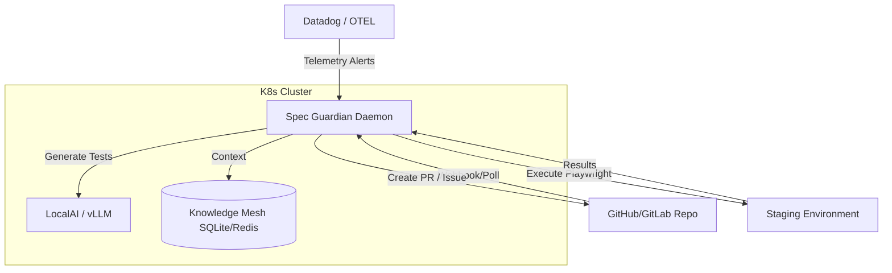

# Vision 20: Spec Guardian Daemon

**Status:** Proposed (Horizon 3)
**Epic:** TBD (Phase 14)
**Related ADR:** [ADR-009](../adr/ADR-009-spec-guardian-daemon.md)

## 1. The Core Concept

The "Spec Guardian" represents the ultimate evolution of CHERENKOV QA from a reactive, push-based CLI tool into a proactive, continuous quality assurance daemon.

Rather than running only when a developer invokes it or when a CI/CD pipeline triggers, the Spec Guardian operates as a persistent background process (deployed as a K8s operator). It acts as an "always-on" sentinel that ensures API specifications, implementation code, and live server behavior remain perfectly synchronized.

## 2. The Agentic Loop

The Guardian continuously executes the following autonomous loop:

1. **Observe**: Monitors Git repositories for changes to `openapi.yaml`, GraphQL schemas, or backend source code. Simultaneously hooks into APM telemetry (Datadog, OpenTelemetry) to watch for 5xx errors or unexpected schema payloads in production.
2. **Infer**: When a change or error is detected, the Guardian infers the scope of the impact. Which endpoints are affected? What new test cases are required?
3. **Generate**: Spins up a targeted test generation session (utilizing the local `qwen2.5-coder` model or the future `cherenkov-coder` fine-tune) to create new Playwright tests covering the delta.
4. **Execute**: Runs the new test suite against staging or ephemeral preview environments.
5. **Act**:
   - If tests pass and coverage is improved, the Guardian opens a Pull Request with the updated test suite.
   - If tests fail, indicating a divergence between the spec and the server, the Guardian files a rich defect ticket containing execution traces and suggest-only healing verdicts.

## 3. The D7 Invariant (Safety First)

To prevent the "Integrity Gap" (assertion weakening and test deletion) commonly found in naive autonomous testing tools, the Spec Guardian operates under strict guardrails:
- **Never Auto-Merge**: The Guardian can open PRs, but a human must review and merge them.
- **Never Loosen Assertions**: The Guardian cannot modify existing assertions to make a failing test pass. Expected values remain strictly derived from the OpenAPI spec.
- **Suggest-Only Healing**: All code modifications are proposed as patches or suggestions, never applied directly to the master branch.

## 4. Architecture

## 5. Next Steps

- Implement the base event loop (`cherenkov/daemon/watcher.py`).
- Define the Webhook handlers for GitHub pushes.
- Integrate the K8s Operator to manage daemon lifecycle natively.
