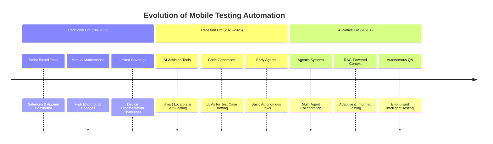

MOBILE TESTING RESEARCH:

# Mobile Testing in the AI Era: How LLMs, RAGs, and Agents Are Redefining QA

The landscape of mobile application testing is undergoing a fundamental transformation. Driven by the convergence of Large Language Models (LLMs), Retrieval-Augmented Generation (RAG), and autonomous AI agents, we are moving from brittle, script-based automation toward intelligent, adaptive, and context-aware systems 【turn0search0】【turn0search5】. This shift promises to alleviate the chronic pain points of mobile QA—device fragmentation, UI volatility, and maintenance overhead—while dramatically improving test coverage and efficiency.

## 🔍 The Paradigm Shift: From Scripts to Intelligence

Traditional mobile testing, dominated by frameworks like Appium, relies on explicit, hardcoded locators (XPath, IDs) and predefined scripts. This approach is inherently fragile—a single UI change can break numerous tests, leading to a maintenance nightmare 【turn0search5】【turn0search7】. The AI era introduces a paradigm where tests are generated from natural language, adapt in real-time to application changes, and can autonomously explore complex user scenarios.

The core enablers of this shift are:
*   **LLMs (Large Language Models):** Understand app semantics, generate test logic from plain English, and reason about application state 【turn0search0】【turn0search12】.
*   **RAG (Retrieval-Augmented Generation):** Provides LLMs with relevant, up-to-date context from documentation, codebases, and test histories, ensuring informed and accurate test generation 【turn0search10】【turn0search11】.
*   **AI Agents:** Autonomous entities that can observe, decide, execute, and learn, mimicking human tester behavior without constant oversight 【turn0search0】【turn0search5】【turn0search7】.

## 🤖 Core AI Technologies in Mobile Testing

### 1. Large Language Models (LLMs) as Test Engineers
LLMs are the cognitive engine, transforming how test cases are authored and executed. Their role extends beyond simple code generation to semantic understanding and reasoning.

*   **Natural Language Test Authoring:** Testers can now write instructions in plain English, such as "Log in as a guest and bypass any paywall," which the LLM interprets and executes 【turn0search7】. This eliminates the need for selector logic and lowers the technical barrier for test creation.
*   **Intelligent Element Identification:** LLMs can analyze the DOM or view hierarchy to identify elements based on their role and context (e.g., "the login button") rather than brittle attributes, enabling self-healing capabilities 【turn0search11】.
*   **Scenario-Based Test Generation:** Advanced approaches like **ScenGen** use multi-modal LLMs within a multi-agent framework (Observer, Decider, Executor, Supervisor, Recorder) to simulate human-like exploration of app scenarios, not just random events 【turn0search5】.

📖 Deep Dive: The ScenGen Multi-Agent Framework

ScenGen, driven by LLMs, structures the GUI testing process as an iterative OODA Loop (Observe, Orient, Decide, Act) 【turn0search5】:
1.  **Observer:** Identifies GUI widgets and their attributes from the current screen state.
2.  **Decider:** Formulates a context-aware operation plan based on the app's state and the testing goal.
3.  **Executor:** Carries out the planned actions (e.g., click, type).
4.  **Supervisor:** Verifies if the action met the scenario's requirements and provides feedback.
5.  **Recorder:** Logs actions, context, and bugs to memory for future iterations and learning.
This collaborative architecture allows for more coherent, scenario-driven testing compared to random exploration.

### 2. RAG: Giving LLMs Context and Memory
A significant challenge for LLMs is hallucination—genering plausible but incorrect test steps or selectors. RAG mitigates this by grounding the LLM in factual, retrieved context.

*   **How RAG Works in Testing:** When generating a test, the RAG system first retrieves relevant information from a knowledge base. This base can include app documentation, API specs, historical bug reports, and even the app's source code 【turn0search10】【turn0search11】. The LLM then synthesizes this information to create accurate and relevant test cases.
*   **Intelligent Test Generation:** For a mobile banking app, RAG could retrieve the latest compliance rules for transaction limits, ensuring the generated test cases validate current requirements, not outdated assumptions 【turn0search4】.
*   **Enhanced Self-Healing:** If a UI element changes, RAG can retrieve the updated view hierarchy or documentation to help the agent re-identify the element correctly, making tests more resilient to change 【turn0search11】.

### 3. Autonomous AI Agents: The Workforce of the Future
AI agents are the orchestration layer that uses LLMs and RAG to perform end-to-end testing tasks autonomously. They represent the shift from "automated testing" to "autonomous testing" 【turn0search0】【turn0search3】.

*   **End-to-End Journey Simulation:** Agents can simulate complex user flows like "add to cart → checkout → payment" across different screens and states, adapting to UI changes on the fly 【turn0search0】.
*   **Dynamic Regression Testing:** Agents explore the application after a change, detect differences, and automatically generate new tests to cover the modified functionality 【turn0search0】.
*   **Flaky Test Resolution:** Agents can rerun failed tests, analyze patterns in logs and screenshots, and distinguish between genuine failures and flakiness, saving debugging time 【turn0search0】.

## 🛠️ Practical Implementation and Tooling

The transition to AI-driven testing is already underway, with various tools and frameworks emerging. The following table contrasts the traditional approach with the AI-native model:

| Aspect | Traditional Automation (e.g., Appium) | AI-Driven Automation (LLM/RAG/Agent) |
| :--- | :--- | :--- |
| **Test Authoring** | Scripting in Java/Python with explicit locators | Natural language prompts or UI-based instruction 【turn0search7】 |
| **Maintenance** | High; scripts break with UI changes | Low; self-healing and adaptive logic 【turn0search0】【turn0search11】 |
| **Context Awareness** | Limited to predefined test data and steps | Rich; incorporates app docs, code, and history via RAG 【turn0search10】 |
| **Execution** | Sequential, predefined scripts | Dynamic, scenario-based exploration by agents 【turn0search5】 |
| **Coverage** | Code-coverage focused, may miss scenarios | Scenario-coverage focused, aims for real-user flows 【turn0search5】 |

### Real-World Production Example
A production-grade AI test automation stack might include 【turn0search0】:
*   **Framework:** Playwright (for web/mobile automation)
*   **LLM Orchestration:** LangChain
*   **LLM API:** OpenAI (e.g., GPT-4o-mini)
*   **RAG Context:** Injected from app documentation or API specs
*   **Agent Logic:** A `testAgent.js` module that uses the LLM to interpret instructions and drive Playwright commands.

### Building an AI Agent: A Simplified Flow
1.  **Initialization:** Launch the app (e.g., via Appium) and load the natural language test prompt 【turn0search7】.
2.  **Agent Loop:** The agent observes the screen, uses the LLM (with RAG) to decide the next action, executes it via the automation framework, and verifies the outcome 【turn0search5】【turn0search7】.
3.  **Recording & Learning:** The agent logs its actions and results, updating its context memory for future decisions and bug reporting 【turn0search5】.

## ⚠️ Challenges and Considerations
While promising, the AI-driven approach introduces new challenges that teams must navigate:

*   **LLM Hallucinations & Reliability:** Models may generate invalid selectors or illogical steps. **Human validation and oversight remain critical** 【turn0search0】.
*   **Debugging Complexity:** Tracing the decision-making process of a multi-agent workflow can be difficult. Explainability tools are needed 【turn0search0】.
*   **CI/CD Integration Maturity:** Integrating autonomous agents into existing pipelines requires robust orchestration and environment management 【turn0search0】.
*   **Cost & Data Privacy:** LLM API calls incur costs, and sending sensitive app data to external models raises privacy concerns. On-premise or fine-tuned models may be necessary 【turn0search0】【turn0search4】.
*   **Security Risks in AI Systems:** The AI models themselves are vulnerable to attacks like prompt injection (manipulating the LLM via malicious input) and training data poisoning 【turn0search4】. The OWASP Top 10 for LLMs highlights these critical risks 【turn0search4】.

## 🚀 The Road Ahead: A Hybrid Future
The future of mobile QA is **hybrid**, combining the efficiency of AI with the strategic oversight of human testers 【turn0search0】. The goal is not replacement but augmentation—giving testers "superpowers" to handle complexity at scale.

### Actionable Steps to Get Started:
1.  **Experiment with LLMs for Test Drafting:** Use ChatGPT or Claude to convert user stories into test case ideas or explore tools like KaneAI that write tests in plain English 【turn0search0】【turn0search3】.
2.  **Pilot Agent-Driven API Testing:** Start with API testing, where the state is more predictable, before moving to UI 【turn0search0】.
3.  **Implement RAG for Context:** Build a simple RAG pipeline that feeds app release notes or API changes into your LLM prompts to generate regression tests 【turn0search10】【turn0search11】.
4.  **Validate Everything:** Never trust AI-generated code or selectors blindly. Always verify in a staging environment before production use 【turn0search0】.

The AI era in mobile testing is not a distant future—it's the present. By understanding and strategically adopting LLMs, RAG, and agent-based systems, QA teams can transform their workflows from cost centers to strategic enablers of quality and speed, ensuring mobile apps meet the high standards of the AI-driven world.

RESEARCH_2:
Mobile Application Testing in the Era of Artificial Intelligence: LLMs, RAG Architectures, and Autonomous AgentsThe Epistemological Shift in Quality EngineeringThe discipline of mobile application testing is undergoing a profound architectural and philosophical transformation. Historically, software quality assurance has operated as a deterministic exercise. Engineers defined a rigid set of instructions, established a predefined baseline state, and executed sequential operations to verify that an application's output matched mathematical or structural expectations. This paradigm relied heavily on script-based automation frameworks such as Appium and Espresso, which allowed developers to write code that simulated user interactions by targeting explicit, underlying element locators like XPath, CSS selectors, or element IDs. While these legacy methodologies provided a high degree of consistency when executing tests under strictly controlled, static conditions, they introduced an untenable level of fragility.The primary vulnerability of locator-based testing is its extreme sensitivity to the evolution of the user interface (UI). Minor and frequent modifications to an application—such as a shifted button, a dynamic layout change, or a renamed element ID during a code refactor—routinely trigger cascade failures within the test suite. To mitigate this script maintenance overhead, early industry efforts introduced record-and-replay mechanisms, such as RERAN, which attempted to capture interaction flows without deep coding. However, these tools still fundamentally relied on static coordinates or rigid element trees, failing to address the core issue of structural brittleness. Consequently, enterprise engineering teams historically found themselves trapped in a maintenance sinkhole, where fixing broken test scripts consumed between 30% and 40% of their total development time. This high overhead severely restricted the ability to scale automation across highly fragmented mobile ecosystems characterized by different operating systems, thousands of device configurations, and heavily localized user interfaces.The integration of Large Language Models (LLMs), Vision-Language Models (VLMs), and Retrieval-Augmented Generation (RAG) frameworks is systematically dismantling these historical limitations. The scientific literature surrounding this transition is expanding at a remarkable velocity, characterized by a high volume of recent, non-peer-reviewed preprints on platforms like arXiv and SSRN, indicating a rapidly evolving and highly disruptive frontier. These modern AI-driven architectures interpret mobile screens not through brittle code structures, but through natural language understanding and visual spatial context. This shift transitions mobile testing from a paradigm of "explicit instruction execution" to one of "semantic intent realization." By treating mobile test execution as a natural language generation problem—where the input consists of the active UI state and the output is the next logical action required to achieve a human-defined goal—generative AI allows for code-free, highly resilient testing that dynamically adapts to evolving codebases.The second-order implication of this epistemological shift is the complete decoupling of the test's intent from its implementation mechanics. A Quality Engineer (QE) is no longer required to map a high-level business requirement to a low-level sequence of WebDriver commands. Instead, the engineer defines the objective in plain language, and autonomous, multi-agent systems dynamically navigate the UI, reason through unexpected pop-ups, and self-heal when encountering localized system blips.Vision-Language Models and the Obsolescence of the Document Object ModelA persistent limiting factor of early AI testing tools was their continued reliance on the underlying XML or Document Object Model (DOM) trees to parse mobile screens. If an application framework utilized custom rendering engines—such as Flutter or certain game engines—that obscured the standard accessibility tree, the AI agent would fail to "see" the screen. The newest generation of testing platforms actively bypasses the code layer entirely, electing to process applications through Computer Vision and Vision-Language Models (VLMs).Tools purpose-built on VLM technology understand mobile interfaces exactly as a human user does. Rather than querying the DOM for a specific identifier, the agent identifies buttons, text fields, navigational icons, and content boundaries through visual appearance and spatial context. This visual-first approach entirely removes locator dependency. When an application's UI undergoes a cosmetic redesign, the test remains stable because the agent is looking for a semantic concept (e.g., a "Checkout" button) rather than a hardcoded node in the application's source code.Furthermore, this visual integration is augmented by advanced Optical Character Recognition (OCR) systems. Modern computer vision pipelines integrated into mobile automation architectures can read on-screen text with up to 92% accuracy. This allows the testing agent to dynamically map input fields, interactive zones, and gesture areas even when the underlying accessibility labels have been stripped or obfuscated by minification. By comparing active screenshots against baseline parameters, these AI platforms execute visual regression diffing that detects unintended pixel-level deviations across builds, achieving match accuracies as high as 99.81%.This cognitive shift extends into how test assertions are formulated. Traditional assertions are boolean checks comparing a specific variable against an expected value. With Generative AI, platforms are introducing "GenAI Assertions" that utilize natural language prompts to determine success or failure based on contextual understanding. For example, a quality engineer can prompt the system to "Verify the image includes a sunflower." The LLM subsequently evaluates the rendered pixels contextually, establishing a pass or fail metric based on generative vision rather than deterministic code parameters. This capability drastically lowers the technical barrier for comprehensive UI validation.The Architecture of Retrieval-Augmented Generation in Test AutomationWhile baseline LLMs possess extraordinary reasoning capabilities, they are inherently constrained by the knowledge cut-off dates of their training datasets and a persistent tendency to hallucinate when forced to operate without specific context. To render LLMs viable for enterprise mobile testing, the industry relies heavily on Retrieval-Augmented Generation (RAG). RAG engines fetch contextually relevant, proprietary operational data—such as historical test cases, proprietary API specifications, and internal business logic documents—and inject them into the LLM's context window before generating a response.Modern intelligent mobile automation layers replace manual script writing with a structured RAG pipeline that transforms natural language intent into historically accurate execution patterns. This architecture generally operates across five distinct phases.In the first phase, Intent Classification, the system mathematically analyzes the user's input to determine if the query demands the generation of a new test case, the creation of synthetic test data, or the drafting of an executable automation script. In the second phase, Context Structuring, natural language processing algorithms parse the prompt to extract key entities, business constraints, and operational requirements.The third phase involves Vector Retrieval. To understand requirements semantically rather than relying on rigid keyword matching, the system processes diverse document types—including software design documents, Python and JavaScript code snippets, and JSON/YAML API specifications—and stores them in a highly optimized vector database, such as FAISS (Facebook AI Similarity Search). Large architectural documents are intelligently chunked, often broken into 1000-character segments with a 200-character overlap to preserve semantic context across chunk boundaries. The retrieval engine utilizes Hierarchical Navigable Small World (HNSW) graphs to perform sub-second, approximate nearest-neighbor searches across thousands of document chunks using Cosine Similarity.In the fourth phase, Document Ranking, the retrieved contextual chunks are prioritized based on relevance scores and historical execution quality. Finally, the fifth phase, Response Generation, utilizes the LLM to synthesize new, structured test scenarios. The generated output aligns closely with the organization's existing best practices while covering edge cases implied by the retrieved context. This framework is highly adaptable; some architectures are utilizing smaller, local models like Llama.cpp alongside RAG to generate QA pairs and structured test scenarios locally, ensuring data privacy for highly sensitive software design documents.The globalization of software development has also forced RAG-based systems to adapt multilingually. Recent research focuses on integrating dynamic knowledge retrieval to generate contextually grounded test cases that support diverse linguistic contexts, such as Indian regional languages. By utilizing high-quality embeddings and linking the RAG architecture to continuous learning feedback loops via issue-tracking platforms, organizations can maintain scalable, intelligent automation that bridges cultural and linguistic gaps within their testing protocols.The Hybrid Vector-Graph Paradigm: Contextualizing Enterprise ComplexityWhile standard vector-based RAG significantly accelerates the authoring of mobile test artifacts, it suffers from a critical epistemological flaw when deployed in highly complex enterprise software environments. Vector databases are remarkably proficient at identifying semantic similarities; they excel at mapping the meaning of an input to a vast corpus of text. However, they frequently fail to maintain the strict chronological dependencies, relational hierarchies, and regulatory rules required to test complex, multi-tiered architectures.To resolve this context loss, researchers within Apple's Corporate Systems Engineering department developed a framework known as Reinforcement Infused Agentic RAG. This innovation abandons the sole reliance on vector databases, introducing a Hybrid Vector-Graph architecture that bridges the gap between probabilistic semantic understanding and deterministic relationship mapping.The system achieves this by operating synchronously across two distinct data layers. The Vector Database Layer, utilizing a distributed architecture like the SingleStore platform, captures the semantic meaning of test requirements by transforming unstructured text into high-dimensional vectors (utilizing up to 1024 dimensions) via Sentence Transformers. Conversely, the Graph Database Layer, utilizing engines like TigerGraph Cloud, models explicit system relationships via directed edges. It utilizes weighted importance scoring for edge types such as Requires for functional dependencies, Validates for test mappings, and Depends on for chronological execution constraints.When an enterprise testing requirement is ingested into this system, the retrieval function performs a complex hybrid query. The LLM is provided with a context window that contains both the semantic objectives (retrieved from the vector database) and the structural execution paths (enforced by graph traversal algorithms like PageRank and breadth-first search). This ensures that generated test artifacts not only meet the semantic intent of the user but explicitly adhere to mandatory prerequisite functional steps and cross-module integrations.Furthermore, this architecture incorporates Reinforcement Learning (RL) to facilitate continuous autonomous improvement. By employing algorithms such as Proximal Policy Optimization (PPO) and Deep Q-Networks (DQN), the AI agents within the system adjust their generation strategies based on real-world outcomes, such as Quality Engineer feedback and post-execution defect detection rates.The integration of hybrid data structures, multi-agent orchestration, and reinforcement learning has yielded exceptional quantitative improvements in enterprise testing accuracy. Table 2 details the results of an ablation study conducted on a massive SAP S/4HANA migration project involving 1,000 legacy test cases, 15 complex modules, and strict regulatory compliance guidelines.Architectural ApproachGeneration AccuracyCompletenessTraceabilityOverall Quality ScoreAgentic RAG (Hybrid Vector-Graph)94.8%96.20%98.10%96.20%Manual Human Testing92.30%85.70%73.60%80.40%Direct Tool Integration (SAP TAO)84.2%88.50%78.90%85.83%Vanilla GPT-4 (No RAG)81.7%79.40%52.80%71.88%Template-Based Generation76.5%82.10%89.30%79.78%Basic Vector RAG65.2%72.80%68.90%63.05%Table 2: Comparative Efficacy of AI Architectures in Enterprise Test Artifact Generation.The data highlights a profound reality: deploying Basic RAG in complex software testing yields results significantly inferior to human manual testing (65.2% accuracy versus 92.3% for humans). It is only through the orchestration of hybrid graph relationships and reinforcement learning that the Agentic RAG system surpasses human baseline capability, ultimately driving an 85% reduction in artifact creation time and a 92% reduction in post-deployment production defects.Autonomous Multi-Agent OrchestrationThe evolution from LLM-assisted scripting to the fully autonomous execution demonstrated in Apple's hybrid system represents a broader industry transition from copilot paradigms to agentic workflows. A sophisticated multi-agent Quality Assurance workflow abandons the concept of a singular, monolithic AI executing a linear script. Instead, it utilizes a coordinator agent to ingest high-level instructional intent and route the execution to highly specialized sub-agents.Within this distributed cognitive architecture, a web testing agent evaluates responsive DOM elements, a mobile testing agent validates device-specific gestures and hardware constraints, an API testing agent asserts endpoint contract validation and data payloads, and a performance testing agent drafts load and stress strategies.This orchestration necessitates dynamic model routing algorithms. Because inference costs and latency scale linearly with the parameter size of the neural network, assigning every task to a massive frontier model is economically and temporally inefficient. Therefore, intelligent testing platforms route tasks dynamically: simple, repetitive test case generations are routed to highly efficient, smaller models (such as Mistral 7B), while complex business logic mapping, deep historical test reverse-engineering, and compliance validation tasks are directed to advanced reasoning models with larger context windows (such as Gemini Pro or GPT-4). This selective delegation ensures that the AI framework operates with maximum temporal efficiency without sacrificing cognitive depth on critical tasks.Generative AI at Hyper-Scale: The Uber DragonCrawl ImplementationApplying AI-driven mobile testing at a global consumer scale introduces extreme operational variance. Uber's engineering ecosystem involves thousands of developers executing over 3,000 simultaneous experiments, requiring test stability across 50+ localized languages, highly divergent Android OS versions, and complex geospatial matching algorithms. To solve the crushing maintenance costs of localized testing scripts, Uber developed and deployed DragonCrawl.DragonCrawl represents a pinnacle implementation of treating mobile interaction strictly as a language generation challenge. During execution, the system passes a structured textual representation of the active mobile screen into an LLM's context window, accompanied by a natural language objective, such as "Request a ride to the airport". The LLM assesses the screen state and mathematically infers the next optimal action—determining whether to tap, swipe, scroll, or input text.Because contemporary LLMs are pre-trained on vast, multilingual internet corpora, DragonCrawl inherited a native ability to understand mobile interfaces across all of Uber's localized markets. Consequently, the platform successfully requested and completed simulated trips in 85 of Uber’s top 89 global cities without requiring engineers to write localized execution scripts for distinct geographical regions.A critical architectural decision in DragonCrawl's deployment involved the strategic selection of the underlying embedding model. While Uber engineers evaluated massive parameter models like the 11-billion parameter T5 suite, they found that the inference latency of such models fundamentally degraded the speed of high-frequency continuous integration (CI) pipelines. Ultimately, Uber selected the MPNet base model, comprising a mere 110 million parameters and 768-dimensional embeddings. This decision underscores a vital principle in operational AI: for real-time mobile automation, the perfect balance of execution speed and sufficient semantic precision is vastly superior to slow, ultra-high-fidelity reasoning.Furthermore, DragonCrawl exhibits highly sophisticated, "human-like" goal-oriented resiliency. Unlike traditional automation scripts that crash and fail the build upon encountering a minor system delay, LLM-driven agents actively reason through obstacles. In a documented test execution in Brisbane, Australia, a simulated driver profile was delayed from going "online" due to backend latency. DragonCrawl recognized the unfulfilled state and persistently re-pressed the appropriate UI elements for five minutes until the backend stabilized and the goal was achieved. Similarly, in a Paris execution where a payment screen failed to load, the agent autonomously closed the application, restarted the runtime environment, and re-initiated the user journey, ensuring the overarching test objective was completed despite the localized app blip.However, the probabilistic nature of LLMs also introduces unique adversarial challenges. Language models occasionally hallucinate quirky or sub-optimal execution paths—such as opting to book a "scheduled ride" and opening calendar sub-menus instead of merely requesting a standard, immediate trip. Uber actively manages this behavioral drift through optimization training, explicitly teaching the model to ignore certain UI prompts and prioritize optimal execution funnels.AI in Dynamic Application Security Testing (DAST)Beyond functional and resilience validation, the integration of generative AI is fundamentally reshaping mobile security testing. Modern Android applications possess highly complex, event-driven lifecycles involving asynchronous callbacks, deep user interface events, inter-process communication (IPC), and interactions with underlying system services. Consequently, static application security testing (SAST), which inspects source code without executing the application, is insufficient for identifying runtime vulnerabilities. Quality assurance relies on Dynamic Application Security Testing (DAST)—an interactive, runtime security assessment.Recent academic studies have investigated the efficacy of employing LLMs as interactive guides during DAST operations. By integrating models such as Gemini 2.5 Flash, Llama 3.3 70B, and Qwen 3 32B via API platforms, researchers evaluated the models on intentionally vulnerable Android applications. The typical DAST toolchain involves traffic interception and modification via HTTPS proxies. When the AI models were integrated into this toolchain, they demonstrated an emerging ability to guide testers through complex exploit scenarios. By applying weighted step-level scoring mechanisms, it becomes clear that large language models can act not just as functional testers, but as sophisticated, automated security analysts capable of identifying runtime logic flaws that deterministic vulnerability scanners typically overlook.However, the usage of Generative AI in security contexts requires immense caution. These deep learning algorithms, including Generative Adversarial Networks (GANs) and transformers, process vast amounts of proprietary application data. Business leaders and quality engineers must remain hyper-aware of privacy and data exfiltration risks when transmitting internal system architectures or traffic logs to third-party LLM providers. The phenomenon of hallucination also remains a profound security risk; an over-reliance on AI to identify vulnerabilities could lead to false-negative security clearances if the model fundamentally misunderstands the application's unique IPC boundaries.Advanced Observability and LLM-Driven Root Cause AnalysisThe transition from deterministic software engineering to probabilistic AI workflows fundamentally alters the mechanics of application debugging. In traditional mobile testing, a failed script generates a highly specific stack trace pointing to a precise line of failing code. Conversely, when an LLM-driven agentic test fails, the failure is often silent, highly nuanced, or confidently hallucinated. A test framework might return a grammatically flawless, highly confident output log asserting success, while failing to realize the application actually crashed in the background.Resolving these non-deterministic failures requires a deep understanding of the taxonomy of LLM errors. Errors generally cascade from three primary vectors: faithfulness errors, where the model generates actions ungrounded in the retrieved UI context; retrieval failures, where the RAG pipeline provides the wrong historical data to the model; and execution drift, where the model wanders off the intended testing path.To restore observability and trust within CI/CD pipelines, engineering teams are deploying LLMs directly into the Root Cause Analysis (RCA) stack. In legacy environments, analyzing raw crash reports and stack traces is a highly manual, time-consuming process because the raw logs lack contextual framing. Modern frameworks like ProfRCA introduce the concept of continuous profiling into the observability pipeline. ProfRCA represents raw call stack samples as interconnected graphs, utilizing Graph Neural Networks (GNNs) to identify abnormal execution patterns. The framework then feeds these anomalous call paths into an LLM, asking it to diagnose the system delay based on function names and operational context, ultimately improving RCA accuracy by over 30%.Similarly, sophisticated Execution Path Analyzers, such as Agentic-LLM, iteratively query graph databases of the application's underlying codebase. Instead of forcing a human to read an isolated stack trace, the agent fetches only the explicitly referenced methods, reasons over the retrieved logic, and generates a concise, natural-language summary isolating the precise semantic difference that triggered the test failure. This transforms a cryptic, hexadecimal error code into an actionable engineering directive, significantly accelerating bug triage.Standardization Through the Model Context Protocol (MCP)As AI agents mature, a significant architectural friction point has been their highly siloed nature. Historically, integrating an AI model with an external mobile testing lab required extensive engineering: writing custom API glue, maintaining bespoke SDKs, and managing complex authorization routing for every unique LLM client. This fragmentation severely limited the scalability of AI testing. This barrier is currently being dismantled by the Model Context Protocol (MCP).Developed by Anthropic, MCP operates as an open-standard, client-server architecture designed to provide a unified interface for connecting LLMs to external data sources, business APIs, and device runtimes. The protocol standardizes bi-directional communication using JSON-RPC 2.0 over standard input/output (stdio), HTTP with Server-Sent Events (SSE), or WebSockets.The implementation of MCP within the mobile testing ecosystem represents a paradigm-altering convergence of coding and testing workflows. Maestro MCP, for instance, bridges Maestro’s highly resilient, YAML-first UI automation framework directly into advanced AI coding assistants like Claude Code, Cursor, and Windsurf. Historically, a developer would write code in an Integrated Development Environment (IDE), deploy a build, and then switch to a separate testing platform to observe the execution. Through MCP, the AI coding assistant operating directly within the IDE gains native control over the testing runtime.By utilizing standardized MCP tools such as open_maestro_viewer, launch_app, run_flow, and inspect_view_hierarchy, the AI agent can autonomously pilot an embedded iOS simulator or Android emulator. The agent can actively observe the screen state, draft the automation test in declarative YAML, execute the flow, and debug failures contextually in real-time. If a continuous integration pipeline fails, the developer no longer relies on static logs; the AI assistant queries the live device state via MCP, pulls the UI accessibility hierarchy, and determines whether the failure was caused by a delayed network transition, an unexpected OS permission modal, or a selector mismatch.This protocol extends far beyond localized emulators. The Kobiton MCP Plugin provides AI agents with secure, standardized access to physical mobile hardware. By routing MCP commands through Kobiton’s hybrid cloud data centers, a developer using an AI CLI tool (such as Claude Code or Copilot CLI) can provision a physical iPhone or Samsung Galaxy device, execute prompt-based interactions, and validate real-world hardware responses, bridging the gap between digital generative reasoning and tangible hardware verification. The overarching impact of MCP is the eradication of context switching. By establishing a universal protocol layer, the AI copilot that assists the developer in writing the software architecture is simultaneously empowered as the autonomous Quality Engineer capable of validating it.The Ecosystem of Generative AI Mobile Testing PlatformsThe commercial and open-source software testing landscape has rapidly expanded to capitalize on these architectural shifts. A 2026 market analysis indicates that low-code/no-code (LCNC) testing development now accounts for nearly 70% of all test automation activities. Organizations leveraging these AI-powered platforms are reporting extreme efficiency gains, including up to an 80% reduction in test creation time and a 40% to 60% decrease in ongoing test maintenance costs. The market has bifurcated into platforms supporting highly divergent operational methodologies, ranging from pure scriptless LLM agents to computer-vision emulators and physical robotic execution platforms.Table 3 outlines the dominant architectural approaches of the leading AI mobile testing providers operating within the contemporary landscape.PlatformArchitectural Approach & Core TechnologyKey Operational StrengthsIdentified LimitationsQuashAI-native generation converting PRDs/Figma files to executable tests. Context-aware execution.Eliminates manual scripting entirely; highly optimized for mobile flows; redesigns bug reporting with linked crash logs.Supported by a small engineering team, resulting in longer latency for major enterprise feature requests.QualGentAutonomous LLM agents. Replaces traditional scripts with goal-oriented AI that crawls, plans, and self-heals dynamically.Achieves a 4x reduction in logic flakiness compared to legacy Appium scripts; autonomous test lifecycle management.Currently operating in beta; evolving enterprise SLAs; lacks widespread validation in legacy enterprise environments.KobitonReal-device cloud execution integrating AI-driven visual diffing and the Claude MCP plugin for hardware control.Massive hybrid device lab access (550+ physical devices); supports natural language prompt-driven execution on hardware.iOS testing is heavily restricted to cloud devices, lacking robust support for localized macOS simulators.MaestroYAML-first CLI automation framework integrated heavily with MCP. Uses accessibility layer interaction for zero-wait tolerance.Exceptionally lightweight (2MB binary footprint); deep, seamless integration with primary AI coding agents (Cursor, Windsurf).Lacks an official, dedicated visual IDE, steepening the learning curve for non-technical quality analysts.Autify MobileFully cloud-managed, scriptless testing powered by AI intelligent screen recognition and visual mapping.Zero infrastructure setup overhead; highly accessible UI; precise visual regression diffing (99.81% accuracy).No support for localized hardware devices; smaller global pool of available cloud devices (~250) compared to enterprise competitors.WaldoEmulator-based execution leveraging SDK-free .APK/.IPA file uploads paired with deep Root-Cause Rewind telemetry.Allows massive execution concurrency (3000+ emulators); provides deep network, header, and performance overlays.Operates purely on emulators; physically incapable of capturing hardware anomalies like thermal throttling or biometric sensor failures.MobotPhysical robotics automation. Interacts with real smartphones via mechanical, robotic taps, swipes, and hardware button presses.Offers full-stack physical validation of hardware-dependent sensors (cameras, accelerometers); produces 4K video execution reporting.Exceptionally high financial cost of adoption (>$60,000/yr); test execution speed is rigidly bottlenecked by physical robotic rack availability.TestGridCloud-based mobile AI testing executing manual, automated, and no-code workflows across native and cross-platform apps.Supports cloud, on-premise, and hybrid testing environments, highly suitable for strict data security environments.Functionality heavily overlaps with established players, requiring steep competitive differentiation.Table 3: Comprehensive Comparative Analysis of Next-Generation AI Mobile Testing Platforms.This detailed ecosystem highlights a diverse matrix of market strategies. Organizations like Waldo and Autify optimize strictly for massive cloud concurrency and deployment speed. Platforms like Mobot and Kobiton prioritize the high-fidelity verification of physical, real-world hardware. Concurrently, cutting-edge startups like QualGent and standardized frameworks like Maestro are pioneering the cognitive orchestration layer, proving that the true value of AI testing lies not in executing the test, but in reasoning through the application's logic.Overcoming Structural Limitations: Flakiness, Non-Determinism, and HallucinationsDespite the extraordinary acceleration in testing efficiency, integrating generative LLMs into enterprise quality engineering introduces profound structural and operational risks. The fundamental, non-negotiable mandate of a software testing suite is determinism: a test failure must unequivocally and invariably indicate an underlying software defect. Generative AI architectures, however, inherently violate this mandate by operating probabilistically, utilizing statistical token prediction rather than immutable logic gates.The Amplification and Economics of Test FlakinessA flaky test is defined as an automated test that produces inconsistent results—yielding both positive and negative outcomes—when executed multiple times under the exact same conditions against the exact same codebase. Flaky tests are not a minor annoyance; they represent a massive financial and operational burden. Recent peer-reviewed studies published at the ACM International Conference on the Foundations of Software Engineering indicate that developers spend approximately 1.28% of their total working hours attempting to repair flaky tests. In complex enterprise environments, this metric spikes dramatically; flaky test investigations consume over 8% of total development time, accumulating to roughly $120,000 in lost productivity annually for a standard 50-person engineering team.The most damaging consequence of test flakiness is psychological: the collapse of pipeline confidence. Once developers learn that a red build indicator might simply be "AI noise" rather than a legitimate code defect, they cease investigating and begin habitually re-running the CI pipeline. This deeply dangerous "re-run culture" inevitably allows severe, legitimate bugs to slip through into production environments.While AI platforms proudly advertise high "self-healing" rates that successfully eliminate framework-level flakiness (e.g., dynamically adjusting to a delayed network response or a visually shifted locator), they simultaneously introduce a new, insidious problem: logic flakiness within the generated tests themselves. A comprehensive empirical study amplifying test suites across major database management systems (SAP HANA, DuckDB, MySQL, SQLite) utilizing GPT-4o and Mistral-Large-Instruct revealed that LLM-generated tests possess a higher overall proportion of flaky tests than traditional, human-written scripts.Upon manual inspection, researchers identified that 63% of flaky LLM tests (72 out of 115 evaluated tests) failed due to a fundamental misunderstanding of the application's underlying concurrency rules. The LLM would repeatedly assert that data must return in a specific, rigid order, heavily relying on an "unordered collection" where the underlying software architecture mathematically offered no execution order guarantees.Furthermore, this research identified the dangerous phenomenon of "flakiness transfer." When an LLM is fed existing, legacy human tests via a RAG prompt context, it blindly trusts the input. If the human test contained underlying flakiness, the LLM unknowingly perpetuated and encoded that exact flakiness into hundreds of newly generated scenarios. This issue is uniquely severe in closed-source enterprise environments (like SAP HANA), where the LLM lacks broad pre-training exposure to the system's proprietary concurrency models, operating completely blind to the internal timing constraints.The Physics and Architecture of LLM Non-DeterminismThe root cause of AI-introduced flakiness lies in the conflation of high-level probabilistic planning with low-level deterministic action execution within a single, unified generative process. When an engineering pipeline asks an AI model to both decide what needs to be tested and simultaneously dictate how the execution engine should physically perform the test, slight systemic variations inherently result in diverging, non-deterministic execution paths.These systemic variations cascade from multiple sources. Software-level non-determinism stems from minor alterations in prompt wording, temperature settings, or shifting context window limitations. More profoundly, true non-determinism occurs at the hardware level. Empirical analysis of LLM inference endpoints demonstrates that the load, and therefore the batch size, nondeterministically varies during execution. On modern GPU (or TPU/CPU) hardware, this batch-size variance induces minute floating-point accumulation errors. Because inference is spread concurrently across multiple hardware chips, the precise order of operations shifts by microseconds, causing the floating-point values to change slightly. In a highly sensitive LLM, these microscopic variations accumulate rapidly, eventually altering the token probabilities enough to select a completely different output token. Therefore, unless an inference is executed sequentially on a single, isolated processor chip—a physical impossibility for large-scale enterprise models—true hardware determinism is impossible.Surrounding Chaos with Code: Blueprint First, Model SecondTo safely deploy AI agents within strict, operationally bound CI/CD environments, the industry is adopting a sophisticated architectural philosophy known as "Blueprint First, Model Second". This paradigm fundamentally decouples the workflow logic from the probabilistic generative model.In this architecture, an expert-defined, deterministic operational procedure is first rigidly codified into a source code-based Execution Blueprint. The execution engine runs this blueprint deterministically, moving through the application's testing states with absolute predictability. The LLM is never permitted to dictate the macro workflow path. Instead, the generative model is strategically invoked strictly as a specialized, heavily bounded tool to resolve highly complex, localized sub-tasks—such as reading a scrambled OCR input, generating a localized string of text for a form field, or executing a visual regression check.Comprehensive evaluations of this paradigm on the complex tau-bench benchmark, designed specifically for rigorous rule-based scenarios, demonstrate that the Blueprint First architecture outperforms strictly agentic baselines by 10.1 percentage points on average accuracy while dramatically stabilizing execution efficiency. As engineering leaders have noted, relying on a non-deterministic model for deterministic infrastructure is an anti-pattern. By surrounding the inherent "chaos" of probabilistic reasoning with strict, immutable deterministic code infrastructure, organizations successfully leverage the vast cognitive flexibility of LLMs without compromising the procedural fidelity and trust required for enterprise continuous integration.Strategic Trajectories and Future ImplicationsThe intersection of mobile application testing and generative AI architectures represents a permanent, irreversible evolution from static, locator-based verification to dynamic, cognitively driven validation. Based on the aggregated academic research, hardware limitations, market dynamics, and empirical performance data, several foundational trajectories dictate the future of this domain:The absolute deprecation of explicit, element-based script authoring is imminent. The economics of script maintenance simply cannot compete with Generative AI layers and Vision-Language Models that achieve near-perfect self-healing rates. Testing suites will universally navigate UIs spatially and semantically rather than programmatically, treating user interfaces as visual landscapes rather than code repositories.For enterprise environments managing massive legacy migrations or complex software state transitions, the adoption of Hybrid Vector-Graph architectures is functionally mandatory. Standard Vector RAG engines lack the structural capacity to handle chronological and relational testing constraints, resulting in severe context loss. Only by merging semantic embeddings with explicit graph-based business rules can organizations achieve the necessary precision and regulatory traceability.Furthermore, the Model Context Protocol (MCP) will radically centralize the Quality Assurance workflow. By securely connecting cloud-based device farms and runtime execution environments directly to the Integrated Development Environment, the barrier between code authoring and comprehensive functional validation collapses. AI coding assistants are evolving into autonomous Quality Engineers capable of writing code and instantly verifying it against physical hardware in real-time.Ultimately, the successful deployment of artificial intelligence in mobile testing does not diminish the role of Quality Engineering; it profoundly elevates it. By automating the crushing mechanical burdens of script maintenance, initial test generation, and superficial failure triage, artificial intelligence emancipates engineers to focus on high-level architectural resilience, complex adversarial edge cases, and the holistic fidelity of the user experience. The future of mobile quality assurance will be dominated by orchestrations of autonomous, deterministic multi-agent systems guided by human intent, operating securely on a bedrock of semantic understanding and continuous, reinforcement-driven learning.

RESEARCH_3:
Mobile Application Testing in the Era of Artificial Intelligence: LLMs, RAG Architectures, and Autonomous AgentsThe Epistemological Shift in Quality EngineeringThe discipline of mobile application testing is undergoing a profound architectural and philosophical transformation. Historically, software quality assurance has operated as a deterministic exercise. Engineers defined a rigid set of instructions, established a predefined baseline state, and executed sequential operations to verify that an application's output matched mathematical or structural expectations. This paradigm relied heavily on script-based automation frameworks such as Appium and Espresso, which allowed developers to write code that simulated user interactions by targeting explicit, underlying element locators like XPath, CSS selectors, or element IDs. While these legacy methodologies provided a high degree of consistency when executing tests under strictly controlled, static conditions, they introduced an untenable level of fragility.The primary vulnerability of locator-based testing is its extreme sensitivity to the evolution of the user interface (UI). Minor and frequent modifications to an application—such as a shifted button, a dynamic layout change, or a renamed element ID during a code refactor—routinely trigger cascade failures within the test suite. To mitigate this script maintenance overhead, early industry efforts introduced record-and-replay mechanisms, such as RERAN, which attempted to capture interaction flows without deep coding. However, these tools still fundamentally relied on static coordinates or rigid element trees, failing to address the core issue of structural brittleness. Consequently, enterprise engineering teams historically found themselves trapped in a maintenance sinkhole, where fixing broken test scripts consumed between 30% and 40% of their total development time. This high overhead severely restricted the ability to scale automation across highly fragmented mobile ecosystems characterized by different operating systems, thousands of device configurations, and heavily localized user interfaces.The integration of Large Language Models (LLMs), Vision-Language Models (VLMs), and Retrieval-Augmented Generation (RAG) frameworks is systematically dismantling these historical limitations. The scientific literature surrounding this transition is expanding at a remarkable velocity, characterized by a high volume of recent, non-peer-reviewed preprints on platforms like arXiv and SSRN, indicating a rapidly evolving and highly disruptive frontier. These modern AI-driven architectures interpret mobile screens not through brittle code structures, but through natural language understanding and visual spatial context. This shift transitions mobile testing from a paradigm of "explicit instruction execution" to one of "semantic intent realization." By treating mobile test execution as a natural language generation problem—where the input consists of the active UI state and the output is the next logical action required to achieve a human-defined goal—generative AI allows for code-free, highly resilient testing that dynamically adapts to evolving codebases.The second-order implication of this epistemological shift is the complete decoupling of the test's intent from its implementation mechanics. A Quality Engineer (QE) is no longer required to map a high-level business requirement to a low-level sequence of WebDriver commands. Instead, the engineer defines the objective in plain language, and autonomous, multi-agent systems dynamically navigate the UI, reason through unexpected pop-ups, and self-heal when encountering localized system blips.Vision-Language Models and the Obsolescence of the Document Object ModelA persistent limiting factor of early AI testing tools was their continued reliance on the underlying XML or Document Object Model (DOM) trees to parse mobile screens. If an application framework utilized custom rendering engines—such as Flutter or certain game engines—that obscured the standard accessibility tree, the AI agent would fail to "see" the screen. The newest generation of testing platforms actively bypasses the code layer entirely, electing to process applications through Computer Vision and Vision-Language Models (VLMs).Tools purpose-built on VLM technology understand mobile interfaces exactly as a human user does. Rather than querying the DOM for a specific identifier, the agent identifies buttons, text fields, navigational icons, and content boundaries through visual appearance and spatial context. This visual-first approach entirely removes locator dependency. When an application's UI undergoes a cosmetic redesign, the test remains stable because the agent is looking for a semantic concept (e.g., a "Checkout" button) rather than a hardcoded node in the application's source code.Furthermore, this visual integration is augmented by advanced Optical Character Recognition (OCR) systems. Modern computer vision pipelines integrated into mobile automation architectures can read on-screen text with up to 92% accuracy. This allows the testing agent to dynamically map input fields, interactive zones, and gesture areas even when the underlying accessibility labels have been stripped or obfuscated by minification. By comparing active screenshots against baseline parameters, these AI platforms execute visual regression diffing that detects unintended pixel-level deviations across builds, achieving match accuracies as high as 99.81%.This cognitive shift extends into how test assertions are formulated. Traditional assertions are boolean checks comparing a specific variable against an expected value. With Generative AI, platforms are introducing "GenAI Assertions" that utilize natural language prompts to determine success or failure based on contextual understanding. For example, a quality engineer can prompt the system to "Verify the image includes a sunflower." The LLM subsequently evaluates the rendered pixels contextually, establishing a pass or fail metric based on generative vision rather than deterministic code parameters. This capability drastically lowers the technical barrier for comprehensive UI validation.The Architecture of Retrieval-Augmented Generation in Test AutomationWhile baseline LLMs possess extraordinary reasoning capabilities, they are inherently constrained by the knowledge cut-off dates of their training datasets and a persistent tendency to hallucinate when forced to operate without specific context. To render LLMs viable for enterprise mobile testing, the industry relies heavily on Retrieval-Augmented Generation (RAG). RAG engines fetch contextually relevant, proprietary operational data—such as historical test cases, proprietary API specifications, and internal business logic documents—and inject them into the LLM's context window before generating a response.Modern intelligent mobile automation layers replace manual script writing with a structured RAG pipeline that transforms natural language intent into historically accurate execution patterns. This architecture generally operates across five distinct phases.In the first phase, Intent Classification, the system mathematically analyzes the user's input to determine if the query demands the generation of a new test case, the creation of synthetic test data, or the drafting of an executable automation script. In the second phase, Context Structuring, natural language processing algorithms parse the prompt to extract key entities, business constraints, and operational requirements.The third phase involves Vector Retrieval. To understand requirements semantically rather than relying on rigid keyword matching, the system processes diverse document types—including software design documents, Python and JavaScript code snippets, and JSON/YAML API specifications—and stores them in a highly optimized vector database, such as FAISS (Facebook AI Similarity Search). Large architectural documents are intelligently chunked, often broken into 1000-character segments with a 200-character overlap to preserve semantic context across chunk boundaries. The retrieval engine utilizes Hierarchical Navigable Small World (HNSW) graphs to perform sub-second, approximate nearest-neighbor searches across thousands of document chunks using Cosine Similarity.In the fourth phase, Document Ranking, the retrieved contextual chunks are prioritized based on relevance scores and historical execution quality. Finally, the fifth phase, Response Generation, utilizes the LLM to synthesize new, structured test scenarios. The generated output aligns closely with the organization's existing best practices while covering edge cases implied by the retrieved context. This framework is highly adaptable; some architectures are utilizing smaller, local models like Llama.cpp alongside RAG to generate QA pairs and structured test scenarios locally, ensuring data privacy for highly sensitive software design documents.The globalization of software development has also forced RAG-based systems to adapt multilingually. Recent research focuses on integrating dynamic knowledge retrieval to generate contextually grounded test cases that support diverse linguistic contexts, such as Indian regional languages. By utilizing high-quality embeddings and linking the RAG architecture to continuous learning feedback loops via issue-tracking platforms, organizations can maintain scalable, intelligent automation that bridges cultural and linguistic gaps within their testing protocols.The Hybrid Vector-Graph Paradigm: Contextualizing Enterprise ComplexityWhile standard vector-based RAG significantly accelerates the authoring of mobile test artifacts, it suffers from a critical epistemological flaw when deployed in highly complex enterprise software environments. Vector databases are remarkably proficient at identifying semantic similarities; they excel at mapping the meaning of an input to a vast corpus of text. However, they frequently fail to maintain the strict chronological dependencies, relational hierarchies, and regulatory rules required to test complex, multi-tiered architectures.To resolve this context loss, researchers within Apple's Corporate Systems Engineering department developed a framework known as Reinforcement Infused Agentic RAG. This innovation abandons the sole reliance on vector databases, introducing a Hybrid Vector-Graph architecture that bridges the gap between probabilistic semantic understanding and deterministic relationship mapping.The system achieves this by operating synchronously across two distinct data layers. The Vector Database Layer, utilizing a distributed architecture like the SingleStore platform, captures the semantic meaning of test requirements by transforming unstructured text into high-dimensional vectors (utilizing up to 1024 dimensions) via Sentence Transformers. Conversely, the Graph Database Layer, utilizing engines like TigerGraph Cloud, models explicit system relationships via directed edges. It utilizes weighted importance scoring for edge types such as Requires for functional dependencies, Validates for test mappings, and Depends on for chronological execution constraints.When an enterprise testing requirement is ingested into this system, the retrieval function performs a complex hybrid query. The LLM is provided with a context window that contains both the semantic objectives (retrieved from the vector database) and the structural execution paths (enforced by graph traversal algorithms like PageRank and breadth-first search). This ensures that generated test artifacts not only meet the semantic intent of the user but explicitly adhere to mandatory prerequisite functional steps and cross-module integrations.Furthermore, this architecture incorporates Reinforcement Learning (RL) to facilitate continuous autonomous improvement. By employing algorithms such as Proximal Policy Optimization (PPO) and Deep Q-Networks (DQN), the AI agents within the system adjust their generation strategies based on real-world outcomes, such as Quality Engineer feedback and post-execution defect detection rates.The integration of hybrid data structures, multi-agent orchestration, and reinforcement learning has yielded exceptional quantitative improvements in enterprise testing accuracy. Table 2 details the results of an ablation study conducted on a massive SAP S/4HANA migration project involving 1,000 legacy test cases, 15 complex modules, and strict regulatory compliance guidelines.Architectural ApproachGeneration AccuracyCompletenessTraceabilityOverall Quality ScoreAgentic RAG (Hybrid Vector-Graph)94.8%96.20%98.10%96.20%Manual Human Testing92.30%85.70%73.60%80.40%Direct Tool Integration (SAP TAO)84.2%88.50%78.90%85.83%Vanilla GPT-4 (No RAG)81.7%79.40%52.80%71.88%Template-Based Generation76.5%82.10%89.30%79.78%Basic Vector RAG65.2%72.80%68.90%63.05%Table 2: Comparative Efficacy of AI Architectures in Enterprise Test Artifact Generation.The data highlights a profound reality: deploying Basic RAG in complex software testing yields results significantly inferior to human manual testing (65.2% accuracy versus 92.3% for humans). It is only through the orchestration of hybrid graph relationships and reinforcement learning that the Agentic RAG system surpasses human baseline capability, ultimately driving an 85% reduction in artifact creation time and a 92% reduction in post-deployment production defects.Autonomous Multi-Agent OrchestrationThe evolution from LLM-assisted scripting to the fully autonomous execution demonstrated in Apple's hybrid system represents a broader industry transition from copilot paradigms to agentic workflows. A sophisticated multi-agent Quality Assurance workflow abandons the concept of a singular, monolithic AI executing a linear script. Instead, it utilizes a coordinator agent to ingest high-level instructional intent and route the execution to highly specialized sub-agents.Within this distributed cognitive architecture, a web testing agent evaluates responsive DOM elements, a mobile testing agent validates device-specific gestures and hardware constraints, an API testing agent asserts endpoint contract validation and data payloads, and a performance testing agent drafts load and stress strategies.This orchestration necessitates dynamic model routing algorithms. Because inference costs and latency scale linearly with the parameter size of the neural network, assigning every task to a massive frontier model is economically and temporally inefficient. Therefore, intelligent testing platforms route tasks dynamically: simple, repetitive test case generations are routed to highly efficient, smaller models (such as Mistral 7B), while complex business logic mapping, deep historical test reverse-engineering, and compliance validation tasks are directed to advanced reasoning models with larger context windows (such as Gemini Pro or GPT-4). This selective delegation ensures that the AI framework operates with maximum temporal efficiency without sacrificing cognitive depth on critical tasks.Generative AI at Hyper-Scale: The Uber DragonCrawl ImplementationApplying AI-driven mobile testing at a global consumer scale introduces extreme operational variance. Uber's engineering ecosystem involves thousands of developers executing over 3,000 simultaneous experiments, requiring test stability across 50+ localized languages, highly divergent Android OS versions, and complex geospatial matching algorithms. To solve the crushing maintenance costs of localized testing scripts, Uber developed and deployed DragonCrawl.DragonCrawl represents a pinnacle implementation of treating mobile interaction strictly as a language generation challenge. During execution, the system passes a structured textual representation of the active mobile screen into an LLM's context window, accompanied by a natural language objective, such as "Request a ride to the airport". The LLM assesses the screen state and mathematically infers the next optimal action—determining whether to tap, swipe, scroll, or input text.Because contemporary LLMs are pre-trained on vast, multilingual internet corpora, DragonCrawl inherited a native ability to understand mobile interfaces across all of Uber's localized markets. Consequently, the platform successfully requested and completed simulated trips in 85 of Uber’s top 89 global cities without requiring engineers to write localized execution scripts for distinct geographical regions.A critical architectural decision in DragonCrawl's deployment involved the strategic selection of the underlying embedding model. While Uber engineers evaluated massive parameter models like the 11-billion parameter T5 suite, they found that the inference latency of such models fundamentally degraded the speed of high-frequency continuous integration (CI) pipelines. Ultimately, Uber selected the MPNet base model, comprising a mere 110 million parameters and 768-dimensional embeddings. This decision underscores a vital principle in operational AI: for real-time mobile automation, the perfect balance of execution speed and sufficient semantic precision is vastly superior to slow, ultra-high-fidelity reasoning.Furthermore, DragonCrawl exhibits highly sophisticated, "human-like" goal-oriented resiliency. Unlike traditional automation scripts that crash and fail the build upon encountering a minor system delay, LLM-driven agents actively reason through obstacles. In a documented test execution in Brisbane, Australia, a simulated driver profile was delayed from going "online" due to backend latency. DragonCrawl recognized the unfulfilled state and persistently re-pressed the appropriate UI elements for five minutes until the backend stabilized and the goal was achieved. Similarly, in a Paris execution where a payment screen failed to load, the agent autonomously closed the application, restarted the runtime environment, and re-initiated the user journey, ensuring the overarching test objective was completed despite the localized app blip.However, the probabilistic nature of LLMs also introduces unique adversarial challenges. Language models occasionally hallucinate quirky or sub-optimal execution paths—such as opting to book a "scheduled ride" and opening calendar sub-menus instead of merely requesting a standard, immediate trip. Uber actively manages this behavioral drift through optimization training, explicitly teaching the model to ignore certain UI prompts and prioritize optimal execution funnels.AI in Dynamic Application Security Testing (DAST)Beyond functional and resilience validation, the integration of generative AI is fundamentally reshaping mobile security testing. Modern Android applications possess highly complex, event-driven lifecycles involving asynchronous callbacks, deep user interface events, inter-process communication (IPC), and interactions with underlying system services. Consequently, static application security testing (SAST), which inspects source code without executing the application, is insufficient for identifying runtime vulnerabilities. Quality assurance relies on Dynamic Application Security Testing (DAST)—an interactive, runtime security assessment.Recent academic studies have investigated the efficacy of employing LLMs as interactive guides during DAST operations. By integrating models such as Gemini 2.5 Flash, Llama 3.3 70B, and Qwen 3 32B via API platforms, researchers evaluated the models on intentionally vulnerable Android applications. The typical DAST toolchain involves traffic interception and modification via HTTPS proxies. When the AI models were integrated into this toolchain, they demonstrated an emerging ability to guide testers through complex exploit scenarios. By applying weighted step-level scoring mechanisms, it becomes clear that large language models can act not just as functional testers, but as sophisticated, automated security analysts capable of identifying runtime logic flaws that deterministic vulnerability scanners typically overlook.However, the usage of Generative AI in security contexts requires immense caution. These deep learning algorithms, including Generative Adversarial Networks (GANs) and transformers, process vast amounts of proprietary application data. Business leaders and quality engineers must remain hyper-aware of privacy and data exfiltration risks when transmitting internal system architectures or traffic logs to third-party LLM providers. The phenomenon of hallucination also remains a profound security risk; an over-reliance on AI to identify vulnerabilities could lead to false-negative security clearances if the model fundamentally misunderstands the application's unique IPC boundaries.Advanced Observability and LLM-Driven Root Cause AnalysisThe transition from deterministic software engineering to probabilistic AI workflows fundamentally alters the mechanics of application debugging. In traditional mobile testing, a failed script generates a highly specific stack trace pointing to a precise line of failing code. Conversely, when an LLM-driven agentic test fails, the failure is often silent, highly nuanced, or confidently hallucinated. A test framework might return a grammatically flawless, highly confident output log asserting success, while failing to realize the application actually crashed in the background.Resolving these non-deterministic failures requires a deep understanding of the taxonomy of LLM errors. Errors generally cascade from three primary vectors: faithfulness errors, where the model generates actions ungrounded in the retrieved UI context; retrieval failures, where the RAG pipeline provides the wrong historical data to the model; and execution drift, where the model wanders off the intended testing path.To restore observability and trust within CI/CD pipelines, engineering teams are deploying LLMs directly into the Root Cause Analysis (RCA) stack. In legacy environments, analyzing raw crash reports and stack traces is a highly manual, time-consuming process because the raw logs lack contextual framing. Modern frameworks like ProfRCA introduce the concept of continuous profiling into the observability pipeline. ProfRCA represents raw call stack samples as interconnected graphs, utilizing Graph Neural Networks (GNNs) to identify abnormal execution patterns. The framework then feeds these anomalous call paths into an LLM, asking it to diagnose the system delay based on function names and operational context, ultimately improving RCA accuracy by over 30%.Similarly, sophisticated Execution Path Analyzers, such as Agentic-LLM, iteratively query graph databases of the application's underlying codebase. Instead of forcing a human to read an isolated stack trace, the agent fetches only the explicitly referenced methods, reasons over the retrieved logic, and generates a concise, natural-language summary isolating the precise semantic difference that triggered the test failure. This transforms a cryptic, hexadecimal error code into an actionable engineering directive, significantly accelerating bug triage.Standardization Through the Model Context Protocol (MCP)As AI agents mature, a significant architectural friction point has been their highly siloed nature. Historically, integrating an AI model with an external mobile testing lab required extensive engineering: writing custom API glue, maintaining bespoke SDKs, and managing complex authorization routing for every unique LLM client. This fragmentation severely limited the scalability of AI testing. This barrier is currently being dismantled by the Model Context Protocol (MCP).Developed by Anthropic, MCP operates as an open-standard, client-server architecture designed to provide a unified interface for connecting LLMs to external data sources, business APIs, and device runtimes. The protocol standardizes bi-directional communication using JSON-RPC 2.0 over standard input/output (stdio), HTTP with Server-Sent Events (SSE), or WebSockets.The implementation of MCP within the mobile testing ecosystem represents a paradigm-altering convergence of coding and testing workflows. Maestro MCP, for instance, bridges Maestro’s highly resilient, YAML-first UI automation framework directly into advanced AI coding assistants like Claude Code, Cursor, and Windsurf. Historically, a developer would write code in an Integrated Development Environment (IDE), deploy a build, and then switch to a separate testing platform to observe the execution. Through MCP, the AI coding assistant operating directly within the IDE gains native control over the testing runtime.By utilizing standardized MCP tools such as open_maestro_viewer, launch_app, run_flow, and inspect_view_hierarchy, the AI agent can autonomously pilot an embedded iOS simulator or Android emulator. The agent can actively observe the screen state, draft the automation test in declarative YAML, execute the flow, and debug failures contextually in real-time. If a continuous integration pipeline fails, the developer no longer relies on static logs; the AI assistant queries the live device state via MCP, pulls the UI accessibility hierarchy, and determines whether the failure was caused by a delayed network transition, an unexpected OS permission modal, or a selector mismatch.This protocol extends far beyond localized emulators. The Kobiton MCP Plugin provides AI agents with secure, standardized access to physical mobile hardware. By routing MCP commands through Kobiton’s hybrid cloud data centers, a developer using an AI CLI tool (such as Claude Code or Copilot CLI) can provision a physical iPhone or Samsung Galaxy device, execute prompt-based interactions, and validate real-world hardware responses, bridging the gap between digital generative reasoning and tangible hardware verification. The overarching impact of MCP is the eradication of context switching. By establishing a universal protocol layer, the AI copilot that assists the developer in writing the software architecture is simultaneously empowered as the autonomous Quality Engineer capable of validating it.The Ecosystem of Generative AI Mobile Testing PlatformsThe commercial and open-source software testing landscape has rapidly expanded to capitalize on these architectural shifts. A 2026 market analysis indicates that low-code/no-code (LCNC) testing development now accounts for nearly 70% of all test automation activities. Organizations leveraging these AI-powered platforms are reporting extreme efficiency gains, including up to an 80% reduction in test creation time and a 40% to 60% decrease in ongoing test maintenance costs. The market has bifurcated into platforms supporting highly divergent operational methodologies, ranging from pure scriptless LLM agents to computer-vision emulators and physical robotic execution platforms.Table 3 outlines the dominant architectural approaches of the leading AI mobile testing providers operating within the contemporary landscape.PlatformArchitectural Approach & Core TechnologyKey Operational StrengthsIdentified LimitationsQuashAI-native generation converting PRDs/Figma files to executable tests. Context-aware execution.Eliminates manual scripting entirely; highly optimized for mobile flows; redesigns bug reporting with linked crash logs.Supported by a small engineering team, resulting in longer latency for major enterprise feature requests.QualGentAutonomous LLM agents. Replaces traditional scripts with goal-oriented AI that crawls, plans, and self-heals dynamically.Achieves a 4x reduction in logic flakiness compared to legacy Appium scripts; autonomous test lifecycle management.Currently operating in beta; evolving enterprise SLAs; lacks widespread validation in legacy enterprise environments.KobitonReal-device cloud execution integrating AI-driven visual diffing and the Claude MCP plugin for hardware control.Massive hybrid device lab access (550+ physical devices); supports natural language prompt-driven execution on hardware.iOS testing is heavily restricted to cloud devices, lacking robust support for localized macOS simulators.MaestroYAML-first CLI automation framework integrated heavily with MCP. Uses accessibility layer interaction for zero-wait tolerance.Exceptionally lightweight (2MB binary footprint); deep, seamless integration with primary AI coding agents (Cursor, Windsurf).Lacks an official, dedicated visual IDE, steepening the learning curve for non-technical quality analysts.Autify MobileFully cloud-managed, scriptless testing powered by AI intelligent screen recognition and visual mapping.Zero infrastructure setup overhead; highly accessible UI; precise visual regression diffing (99.81% accuracy).No support for localized hardware devices; smaller global pool of available cloud devices (~250) compared to enterprise competitors.WaldoEmulator-based execution leveraging SDK-free .APK/.IPA file uploads paired with deep Root-Cause Rewind telemetry.Allows massive execution concurrency (3000+ emulators); provides deep network, header, and performance overlays.Operates purely on emulators; physically incapable of capturing hardware anomalies like thermal throttling or biometric sensor failures.MobotPhysical robotics automation. Interacts with real smartphones via mechanical, robotic taps, swipes, and hardware button presses.Offers full-stack physical validation of hardware-dependent sensors (cameras, accelerometers); produces 4K video execution reporting.Exceptionally high financial cost of adoption (>$60,000/yr); test execution speed is rigidly bottlenecked by physical robotic rack availability.TestGridCloud-based mobile AI testing executing manual, automated, and no-code workflows across native and cross-platform apps.Supports cloud, on-premise, and hybrid testing environments, highly suitable for strict data security environments.Functionality heavily overlaps with established players, requiring steep competitive differentiation.Table 3: Comprehensive Comparative Analysis of Next-Generation AI Mobile Testing Platforms.This detailed ecosystem highlights a diverse matrix of market strategies. Organizations like Waldo and Autify optimize strictly for massive cloud concurrency and deployment speed. Platforms like Mobot and Kobiton prioritize the high-fidelity verification of physical, real-world hardware. Concurrently, cutting-edge startups like QualGent and standardized frameworks like Maestro are pioneering the cognitive orchestration layer, proving that the true value of AI testing lies not in executing the test, but in reasoning through the application's logic.Overcoming Structural Limitations: Flakiness, Non-Determinism, and HallucinationsDespite the extraordinary acceleration in testing efficiency, integrating generative LLMs into enterprise quality engineering introduces profound structural and operational risks. The fundamental, non-negotiable mandate of a software testing suite is determinism: a test failure must unequivocally and invariably indicate an underlying software defect. Generative AI architectures, however, inherently violate this mandate by operating probabilistically, utilizing statistical token prediction rather than immutable logic gates.The Amplification and Economics of Test FlakinessA flaky test is defined as an automated test that produces inconsistent results—yielding both positive and negative outcomes—when executed multiple times under the exact same conditions against the exact same codebase. Flaky tests are not a minor annoyance; they represent a massive financial and operational burden. Recent peer-reviewed studies published at the ACM International Conference on the Foundations of Software Engineering indicate that developers spend approximately 1.28% of their total working hours attempting to repair flaky tests. In complex enterprise environments, this metric spikes dramatically; flaky test investigations consume over 8% of total development time, accumulating to roughly $120,000 in lost productivity annually for a standard 50-person engineering team.The most damaging consequence of test flakiness is psychological: the collapse of pipeline confidence. Once developers learn that a red build indicator might simply be "AI noise" rather than a legitimate code defect, they cease investigating and begin habitually re-running the CI pipeline. This deeply dangerous "re-run culture" inevitably allows severe, legitimate bugs to slip through into production environments.While AI platforms proudly advertise high "self-healing" rates that successfully eliminate framework-level flakiness (e.g., dynamically adjusting to a delayed network response or a visually shifted locator), they simultaneously introduce a new, insidious problem: logic flakiness within the generated tests themselves. A comprehensive empirical study amplifying test suites across major database management systems (SAP HANA, DuckDB, MySQL, SQLite) utilizing GPT-4o and Mistral-Large-Instruct revealed that LLM-generated tests possess a higher overall proportion of flaky tests than traditional, human-written scripts.Upon manual inspection, researchers identified that 63% of flaky LLM tests (72 out of 115 evaluated tests) failed due to a fundamental misunderstanding of the application's underlying concurrency rules. The LLM would repeatedly assert that data must return in a specific, rigid order, heavily relying on an "unordered collection" where the underlying software architecture mathematically offered no execution order guarantees.Furthermore, this research identified the dangerous phenomenon of "flakiness transfer." When an LLM is fed existing, legacy human tests via a RAG prompt context, it blindly trusts the input. If the human test contained underlying flakiness, the LLM unknowingly perpetuated and encoded that exact flakiness into hundreds of newly generated scenarios. This issue is uniquely severe in closed-source enterprise environments (like SAP HANA), where the LLM lacks broad pre-training exposure to the system's proprietary concurrency models, operating completely blind to the internal timing constraints.The Physics and Architecture of LLM Non-DeterminismThe root cause of AI-introduced flakiness lies in the conflation of high-level probabilistic planning with low-level deterministic action execution within a single, unified generative process. When an engineering pipeline asks an AI model to both decide what needs to be tested and simultaneously dictate how the execution engine should physically perform the test, slight systemic variations inherently result in diverging, non-deterministic execution paths.These systemic variations cascade from multiple sources. Software-level non-determinism stems from minor alterations in prompt wording, temperature settings, or shifting context window limitations. More profoundly, true non-determinism occurs at the hardware level. Empirical analysis of LLM inference endpoints demonstrates that the load, and therefore the batch size, nondeterministically varies during execution. On modern GPU (or TPU/CPU) hardware, this batch-size variance induces minute floating-point accumulation errors. Because inference is spread concurrently across multiple hardware chips, the precise order of operations shifts by microseconds, causing the floating-point values to change slightly. In a highly sensitive LLM, these microscopic variations accumulate rapidly, eventually altering the token probabilities enough to select a completely different output token. Therefore, unless an inference is executed sequentially on a single, isolated processor chip—a physical impossibility for large-scale enterprise models—true hardware determinism is impossible.Surrounding Chaos with Code: Blueprint First, Model SecondTo safely deploy AI agents within strict, operationally bound CI/CD environments, the industry is adopting a sophisticated architectural philosophy known as "Blueprint First, Model Second". This paradigm fundamentally decouples the workflow logic from the probabilistic generative model.In this architecture, an expert-defined, deterministic operational procedure is first rigidly codified into a source code-based Execution Blueprint. The execution engine runs this blueprint deterministically, moving through the application's testing states with absolute predictability. The LLM is never permitted to dictate the macro workflow path. Instead, the generative model is strategically invoked strictly as a specialized, heavily bounded tool to resolve highly complex, localized sub-tasks—such as reading a scrambled OCR input, generating a localized string of text for a form field, or executing a visual regression check.Comprehensive evaluations of this paradigm on the complex tau-bench benchmark, designed specifically for rigorous rule-based scenarios, demonstrate that the Blueprint First architecture outperforms strictly agentic baselines by 10.1 percentage points on average accuracy while dramatically stabilizing execution efficiency. As engineering leaders have noted, relying on a non-deterministic model for deterministic infrastructure is an anti-pattern. By surrounding the inherent "chaos" of probabilistic reasoning with strict, immutable deterministic code infrastructure, organizations successfully leverage the vast cognitive flexibility of LLMs without compromising the procedural fidelity and trust required for enterprise continuous integration.Strategic Trajectories and Future ImplicationsThe intersection of mobile application testing and generative AI architectures represents a permanent, irreversible evolution from static, locator-based verification to dynamic, cognitively driven validation. Based on the aggregated academic research, hardware limitations, market dynamics, and empirical performance data, several foundational trajectories dictate the future of this domain:The absolute deprecation of explicit, element-based script authoring is imminent. The economics of script maintenance simply cannot compete with Generative AI layers and Vision-Language Models that achieve near-perfect self-healing rates. Testing suites will universally navigate UIs spatially and semantically rather than programmatically, treating user interfaces as visual landscapes rather than code repositories.For enterprise environments managing massive legacy migrations or complex software state transitions, the adoption of Hybrid Vector-Graph architectures is functionally mandatory. Standard Vector RAG engines lack the structural capacity to handle chronological and relational testing constraints, resulting in severe context loss. Only by merging semantic embeddings with explicit graph-based business rules can organizations achieve the necessary precision and regulatory traceability.Furthermore, the Model Context Protocol (MCP) will radically centralize the Quality Assurance workflow. By securely connecting cloud-based device farms and runtime execution environments directly to the Integrated Development Environment, the barrier between code authoring and comprehensive functional validation collapses. AI coding assistants are evolving into autonomous Quality Engineers capable of writing code and instantly verifying it against physical hardware in real-time.Ultimately, the successful deployment of artificial intelligence in mobile testing does not diminish the role of Quality Engineering; it profoundly elevates it. By automating the crushing mechanical burdens of script maintenance, initial test generation, and superficial failure triage, artificial intelligence emancipates engineers to focus on high-level architectural resilience, complex adversarial edge cases, and the holistic fidelity of the user experience. The future of mobile quality assurance will be dominated by orchestrations of autonomous, deterministic multi-agent systems guided by human intent, operating securely on a bedrock of semantic understanding and continuous, reinforcement-driven learning.

RESEARCH_4:
