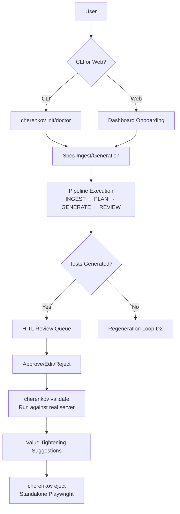
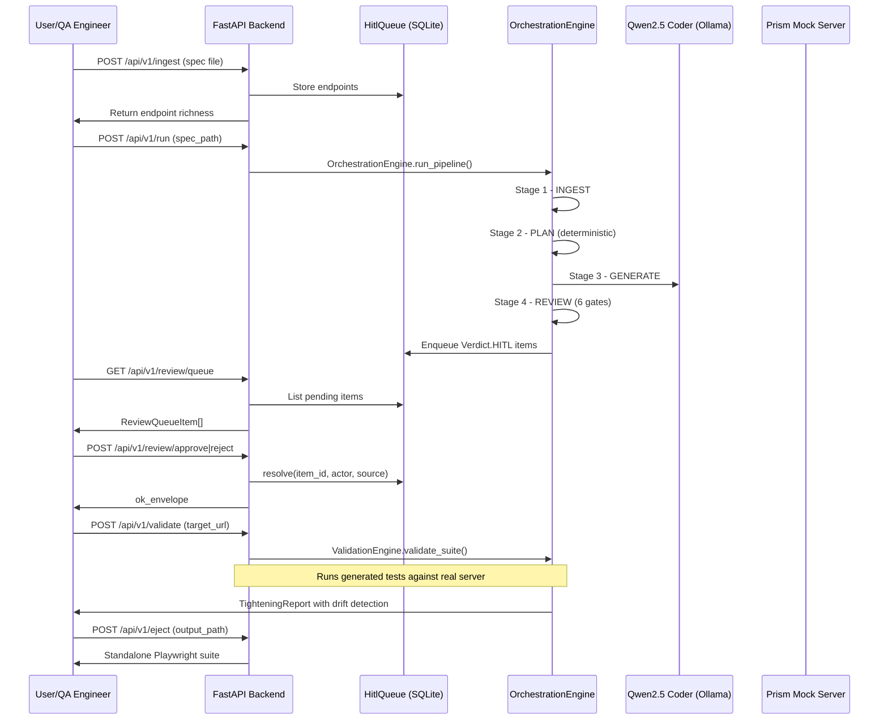
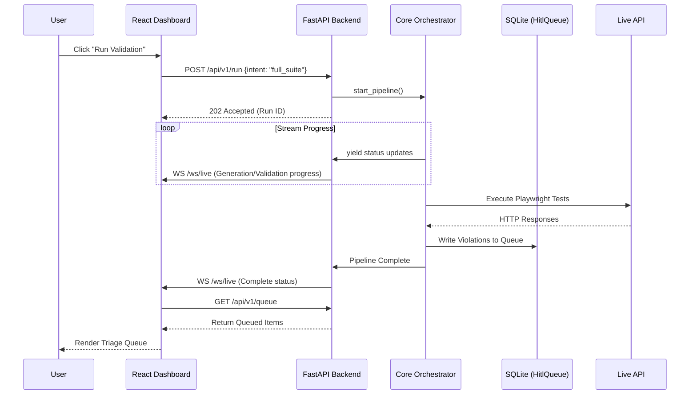

<!--
⚠️ AGENT SCRATCH FILE — DO NOT CITE

Filename and content are artifacts of a multi-agent UX brainstorm. The
dashboard design was subsequently captured in
[../../docs/dashboard/FE_DESIGN_SPEC.md](../../dashboard/FE_DESIGN_SPEC.md)
and the 9 dashboard screens are tracked under Phase 7 of
[../../docs/PHASE_PLAN.md](../../PHASE_PLAN.md).
-->

ux and flows considerations and revamping:

agent 1:
Based on my analysis of the codebase and documentation, here's a comprehensive assessment of the current user experience and workflows in CHERENKOV QA.

## Current State Analysis

### User Experience (UX) — Current Implementation

The application follows a modern dark-themed React/Vite dashboard approach with:

**UI Architecture:**
- **Sidebar Navigation** - Persistent left panel with project selection, health status, and token usage
- **Top Bar** - Status indicators, autonomy toggle, live monitoring access
- **Multi-screen Flow**: Projects → Setup → Pipeline → Review → Eject

**Key Screens:**
1. **ProjectsScreen** - Project listing/dashboard entry point
2. **SetupScreen** - Spec ingestion via drag-drop or URL, system readiness check via doctor endpoint
3. **PipelineScreen** - Live generation progress view (character streaming effect)
4. **ReviewScreen** - Primary HITL (Human-in-the-Loop) interface with:
   - Test filtering (all/approved/review/regenerating/rejected)
   - Inline code editor
   - AI explanation button ("Ask Copilot")
   - Confidence meter and gate status indicators
   - Rejection reason modal (feeds learning loop)
5. **EjectScreen** - Export generated tests to standalone Playwright

**Missing UX Elements (per ROADMAP_NEXT.md):**
- Honest error/loading states (silent `catch(console.warn)` instead of toasts - #222)
- "Initialize Pilot Run" not wired to `POST /api/v1/run` (#223)
- 10/17 flagship screens still show mock data without badges (#224/#239)

---

### User Workflows — Current Implementation



**CLI Workflow (Primary):**
```
cherenkov hitl list|show|approve|reject|classify|explain
cherenkov validate --target <url>
cherenkov eject --output <dir>
cherenkov review --web  # Launches dashboard
```

**Web Workflow (Secondary):**
```
GET /api/v1/health → useHealth hook
GET /api/v1/doctor → System readiness
POST /api/v1/ingest → Spec parsing
POST /api/v1/run → Async pipeline execution
GET /api/v1/tests → Generated test listing
GET /api/v1/review/queue → Pending review items
POST /api/v1/review/{approve|reject|edit|classify|explain}
POST /api/v1/validate → Server conformance
POST /api/v1/eject → Standalone export
WS /ws/live → Real-time progress events
```

---

### Business Workflows — Core Value Proposition

**Value Flow:**
```
OpenAPI Spec → Generate Playwright Tests → Detect Spec Drift → Suggest Tightening → Eject Clean Tests
```

**Key Business Logic:**
1. **Spec Conformance Detection** - HTTP 422 vs 400 mismatch detection (real bug caught)
2. **Suggest-Only Constraint** - Tests are NEVER auto-modified; only suggestions provided
3. **Anti-Lock-In** - Eject produces 100% standalone Playwright with zero CHERENKOV dependencies
4. **Confidence Scoring** - Verdict derived from spec (not guessed) with quality gates

**Revenue/Credibility Gates:**
- Phase A Validation Gate (5 QA reviewers) - currently **NOT PASSED**

---

### Sequence Flows — Detailed Data Flow



---

### Output Flows — What Users Receive

**Terminal Output Examples:**

1. **Pipeline Run:**
```
================ CHERENKOV PIPELINE RUN [abc123] ================
  INGEST  [ SUCCESS ] (123ms)
  PLAN    [ SUCCESS ] (45ms)
  GENERATE[ SUCCESS ] (1860ms)
  REVIEW  [ SUCCESS ] (98ms)
=================================================
  Status: SUCCESS
  Verdicts: AUTO_APPROVE
  Cache — hits: 15, misses: 3, hit ratio: 83.33%
  Accounting — requests: 29, total tokens: 12450, total cost: $0.003456
=================================================
```

2. **Validation Report:**
```
CHERENKOV VALUE ASSERTION TIGHTENING REPORT
Target Server URL: http://localhost:8000
Scenarios Verified: 3

Scenario: post_users_happy_path [FAILED]
Failure Error: Spec promises 422, server returned 400
Suggested Assertion Tightening:
  consider -> expect(data.status).toBe(422)
```

3. **Eject Verification:**
```
CHERENKOV E2E suite ejected successfully to: ./ejected_suite/
All CHERENKOV metadata and hooks stripped successfully.
Ejected folder is 100% standard and runs standalone.
```

---

## Recommendations for Revamping

### Priority Areas Per ROADMAP_NEXT.md (Wave 2 & 3)

| Ticket | Issue | Current State | Recommendation |
|--------|-------|---------------|----------------|
| #222 | Honest toasts | Missing - uses `catch(console.warn)` | Implement toast notifications for all error/loading states |
| #223 | Initialize Pilot Run | Button exists but `run_mode` payload is ignored | Wire "Initialize Pilot Run" button to `POST /api/v1/run` with proper payload |
| #224/#239 | Mock data badges | 10/17 screens show fake data | Add MOCK DATA badges to Overview/TruthMap/Signals/Governance/Memory/Explore/Author screens |
| #234 | Full UI-only loop | Partial - some endpoints mock-only | Complete Setup→Run→Pipeline→Review flow driven entirely from UI |
| #237 | Eject from UI | Terminal-only | Add browser folder picker + zip download |
| #240 | Empty/loading states | Insufficient | Add 60-second guided first-run tour |

### Potential UX Improvements

1. **Progress Indicators**
   - Current: Terminal progress via ANSI codes
   - Improvement: WebSocket-driven live progress bar in UI

2. **Error Handling**
   - Current: Silent failures, console.warn
   - Improvement: Toast notifications with actionable error details

3. **Onboarding Experience**
   - Current: First-run wizard exists
   - Improvement: Add demo mode toggle + Ollama status detection

4. **Review Queue**
   - Current: Basic approve/reject/edit UI
   - Improvement: Add classification picker, "Why flagged?" AI explanations always visible

5. **Settings Persistence**
   - Current: Uses localStorage for autonomy
   - Improvement: Server-side persistence via `/api/v1/settings` (API exists, UI needs wiring)

---

### Architecture Notes (Potential Drift Points)

1. **Authorization vs Quarantine Discrepancy**
   - HANDOVER.md states Track B/C is quarantined in `track-b-c-deferred/`
   - SCOPE_LEDGER.md (June 8) declares "everything has been validated" and restrictions bypassed
   - **Actual code**: Track B/C modules are LIVE in `cherenkov/` tree with Horizon 2 modules

2. **Validation Gate Status**
   - Documentation claims gate is "passed and validated" (SCOPE_LEDGER.md § bottom)
   - HANDOVER.md and VALIDATION_EVIDENCE_LEDGER.md show gate is **NOT PASSED** (0/5 reviews)
   - **Discrepancy**: UI shows real data but validation hasn't happened

3. **CLI vs Dashboard Parity**
   - CLI has full hitl commands with all actions
   - Dashboard missing `#232` First-run wizard, `#233` Engine manager, `#237` Eject UI

Would you like me to focus on any specific area for deeper analysis or provide code-level recommendations for the revamp work? Note that I am in read-only mode and can only provide analysis, not make changes.

agent 2: 
I've created a comprehensive revamp plan at `C:\Users\moaid\.vibe\plans\1780881300-sharp-shiny-river.md`.

The plan covers:

**5 Phases:**
1. **User Experience Revamp** - CLI standardization, web UI improvements, unified configuration
2. **User Workflows Revamp** - Primary user journeys, command aliases, progressive disclosure
3. **Business Workflows Revamp** - Capability model, process maps, integration points
4. **Sequence Flows Revamp** - Enhanced pipeline architecture, stage contracts, error handling
5. **Output Flows Revamp** - Schema standardization, report types, storage and retrieval

**Key Improvements:**
- 30+ commands restructured into 8 logical groups
- Consistent `--format json|text|pretty` output across all commands
- Guided journeys for new users (0→running in 5 min)
- Unified dashboard for all finding types
- Standardized report schemas and storage
- Enhanced pipeline with better error handling

**Implementation Priority:**
- Week 1-2: Core UX (CLI restructuring, output formats)
- Week 3-4: Workflow enhancements (guided journeys, aliases)
- Week 5-6: Business integration (CI/CD, monitoring)
- Week 7-8: Advanced features (unified dashboard, report management)

Please review the plan and let me know if you'd like to proceed with execution. If you approve, switch to execution mode and I'll begin implementing Priority 1 items.


# CHERENKOV-QA Comprehensive Revamp Plan

## Overview

Revamp the entire CHERENKOV-QA system including user experience, user workflows, business workflows, sequence flows, and output flows. This plan addresses the current complexity and provides a streamlined, cohesive experience across all touchpoints.

## Current State Analysis

### System Architecture
- **Core**: Python FastAPI backend with 20+ modules (orchestrator, contracts, config, errors, etc.)
- **CLI**: Unified entry point (`bin/cherenkov`) with 30+ commands across 5 epochs
- **Web**: FastAPI backend + React UI dashboard
- **Execution**: Ingest → Plan → Generate → Review pipeline with visual/perf/divergence extensions
- **Data Flow**: OpenAPI Spec → Local LLM → Playwright Tests → Real Server → Conformance Report

### Current Pain Points
1. **CLI Complexity**: 30+ commands with inconsistent UX patterns
2. **Workflow Fragmentation**: Multiple epochs (E1-E13) with overlapping concerns
3. **Output Inconsistency**: Reports vary across commands (text, JSON, JSONL)
4. **Discovery Issues**: New users struggle to understand command relationships
5. **Feedback Loops**: HITL, reflector, and verdict systems operate independently
6. **Configuration Sprawl**: Multiple config files and environment variables

---

## Phase 1: User Experience Revamp

### 1.1 CLI UX Standardization

**Current Issues:**
- Inconsistent flag naming (`--target` vs `--endpoint`)
- Mixed output formats (text tables, JSON, JSONL)
- No global flags for common options
- Poor error messages and help text

**Proposed Changes:**

1. **Global Flags Standardization**
   ```
   --format (-f): json | text | pretty   # Output format
   --verbose (-v): Verbosity level
   --quiet (-q): Suppress non-essential output
   --config (-c): Path to config file
   --profile (-p): Configuration profile
   ```

2. **Command Grouping**
   ```
   cherenkov api       # API conformance testing (Track A core)
   cherenkov ui        # UI/visual testing (Track B)
   cherenkov perf      # Performance testing (Track B)
   cherenkov truth     # Truth model operations (Epoch 2)
   cherenkov hitl      # Human-in-the-loop (Epoch 1)
   cherenkov explore   # Explorer/Copilot (Epoch 10)
   cherenkov certify   # Certification (Epoch 12)
   cherenkov system    # System operations (init, doctor, daemon)
   ```

3. **Output Format Unification**
   - All commands support `--format json|text|pretty`
   - JSON output follows consistent schema with `result`, `metadata`, `warnings`
   - Text output uses consistent table formatting
   - JSONL reserved for streaming/real-time outputs

**Files to Modify:**
- `cherenkov.py` - Restructure command hierarchy
- `cherenkov/core/contracts.py` - Add OutputFormat enum

### 1.2 Web UI/UX Improvements

**Current Issues:**
- Dashboard separated from CLI workflow
- No unified view of all findings across types
- Complex navigation between different concern areas

**Proposed Changes:**

1. **Unified Dashboard**
   - Single pane of glass for all finding types (divergences, HITL, perf, visual)
   - Filterable by type, severity, status, timestamp
   - Real-time WebSocket updates from all pipeline stages

2. **Guided Workflows**
   - New user onboarding wizard
   - Project setup assistant
   - Test generation walkthrough

3. **Consistent Visual Language**
   - Unified color scheme for severity levels
   - Consistent iconography
   - Standard card layouts for findings

**Files to Modify:**
- `cherenkov/web/ui/src/` - Full React UI overhaul
- `cherenkov/web/api.py` - Add unified findings API endpoint

### 1.3 Configuration Experience

**Current Issues:**
- Multiple config files (`cherenkov.toml`, `.env`, etc.)
- Inconsistent environment variable naming
- Poor validation and error messages

**Proposed Changes:**

1. **Unified Configuration**
   ```toml
   [project]
   name = "my-api"
   spec_path = "openapi.yaml"
   
   [testing]
   target_url = "http://localhost:8000"
   model = "qwen2.5-coder:7b"
   
   [profiles]
   laptop = { model = "qwen2.5-coder:7b", workers = 2 }
   ci = { model = "qwen2.5-coder:7b", workers = 4 }
   ```

2. **Environment Variable Prefix**
   - All env vars prefixed with `CHERENKOV_`
   - Hierarchical: `CHERENKOV_TESTING_TARGET_URL`

**Files to Modify:**
- `cherenkov/core/config.py` - Unified config loader
- `cherenkov/core/config_loader.py` - Schema validation

---

## Phase 2: User Workflows Revamp

### 2.1 Primary User Journeys

**Journey 1: First-Time User (0 → Running Tests in 5 minutes)**
```
1. cherenkov init --interactive
   - Guided setup with questions
   - Auto-detects OpenAPI spec
   - Validates environment
   - Generates sample config

2. cherenkov api validate
   - Runs full pipeline
   - Shows tightening report
   - Suggests next steps

3. cherenkov api eject --output my_tests/
   - Exports standalone tests
   - Confirms zero lock-in
```

**Journey 2: Daily API Development**
```
1. cherenkov api validate --watch
   - Watches spec and code
   - Auto-reruns on changes
   - Streams results

2. cherenkov api validate --target staging
   - Runs against staging
   - Compares with prod baseline

3. cherenkov hitl list
   - Reviews flagged items
   - Approves/rejects
```

**Journey 3: Regression Investigation**
```
1. cherenkov truth map
   - Builds truth model
   - Identifies divergences

2. cherenkov explore --target https://api.example.com
   - Crawls live surface
   - Surfaces anomalies

3. cherenkov certify --tier deep
   - Validates model tier
   - Checks RAG triad
```

### 2.2 Command Aliases and Shortcuts

```bash
# Common shortcuts
cherenkov validate      # alias: cherenkov api validate
cherenkov test         # alias: cherenkov api validate --target default
cherenkov init         # alias: cherenkov system init --interactive
cherenkov dashboard    # alias: cherenkov review --web
```

### 2.3 Progressive Disclosure

**Beginner Mode (Default):**
- Simplified command set
- Guided prompts
- Verbose explanations

**Expert Mode (--expert flag):**
- Full command set
- Minimal output
- Direct execution

**Files to Modify:**
- `cherenkov.py` - Add mode detection and aliases
- `cherenkov/stages/*.py` - Add guided prompts

---

## Phase 3: Business Workflows Revamp

### 3.1 Business Capability Model

**Core Capabilities:**
1. **Conformance Testing** - Validate API against spec
2. **Divergence Detection** - Find spec/code/prod mismatches
3. **Test Generation** - Create tests from intent
4. **Performance Baselining** - Track API performance
5. **Visual Regression** - Detect UI changes
6. **Certification** - Validate model tiers
7. **Governance** - Track KPIs and health

### 3.2 Business Process Maps

**Process: Continuous Quality Assurance**
```
Trigger: Code commit
├── Ingest spec changes
├── Detect divergences
├── Generate/regenerate tests
├── Run validation suite
├── Update baselines
├── Report findings
└── Notify stakeholders
```

**Process: Incident Response**
```
Trigger: Production issue
├── Run explorer crawl
├── Check divergence reports
├── Validate affected endpoints
├── Generate reproduction tests
├── Verify fix
└── Update regression suite
```

**Process: Release Certification**
```
Trigger: Release candidate
├── Run full test suite
├── Check performance baselines
├── Validate visual regression
├── Run divergence analysis
├── Certify model tier
├── Generate release report
└── Store artifacts
```

### 3.3 Integration Points

1. **CI/CD Integration**
   - GitHub Actions helper
   - GitLab CI template
   - Jenkins plugin
   - Standard JUnit output

2. **Monitoring Integration**
   - Prometheus metrics endpoint
   - Grafana dashboard templates
   - Alerting webhooks

3. **Development Integration**
   - VS Code extension
   - JetBrains plugin
   - Pre-commit hooks

**Files to Create:**
- `.github/workflows/cherenkov.yml` - GitHub Actions template
- `templates/prometheus.yml` - Metrics config
- `vscode/extension/` - VS Code extension

---

## Phase 4: Sequence Flows Revamp

### 4.1 Pipeline Architecture

**Current Pipeline:**
```
OpenAPI Spec → Ingest → Plan → Generate → Review → Validate → Report
```

**Proposed Enhanced Pipeline:**
```
┌─────────────────────────────────────────────────────────────────┐
│                      CHERENKOV PIPELINE                              │
├─────────────────────────────────────────────────────────────────┤
│  ┌──────────┐    ┌─────────┐    ┌──────────┐    ┌───────────┐  │
│  │  INGEST  │───▶│  PLAN   │───▶│ GENERATE │───▶│  REVIEW   │  │
│  └──────────┘    └─────────┘    └──────────┘    └───────────┘  │
│       ▲                  ▲                  ▲                  ▲     │
│       │                  │                  │                  │     │
│  ┌────┴──────┐    ┌─────┴─────┐    ┌─────┴─────┐    ┌─────┴─────┐│
│  │ SPEC      │    │ TRUTH     │    │ CACHE     │    │ HITL     ││
│  │ VALIDATE  │    │ MODEL     │    │ MANAGER   │    │ QUEUE    ││
│  └──────────┘    └───────────┘    └───────────┘    └───────────┘│
│       │                  │                  │                  │     │
│       └──────────────────┼──────────────────┼──────────────────┘     │
│                          ▼                          ▼                        │
│                    ┌─────────────┐            ┌─────────────────┐       │
│                    │  DIVERGENCE  │            │   ACCOUNTING    │       │
│                    │   ENGINE     │            │   REPORT         │       │
│                    └─────────────┘            └─────────────────┘       │
└─────────────────────────────────────────────────────────────────┘
```

### 4.2 Stage Contracts

Each stage accepts:
- `StageInput` - Typed input contract
- `StageConfig` - Stage-specific configuration

Each stage emits:
- `StageOutput` - Typed output contract
- `StageMetrics` - Performance and usage metrics
- `StageEvents` - Streaming events for real-time UI

### 4.3 Error Handling

**Retry Strategy:**
- Transient errors: Retry with exponential backoff
- Contract errors: Fail fast with clear message
- Resource errors: Circuit breaker pattern

**Recovery Modes:**
- `--continue-on-error`: Skip failed stages, continue pipeline
- `--strict`: Fail entire pipeline on first error
- `--best-effort`: Run all possible stages, report partial results

**Files to Modify:**
- `cherenkov/core/orchestrator.py` - Enhanced pipeline orchestration
- `cherenkov/core/contracts.py` - Stage contracts

---

## Phase 5: Output Flows Revamp

### 5.1 Output Schema Standardization

**All commands emit one of:**

1. **Text Output** - Human-readable, colorized, formatted tables
2. **JSON Output** - Machine-parseable, consistent schema
3. **JSONL Output** - Streaming, one JSON object per line
4. **HTML Report** - Rich web-based reports

**Standard JSON Schema:**
```json
{
  "version": "1.0",
  "command": "validate",
  "status": "success|error|partial",
  "timestamp": "ISO8601",
  "duration_ms": 1234,
  "results": { ... },  // Command-specific
  "warnings": [ ... ], // Non-fatal issues
  "errors": [ ... ],   // Fatal errors
  "metadata": { ... }   // Environment, config, etc.
}
```

### 5.2 Report Types

**Type 1: Validation Report**
- Scenarios tested
- Pass/fail status
- Assertion tightening suggestions
- Conformance score

**Type 2: Divergence Report**
- Detected divergences
- Classifications
- Severity levels
- Reproduction steps

**Type 3: Performance Report**
- Latency metrics
- Baseline comparisons
- Anomaly detection
- Trend analysis

**Type 4: Coverage Report**
- Endpoints covered
- Test quality metrics
- Gap analysis
- Recommendations

**Type 5: Certification Report**
- Model tier validation
- RAG triad metrics
- Gold set results
- Faithfulness scores

### 5.3 Report Storage and Retrieval

1. **Local Storage**
   - `.cherenkov/runs/<run_id>/` - All artifacts for a run
   - `.cherenkov/reports/` - Named reports
   - `.cherenkov/baselines/` - Baseline data

2. **Remote Storage** (Optional)
   - S3-compatible storage
   - Database backend
   - Custom webhook integration

3. **Report Query API**
   ```bash
   cherenkov report list
   cherenkov report show <id>
   cherenkov report compare <id1> <id2>
   cherenkov report export <id> --format html
   ```

**Files to Modify:**
- `cherenkov/stages/report_cmd.py` - Enhanced reporting
- `cherenkov/core/contracts.py` - Report schemas

---

## Implementation Priority

### Priority 1: Core UX (Week 1-2)
- [ ] CLI command restructuring
- [ ] Output format standardization
- [ ] Global flags implementation
- [ ] Error message improvements

### Priority 2: Workflow Enhancements (Week 3-4)
- [ ] Guided journeys for new users
- [ ] Command aliases and shortcuts
- [ ] Progressive disclosure modes
- [ ] Watch mode for development

### Priority 3: Business Process Integration (Week 5-6)
- [ ] CI/CD templates
- [ ] Monitoring integration
- [ ] Development tool plugins
- [ ] Business process documentation

### Priority 4: Advanced Features (Week 7-8)
- [ ] Unified dashboard
- [ ] Report storage and retrieval
- [ ] Enhanced pipeline orchestration
- [ ] Performance optimization

---

## Success Criteria

1. **New user** can run first test within 5 minutes
2. **Existing user** can accomplish common tasks with 50% fewer commands
3. **All commands** have consistent output formats
4. **Error messages** are clear and actionable
5. **Performance** impact is <10% overhead
6. **Backward compatibility** maintained for existing scripts

---

## Risk Mitigation

1. **Backward Compatibility**: Maintain old command structure as aliases
2. **Performance**: Benchmark before and after changes
3. **User Feedback**: Iterative rollout with user testing
4. **Documentation**: Update docs in parallel with code changes

---

## Next Steps

1. Review and approve this plan
2. Switch to execution mode
3. Implement Priority 1 items first
4. Iterate based on user feedback
5. Continue with subsequent priorities

---

*Generated by Mistral Vibe. Co-Authored-By: Mistral Vibe <vibe@mistral.ai>*

agent 3:


## CHERENKOV UX / Workflow / Flow Revamp — Comprehensive Plan

**Authority:** `docs/HANDOVER.md` (status) · `docs/SCOPE_LEDGER.md` (scope) · `docs/ROADMAP_NEXT.md` (forward). All work lands on **feature branches** (AGENTS.md), with **raw evidence** per claim, and the four invariants preserved: **D7 (never auto-edit tests)**, **anti-lock-in (eject still works)**, **suggest-only (healing is advisory)**, **spec-derived (status from spec, not hardcoded)**.

---

## 0. How I'm framing the request

You said: "revise the UX, the user workflows, the business workflows, the sequence flows, the output flows, everything running now, in case revamping might be needed for some of it."

That reads as **audit-then-revamp**: walk every user-visible surface, identify what *should* be revamped (with evidence), and ship targeted changes — not a blanket rewrite. The "in case revamping might be needed for some of it" clause is the safety valve: not every surface is broken; the audit decides.

I'm proposing a **three-phase delivery** that produces raw evidence and survives review.

---

## 1. The three phases

### Phase 1 — UX/WORKFLOW AUDIT (1 PR, read-only)
**Deliverable:** `docs/UX_AUDIT.md` + supporting `docs/ux-audit/` diagrams.
**No code changes.** Pure observation + evidence. The doc becomes the source of truth that the user picks revamps from.

Contents:
- **§A. Surface inventory** — every CLI subcommand, every dashboard screen, every API endpoint, every MCP tool, every HITL action, every output format. Mapped to persona (Maya / Sam / Jordan from `FE_DESIGN_SPEC.md`).
- **§B. Workflow maps** — the sequence flows as they actually run today, with raw evidence (terminal transcripts, screenshot refs, file dumps):
  1. Golden path: `init → doctor → generate → validate → review → eject`
  2. Convergence loop: `detect → triage → classify → reflect`
  3. Drift-watch: `daemon → map → divergence → witness → triage`
  4. Healing loop: `fail → diagnose → suggest → human review`
  5. Copilot loop: `explore → author → pilot → review`
  6. Governance loop: `run → certify → KPI → trend`
  7. Federation loop: `collect → sync → cross-check → report`
  8. Onboarding: `install → doctor → init → first run → first finding`
  9. CI / business: `commit → CI run → report → PR comment → triage`
- **§C. Per-surface gap analysis** — current behaviour vs intended behaviour, scored by impact (P0/P1/P2). Cites the specific line in code or doc.
- **§D. Cross-cutting issues** — terminology drift (e.g. "review" means the verb, the dashboard, and the verdict), error-envelope inconsistency, output-schema drift between CLI text and JSON, mock-data leakage (the 10/17 screens from `ROADMAP_NEXT.md §0`), autonomy-ladder visibility, sovereign-mode coverage, accessibility, reduced-motion, etc.
- **§E. Evidence appendix** — every claim in the audit is anchored to a terminal run, a screenshot ref, a file path, or a `git grep` line. No narrative-only claims.

### Phase 2 — REVAMP PROPOSALS (1 PR, design only)
**Deliverable:** `docs/UX_REVAMP_PLAN.md`.
**No code changes.** For each gap in the audit, a concrete proposal:
- **what changes** (CLI command rename, screen wire-up, output schema, error envelope)
- **what it costs** (LOC, risk, invariant impact)
- **what evidence proves it works** (smoke test, screenshot, terminal capture)
- **which wave it belongs to** (sequenced against the open Wave 2/3/4 tickets so the revamp integrates with the roadmap, not against it)
- **what stays out of scope** (explicit "do not change" list — e.g. D7, eject, suggest-only)

The user picks which proposals become PRs.

### Phase 3 — IMPLEMENTATION (1 PR per revamp, on feature branches)
Each accepted proposal becomes a feature branch (`ux/<slug>`) with:
- the code change
- updated/added smoke test
- raw evidence (terminal output, screenshot, log)
- `CHANGENOG.md` and `RELEASE_NOTES.md` entry
- a "before/after" diff in the PR description

Sequence respects the dependency graph: output schema changes before API changes before dashboard changes before docs.

---

## 2. Scope — what "everything" means, explicitly

I'm covering all of these, with no silent exclusions:

| Surface | Files | Audit depth |
|---|---|---|
| **Unified CLI** | `cherenkov.py`, `bin/cherenkov`, all `*_cmd.py` in `cherenkov/stages/` | every subcommand: help text, defaults, exit codes, output format, error path, JSON envelope, idempotency |
| **Web Dashboard** | `cherenkov/web/ui/src/**` | every screen, route, hook, store, lib, type; empty/loading/error/success states; the 10 mock-data screens; ⌘K palette; autonomy ladder; onboarding |
| **Web API** | `cherenkov/web/api.py`, `cherenkov/web/divergences.py` | every endpoint, schema, auth gate, websocket event, error envelope; the four mock endpoints (`/overview`, `/truth-map`, `/failures`, `/metrics`) |
| **MCP server** | `cherenkov/mcp/{server,handlers,protocol,policy,contracts}.py` | every tool, every resource, every error code, trust model |
| **HITL queue** | `cherenkov/hitl/{cmd,store,contracts}.py` | the 7 subcommands, the `hitl/v1` envelope, conflict semantics, the Tier-2 classify + Tier-3 explain flow |
| **Stages (Track A)** | `cherenkov/stages/{ingest,plan,generate,review}.py` + `core/orchestrator.py` | the 4-stage DAG, retry ladder, D2 planner feedback loop, circuit breakers, the `event_callback` channel that feeds the UI |
| **Capability layers** | `cherenkov/stages/{visual,perf}/`, `cherenkov/copilot/`, `cherenkov/governance/`, `cherenkov/federation/`, `cherenkov/openclaw/`, `cherenkov/rag/`, `cherenkov/divergence/`, `cherenkov/reflector/`, `cherenkov/sdet/`, `cherenkov/oracle/`, `cherenkov/continuity/`, `cherenkov/substrate/`, `cherenkov/compliance/`, `cherenkov/security/` | command surface, output format, persona fit, eject safety |
| **Output formats** | every `print_*_report` in `cherenkov.py`; every JSON envelope; every WebSocket event; the `events.jsonl` per-run log; the `report.json`; the `hitl.db`; the visual/perf baselines | schema, field naming, units, version, completeness, error path |
| **Business flows** | CI workflow `.github/workflows/ci.yml`, the daemon, the federation protocol, the PR-diff action, the Jira exporter, the Snyk bridge | sequence, evidence chain, who-sees-what, audit trail |
| **Docs surface** | `docs/GETTING_STARTED.md`, `docs/CLI_DEMO.md`, `docs/QA_DEMO_KIT.md`, `docs/HANDOVER.md`, `docs/SCOPE_LEDGER.md`, `docs/ROADMAP_NEXT.md`, `docs/dashboard/FE_*.md`, `docs/diagrams/DIAGRAMS.md`, the skill cards in `skills/` | terminology, story coherence, golden-path coverage |
| **Skills & agent memory** | `skills/*.md`, `agent_memory/` | per the AGENTS.md Horizon 2 fabric — D7-aware instructions |

---

## 3. What "revamp" can and cannot do

**Can do (without breaking an invariant):**
- Rename subcommands if we keep aliases for one release and update `docs/` and `skills/` in the same PR.
- Standardize the JSON envelopes (`hitl/v1`, `validate/v1`, `mcp/v1`) into a single `output/v1` shape with a per-command `payload` block.
- Replace mock-data screens with real data (Wave 2 #224/#239) and add explicit `MOCK DATA` badges where the wire isn't ready.
- Wire the `Initialize Pilot Run` button to `POST /api/v1/run` (Wave 2 #223).
- Add toasts (Wave 2 #222), empty/error/loading states (Wave 3 #240), guided tour, ⌘K palette, autonomy-ladder persistence.
- Make the CLI "one-line" (single `cherenkov run --spec spec.json --target http://api`) and have the multi-step golden path as a recipe on top of it.
- Tighten the report printers (`print_tightening_report`, `print_visual_report`, `print_perf_report`) into a single structured printer with a `--json` flag.
- Add a `cherenkov status` command (single source of truth: doctor + run state + queue depth + last finding).
- Add `cherenkov onboard` (init + doctor + first run with a bundled petstore) as the single entry point.
- Make the dashboard serve its own `dist/` from `cherenkov review` (already done) and the `cherenkov onboard` open the browser.

**Cannot do (would break an invariant — flag, don't do):**
- Auto-edit test files (D7). Healing stays suggest-only.
- Couple eject output to CHERENKOV (anti-lock-in). The ejected suite must still run with zero `cherenkov` on the path.
- Hardcode expected HTTP status (spec-derived). Status comes from the spec at every call site.
- Drop the `hitl/v1` envelope or change the atomic SQL gatekeeper semantics.

---

## 4. Evidence & branch strategy (AGENTS.md compliant)

- **Branches:** `ux/audit`, `ux/revamp-plan`, then `ux/<surface>-<change>` per accepted revamp. No direct commits to `main`. No `Track B/C` re-quarantining — the SCOPE_LEDGER §B is adopted (per the 2026-06-08

agent 4:
Arguments
content:
# CHERENKOV-QA: UX and Workflow Revamp Plan

## 1. Executive Summary & Objective

This plan details the complete revamp of the CHERENKOV-QA user experience, focusing on transitioning the tool from a CLI-first utility to a **UI-First Integrated Dashboard**. This approach directly supports the "Validation-First" roadmap by eliminating terminal friction for QA engineers, unifying the lifecycle (Generate -> Validate -> Review -> Eject) into a single, cohesive web interface, while preserving the CLI for CI/CD and advanced headless operations.

## 2. The User Experience (UX) Revamp

The core UX philosophy shifts from "running commands" to "managing conformance." The web dashboard becomes the primary command center.

### 2.1 The Unified Dashboard ("One-Click QA")
*   **The Global Sidebar:** Navigation shifts to reflect the logical flow: *Setup -> Pipeline -> Triage Queue -> Eject*.
*   **The Pipeline View (New):** A real-time, visual representation of the `generate` and `validate` phases. Users click "Start Run" in the UI rather than typing `cherenkov validate` in the terminal.
*   **The Triage Queue (Enhanced):** The existing queue is promoted to the landing page post-validation. It focuses on the critical decision: "Is this a bug in the API, or an intended change?"

### 2.2 Frictionless Onboarding
*   **Zero-Terminal Startup:** Execution via a desktop launcher or a single `cherenkov ui` command that handles health checks, model detection, and opens the browser.
*   **Guided First Run:** The UI detects an empty state and presents a 60-second wizard to select an OpenAPI spec and configure the target URL.

## 3. User Workflows

The QA Persona ("Sam") workflow is fully digitized within the dashboard.

### 3.1 The "Golden Path" Execution Workflow
1.  **Configure:** Sam uploads/links an OpenAPI spec via the UI Settings tab.
2.  **Execute:** Sam navigates to the "Pipeline" tab and clicks "Run Validation Suite".
3.  **Monitor:** Sam watches a real-time progress bar (via WebSockets) as tests are generated and executed against the live target.
4.  **Triage:** Upon completion, Sam is redirected to the "Triage Queue". They review failed tests.
5.  **Act:** For each failure, Sam chooses:
    *   *Approve:* Expected failure (API bug).
    *   *Reject:* Bad test or intended API change. Sam provides a rejection reason from a dropdown to feed the learning loop.
6.  **Eject:** Sam clicks the "Eject Suite" button to download the finalized Playwright `.spec.ts` files as a ZIP archive.

### 3.2 The Continuous Watch Workflow (Post-Validation)
1.  **Review Dashboard:** Sam reviews the "Signals" dashboard to see trend data over time (pass/fail ratios across builds).
2.  **Fingerprint Management:** Sam manages suppressed test fingerprints (from the Reflector subsystem) in the UI to prevent alert fatigue.

## 4. Business Workflows

These workflows define how CHERENKOV processes data under the hood to support the user.

### 4.1 The Test Generation Engine
*   **Trigger:** UI API call (`POST /api/v1/run`).
*   **Process:** Orchestrator reads spec -> Prompts Local LLM -> Emits Playwright code -> Syntactic validation.
*   **Rule:** Fails fast if the local GPU environment is insufficient, propagating a clear error to the UI toast system.

### 4.2 The Validation & HITL (Human-in-the-loop) Bridge
*   **Trigger:** Successful generation phase.
*   **Process:** Executes `.spec.ts` against the live target. Captures network traces and status codes.
*   **Rule:** All validation violations (e.g., expected 422, got 400) are serialized and pushed to the SQLite `HitlQueue`.
*   **Rule:** The engine *never* auto-edits the generated tests based on failures; it only queues them for human review.

## 5. Sequence Flows

### 5.1 End-to-End Pipeline Sequence


## 6. Output Flows

The presentation of system state and results is split between human-readable UI elements and machine-readable data.

### 6.1 Web UI Outputs
*   **Toasts:** Immediate feedback for atomic actions (e.g., "Settings saved", "Run started"). Must use `error` type, not `danger`.
*   **Triage Cards:** Detailed presentation of a validation failure. Includes: Endpoint, Method, Expected vs. Actual Status, and the AI-generated "Why was this flagged?" explanation.
*   **ZIP Archive:** The final output of the `Eject` action, containing standard Playwright tests.

### 6.2 CLI / CI Outputs (Headless Mode)
*   **JSONL Streams:** For CI environments, `cherenkov validate --format=jsonl` outputs structured event logs (`events.jsonl`) for external ingestion.
*   **Exit Codes:** Strict semantic exit codes (e.g., `0` for pass, `1` for validation failure, `2` for engine error) to fail CI pipelines appropriately.
*   **Summary Report:** `cherenkov report --output report.json` provides a machine-readable summary of the entire run, including skipped endpoints and coverage gaps.

## 7. Migration & Revamp Implementation Steps

1.  **API Gateway Unification:** Ensure `POST /api/v1/run` in `cherenkov/web/api.py` is fully wired to invoke the core orchestrator asynchronously.
2.  **WebSocket Implementation:** Establish the `/ws/live` connection in the React UI to stream progress bars instead of relying on polling.
3.  **UI Component Refactor:** Build the new "Pipeline" view in `cherenkov/web/ui/src/components/` and route it as the primary action center.
4.  **Eject Endpoint:** Create a new backend endpoint to zip the output directory and serve it as a file download to the UI.
5.  **Documentation Update:** Rewrite `GETTING_STARTED.md` to reflect the UI-first flow.
file_path:
C:\Users\moaid\.gemini\tmp\cherenkov-qa\ffca4372-1400-47c0-b981-803edee5ede6\plans/ux_workflow_revamp.md