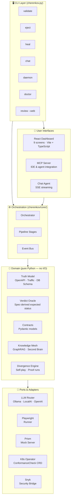
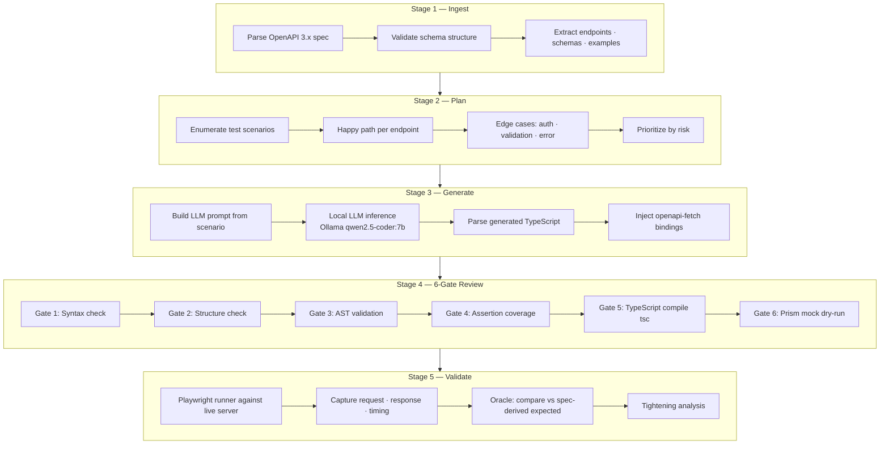
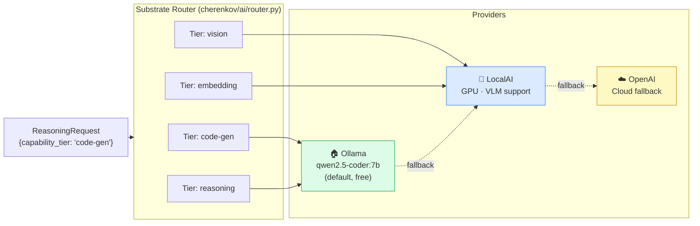
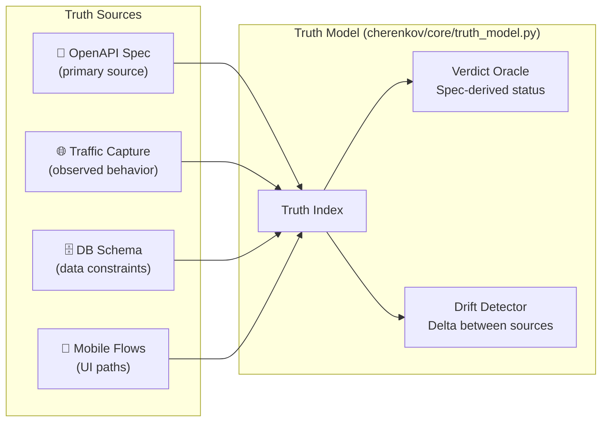
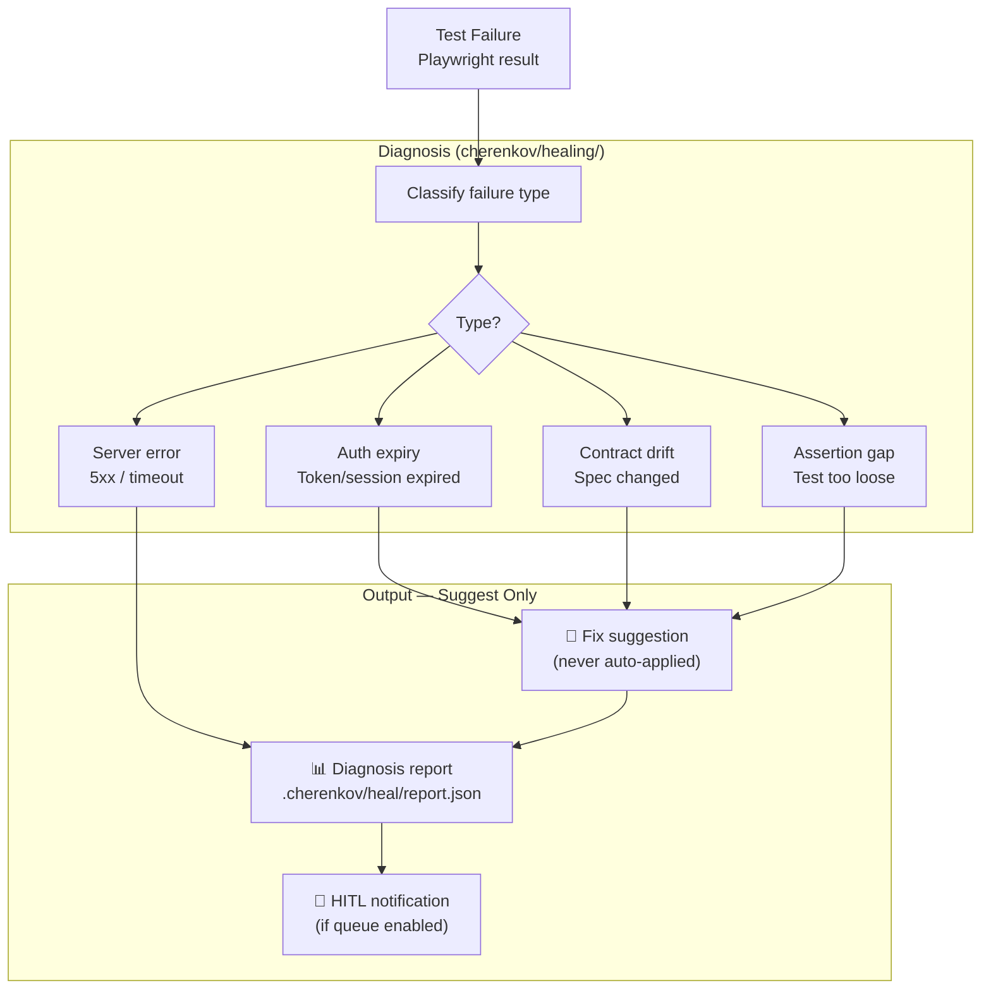
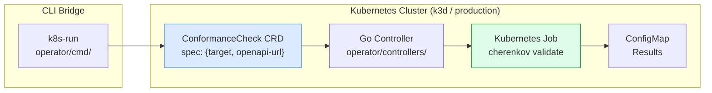
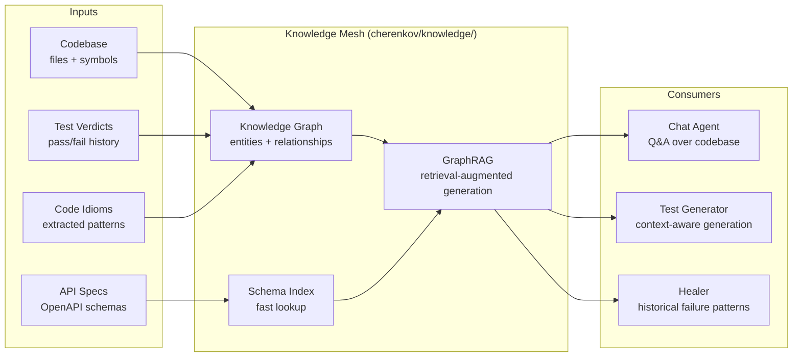

# Architecture

> **Navigation:** [Home](Home.md) · [Pipeline](Pipeline.md) · **Architecture** · [CLI Reference](CLI-Reference.md) · [Configuration](Configuration.md) · [Deployment](Deployment.md) · [Roadmap](Roadmap.md) · [FAQ](FAQ.md) · [Troubleshooting](Troubleshooting.md)

CHERENKOV is built in three layers: a **CLI** on the outside, a **domain** in the middle, and **infrastructure adapters** at the edges. Nothing in the domain layer imports from infrastructure — the Clean Architecture boundary is enforced by ADR-004.

---

## System Overview



---

## Directory Map

```
cherenkov-qa/
│
├── cherenkov.py              ← Main CLI (all commands live here)
├── bin/cherenkov             ← Shell wrapper (invokes cherenkov.py)
│
├── cherenkov/                ← Main Python package
│   ├── core/                 ← Orchestrator · contracts · config · errors
│   ├── stages/               ← ingest → plan → generate → review → validate
│   ├── execution/            ← validate · eject · playwright_invoke · trace
│   ├── healing/              ← diagnose · auth_expiry · contract_drift · sandbox
│   ├── divergence/           ← skeptic · witness · self_play · proof_run
│   ├── truth/                ← truth model · index · emitters
│   ├── sources/              ← openapi · traffic · mobile · db_schema
│   ├── knowledge/            ← knowledge_mesh · graph_rag · schema_index
│   ├── ai/                   ← router · ollama_client · accounting · cache
│   ├── agents/               ← pilot · exploration agents
│   ├── chat/                 ← chat agent · tool-calling · conversation memory
│   ├── mcp/                  ← MCP protocol server
│   ├── governance/           ← KPI · certification · audit
│   ├── compliance/           ← MENA · governance scanning
│   ├── continuity/           ← PR diff tracking
│   ├── federation/           ← cross-check · protocol · corpus
│   ├── hitl/                 ← human-in-the-loop queue
│   ├── observability/        ← metrics · structured logging · Logfire
│   ├── security/             ← Snyk bridge
│   ├── oracle/               ← verdict oracle · expected status resolver
│   ├── reflector/            ← learning from verdicts · idiom extraction
│   ├── substrate/            ← provider certification · routing logic
│   ├── ports/                ← adapter port interfaces (Ports/Adapters)
│   └── web/ui/               ← React dashboard (Vite · TypeScript · Tailwind)
│
├── operator/                 ← Go K8s operator (ConformanceCheck CRD)
├── engine/                   ← Engine service (spec loader · validator)
├── stub/                     ← Test fixtures · generated tests · OpenAPI client
├── target/                   ← Sample target API (FastAPI)
├── tests/                    ← Test suite (smoke · unit · integration · e2e)
├── skills/                   ← Autonomous workflow instructions
└── docs/                     ← All documentation
```

---

## Pipeline Stages Detail



---

## LLM Routing

CHERENKOV never hardcodes a model name. Agents emit a `ReasoningRequest` with a `capability_tier`; the Substrate Router picks the best available provider.



**Provider selection priority:**
1. Ollama (local, free, default)
2. LocalAI (local, Docker, VLM support)
3. OpenAI (cloud, paid, fallback only)

---

## Truth Model

The Truth Model is the source of expected behavior. It aggregates evidence from multiple sources to build a ground truth for what the API *should* do.



---

## Healing Architecture

Healing is **always suggest-only**. The D7 invariant is enforced: no automation ever modifies test code.



---

## K8s Operator



Apply a `ConformanceCheck` manifest → the operator spins up a job → CHERENKOV runs → results land in a ConfigMap. No `kubectl exec` needed.

---

## Knowledge Mesh (Second Brain)



---

## Clean Architecture Enforcement

Per [ADR-004](../adr/), domain logic never imports from infrastructure:

```
Domain layer (pure Python, no I/O):
  cherenkov/core/contracts.py     — Pydantic models
  cherenkov/oracle/               — verdict logic
  cherenkov/truth/                — truth model logic
  cherenkov/divergence/           — divergence detection

Infrastructure adapters (I/O allowed):
  cherenkov/ai/ollama_client.py   — Ollama HTTP calls
  cherenkov/execution/playwright_invoke.py — subprocess
  cherenkov/mcp/server.py         — network
  cherenkov/security/snyk_bridge.py — subprocess
```

The `cherenkov/ports/` directory defines the interfaces that adapters implement. Domain code only depends on the port interfaces, never on concrete adapter implementations.

---

## Design Invariants

These rules are **non-negotiable** and tested in CI on every push.

| Invariant | Enforcement |
|-----------|------------|
| **D7 — no auto-edit** | `smoke_test_healing.py` — asserts healing never writes test files |
| **Anti-lock-in** | `smoke_test_eject.py` — ejected tests run without CHERENKOV on PATH |
| **Spec-derived oracle** | `smoke_test_validate.py` — expected status from OpenAPI, never hardcoded |
| **Suggest-only healing** | `ci.yml: Healing Suggest-Only` job — required check on `main` |
| **Model-agnostic** | `test_substrate_providers.py` — no model name in domain code |

---

## Further Reading

- [ADR-001: Seam Widening](../adr/) — why we extend at seams, not cores
- [ADR-004: Clean Architecture](../adr/) — the Ports/Adapters boundary
- [ADR-005: Event-Driven Orchestration](../adr/) — why we use events
- [ADR-006: Knowledge Mesh](../adr/) — why a graph, not just a vector store
- [docs/engineering/SYSTEM_DESIGN.md](../engineering/SYSTEM_DESIGN.md) — full system design doc
