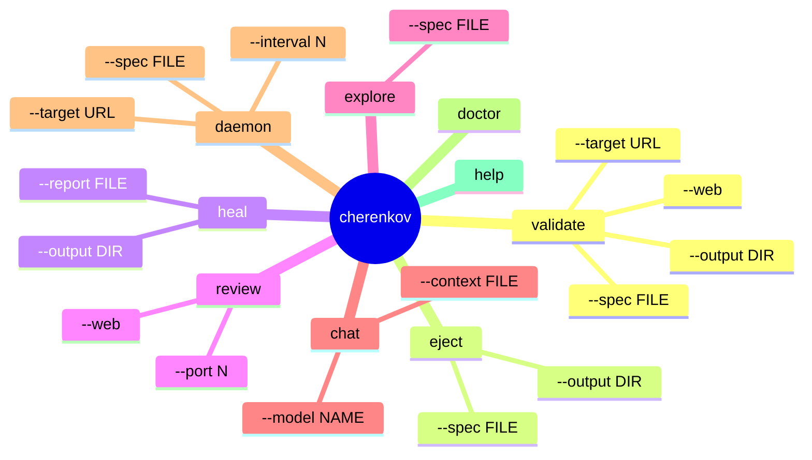

# CLI Reference

> **Navigation:** [Home](Home.md) · [Pipeline](Pipeline.md) · [Architecture](Architecture.md) · **CLI Reference** · [Configuration](Configuration.md) · [Deployment](Deployment.md) · [Roadmap](Roadmap.md) · [FAQ](FAQ.md) · [Troubleshooting](Troubleshooting.md)

Every command, flag, and option for the `cherenkov` CLI.

**Invoke via:**

```bash
./bin/cherenkov <command> [options]
# or
PYTHONPATH=. python cherenkov.py <command> [options]
```

---

## Command Overview



---

## `validate` — Run Conformance Tests

The core command. Generates tests from your spec, runs them against a live server, and reports conformance drift.

```bash
./bin/cherenkov validate --target <url> [options]
```

### Options

| Flag | Type | Default | Description |
|------|------|---------|-------------|
| `--target` | URL | *required* | Base URL of the API to test |
| `--spec` | path/URL | auto-fetch | OpenAPI spec file or URL. If omitted, fetches `<target>/openapi.json` |
| `--output` | directory | `.cherenkov/` | Directory for test files and report |
| `--web` | flag | off | Open browser dashboard after run |
| `--model` | model name | `qwen2.5-coder:7b` | Override the LLM model |
| `--timeout` | seconds | `60` | Per-test timeout |
| `--workers` | integer | `4` | Parallel test workers |
| `--filter` | pattern | *all* | Only run tests matching this name/glob |
| `--dry-run` | flag | off | Plan and generate tests, do not run them |
| `--format` | `json`/`text` | `text` | Report output format |
| `--verbose` | flag | off | Show full request/response details |

### Examples

```bash
# Basic — fetch spec automatically from /openapi.json
./bin/cherenkov validate --target http://localhost:8000

# With explicit spec file
./bin/cherenkov validate --target http://localhost:8000 --spec ./api.yaml

# Open dashboard after run
./bin/cherenkov validate --target http://localhost:8000 --web

# Only run tests matching a pattern
./bin/cherenkov validate --target http://localhost:8000 --filter "password*"

# Dry run — see what tests would be generated
./bin/cherenkov validate --target http://localhost:8000 --dry-run

# JSON output for CI
./bin/cherenkov validate --target http://localhost:8000 --format json > report.json
```

### Exit Codes

| Code | Meaning |
|------|---------|
| `0` | All tests passed |
| `1` | One or more tests failed (conformance drift detected) |
| `2` | Fatal error (spec invalid, server unreachable, LLM unavailable) |

---

## `eject` — Export Standalone Tests

Exports the generated tests as standalone Playwright files with zero CHERENKOV dependency.

```bash
./bin/cherenkov eject --output <directory> [options]
```

### Options

| Flag | Type | Default | Description |
|------|------|---------|-------------|
| `--output` | directory | *required* | Where to write the ejected test files |
| `--spec` | path/URL | last used | OpenAPI spec to generate from |
| `--format` | `ts`/`js` | `ts` | Output language (TypeScript or JavaScript) |
| `--include-fixtures` | flag | off | Include test fixture helpers |
| `--overwrite` | flag | off | Overwrite existing files in output directory |

### Examples

```bash
# Eject to a directory
./bin/cherenkov eject --output ./my_tests

# Run the ejected tests — completely self-contained
cd my_tests
npm install
npx playwright test
```

### What Gets Ejected

```
my_tests/
├── package.json          (playwright, openapi-fetch — no cherenkov)
├── playwright.config.ts  (standard playwright config)
├── generated-types.ts    (auto-generated from your OpenAPI spec)
├── tests/
│   ├── happy_path.spec.ts
│   ├── password_too_short.spec.ts
│   └── auth_missing.spec.ts
└── README.md             (how to run)
```

Zero CHERENKOV imports. Standard Playwright. Runs forever.

---

## `heal` — Get Fix Suggestions

Reads a validation report and generates human-readable fix suggestions for each failure.

```bash
./bin/cherenkov heal --report <file> [options]
```

### Options

| Flag | Type | Default | Description |
|------|------|---------|-------------|
| `--report` | path | `.cherenkov/report.json` | Validation report to analyze |
| `--output` | path | `.cherenkov/heal/` | Where to write suggestion files |
| `--filter` | pattern | *all failures* | Only diagnose failures matching this pattern |
| `--verbose` | flag | off | Include reasoning in suggestions |

### Examples

```bash
# Heal failures from the last validate run
./bin/cherenkov heal

# Heal from a specific report
./bin/cherenkov heal --report ./reports/2026-06-09.json

# Heal with verbose reasoning
./bin/cherenkov heal --verbose
```

### What Healing Produces

```
.cherenkov/heal/
├── password_too_short.md     ← fix suggestion for this failure
├── auth_missing.md
└── summary.md                ← overall diagnosis summary
```

**Healing never modifies your tests.** It only produces markdown suggestion files that you review and decide whether to act on.

---

## `review` — Open Dashboard

Opens the React dashboard in your browser for a visual view of test results.

```bash
./bin/cherenkov review --web [options]
```

### Options

| Flag | Type | Default | Description |
|------|------|---------|-------------|
| `--web` | flag | *required* | Launch browser UI |
| `--port` | integer | `3000` | Port for the dev server |
| `--report` | path | `.cherenkov/report.json` | Report to display |

```bash
# Open dashboard on port 3000
./bin/cherenkov review --web

# Different port
./bin/cherenkov review --web --port 4000

# Also accessible after validate
./bin/cherenkov validate --target http://localhost:8000 --web
```

The dashboard has 9 screens:

| Screen | Shows |
|--------|-------|
| Run History | All past validation runs |
| Test Explorer | Browse generated test files |
| Spec Viewer | Your OpenAPI spec with annotations |
| Healing Queue | Pending fix suggestions |
| Knowledge Graph | Second brain visualization |
| Mobile Dashboard | Mobile test results |
| Chat Interface | AI chat agent |
| Settings | Configuration |
| Governance | KPI and certification status |

---

## `explore` — Interactive Spec Explorer

Interactively explore your OpenAPI spec, inspect schemas, and preview what tests would be generated.

```bash
./bin/cherenkov explore [options]
```

### Options

| Flag | Type | Default | Description |
|------|------|---------|-------------|
| `--spec` | path/URL | auto-fetch | OpenAPI spec to explore |
| `--target` | URL | — | API to fetch spec from |
| `--query` | string | — | Non-interactive: answer a single query |

```bash
# Interactive explorer
./bin/cherenkov explore --spec ./api.yaml

# Ask a specific question
./bin/cherenkov explore --spec ./api.yaml --query "What endpoints require auth?"

# Explore a live API's spec
./bin/cherenkov explore --target http://localhost:8000
```

---

## `chat` — AI Chat Agent

Conversational interface for asking questions about your spec, test results, and codebase.

```bash
./bin/cherenkov chat [options]
```

### Options

| Flag | Type | Default | Description |
|------|------|---------|-------------|
| `--model` | model name | routing default | Override the chat model |
| `--context` | path | `.cherenkov/` | Context directory to load |
| `--persona` | name | `default` | Chat persona to use |

```bash
# Start a chat session
./bin/cherenkov chat

# Example questions the agent can answer:
# > "Why did password_too_short fail?"
# > "What endpoints are not covered by tests?"
# > "How do I fix the 400 vs 422 issue?"
# > "Show me all endpoints that require auth"
```

---

## `daemon` — Watch Mode

Watches your spec file and re-runs the pipeline automatically on every change.

```bash
./bin/cherenkov daemon --spec <file> --target <url> [options]
```

### Options

| Flag | Type | Default | Description |
|------|------|---------|-------------|
| `--spec` | path | *required* | OpenAPI spec file to watch |
| `--target` | URL | *required* | API to run tests against |
| `--interval` | seconds | `5` | How often to check for spec changes |
| `--web` | flag | off | Keep dashboard open while watching |

```bash
# Watch and auto-test on every spec change
./bin/cherenkov daemon \
  --spec ./openapi.yaml \
  --target http://localhost:8000

# With live dashboard
./bin/cherenkov daemon \
  --spec ./openapi.yaml \
  --target http://localhost:8000 \
  --web
```

---

## `doctor` — Environment Health Check

Checks that all required tools are installed and configured correctly.

```bash
./bin/cherenkov doctor
```

No options. Checks and reports on:

| Component | What It Checks |
|-----------|---------------|
| Python | Version ≥ 3.10 |
| Node | Version ≥ 20 |
| npm / npx | Available |
| Playwright | Installed in `stub/` |
| Ollama | Running and reachable |
| Model | `qwen2.5-coder:7b` pulled |
| Docker | Available (optional, for Prism) |
| Prism | Reachable (optional) |

Example output:

```
cherenkov doctor

  ✔  Python   3.12.3 (≥ 3.10 required)
  ✔  Node     22.1.0 (≥ 20 required)
  ✔  npm      10.7.0
  ✔  Playwright  installed
  ✔  Ollama   running at http://localhost:11434
  ✔  Model    qwen2.5-coder:7b  pulled
  ⚠  Docker   not found (optional — needed for Prism mock)
  ✘  Prism    not reachable (start with: docker run stoplight/prism)

  2 checks passed, 1 warning, 1 error
  See: docs/GETTING_STARTED.md for setup instructions
```

---

## Global Flags

These flags work with every command:

| Flag | Description |
|------|-------------|
| `--help` | Show help for the command |
| `--version` | Print CHERENKOV version |
| `--config <path>` | Path to config file (default: `.cherenkov/config.yaml`) |
| `--no-color` | Disable color output |
| `--quiet` | Suppress non-error output |

---

## Environment Variables

All CLI options can be set via environment variables (useful for CI):

| Variable | CLI Flag | Example |
|----------|----------|---------|
| `CHERENKOV_TARGET` | `--target` | `http://api:8000` |
| `CHERENKOV_SPEC` | `--spec` | `./api/openapi.yaml` |
| `CHERENKOV_OUTPUT` | `--output` | `./.cherenkov` |
| `CHERENKOV_LLM_MODEL` | `--model` | `qwen2.5-coder:14b` |
| `CHERENKOV_OLLAMA_URL` | — | `http://localhost:11434` |
| `CHERENKOV_TIMEOUT` | `--timeout` | `120` |
| `CHERENKOV_WORKERS` | `--workers` | `8` |

Full list: [Configuration](Configuration.md)

---

## Further Reading

- [Pipeline](Pipeline.md) — what each stage does internally
- [Configuration](Configuration.md) — all settings and environment variables
- [Troubleshooting](Troubleshooting.md) — when commands fail
