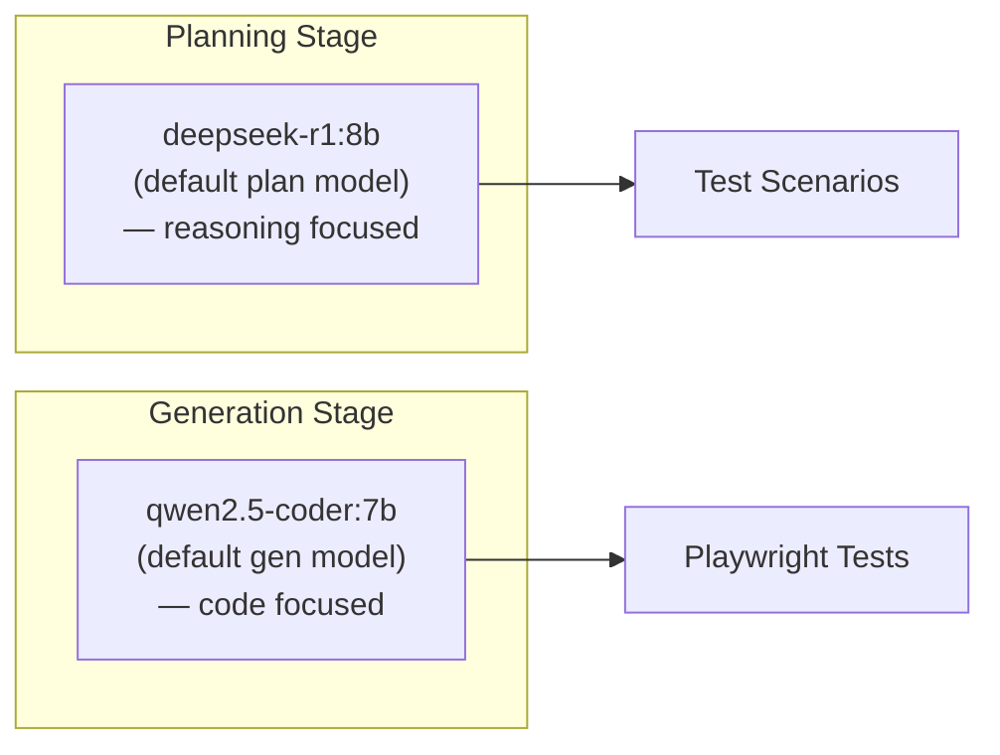

# Configuration

> **Navigation:** [Home](Home.md) · [Pipeline](Pipeline.md) · [Architecture](Architecture.md) · [CLI Reference](CLI-Reference.md) · **Configuration** · [Deployment](Deployment.md) · [Roadmap](Roadmap.md) · [FAQ](FAQ.md) · [Troubleshooting](Troubleshooting.md)

All the knobs and dials — environment variables, config files, and LLM settings.

---

## Quick Reference

The fastest way to configure CHERENKOV is environment variables. Set them in your shell or `.env` file.

```bash
# Minimum viable configuration
export CHERENKOV_TARGET=http://localhost:8000   # Your API
export OLLAMA_URL=http://localhost:11434        # Ollama server

./bin/cherenkov validate
```

---

## Config File

CHERENKOV reads `.cherenkov/config.yaml` if present. All values are optional.

```yaml
# .cherenkov/config.yaml

# Core
target: http://localhost:8000      # Default API target URL
spec: ./api/openapi.yaml           # Default spec file (optional)
output: .cherenkov/                # Output directory

# LLM
llm:
  provider: ollama                 # ollama | localai | openai
  model: qwen2.5-coder:7b         # Generation model
  plan_model: deepseek-r1:8b      # Planning model (optional, defaults to model)
  ollama_url: http://localhost:11434
  timeout: 60                      # Per-LLM-call timeout (seconds)
  max_retries: 3                   # Retries on LLM failure

# Validation
validate:
  workers: 4                       # Parallel test workers
  timeout: 60                      # Per-test timeout (seconds)
  prism_url: http://localhost:4010 # Prism mock server URL (for Gate 6)

# Dashboard
web:
  port: 3000                       # Browser dashboard port
  auto_open: true                  # Open browser automatically

# Logging
log:
  level: info                      # debug | info | warn | error
  format: text                     # text | json
```

---

## Environment Variables

Environment variables override config file values.

### Core

| Variable | Default | Description |
|----------|---------|-------------|
| `CHERENKOV_TARGET` | — | API base URL (required if not in config) |
| `CHERENKOV_SPEC` | auto-fetch | OpenAPI spec path or URL |
| `CHERENKOV_OUTPUT` | `.cherenkov/` | Output directory for reports and tests |
| `CHERENKOV_CONFIG` | `.cherenkov/config.yaml` | Config file path |

### LLM

| Variable | Default | Description |
|----------|---------|-------------|
| `CHERENKOV_LLM_PROVIDER` | `ollama` | LLM provider: `ollama`, `localai`, `openai` |
| `CHERENKOV_LLM_MODEL` | `qwen2.5-coder:7b` | Model for test generation |
| `CHERENKOV_LLM_PLAN_MODEL` | same as `MODEL` | Model for scenario planning |
| `OLLAMA_URL` | `http://localhost:11434` | Ollama server URL |
| `LOCALAI_URL` | `http://localhost:8080` | LocalAI server URL |
| `OPENAI_API_KEY` | — | OpenAI API key (cloud fallback only) |
| `CHERENKOV_LLM_TIMEOUT` | `60` | LLM call timeout in seconds |
| `CHERENKOV_LLM_MAX_RETRIES` | `3` | Max retries on LLM failure |

### Validation

| Variable | Default | Description |
|----------|---------|-------------|
| `CHERENKOV_WORKERS` | `4` | Parallel test workers |
| `CHERENKOV_TIMEOUT` | `60` | Per-test timeout in seconds |
| `CHERENKOV_PRISM_URL` | `http://localhost:4010` | Prism mock server for Gate 6 review |

### Security and Auth

| Variable | Default | Description |
|----------|---------|-------------|
| `CHERENKOV_API_KEY` | — | API key to inject in Authorization header |
| `CHERENKOV_AUTH_TOKEN` | — | Bearer token for authenticated tests |
| `CHERENKOV_AUTH_SCHEME` | `Bearer` | Auth scheme: `Bearer`, `Basic`, `ApiKey` |
| `SNYK_TOKEN` | — | Snyk API token (for security scanning in CI) |

### Kubernetes

| Variable | Default | Description |
|----------|---------|-------------|
| `CHERENKOV_K8S_NAMESPACE` | `default` | K8s namespace for the operator |
| `CHERENKOV_K8S_IMAGE` | — | Docker image for the K8s job |
| `KUBECONFIG` | `~/.kube/config` | Kubernetes config file |

### Dashboard

| Variable | Default | Description |
|----------|---------|-------------|
| `CHERENKOV_WEB_PORT` | `3000` | Dashboard port |
| `CHERENKOV_WEB_AUTO_OPEN` | `true` | Open browser automatically |

### Logging and Observability

| Variable | Default | Description |
|----------|---------|-------------|
| `CHERENKOV_LOG_LEVEL` | `info` | Log level: `debug`, `info`, `warn`, `error` |
| `CHERENKOV_LOG_FORMAT` | `text` | Log format: `text` or `json` |
| `LOGFIRE_TOKEN` | — | Pydantic Logfire token (optional telemetry) |

---

## LLM Configuration Deep Dive

### Choosing a Model

CHERENKOV uses two models: one for planning scenarios (reasoning), one for generating tests (code).



**Recommended models by hardware:**

| GPU VRAM | Generation Model | Planning Model | Notes |
|----------|-----------------|----------------|-------|
| 4–6 GB | `qwen2.5-coder:3b` | `llama3.2:3b` | Smaller but works |
| 8 GB (default) | `qwen2.5-coder:7b` | `deepseek-r1:8b` | Optimal |
| 12–16 GB | `qwen2.5-coder:14b` | `deepseek-r1:14b` | Better quality |
| 24+ GB | `qwen2.5-coder:32b` | `deepseek-r1:32b` | Best quality |
| CPU only | `qwen2.5-coder:3b` | `llama3.2:3b` | ~10× slower |

### Setting the Model

```bash
# Via environment variable (recommended for CI)
export CHERENKOV_LLM_MODEL=qwen2.5-coder:14b

# Via CLI flag
./bin/cherenkov validate --target http://localhost:8000 --model qwen2.5-coder:14b

# Via config file
cat .cherenkov/config.yaml
# llm:
#   model: qwen2.5-coder:14b
```

### Using LocalAI Instead of Ollama

[LocalAI](https://localai.io) supports GGUF models with GPU acceleration and VLM (vision) support.

```bash
# Start LocalAI via Docker Compose
docker compose -f docker-compose.ai.yml up localai

# Point CHERENKOV at LocalAI
export CHERENKOV_LLM_PROVIDER=localai
export LOCALAI_URL=http://localhost:8080

./bin/cherenkov validate --target http://localhost:8000
```

### Using OpenAI (Cloud Fallback)

```bash
export CHERENKOV_LLM_PROVIDER=openai
export OPENAI_API_KEY=sk-...
export CHERENKOV_LLM_MODEL=gpt-4o

./bin/cherenkov validate --target http://localhost:8000
```

**Note:** OpenAI sends your OpenAPI spec to the cloud. Use only if you're comfortable with that.

---

## Cost Tier Configuration

Choose your setup based on budget and needs:

<details>
<summary><strong>L0 — Bare CLI ($0/month)</strong></summary>

No Docker, no Ollama. Uses a stub LLM (useful for testing the pipeline without a GPU).

```bash
export CHERENKOV_LLM_PROVIDER=stub  # No actual LLM calls
./bin/cherenkov validate --target http://localhost:8000 --dry-run
```

</details>

<details>
<summary><strong>L1 — + Ollama ($0/month)</strong></summary>

Full local LLM. Install Ollama, pull the model, run.

```bash
# Install Ollama: https://ollama.com
ollama pull qwen2.5-coder:7b
ollama pull deepseek-r1:8b

./bin/cherenkov validate --target http://localhost:8000
```

</details>

<details>
<summary><strong>L2 — + Docker Compose ($0/month)</strong></summary>

Adds LocalAI (VLM support) and Redis (vector store for knowledge mesh).

```bash
docker compose -f docker-compose.ai.yml up -d
./bin/cherenkov validate --target http://localhost:8000
```

</details>

<details>
<summary><strong>L3 — + Full Stack ($0/month)</strong></summary>

Adds Prism mock server, all services.

```bash
docker compose up -d
./bin/cherenkov validate --target http://localhost:8000
```

</details>

<details>
<summary><strong>L4/L5 — Cloud & Enterprise (~$50–300+/month)</strong></summary>

Cloud VLM, K8s operator, SSO. See [Deployment](Deployment.md).

</details>

---

## CI Configuration

Minimal CI setup for GitHub Actions:

```yaml
# .github/workflows/conformance.yml
name: API Conformance
on: [push, pull_request]

jobs:
  conformance:
    runs-on: ubuntu-latest
    steps:
      - uses: actions/checkout@v4

      - name: Set up Python
        uses: actions/setup-python@v5
        with: { python-version: '3.12' }

      - name: Set up Node
        uses: actions/setup-node@v4
        with: { node-version: '22' }

      - name: Install dependencies
        run: |
          pip install -r requirements.txt
          cd stub && npm install && npx playwright install

      - name: Start API
        run: uvicorn target.target_api:app --host 127.0.0.1 --port 8000 &

      - name: Run conformance tests
        env:
          CHERENKOV_LLM_PROVIDER: stub  # Use stub LLM in CI (no GPU)
          CHERENKOV_TARGET: http://localhost:8000
        run: |
          PYTHONPATH=. ./bin/cherenkov validate --format json > report.json

      - name: Upload report
        uses: actions/upload-artifact@v4
        if: always()
        with:
          name: conformance-report
          path: report.json
```

---

## MCP Integration

CHERENKOV exposes a Model Context Protocol (MCP) server so IDE agents — Claude Desktop, Cursor, Copilot, and [Open Interpreter](https://github.com/openinterpreter/openinterpreter) — can query conformance results, trigger new runs, and explain findings without leaving the editor.

### Starting the MCP Server

```bash
./bin/cherenkov mcp serve
```

Communicates via JSON-RPC 2.0 over stdio. Blocks until stdin closes.

### Available Tools

| Tool | Permission | Description |
|------|-----------|-------------|
| `hitl_list` | read | List HITL queue items by status |
| `hitl_approve` | write | Approve a pending HITL item |
| `hitl_reject` | write | Reject a pending HITL item |
| `validate_run_gate` | read | Run Validation Gate in report-only mode |
| `run_conformance_check` | execute | Trigger `cherenkov validate` and return report summary |
| `get_last_report` | read | Return `.cherenkov/report.json` without a new run |
| `list_drift_findings` | read | List spec-drift findings, filterable by severity and endpoint |
| `get_tightening_suggestions` | read | Return OpenAPI spec tightening suggestions for an endpoint |
| `explain_finding` | read | Natural-language LLM explanation of a specific finding |
| `chat_query_verdicts` | read | Query recent test verdicts from the Reflector |
| `chat_query_idioms` | read | Query learned idiom patterns |
| `chat_explain_divergence` | read | Explain a divergence via GraphRAG |
| `chat_run_test` | read | Plan test scenarios (suggest-only) |
| `policy_list` / `policy_reload` | admin | View and hot-reload `cherenkov-policy.json` |

### Client Configurations

#### Claude Desktop

Add to `claude_desktop_config.json → mcpServers`:

```json
{
  "cherenkov": {
    "command": "python3",
    "args": ["/path/to/cherenkov-qa/cherenkov.py", "mcp", "serve"],
    "cwd": "/path/to/cherenkov-qa"
  }
}
```

#### Open Interpreter

Add to `~/.openinterpreter/mcp.json`:

```json
{
  "mcpServers": {
    "cherenkov": {
      "command": "python3",
      "args": ["/path/to/cherenkov-qa/cherenkov.py", "mcp", "serve"],
      "cwd": "/path/to/cherenkov-qa",
      "env": {
        "MCP_PROFILE": "full-dev"
      }
    }
  }
}
```

After adding the config, restart Open Interpreter. The cherenkov tools appear automatically in the tool list. You can then ask Open Interpreter to run conformance checks, query findings, or explain drift directly from the terminal.

#### Cursor / VS Code Copilot

Add to `.cursor/mcp.json` (or VS Code's MCP settings):

```json
{
  "mcpServers": {
    "cherenkov": {
      "command": "python3",
      "args": ["cherenkov.py", "mcp", "serve"],
      "cwd": "/path/to/cherenkov-qa"
    }
  }
}
```

### Policy Enforcement

Tools are governed by `cherenkov-policy.json`. The `full-dev` profile (default) allows all tools. `run_conformance_check` requires `execute` permission; all other conformance tools are read-only.

Set the active profile via:

```bash
export MCP_PROFILE=full-dev   # default
```

---

## Further Reading

- [CLI Reference](CLI-Reference.md) — flags that override config values
- [Deployment](Deployment.md) — Docker Compose and K8s configuration
- [Troubleshooting](Troubleshooting.md) — common config problems
