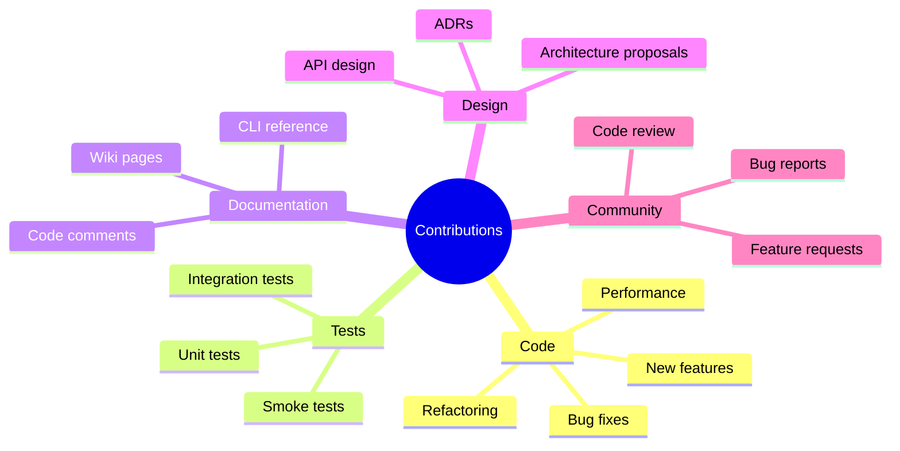
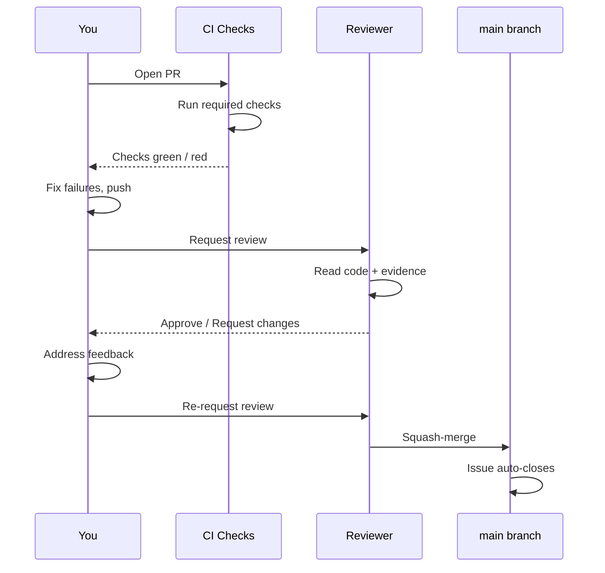

# Contributing

> **Navigation:** [Home](Home.md) · [Architecture](Architecture.md) · [Roadmap](Roadmap.md) · [Way of Work](Way-of-Work.md) · **Contributing** · [Security](Security.md)

Everything you need to start contributing — from your first issue to your first merged PR.

---

## Before You Start

Read these first — in order:

1. [docs/STATUS.md](../STATUS.md) — what is built, what is blocked, what is next
2. [docs/HANDOVER.md](../HANDOVER.md) — what is real vs fabricated; authoritative state
3. [AGENTS.md](../../AGENTS.md) — if you are an AI agent, this is required reading

---

## Types of Contributions



---

## First Contribution: Bug Report

Found something broken? Open an issue using the **Bug** template:

```
GitHub → Issues → New Issue → Bug
```

A good bug report includes:
- The exact command you ran
- The full error output (paste it — don't describe it)
- Your OS, Python version, Node version (from `./bin/cherenkov doctor`)
- What you expected to happen

---

## First Contribution: Small Fix

Best starting point if you want to write code:

1. Look for issues labelled `good first issue` or `type:bug` + `status:ready`
2. Comment on the issue to claim it (prevents duplicate work)
3. Follow the [Way of Work](Way-of-Work.md) loop
4. Open a small PR — it reviews faster

---

## Setting Up Your Development Environment

```bash
# 1. Fork and clone
git clone https://github.com/YOUR_USERNAME/cherenkov-qa.git
cd cherenkov-qa

# 2. Install Python dependencies
python3 -m venv .venv && source .venv/bin/activate
pip install -r requirements.txt

# 3. Install Node dependencies
cd stub && npm install && npx playwright install && cd ..

# 4. Install pre-commit hooks
pip install pre-commit && pre-commit install

# 5. Check your environment
PYTHONPATH=. ./bin/cherenkov doctor

# 6. Verify tests pass
PYTHONPATH=. python -m pytest tests/unit/ -v
PYTHONPATH=. python3 tests/smoke/smoke_test_healing.py
```

---

## Project Structure at a Glance

```
cherenkov/
├── core/          ← Domain models + orchestrator (don't fork these)
├── stages/        ← Pipeline stages (ingest → plan → generate → review → validate)
├── execution/     ← Playwright runner, eject, validate
├── healing/       ← Suggest-only failure diagnosis
├── ai/            ← LLM router + provider adapters
├── knowledge/     ← GraphRAG knowledge mesh
├── ports/         ← Adapter interfaces (Ports/Adapters per ADR-004)
└── web/ui/        ← React dashboard

tests/
├── smoke/         ← Invariant-checking smoke tests (run in CI)
├── unit/          ← Pure unit tests
└── integration/   ← K8s, Redis integration tests

docs/
├── wiki/          ← You are here
├── engineering/   ← Architecture, principles, best practices
├── adr/           ← Architecture Decision Records
└── process/       ← GitHub PM, validation runbook
```

**The golden rule for code changes:** extend at seams, never fork cores. Add adapters in `ports/`; don't modify `core/contracts.py` without an ADR.

---

## Writing Tests

Every PR needs tests. Here's where to put them:

| Test type | Location | When to use |
|-----------|----------|-------------|
| **Unit** | `tests/unit/` | Pure logic with no I/O |
| **Smoke** | `tests/smoke/` | End-to-end invariant checks |
| **Integration** | `tests/integration/` | K8s, Redis, real services |

For smoke tests, assert the invariant explicitly:

```python
# Good — explicit invariant assertion
def test_healing_suggest_only():
    result = healer.diagnose(failure)
    assert not any_test_file_was_modified()   # D7 invariant
    assert result.suggestions is not None
```

---

## Writing Documentation

When your change affects user-facing behavior, update the docs:

| Change type | What to update |
|-------------|---------------|
| New CLI flag | [CLI Reference](CLI-Reference.md) + `./bin/cherenkov --help` |
| New config option | [Configuration](Configuration.md) |
| New architecture | [Architecture](Architecture.md) + relevant ADR |
| New deployment option | [Deployment](Deployment.md) |
| Bug fix | [Troubleshooting](Troubleshooting.md) if it was a common issue |

Run `PYTHONPATH=. python3 scripts/ci_docs_check.py` after doc changes.

---

## Architecture Decision Records (ADRs)

For decisions with significant architectural impact, write an ADR before coding:

```
docs/adr/ADR-NNN-short-title.md
```

ADR template:

```markdown
# ADR-NNN: Short Title

## Status
Proposed | Accepted | Deprecated

## Context
What is the situation that requires a decision?

## Decision
What did we decide?

## Consequences
What are the positive and negative outcomes?
```

Existing ADRs in [docs/adr/](../adr/).

---

## Review Process



**Review expectations:**
- Reviewers respond within 2 business days
- Address all comments before re-requesting review
- If a comment is unclear, ask for clarification — don't guess

---

## Code Style

- **Python:** Black formatting + mypy type hints (non-strict)
- **TypeScript:** Prettier + strict TypeScript
- **No unnecessary comments** — code should be self-explanatory; only add comments for non-obvious *why*, not *what*
- **No dead code** — remove unused imports, variables, functions

Pre-commit hooks enforce formatting automatically:
```bash
pre-commit run --all-files
```

---

## Getting Help

- **Question about the codebase?** — Try `./bin/cherenkov chat` or open a discussion
- **Stuck on a bug?** — Paste the full error in the issue; don't paraphrase
- **Unsure if something is in scope?** — Read [HANDOVER.md](../HANDOVER.md) or open an issue to discuss first
- **Found a security issue?** — See [Security](Security.md) — do not open a public issue

---

## Recognition

Every merged PR is recorded in [CHANGELOG.md](../../CHANGELOG.md). Contributors are listed in the GitHub contributors graph.
