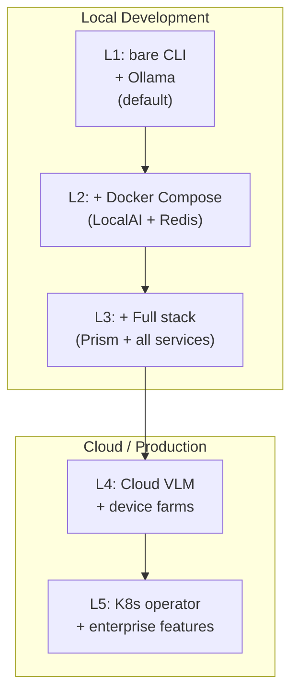

# Deployment

> **Navigation:** [Home](Home.md) · [Pipeline](Pipeline.md) · [Architecture](Architecture.md) · [CLI Reference](CLI-Reference.md) · [Configuration](Configuration.md) · **Deployment** · [Roadmap](Roadmap.md) · [FAQ](FAQ.md) · [Troubleshooting](Troubleshooting.md)

How to run CHERENKOV in different environments — from a single laptop to a Kubernetes cluster.

---

## Overview



Start at the level you need. Most developers only need L1 or L2.

---

## L1 — Bare CLI + Ollama (Recommended Start)

**Requirements:** Python 3.10+, Node 20+, [Ollama](https://ollama.com)

```bash
# 1. Install Ollama
# macOS/Linux: curl -fsSL https://ollama.com/install.sh | sh
# Windows: download from ollama.com

# 2. Pull models
ollama pull qwen2.5-coder:7b
ollama pull deepseek-r1:8b

# 3. Clone and install
git clone https://github.com/moaidmoatasem/cherenkov-qa.git
cd cherenkov-qa
python3 -m venv .venv && source .venv/bin/activate
pip install -r requirements.txt
cd stub && npm install && npx playwright install && cd ..

# 4. Run
PYTHONPATH=. ./bin/cherenkov validate --target http://your-api.com
```

**What runs locally:**

```
Your machine:
  ├── cherenkov CLI (Python)
  ├── Playwright tests (Node)
  └── Ollama + models (local LLM)
```

---

## L2 — Docker Compose with AI Stack

Adds LocalAI (VLM support) and Redis (for knowledge mesh / session storage).

**Requirements:** Docker, Docker Compose

```bash
# Start the AI stack
docker compose -f docker-compose.ai.yml up -d

# Check services are running
docker compose -f docker-compose.ai.yml ps

# Run CHERENKOV
PYTHONPATH=. ./bin/cherenkov validate --target http://your-api.com
```

**`docker-compose.ai.yml` starts:**

```
Services:
  localai   → http://localhost:8080   (VLM inference)
  redis     → localhost:6379          (vector store + sessions)
```

### GPU Acceleration for LocalAI

```yaml
# Add to docker-compose.ai.yml to enable GPU
services:
  localai:
    deploy:
      resources:
        reservations:
          devices:
            - driver: nvidia
              count: 1
              capabilities: [gpu]
```

---

## L3 — Full Stack (All Services)

The complete local environment: Prism mock server, Cherenkov service, Ollama, and agents.

```bash
# Start everything
docker compose up -d

# Services started:
#   prism       → http://localhost:4010  (OpenAPI mock server)
#   cherenkov   → http://localhost:8001  (cherenkov API mode)
#   ollama      → http://localhost:11434
#   redis       → localhost:6379
```

**`docker-compose.yml` services:**

| Service | Port | Purpose |
|---------|------|---------|
| `prism` | 4010 | Stoplight Prism — OpenAPI mock server (Gate 6 review) |
| `cherenkov` | 8001 | CHERENKOV in API/server mode |
| `ollama` | 11434 | Local LLM inference |
| `redis` | 6379 | Vector store and session storage |

```bash
# Validate against a running service
docker compose exec cherenkov ./bin/cherenkov validate --target http://your-api.com

# Or from the host
CHERENKOV_PRISM_URL=http://localhost:4010 \
./bin/cherenkov validate --target http://localhost:8000
```

---

## Docker Image

The `Dockerfile` builds a multi-stage image:

```dockerfile
# Stage 1: Build React dashboard (Node)
FROM node:22-alpine AS ui-build
# ... build cherenkov/web/ui

# Stage 2: Python runtime + compiled UI
FROM python:3.12-slim
# ... install Python deps, copy UI build
```

```bash
# Build the image
docker build -t cherenkov-qa:latest .

# Run
docker run --rm \
  -e CHERENKOV_TARGET=http://host.docker.internal:8000 \
  -e OLLAMA_URL=http://host.docker.internal:11434 \
  cherenkov-qa:latest \
  ./bin/cherenkov validate
```

---

## MCP Server Deployment

CHERENKOV includes a Model Context Protocol server for IDE and agent integration.

```bash
# Start MCP server via Docker
docker build -f Dockerfile.mcp -t cherenkov-mcp .
docker run -p 3001:3001 cherenkov-mcp

# Or directly
PYTHONPATH=. python -m cherenkov.mcp.server
```

**Configure in your IDE (Claude Code, Cursor, etc.):**

```json
// .mcp.json
{
  "mcpServers": {
    "cherenkov": {
      "url": "http://localhost:3001/mcp",
      "description": "CHERENKOV QA — API conformance testing"
    }
  }
}
```

---

## Kubernetes — Phase 8

> **Status:** Phase 8 in progress. CRD and controller are coded; `make k3d-test` validation pending.

The Kubernetes operator runs CHERENKOV tests as native K8s jobs. You apply a `ConformanceCheck` CRD and the operator handles the rest.

### Local K8s with k3d

```bash
# Install k3d (https://k3d.io)
# brew install k3d  (macOS)

# Create local cluster
make k3d-up

# Build and push image to local registry
make k3d-image

# Deploy operator
kubectl apply -f operator/config/

# Apply a ConformanceCheck
kubectl apply -f - <<EOF
apiVersion: qa.cherenkov.dev/v1alpha1
kind: ConformanceCheck
metadata:
  name: my-api-check
spec:
  target: http://my-api.default.svc.cluster.local
  openapiUrl: http://my-api.default.svc.cluster.local/openapi.json
  schedule: "0 * * * *"    # Every hour
EOF

# Check status
kubectl get conformancechecks
kubectl describe conformancecheck my-api-check

# View results
kubectl get jobs -l conformancecheck=my-api-check
kubectl logs -l conformancecheck=my-api-check
```

### K8s Commands (Makefile)

```bash
make k3d-up      # Create local k3d cluster
make k3d-down    # Destroy cluster
make k3d-image   # Build + push image to local registry
make k3d-test    # Run integration tests against cluster
make k3d-deploy  # Deploy operator to cluster
```

### ConformanceCheck CRD Reference

```yaml
apiVersion: qa.cherenkov.dev/v1alpha1
kind: ConformanceCheck
metadata:
  name: my-api
  namespace: default
spec:
  # Required
  target: http://my-api:8080           # API URL inside cluster
  
  # Optional
  openapiUrl: ""                       # Spec URL (defaults to target/openapi.json)
  schedule: "0 */6 * * *"             # Cron schedule (default: manual only)
  timeout: 120                         # Job timeout in seconds
  workers: 4                           # Parallel test workers
  
  # LLM config (uses cluster-level defaults if not set)
  llm:
    model: qwen2.5-coder:7b
    ollamaUrl: http://ollama:11434
    
  # Results
  reportRetention: 30d                 # How long to keep reports
```

---

## Production Checklist

Before running CHERENKOV against a production API:

- [ ] Use `--dry-run` first to preview tests without running them
- [ ] Set `CHERENKOV_WORKERS=1` to avoid rate-limiting your API
- [ ] Configure `CHERENKOV_TIMEOUT` appropriately for your API's SLA
- [ ] Never run healing suggestions against production — always test in staging first
- [ ] Store API keys in secrets (`CHERENKOV_API_KEY`), never in config files
- [ ] Review generated tests before running (use `eject` to inspect)
- [ ] Set up report retention (`reportRetention` in K8s, or cron cleanup locally)

---

## Further Reading

- [Configuration](Configuration.md) — all environment variables and config options
- [Architecture](Architecture.md) — system components and their relationships
- [Troubleshooting](Troubleshooting.md) — common deployment issues
