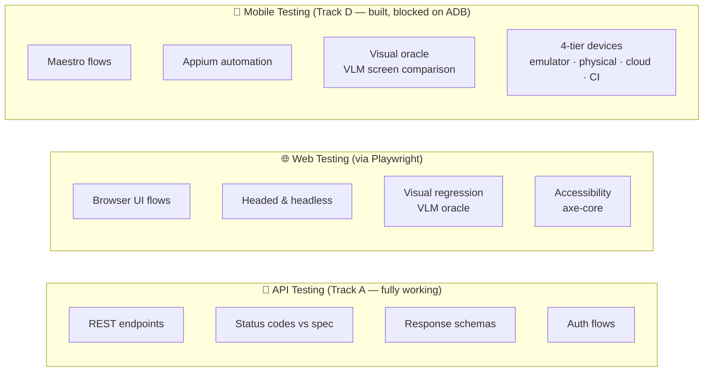

# FAQ

> **Navigation:** [Home](Home.md) · [Pipeline](Pipeline.md) · [Architecture](Architecture.md) · [CLI Reference](CLI-Reference.md) · [Configuration](Configuration.md) · [Deployment](Deployment.md) · [Roadmap](Roadmap.md) · **FAQ** · [Troubleshooting](Troubleshooting.md)

---

## General

### What does CHERENKOV actually test?

Three layers — API, Web, and Mobile:



All three run **headed** (visible window) or **headless** (CI mode).

### Does my data leave my machine?

No — by default everything runs locally via Ollama. The only exception is if you explicitly set `CHERENKOV_LLM_PROVIDER=openai`, which sends your spec to OpenAI's servers. The default is always local.

### Is this just another API testing tool?

Not exactly. CHERENKOV generates tests from your OpenAPI spec (you don't write them), and it specifically tests whether your server *conforms to its spec* — not just whether it's internally consistent. It also supports web UI testing via Playwright and mobile testing via Maestro/Appium with a VLM-based visual oracle.

### How is this different from Dredd, Schemathesis, or Spectral?

| Tool | What it does | CHERENKOV difference |
|------|-------------|----------------------|
| **Dredd** | Runs example-based tests from OpenAPI | Generates typed Playwright; supports web + mobile; ejects to standalone |
| **Schemathesis** | Property-based fuzzing | Human-readable test scenarios; visual testing; suggest-only healing |
| **Spectral** | Lints OpenAPI specs | Runs against a live server (not just linting) |
| **Playwright** | Browser automation | Generates the tests for you from the spec |

---

## Testing Capabilities

### What's the difference between headed and headless mode?

| Mode | Window | Speed | Use Case |
|------|--------|-------|----------|
| **Headless** | No browser window | Faster | CI, automated runs |
| **Headed** | Visible browser window | Slower | Debugging, visual verification |

```bash
# Headless (default in CI)
./bin/cherenkov validate --target http://localhost:8000

# Headed — shows the browser window
PLAYWRIGHT_HEADED=1 ./bin/cherenkov validate --target http://localhost:8000
```

### What is visual testing?

CHERENKOV uses a VLM (Vision Language Model) as a visual oracle. Instead of pixel-exact screenshots (which break on every CSS change), it asks the VLM: *"Does this screen look correct?"*

Used in:
- **Mobile:** VLM compares Maestro/Appium screenshots against expected app states
- **Web UI:** VLM regression on before/after screenshots

The VLM runs locally via LocalAI (GPU) or Ollama with a vision model. No cloud required.

### Does it test WebSockets or GraphQL?

Currently focused on REST APIs (OpenAPI 3.x). WebSocket and GraphQL support are future roadmap items.

---

## Setup

### What do I need installed?

| Requirement | Why | How to get it |
|-------------|-----|--------------|
| Python 3.10+ | The engine | [python.org](https://python.org) |
| Node 20+ | Playwright runner | [nodejs.org](https://nodejs.org) |
| Ollama | Local LLM | [ollama.com](https://ollama.com) |
| `qwen2.5-coder:7b` model | Test generation | `ollama pull qwen2.5-coder:7b` |

Optional:
- Docker (for Prism mock server, LocalAI, Redis)
- ADB + Android tools (for mobile testing)
- `cargo` (Rust) for the Tauri desktop app

Run `./bin/cherenkov doctor` to check what's installed.

### Do I need a GPU?

No. Ollama runs on CPU (~10× slower: ~15–20s per test vs 3–5s with GPU). For visual testing (VLM), a GPU is strongly recommended.

---

## Running Tests

### What does "conformance drift" mean?

Your OpenAPI spec says one thing; your server does another. Example: spec says `POST /users` returns `422` for validation errors, server returns `400`. That's drift. CHERENKOV finds it; you decide what to fix.

### Will CHERENKOV modify my existing tests?

**Never.** This is the D7 invariant, tested in CI on every push. CHERENKOV produces reports and suggestions only. Your existing test files are read-only.

### What are "tightening suggestions"?

When a test passes, CHERENKOV suggests additional assertions to make the test more specific:

```
GET /pets → 200  [PASSED]

Suggestions:
  › assert response.headers['content-type'] includes 'application/json'
  › assert Array.isArray(response.body) === true
  › assert response.body.every(pet => typeof pet.id === 'number')
```

Suggestions only. Never auto-applied.

### Can I run it in CI without a GPU?

Yes. Use `CHERENKOV_LLM_PROVIDER=stub` to skip LLM calls:

```yaml
env:
  CHERENKOV_LLM_PROVIDER: stub
```

Or use a self-hosted runner with Ollama pre-installed.

---

## Eject and Portability

### What does `eject` produce?

Standalone Playwright tests with zero CHERENKOV dependency:

```
my_tests/
├── package.json           (playwright + openapi-fetch only, no cherenkov)
├── playwright.config.ts
├── generated-types.ts
└── tests/
    └── *.spec.ts          (standard Playwright test files)
```

Runs with `npx playwright test`. No Python. No CHERENKOV binary.

### If I eject, can I still use CHERENKOV later?

Yes. Eject is a snapshot, not a migration. Keep using CHERENKOV or walk away — ejected tests work either way.

### Can it run fully offline / air-gapped?

Yes — Ollama runs locally. Set `egress: none` in policy to prevent any outbound calls. Everything stays on your machine.

---

## Common Quick Fixes

| Problem | Fix |
|---------|-----|
| "Ollama not running" | `ollama serve` |
| "Model not found" | `ollama pull qwen2.5-coder:7b` |
| "No spec found" | Pass `--spec ./api.yaml` or ensure `/openapi.json` is served |
| "TypeScript error in generated test" | Run `cd stub && npm install` then retry |
| "Prism not reachable" | `docker run -p 4010:4010 stoplight/prism mock <spec-url>` |

**More:** [Troubleshooting](Troubleshooting.md)

---

## Contributing

### How do I report a bug?

Open a [GitHub issue](https://github.com/moaidmoatasem/cherenkov-qa/issues/new/choose) with the bug report template. Paste the full command output — summaries aren't evidence.

### Can AI agents contribute?

Yes. See [AGENTS.md](../../AGENTS.md). Same workflow as humans: pick a `status:ready` + `agent-ready` issue, open a PR with raw evidence, get human review.
